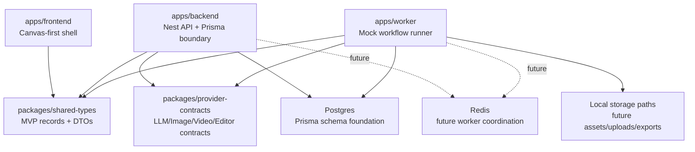
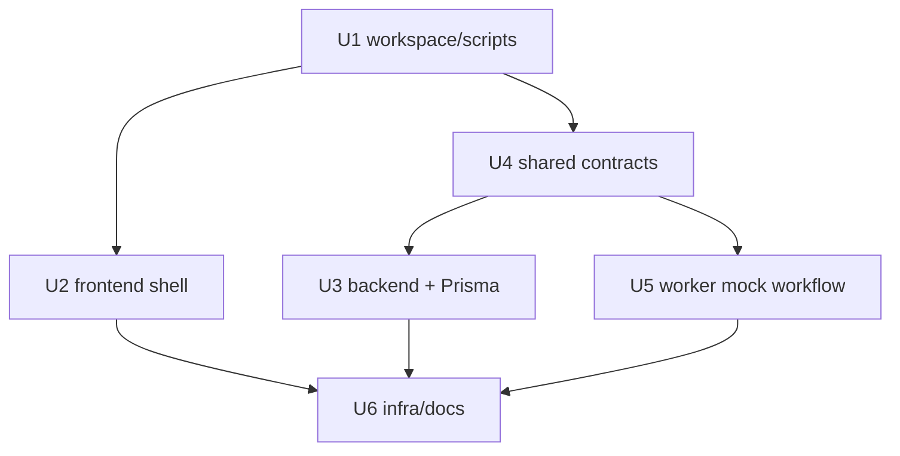

# feat: Establish Phase 0 engineering foundation

## Summary

This plan establishes the initial guga-flow monorepo by creating the frontend, backend, worker, shared contracts, database foundation, mock provider boundary, local infra, documentation, and baseline quality checks needed for later canvas-first roadmap modules.

---

## Problem Frame

The repository currently has product and architecture documents but no application code. Phase 0 must create a working foundation that downstream phases can extend without re-deciding the core service boundaries, provider safety rules, or persistence direction from the origin requirements.

---

## Assumptions

*This plan was authored without synchronous user confirmation. The items below are agent inferences that fill gaps in the input -- un-validated bets that should be reviewed before implementation proceeds.*

- Use pnpm as the package manager because the architecture reference and text2sql precedent both use a pnpm workspace.
- Keep frontend, backend, and worker as independently runnable app surfaces, even though Phase 0 only needs minimal product behavior.
- Use Prisma 7-style configuration and generated client conventions when package availability supports it; otherwise preserve the same architecture with the closest current Prisma-supported setup.
- Verify the mock provider boundary with both package-level tests and a small worker/backend-owned mock workflow, rather than waiting for Phase 8 GenerationJob behavior.

---

## Requirements

- R1. Provide a TypeScript monorepo foundation with app surfaces for frontend, backend, and worker development.
- R2. Create shared package boundaries for cross-app types and provider contracts.
- R3. Support install, development, build, test, and lint/format-check workflows through root-level scripts.
- R4. Establish the database foundation for hybrid canvas snapshot plus normalized business data persistence.
- R5. Leave room for core MVP model names and relationships: Projects, NovelDocuments, CanvasDocuments, CanvasNodes, CanvasEdges, Assets, GenerationJobs, EditorExports, and provider configuration.
- R6. Make local database setup and generated client artifacts usable for later modules.
- R7. Provide mock LLM, image, video, and editor/export-adjacent provider contracts.
- R8. Model provider calls and sensitive configuration as server-side responsibilities.
- R9. Represent worker responsibilities as a first-class app surface or runnable process.
- R10. Provide baseline quality scripts for build, test, and formatting or lint checks.
- R11. Include environment examples and local development documentation.
- R12. Preserve Phase 0 scope without implementing Phase 1+ product behavior early.

**Origin actors:** A1 Developer, A2 Downstream module implementer, A3 Local mock runtime
**Origin flows:** F1 Local foundation bootstrap, F2 Mock-first provider boundary check
**Origin acceptance examples:** AE1 covers R1/R2/R3/R10, AE2 covers R4/R5/R6, AE3 covers R7/R8/R9, AE4 covers R11/R12

---

## Scope Boundaries

- Do not implement Project CRUD, dashboard behavior, asset upload, or asset previews.
- Do not implement tldraw canvas load/save, autosave, custom business shapes, inspector forms, or semantic edge interactions.
- Do not implement storyboard generation/import, prompt composition, real media generation, persistent generation queue processing, or editor package export.
- Do not introduce browser-side provider API key storage or direct browser-to-provider calls.
- Do not copy reference project code or data models.

### Deferred to Follow-Up Work

- Phase 1 will add Project CRUD, dashboard, local storage, and asset upload/preview behavior.
- Phase 2 will add tldraw canvas persistence and save-status behavior.
- Phase 8 will replace the thin mock workflow shell with GenerationJob-backed worker execution.
- Phase 9 and Phase 10 will add real image/video provider adapters.

---

## Context & Research

### Relevant Code and Patterns

- Current repo: no committed app code; planning starts from documentation and must create the first implementation patterns.
- `docs/tech-stack-text2sql-reference.md`: captures the text2sql-derived patterns to reuse, including pnpm workspace filters, `apps/*` and `packages/*`, root quality scripts, Nginx gateway, Postgres, and Redis local services.

### Institutional Learnings

- No existing `docs/solutions/` entries are present for this repo yet.

### External References

- Next.js official docs via Context7: create-next-app supports TypeScript, Tailwind, ESLint/Biome, App Router, `src` directory, and import alias setup; official examples include Vitest integration.
- NestJS official docs via Context7: use `ConfigModule.forRoot({ isGlobal: true })` for environment config, global `ValidationPipe` at bootstrap, and Supertest-backed e2e tests for API contracts.
- Prisma official docs via Context7: Prisma 7 uses `prisma.config` for schema, migration path, and datasource env handling; current client generation uses the `prisma-client` generator and driver adapters for runtime connections.

---

## Key Technical Decisions

- Use pnpm workspace boundaries for `apps/*` and `packages/*`: this matches `docs/tech-stack-text2sql-reference.md` and the text2sql precedent, and gives later modules stable package imports.
- Keep Phase 0 app behavior intentionally thin: frontend gets a canvas-first shell, backend gets health/config/Prisma boundaries, and worker gets a mock workflow, while Phase 1+ product behavior stays deferred.
- Put provider interfaces and mocks in a shared contract package: backend and worker can share provider input/output shapes without duplicating or leaking provider keys to the browser.
- Use Prisma schema and migration artifacts as the database foundation: later modules need visible persistent model concepts, not only TypeScript types, to preserve Hybrid Snapshot + Normalized Business Data.
- Treat CI as a Phase 0 contract, not a later cleanup: root quality scripts should be represented both locally and in a minimal CI workflow so future modules inherit the same gates.

---

## Output Structure

This tree is the expected Phase 0 shape. The implementing agent may adjust low-level filenames if package generators produce a better equivalent, but the app/package/infra boundaries should remain.

```text
.
├── apps/
│   ├── frontend/
│   ├── backend/
│   └── worker/
├── packages/
│   ├── shared-types/
│   └── provider-contracts/
├── infra/
│   ├── docker-compose.yml
│   └── nginx/
├── .github/
│   └── workflows/
│       └── ci.yml
├── docs/
│   ├── brainstorms/
│   ├── plans/
│   └── development.md
├── package.json
├── pnpm-workspace.yaml
├── tsconfig.base.json
└── README.md
```

---

## High-Level Technical Design

> *This illustrates the intended approach and is directional guidance for review, not implementation specification. The implementing agent should treat it as context, not code to reproduce.*



---

## Implementation Units

- U1. **Create workspace, shared TypeScript config, and root scripts**

**Goal:** Establish the pnpm monorepo skeleton and root developer commands used by every later unit.

**Requirements:** R1, R2, R3, R10; supports AE1

**Dependencies:** None

**Files:**
- Create: `package.json`
- Create: `pnpm-workspace.yaml`
- Create: `tsconfig.base.json`
- Create: `.gitignore`
- Create: `.npmrc`
- Create: `.github/workflows/ci.yml`
- Create: `README.md`

**Approach:**
- Follow the text2sql workspace shape with `apps/*` and `packages/*`.
- Keep root scripts package-manager-level and app-agnostic so later phases can add package-specific details without changing the root contract.
- Prefer current package-manager/tooling defaults that work across frontend, backend, worker, and shared packages.
- Add a minimal CI workflow that runs the same root quality gates as local development once dependencies are installed.

**Execution note:** Start by making the workspace installable before creating app-specific source files.

**Patterns to follow:**
- `docs/tech-stack-text2sql-reference.md` sections 1, 3, 9, and 11.

**Test scenarios:**
- Happy path: with all workspace package manifests present, root build/test/lint scripts discover app and package workspaces.
- Edge case: running root test before feature tests exist still reports a deterministic pass or no-op result, not a missing script failure.
- Integration: CI invokes the same root quality gates as local development and does not require real provider credentials.

**Verification:**
- The repo has a valid workspace manifest, common TypeScript config, root scripts, ignore rules, and top-level setup documentation.

- U2. **Scaffold the frontend canvas-first shell**

**Goal:** Create a minimal Next.js TypeScript app surface that represents the future canvas-first workbench without implementing later canvas behavior.

**Requirements:** R1, R3, R10, R11, R12; supports F1 and AE1

**Dependencies:** U1

**Files:**
- Create: `apps/frontend/package.json`
- Create: `apps/frontend/next.config.ts`
- Create: `apps/frontend/tsconfig.json`
- Create: `apps/frontend/src/app/layout.tsx`
- Create: `apps/frontend/src/app/page.tsx`
- Create: `apps/frontend/src/app/globals.css`
- Create: `apps/frontend/src/components/workbench-shell.tsx`
- Create: `apps/frontend/src/components/workbench-shell.test.tsx`
- Create: `apps/frontend/vitest.config.ts`
- Create: `apps/frontend/.env.example`

**Approach:**
- Use App Router, TypeScript, Tailwind-compatible styling, and a restrained workbench shell with TopBar, side panels, canvas area, inspector area, and job queue placeholders.
- Avoid tldraw integration until Phase 2/3; Phase 0 only proves that the frontend surface exists and imports shared types safely.
- Keep provider-sensitive configuration out of the frontend environment example.

**Patterns to follow:**
- Next.js official setup conventions from Context7 for TypeScript App Router and testing support.
- Visual layout from `infinite_canvas_video_prd_roadmap_v2_detailed.md` section 5.1.

**Test scenarios:**
- Covers AE1. Happy path: rendering the root page shows the canvas-first workbench regions.
- Edge case: the frontend shell renders without backend data and does not require provider keys.
- Error path: missing optional public API URL configuration does not crash the shell.

**Verification:**
- The frontend app builds, its test runs, and it stays within Phase 0 placeholder behavior.

- U3. **Create backend API shell with Prisma foundation**

**Goal:** Create the NestJS backend app, environment configuration, health endpoint, and initial Prisma model foundation for Phase 0 persistence.

**Requirements:** R1, R4, R5, R6, R8, R10, R11; supports F1, F2, AE2, and AE3

**Dependencies:** U1, U4

**Files:**
- Create: `apps/backend/package.json`
- Create: `apps/backend/tsconfig.json`
- Create: `apps/backend/src/main.ts`
- Create: `apps/backend/src/app.module.ts`
- Create: `apps/backend/src/health/health.controller.ts`
- Create: `apps/backend/src/health/health.controller.spec.ts`
- Create: `apps/backend/src/config/app-config.ts`
- Create: `apps/backend/src/prisma/prisma.module.ts`
- Create: `apps/backend/src/prisma/prisma.service.ts`
- Create: `apps/backend/prisma/schema.prisma`
- Create: `apps/backend/prisma/migrations/<initial>/migration.sql`
- Create: `apps/backend/prisma.config.ts`
- Create: `apps/backend/test/app.e2e-spec.ts`
- Create: `apps/backend/vitest.config.ts`
- Create: `apps/backend/.env.example`

**Approach:**
- Use NestJS environment configuration and global validation setup according to official Nest guidance.
- Model the initial Prisma schema around the MVP foundation names from the origin requirements, while keeping behavior minimal.
- Make `CanvasDocument.snapshotJson` and normalized `CanvasNode`/`CanvasEdge`/`Asset`/`GenerationJob` concepts visible in schema form to protect the hybrid persistence rule.
- Keep model relationships conservative: include enough ownership, project scoping, relation, status, and JSON extension points for later modules, but avoid premature strong typing for Character/Location/Shot internals.
- Ensure provider configuration remains backend/worker-owned.

**Execution note:** Implement schema and backend health coverage before adding worker behavior that relies on these boundaries.

**Patterns to follow:**
- NestJS official docs for ConfigModule, validation pipe, and Supertest-style API tests.
- Prisma official docs for Prisma 7 config, schema, migrations, and client generation.
- `docs/tech-stack-text2sql-reference.md` sections 5, 7, and 8.

**Test scenarios:**
- Covers AE2. Happy path: database client generation succeeds against the initial schema.
- Covers AE3. Integration: backend health endpoint reports mock provider mode without exposing secrets.
- Edge case: missing optional provider keys leaves real providers disabled but mock mode available.
- Edge case: schema supports business node and edge records independently from snapshot JSON so later canvas behavior can query normalized facts.
- Error path: invalid required backend environment configuration fails early with a clear startup/configuration failure.

**Verification:**
- Backend build/test pass, Prisma client artifacts can be generated, and the schema expresses the Phase 0 persistence foundation without implementing Phase 1+ CRUD.

- U4. **Define shared MVP types and provider contracts**

**Goal:** Create reusable shared packages for domain types and mock-first provider interfaces.

**Requirements:** R2, R5, R7, R8, R10; supports F2 and AE3

**Dependencies:** U1

**Files:**
- Create: `packages/shared-types/package.json`
- Create: `packages/shared-types/tsconfig.json`
- Create: `packages/shared-types/src/index.ts`
- Create: `packages/shared-types/src/domain/canvas.ts`
- Create: `packages/shared-types/src/domain/generation.ts`
- Create: `packages/shared-types/src/domain/storyboard.ts`
- Create: `packages/shared-types/src/domain/assets.ts`
- Create: `packages/shared-types/src/domain/project.ts`
- Create: `packages/shared-types/src/domain/domain.test.ts`
- Create: `packages/provider-contracts/package.json`
- Create: `packages/provider-contracts/tsconfig.json`
- Create: `packages/provider-contracts/src/index.ts`
- Create: `packages/provider-contracts/src/contracts.ts`
- Create: `packages/provider-contracts/src/mock-providers.ts`
- Create: `packages/provider-contracts/src/mock-providers.test.ts`

**Approach:**
- Encode domain enums and DTO-like types that later apps can import without coupling to Prisma internals.
- Define LLM/storyboard, image, video, and editor/export-adjacent provider contracts at capability level.
- Provide deterministic mock implementations that return typed placeholder outputs and never read browser-side configuration.

**Patterns to follow:**
- `docs/tech-stack-text2sql-reference.md` sections 2, 5.2, 5.3, and 6.
- PRD node and provider concepts from `infinite_canvas_video_prd_roadmap_v2_detailed.md` sections 7-11.

**Test scenarios:**
- Covers AE3. Happy path: mock LLM/image/video/editor providers return deterministic typed results for valid inputs.
- Edge case: empty optional reference assets still produce valid mock image/video outputs.
- Error path: unsupported provider capability or intentionally failed mock input returns a normalized provider error shape.
- Integration: shared types can be imported by backend and worker packages without circular package dependencies.

**Verification:**
- Shared packages build and their tests prove mock outputs, error normalization, and import boundaries.

- U5. **Create worker app and mock workflow verification**

**Goal:** Make worker responsibilities first-class and prove a no-real-key mock workflow can execute through server-side contracts.

**Requirements:** R7, R8, R9, R10, R11; supports F2 and AE3

**Dependencies:** U1, U4

**Files:**
- Create: `apps/worker/package.json`
- Create: `apps/worker/tsconfig.json`
- Create: `apps/worker/src/index.ts`
- Create: `apps/worker/src/mock-workflow.ts`
- Create: `apps/worker/src/mock-workflow.test.ts`
- Create: `apps/worker/vitest.config.ts`
- Create: `apps/worker/.env.example`

**Approach:**
- Build a small worker-owned mock workflow that exercises provider contracts in the same service-side direction later GenerationJob execution will use.
- Keep the workflow intentionally thin: it should not introduce a persistent queue, media downloads, real storage, or canvas node creation.
- Emit typed workflow output that future Phase 8 can replace with database-backed job execution.

**Execution note:** Implement the mock workflow test-first because it is the clearest proof of the provider boundary.

**Patterns to follow:**
- `docs/tech-stack-text2sql-reference.md` section 6 for worker/async direction.
- Provider contracts from U4.

**Test scenarios:**
- Covers AE3. Happy path: with mock provider config and no real keys, worker mock workflow produces storyboard, image, video, and editor-adjacent placeholder outputs.
- Edge case: mock workflow handles missing optional style/reference input while preserving typed output.
- Error path: forced provider failure returns a failed workflow result without pretending success.
- Integration: worker imports shared types and provider contracts from workspace packages rather than duplicating them.

**Verification:**
- Worker build/test pass and a developer can run the documented mock workflow verification without real provider credentials.

- U6. **Add local infra, environment examples, and development docs**

**Goal:** Document and support the local bootstrap path for developers and downstream implementers.

**Requirements:** R3, R6, R10, R11, R12; supports F1, AE1, AE2, and AE4

**Dependencies:** U1, U2, U3, U5

**Files:**
- Create: `infra/docker-compose.yml`
- Create: `infra/nginx/dev-gateway.conf`
- Create: `docs/development.md`
- Modify: `README.md`
- Modify: `apps/frontend/.env.example`
- Modify: `apps/backend/.env.example`
- Modify: `apps/worker/.env.example`

**Approach:**
- Mirror text2sql's local infra shape while renaming services, database names, and ports for guga-flow.
- Keep local storage paths and provider mode variables documented as development defaults.
- Document quality gates and the expected Phase 0 verification outcomes without adding Phase 1+ workflows.

**Patterns to follow:**
- `docs/tech-stack-text2sql-reference.md` section 9.

**Test scenarios:**
- Covers AE4. Happy path: a downstream implementer can identify commands, environment files, and extension points from README/development docs.
- Edge case: docs clearly state that mock providers work without real keys.
- Error path: docs explain how to recover when local database or generated client artifacts are absent.

**Verification:**
- Local infra files exist, env examples match app expectations, and docs describe bootstrap, database setup, mock workflow verification, and quality gates.

---

## Implementation Dependency Graph



---

## System-Wide Impact

- **Interaction graph:** Frontend imports shared types only; backend owns API/config/database/provider boundaries; worker owns mock workflow execution; shared packages provide contracts without importing apps.
- **Error propagation:** Provider failures should become typed provider/workflow errors in package tests and worker verification, not frontend-only exceptions.
- **State lifecycle risks:** Prisma schema establishes persistent concepts, but Phase 0 should not create runtime mutation flows that imply unfinished CRUD behavior.
- **Data integrity:** The schema should project-scope records and leave room for relation/status validation while avoiding cascade behavior that would delete generated assets unexpectedly in later phases.
- **API surface parity:** Backend and worker should import the same provider contracts so future GenerationJob behavior does not fork provider input/output shapes.
- **Integration coverage:** Backend health/config, shared provider mocks, and worker mock workflow are the cross-layer scenarios unit tests alone must prove.
- **Unchanged invariants:** Provider keys stay out of the browser; mock mode remains available; canvas-first roadmap scope is not replaced by a generic dashboard app.

---

## Risks & Dependencies

| Risk | Mitigation |
|------|------------|
| Current package versions differ from the architecture reference's example majors | Prefer the architecture's boundaries and verify exact versions during implementation using official package metadata and generated project constraints. |
| Prisma 7 generator/config details differ from older Prisma patterns | Use official Prisma 7 docs as the planning source and keep schema/client generation verification explicit. |
| Greenfield scaffold can accidentally overbuild Phase 1 behavior | Keep app screens and API endpoints to health/shell/mock verification only; defer Project CRUD and asset behavior. |
| Mock workflow may become a throwaway script detached from future worker execution | Put it inside `apps/worker` and shared provider contracts so Phase 8 can replace internals without changing the boundary. |
| Root quality gates can become brittle before real tests exist | Ensure every workspace package has a deterministic build/test/lint posture, even when behavior is intentionally minimal. |
| Initial migration may imply stronger data semantics than Phase 0 can verify | Keep migration semantics conservative and document execution-time schema choices in code/tests rather than adding untested product behavior. |

---

## Documentation / Operational Notes

- Update `README.md` and add `docs/development.md` with bootstrap, local infra, environment examples, mock provider mode, database setup, and quality gates.
- Keep documentation repo-relative and aligned with `docs/infinite-canvas-video-long-task-development-flow.md`.
- Do not document real provider setup beyond disabled placeholders and server-side ownership.

---

## Open Questions

### Resolved During Planning

- Package manager: use pnpm, matching the architecture reference and text2sql precedent.
- Phase 0 mock workflow form: include package-level provider tests plus a worker-owned mock workflow verification.
- Reference project research: not needed for Phase 0 because the module is foundation-focused and does not touch video production semantics.

### Deferred to Implementation

- Exact dependency versions: resolve with package manager metadata at implementation time while preserving the architecture's intended stack.
- Exact Prisma field names and indexes: decide while authoring the schema, but keep the model concepts and relationships traceable to R4/R5.
- Exact lint/format tool choice: use whichever current toolchain integrates cleanly across Next, Nest, worker, and packages while satisfying root `format:check`.
- Whether to include Nginx in Phase 0 dev server verification: create the infra shape now, but allow direct app ports as the primary development path if the gateway adds avoidable setup friction.

---

## Sources & References

- **Origin document:** `docs/brainstorms/2026-06-12-001-phase-0-engineering-foundation-requirements.md`
- Product source: `infinite_canvas_video_prd_roadmap_v2_detailed.md`
- Architecture source: `docs/tech-stack-text2sql-reference.md`
- Workflow source: `docs/infinite-canvas-video-long-task-development-flow.md`
- Text2sql precedent: summarized in `docs/tech-stack-text2sql-reference.md`
- External docs: Next.js official docs via Context7, NestJS official docs via Context7, Prisma official docs via Context7
