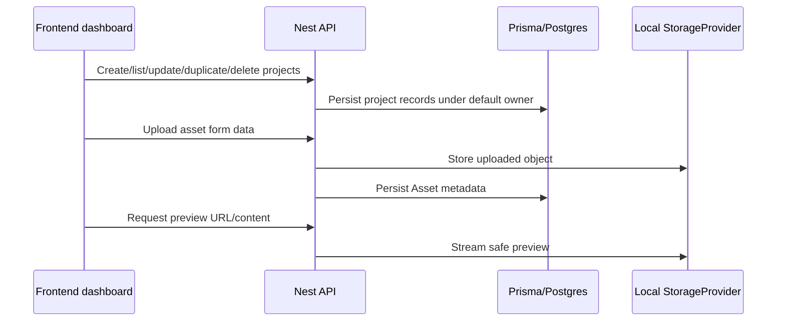

# feat: Add project management and asset library

## Summary

This plan adds the first usable product surface on top of the Phase 0 foundation: project lifecycle APIs and UI, server-owned local asset upload/storage, and project-scoped asset browsing and preview.

---

## Problem Frame

Phase 0 created app boundaries but no user workflow beyond health checks and a static workbench shell. Phase 1 needs a real project container and asset library so later canvas, storyboard, binding, and generation modules have stable parents and media records to build on.

---

## Assumptions

*This plan was authored without synchronous user confirmation. The items below are agent inferences that fill gaps in the input -- un-validated bets that should be reviewed before implementation proceeds.*

- Keep Phase 1 as one module, but commit completed implementation units separately if the diff becomes large.
- Use server-side local storage and safe preview URLs; do not add remote object storage.
- Use a deterministic default user for MVP ownership; do not add authentication or session state.
- Use direct frontend-to-backend HTTP calls from the Next app, with the backend base URL coming from public local configuration only.
- Tune exact upload size and MIME checks during implementation while preserving the origin requirement for server-side validation.

---

## Requirements

- R1. The app must provide a project dashboard that lists available projects with enough metadata for A1 to identify and open recent work.
- R2. A1 must be able to create a project with a title and default aspect ratio.
- R3. A1 must be able to open a project and land on the project canvas route, even if the actual tldraw canvas implementation is deferred to Phase 2.
- R4. Every project must be associated with the MVP default owner so later records can remain project-scoped without adding authentication.
- R5. A1 must be able to edit basic project metadata after creation.
- R6. A1 must be able to delete a project only after an explicit confirmation step.
- R7. A1 must be able to duplicate a project's basic metadata; duplicated projects do not need to copy every asset file in Phase 1.
- R8. A1 must be able to upload images, videos, txt, and md files into a specific project.
- R9. Uploaded files must be validated server-side for supported type and reasonable size before becoming asset records.
- R10. Uploaded assets must be stored server-side and recorded as project-scoped assets with type, purpose, filename, mime type, size, and preview metadata when available.
- R11. The project UI must show an asset library with list/grid browsing, type labels, and basic details.
- R12. Image assets must have an inspectable preview, video assets must have a playable preview, and text/markdown assets must expose readable metadata or text preview.
- R13. A1 must be able to delete an uploaded asset from the project asset library before later canvas/generation references exist.
- R14. Provider keys and real generation providers remain out of scope; Phase 1 must not introduce browser-side provider credentials.
- R15. The asset library must be ready for later canvas binding: project-scoped assets should be addressable by later modules without duplicating upload logic.
- R16. Phase 1 must preserve the canvas-first path by making project open actions lead toward the canvas experience, not a generic CRUD-only admin app.

**Origin actors:** A1 Creator, A2 Downstream canvas/generation modules, A3 Backend storage boundary
**Origin flows:** F1 Project bootstrap, F2 Asset upload and preview, F3 Project lifecycle management
**Origin acceptance examples:** AE1 covers R1/R2/R3/R4/R16, AE2 covers R5/R6/R7, AE3 covers R8/R9/R10/R11, AE4 covers R12, AE5 covers R13/R15

---

## Scope Boundaries

- Do not implement login, RBAC, teams, sharing, or multi-user collaboration.
- Do not implement tldraw load/save or real canvas editing behavior; Phase 1 only routes to the future canvas surface.
- Do not implement asset drag/drop binding to canvas nodes.
- Do not implement novel parsing, storyboard generation, image generation, video generation, or editor export.
- Do not implement remote object storage providers.
- Do not expose provider credentials or real generation provider configuration in the frontend.

### Deferred to Follow-Up Work

- Canvas persistence and tldraw editing remain Phase 2.
- Asset drag/drop binding and semantic edges remain Phase 4.
- Character/location reference workflows and prompt composer-specific asset semantics remain Phase 7.
- Generated asset retention and reference safety are finalized in generation and canvas modules.

---

## Context & Research

### Relevant Code and Patterns

- `apps/backend/src/app.module.ts` already wires global config and Prisma.
- `apps/backend/src/prisma/prisma.service.ts` exposes the Prisma 7 generated client with a Postgres adapter.
- `apps/backend/test/app.e2e-spec.ts` shows the current Nest + Supertest e2e setup and provider override style.
- `apps/frontend/src/components/workbench-shell.tsx` is the current canvas-first shell to preserve as the project canvas surface evolves.
- `packages/shared-types/src/domain/project.ts` and `packages/shared-types/src/domain/assets.ts` already define baseline project and asset records.

### Institutional Learnings

- `docs/solutions/tooling-decisions/node-26-prisma-7-phase-0-foundation-2026-06-12.md`: keep Node 26 and current framework majors as the target, preserve Prisma 7 generator output/ignore rules, and do not downgrade the stack for local Node 22 warnings.

### External References

- Next.js 16 App Router docs via Context7: client form submissions can use `FormData` and `fetch`; client navigation uses `next/navigation`; links use `next/link`.
- NestJS docs via Context7: CRUD controllers use standard decorators; file upload uses `FileInterceptor`; file validation should use `ParseFilePipe` with size/type validators; Supertest e2e tests are the documented integration pattern.
- Prisma 7 docs via Context7: `prisma-client` requires explicit output, and CRUD/relation operations should use generated typed client methods.

---

## Key Technical Decisions

- Add project and asset behavior behind the Nest backend rather than Next route handlers: this keeps provider/storage boundaries server-owned and matches the Phase 0 backend/worker architecture.
- Use local StorageProvider as an injectable backend service: this satisfies MVP local storage while keeping later S3/R2 replacement behind the same app-owned boundary.
- Keep shared package types DTO-like and Prisma-independent: frontend, backend, and later worker code should share stable records without importing generated Prisma internals.
- Make frontend UI dense and workbench-oriented: project management should feel like an operational production tool, not a marketing page.
- Serve only safe asset previews and metadata to the browser: uploaded bytes stay behind backend-controlled routes.

---

## Open Questions

### Resolved During Planning

- Should Phase 1 split Project CRUD and Asset/Storage into separate modules? Keep them together because the asset library is project-scoped and the acceptance examples require demonstrating both in one local workflow.
- Should Phase 1 research Toonflow assets now? Skip additional reference-project research because the current PRD and tech-stack documents already define upload/storage/preview scope; Toonflow-specific asset binding becomes more relevant in Phase 4 and Phase 7.

### Deferred to Implementation

- Exact upload size limits and MIME allowlist: choose conservative values while implementing Nest file validators and tests.
- Exact preview metadata extraction: start with mime/type/size and text snippet where practical; image dimensions or video duration can be added if low-cost and reliable.
- Storage cleanup failure behavior: return clear API errors or warnings without hiding partial failures.

---

## Output Structure

```text
apps/backend/src/projects/
apps/backend/src/assets/
apps/backend/src/storage/
apps/frontend/src/app/projects/
apps/frontend/src/components/projects/
apps/frontend/src/lib/
```

This tree is the expected shape. Implementation may adjust low-level filenames if tests reveal a cleaner local pattern.

---

## High-Level Technical Design

> *This illustrates the intended approach and is directional guidance for review, not implementation specification. The implementing agent should treat it as context, not code to reproduce.*



---

## Implementation Units

- U1. **Extend shared project and asset contracts**

**Goal:** Make frontend/backend data contracts explicit enough for Phase 1 project and asset UI without importing Prisma types.

**Requirements:** R1, R2, R5, R8, R10, R11, R12, R15

**Dependencies:** None

**Files:**
- Modify: `packages/shared-types/src/domain/project.ts`
- Modify: `packages/shared-types/src/domain/assets.ts`
- Modify: `packages/shared-types/src/domain/domain.test.ts`

**Approach:**
- Add DTO-like shapes for project create/update/list and asset upload/list/preview responses.
- Keep enum values aligned with the existing Prisma schema and avoid adding Phase 2+ canvas semantics.

**Patterns to follow:**
- Existing constant-plus-type pattern in `packages/shared-types/src/domain/canvas.ts`.
- Existing package tests in `packages/shared-types/src/domain/domain.test.ts`.

**Test scenarios:**
- Happy path: shared constants include the Phase 1 upload asset types and purposes.
- Edge case: project defaults include the supported aspect ratios used by the UI.

**Verification:**
- Shared package tests and build pass without generating tracked artifacts.

- U2. **Add Project API and default owner behavior**

**Goal:** Provide backend project list/create/read/update/delete/duplicate behavior under the MVP default owner.

**Requirements:** R1, R2, R3, R4, R5, R6, R7, R16; supports F1, F3, AE1, AE2

**Dependencies:** U1

**Files:**
- Create: `apps/backend/src/projects/projects.module.ts`
- Create: `apps/backend/src/projects/projects.controller.ts`
- Create: `apps/backend/src/projects/projects.service.ts`
- Create: `apps/backend/src/projects/dto.ts`
- Create: `apps/backend/src/projects/projects.service.spec.ts`
- Modify: `apps/backend/src/app.module.ts`
- Test: `apps/backend/test/app.e2e-spec.ts`

**Approach:**
- Use Prisma-backed service methods for default owner creation/lookup and project lifecycle operations.
- Duplicate only basic metadata and let later modules define deep-copy semantics for canvas and generated assets.
- Keep deletion explicit at UI level; API should remain deterministic and project-scoped.

**Execution note:** Add service-level tests before expanding e2e coverage so project ownership and duplicate semantics are pinned down.

**Patterns to follow:**
- Nest module/controller style from `apps/backend/src/health/health.controller.ts`.
- Supertest e2e setup in `apps/backend/test/app.e2e-spec.ts`.
- Prisma client service pattern in `apps/backend/src/prisma/prisma.service.ts`.

**Test scenarios:**
- Covers AE1. Happy path: creating a project returns a project record with default owner and aspect ratio, and listing includes it.
- Covers AE2. Happy path: updating project metadata changes the returned record.
- Covers AE2. Happy path: duplicating a project creates a distinct record with copied basic metadata.
- Covers AE2. Error path: requesting a missing project returns a clear not-found response.
- Edge case: empty or invalid title/default aspect ratio is rejected by validation.

**Verification:**
- Backend tests prove project lifecycle behavior without requiring authentication.

- U3. **Add local StorageProvider and Asset API**

**Goal:** Store uploaded project files server-side, record asset metadata, provide safe list/detail/preview/delete APIs.

**Requirements:** R8, R9, R10, R12, R13, R14, R15; supports F2, AE3, AE4, AE5

**Dependencies:** U1, U2

**Files:**
- Create: `apps/backend/src/storage/storage.module.ts`
- Create: `apps/backend/src/storage/local-storage.service.ts`
- Create: `apps/backend/src/storage/storage.types.ts`
- Create: `apps/backend/src/assets/assets.module.ts`
- Create: `apps/backend/src/assets/assets.controller.ts`
- Create: `apps/backend/src/assets/assets.service.ts`
- Create: `apps/backend/src/assets/dto.ts`
- Create: `apps/backend/src/assets/assets.service.spec.ts`
- Modify: `apps/backend/src/app.module.ts`
- Test: `apps/backend/test/app.e2e-spec.ts`

**Approach:**
- Validate upload type and size in the backend before storing and creating records.
- Infer asset type from validated MIME category and map text/markdown to document assets.
- Store files beneath configured local storage paths and expose preview through backend-controlled routes.
- Delete uploaded objects when deleting assets, while surfacing cleanup failures clearly.

**Execution note:** Implement storage service with focused filesystem tests before wiring multipart e2e tests.

**Patterns to follow:**
- Config reads in `apps/backend/src/config/app-config.ts`.
- Nest file upload validation guidance from Context7 NestJS docs.
- Asset domain constants in `packages/shared-types/src/domain/assets.ts`.

**Test scenarios:**
- Covers AE3. Happy path: uploading a PNG records an image asset with filename, mime type, size, and storage key.
- Covers AE3. Happy path: uploading an MP4 records a video asset.
- Covers AE4. Happy path: previewing image/video assets returns browser-usable content with safe headers.
- Covers AE4. Happy path: previewing markdown/text returns readable text or metadata.
- Error path: unsupported MIME type is rejected before storage.
- Error path: oversized file is rejected before asset record creation.
- Covers AE5. Integration: deleting an uploaded asset removes the record and attempts local object cleanup.

**Verification:**
- Backend e2e tests cover multipart upload, asset list/detail, preview, and delete behavior.

- U4. **Build frontend project dashboard and placeholder canvas route**

**Goal:** Replace the static first screen with a usable project dashboard and route project open actions toward the canvas-first workflow.

**Requirements:** R1, R2, R3, R5, R6, R7, R16; supports F1, F3, AE1, AE2

**Dependencies:** U1, U2

**Files:**
- Modify: `apps/frontend/src/app/page.tsx`
- Create: `apps/frontend/src/app/projects/[projectId]/canvas/page.tsx`
- Create: `apps/frontend/src/components/projects/project-dashboard.tsx`
- Create: `apps/frontend/src/components/projects/project-dashboard.test.tsx`
- Create: `apps/frontend/src/lib/api.ts`
- Modify: `apps/frontend/src/app/globals.css`
- Test: `apps/frontend/src/components/projects/project-dashboard.test.tsx`

**Approach:**
- Use a client component for dashboard actions that call the backend API and update local UI state.
- Keep the canvas route as a workbench-oriented placeholder that can be replaced by Phase 2 tldraw persistence.
- Use confirmation UI for delete actions.

**Patterns to follow:**
- Current workbench layout in `apps/frontend/src/components/workbench-shell.tsx`.
- Next.js App Router client navigation guidance from Context7.

**Test scenarios:**
- Covers AE1. Happy path: dashboard renders project list and create controls.
- Covers AE1. Happy path: opening a project points to the project canvas route.
- Covers AE2. Happy path: duplicate and edit controls are visible for project records.
- Covers AE2. Error path: delete requires confirmation before invoking the deletion action.
- Edge case: empty project list shows a usable empty state without turning into a landing page.

**Verification:**
- Frontend tests prove the dashboard and canvas route render without provider credentials.

- U5. **Build frontend asset library upload and preview UI**

**Goal:** Let users upload and inspect project-scoped assets from the project workspace.

**Requirements:** R8, R9, R10, R11, R12, R13, R14, R15; supports F2, AE3, AE4, AE5

**Dependencies:** U3, U4

**Files:**
- Create: `apps/frontend/src/components/projects/asset-library.tsx`
- Create: `apps/frontend/src/components/projects/asset-library.test.tsx`
- Modify: `apps/frontend/src/app/projects/[projectId]/canvas/page.tsx`
- Modify: `apps/frontend/src/lib/api.ts`
- Modify: `apps/frontend/src/app/globals.css`
- Test: `apps/frontend/src/components/projects/asset-library.test.tsx`

**Approach:**
- Use `FormData` upload from a client component to the backend asset upload endpoint.
- Show assets in a dense list/grid with type, filename, size, and purpose.
- Render previews by type while keeping all bytes served through backend-controlled preview URLs.

**Patterns to follow:**
- Next.js client form submission guidance from Context7.
- Existing frontend static-render tests using `renderToStaticMarkup`.

**Test scenarios:**
- Covers AE3. Happy path: upload control and asset list render for a project.
- Covers AE4. Happy path: image, video, and document assets choose the expected preview element.
- Covers AE5. Happy path: delete action is available for uploaded assets.
- Error path: upload failure state is visible and does not pretend success.
- Edge case: empty asset library shows a usable upload-first state.

**Verification:**
- Frontend tests cover asset-library rendering, preview branching, and error state.

- U6. **Document Phase 1 local workflow and run cross-layer gates**

**Goal:** Keep developer handoff current and prove the project/asset flow works across backend and frontend boundaries.

**Requirements:** R9, R14, R15; supports AE1-AE5

**Dependencies:** U2, U3, U4, U5

**Files:**
- Modify: `README.md`
- Modify: `docs/development.md`
- Modify: `apps/backend/.env.example`
- Modify: `apps/frontend/.env.example`
- Test: `apps/backend/test/app.e2e-spec.ts`
- Test: `apps/frontend/src/components/projects/project-dashboard.test.tsx`
- Test: `apps/frontend/src/components/projects/asset-library.test.tsx`

**Approach:**
- Document backend API URL, local storage paths, supported upload types, and Phase 1 quality gates.
- Ensure docs preserve Node 26 guidance and do not introduce provider keys.
- Run targeted backend/frontend tests before root quality gates.

**Test scenarios:**
- Integration: backend e2e covers project create/open lifecycle and multipart asset upload/preview/delete.
- Integration: frontend tests cover dashboard and asset library states.
- Error path: docs describe local storage and generated client prerequisites without suggesting browser provider keys.

**Verification:**
- Root build, test, lint/format check, mock workflow, and docker compose config remain green.

---

## System-Wide Impact

- **Interaction graph:** Frontend dashboard and project canvas route call Nest APIs; backend owns Prisma and local storage; shared types describe records across both.
- **Error propagation:** Validation, not-found, upload, and cleanup failures should return clear API responses and visible frontend states.
- **State lifecycle risks:** Project delete cascades records by schema; asset delete must coordinate database record removal and local file cleanup.
- **API surface parity:** Shared project/asset types should align with backend responses and frontend expectations.
- **Integration coverage:** Multipart upload and preview routing require backend e2e coverage; frontend rendering tests alone cannot prove storage behavior.
- **Unchanged invariants:** Provider keys remain server-only; real provider adapters, canvas persistence, and generation jobs remain untouched.

---

## Risks & Dependencies

| Risk | Mitigation |
|------|------------|
| Upload validation is too permissive or too strict | Use backend allowlist tests for supported and unsupported MIME types, then document supported types. |
| Local object cleanup and DB deletion can diverge | Keep deletion behavior explicit in service tests and surface cleanup failures instead of silently succeeding. |
| Project UI drifts into a generic CRUD dashboard | Route open actions to `/projects/:projectId/canvas` and keep the canvas placeholder visible. |
| Browser accidentally receives storage internals or provider secrets | Serve previews through backend routes and keep frontend env limited to the backend API base URL. |
| Phase 1 diff grows too large | Commit implementation units separately and split follow-up work only if reviewability suffers. |

---

## Documentation / Operational Notes

- Update `docs/development.md` with supported upload types, local storage paths, and Phase 1 verification.
- Keep README focused on current status and quality gates.
- Do not document real provider setup in Phase 1.

---

## Sources & References

- **Origin document:** `docs/brainstorms/2026-06-12-002-phase-1-project-management-assets-requirements.md`
- Product source: `infinite_canvas_video_prd_roadmap_v2_detailed.md`
- Architecture source: `docs/tech-stack-text2sql-reference.md`
- Workflow source: `docs/infinite-canvas-video-long-task-development-flow.md`
- Institutional learning: `docs/solutions/tooling-decisions/node-26-prisma-7-phase-0-foundation-2026-06-12.md`
- External docs: Next.js 16, NestJS, and Prisma 7 official documentation via Context7
