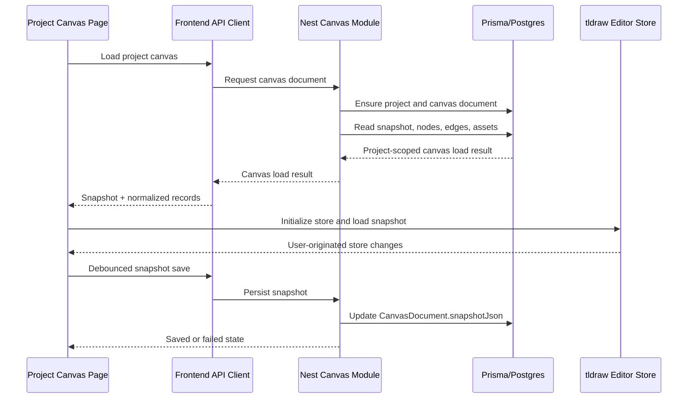

# feat: Add tldraw canvas persistence

## Summary

This plan adds the Phase 2 canvas substrate by extending the existing shared DTO, Nest API, Prisma, frontend API, and WorkbenchShell patterns around a tldraw editor with project-scoped snapshot load/save, debounce autosave, visible save state, retry, and browser verification.

---

## Problem Frame

The project canvas route currently lands in the correct workbench shell but still renders a static placeholder. Phase 2 needs to replace that placeholder with a real durable canvas without importing Phase 3 business shapes or later semantic production flows.

---

## Assumptions

*This plan was authored without synchronous user confirmation. The items below are agent inferences that fill gaps in the input — un-validated bets that should be reviewed before implementation proceeds.*

- The module can land as one Deep feature because backend persistence, tldraw integration, autosave status, and browser verification are tightly coupled.
- Frontend failure-state coverage can be proved with mocked save rejection plus real browser smoke, without adding production-only failure switches.
- The first implementation should add tldraw as a current dependency rather than changing the existing Next/React/Node targets to match older local tooling.
- The saved snapshot should include tldraw document state and session state when available, so reload and viewport behavior have a single durable source.
- The canvas load response should include existing project assets for contract readiness even though the Phase 1 AssetLibrary may still load its own list independently.

---

## Requirements

- R1. Embed an interactive tldraw canvas on the project canvas page.
- R2. Auto-create or resolve an empty project-scoped canvas document on first open.
- R3. Preserve baseline tldraw pan, zoom, select, move, shape drawing, and text creation.
- R4. Restore a previously saved visual snapshot before editing after page load.
- R5. Provide a fit-to-content path for saved content.
- R6. Autosave visual snapshots with debounce.
- R7. Show saving, saved, and failed save states.
- R8. Preserve visible local edits and offer retry when snapshot save fails.
- R9. Keep Phase 2 single-user and project-scoped.
- R10. Keep the load contract compatible with Hybrid Snapshot + Normalized Business Data.
- R11. Keep provider keys, browser secrets, and generation credentials out of snapshot data.
- R12. Preserve Phase 1 project and asset workflows on the canvas page.
- R13. Verify first-open, draw, refresh restore, move, position restore, and save status.
- R14. Verify save failure and retry without losing the visible local edit.

**Origin actors:** A1 Creator, A2 Canvas persistence system, A3 Future canvas modules
**Origin flows:** F1 First project canvas open, F2 Draw/autosave/restore, F3 Move/autosave/restore position, F4 Save failure and retry
**Origin acceptance examples:** AE1 interactive empty canvas, AE2 draw and reload, AE3 move and reload, AE4 failed save and retry, AE5 asset library preserved

---

## Scope Boundaries

- Do not implement business custom shapes, typed node forms, or inspector editing.
- Do not implement semantic arrows, bindings, or asset-to-shot references.
- Do not implement storyboard import, automatic layout, or duplicate import policy.
- Do not implement AI provider calls, generation jobs, image/video creation, or media export.
- Do not implement multiplayer editing, CRDT conflict handling, version history, or offline-first sync.
- Do not make the 300-node or 1000-node performance targets Phase 2 acceptance gates.

### Deferred to Follow-Up Work

- Automated Playwright coverage can be added in a later quality module if browser smoke remains too manual; Phase 2 should still perform a real browser verification pass.
- Snapshot size warnings and large-canvas performance instrumentation remain later canvas productivity/performance work unless implementation reveals an immediate blocker.

---

## Context & Research

### Relevant Code and Patterns

- `packages/shared-types/src/domain/canvas.ts` already defines `CanvasDocumentRecord`, `CanvasNodeRecord`, and `CanvasEdgeRecord`; extend this package instead of importing Prisma types into frontend code.
- `apps/backend/src/projects/` and `apps/backend/src/assets/` establish the Nest pattern: controller, DTO, service, module, service spec, e2e coverage, shared-type return shapes, and project-scoped not-found checks.
- `apps/backend/prisma/schema.prisma` already has `CanvasDocument`, `CanvasNode`, and `CanvasEdge`, including a unique `CanvasDocument.projectId` constraint and `snapshotJson Json @default("{}")`.
- `apps/frontend/src/lib/api.ts` centralizes backend calls with consistent JSON error handling.
- `apps/frontend/src/components/workbench-shell.tsx` owns the three-column workbench layout and already accepts an inspector slot; extend it with canvas and save-status slots instead of replacing the page shell.
- `apps/frontend/src/components/projects/asset-library.tsx` should continue to render in the inspector and preserve Phase 1 upload/preview/delete behavior.
- Frontend unit tests currently use static React rendering and Vitest node environment; tldraw-specific behavior should be isolated behind testable helper/state boundaries where browser APIs are hard to exercise in node tests.

### Institutional Learnings

- `docs/solutions/tooling-decisions/node-26-prisma-7-phase-0-foundation-2026-06-12.md` says to keep the Node 26 target and current framework choices visible, and to treat local Node 22 warnings as a machine-upgrade reminder rather than a reason to downgrade architecture.
- `docs/solutions/architecture-patterns/project-scoped-asset-lifecycle-boundary-2026-06-12.md` says project-scoped media and lifecycle details belong behind the backend boundary, and browser smoke is valuable for cross-layer UI flows that static tests miss.

### External References

- tldraw official docs via Context7: `Tldraw` exposes `onMount={(editor) => ...}` for editor access.
- tldraw official persistence docs via Context7: use `createTLStore`, `loadSnapshot`, and `getSnapshot(editor.store)` for custom backend persistence.
- tldraw store docs via Context7: `editor.store.listen` can drive autosave and can filter user-originated changes.
- tldraw editor docs via Context7: `editor.zoomToFit()` provides the fit-to-content path.
- tldraw component customization docs via Context7: UI component slots can be customized with the `components` prop when a tldraw-native control surface is needed.
- `npm view tldraw` on 2026-06-12 reports `tldraw@5.1.0` with React peer support for `^18.2.0 || ^19.2.1`, which is compatible with the current React 19.2.7 frontend target.

---

## Key Technical Decisions

- Add a backend `canvas` module instead of Next route handlers: Prisma ownership, project scoping, and failure semantics stay in the Nest backend like projects and assets.
- Extend shared canvas contracts before frontend/backend implementation: the load/save result shapes should be explicit and importable from both sides.
- Store tldraw snapshot JSON as the visual source of truth for Phase 2 while returning normalized nodes, edges, and assets for later modules.
- Treat an empty `{}` snapshot as "no saved tldraw data yet": this works with the existing Prisma default and avoids a migration just to represent a blank canvas.
- Keep autosave orchestration in a frontend hook/helper that is separate from the tldraw rendering component, so debounce, failed, retry, and stale request behavior are testable without a full browser canvas.
- Import tldraw CSS at the app/global boundary and keep canvas sizing in the existing workbench CSS, so Next's global CSS rules and current layout model stay predictable.
- Use mocked API rejection for deterministic save-failure tests and real browser smoke for tldraw drawing/reload behavior; do not add production-only failure toggles.

---

## Open Questions

### Resolved During Planning

- Which tldraw APIs should Phase 2 plan around? Use `createTLStore`, `loadSnapshot`, `getSnapshot(editor.store)`, `editor.store.listen`, `onMount`, and `editor.zoomToFit()` based on official docs.
- Should Phase 2 save document-only or document-plus-session snapshot data? Save the full snapshot object when available, with tolerant loading for empty or document-only values.
- Should fit-to-content be visible or hidden? Include a visible toolbar/topbar control so users and smoke verification can exercise it deliberately.
- How should failed save verification avoid brittle production switches? Use mocked frontend/backend tests for rejection and retry state, then use browser smoke for the happy-path canvas persistence.

### Deferred to Implementation

- Exact tldraw import types and callback signatures should be verified against the installed `tldraw` package types during implementation.
- The final debounce helper names and React hook boundaries may adjust after TypeScript type checks.
- Browser smoke interaction details may adjust based on tldraw's rendered toolbar affordances in the installed version.

---

## High-Level Technical Design

> *This illustrates the intended approach and is directional guidance for review, not implementation specification. The implementing agent should treat it as context, not code to reproduce.*

---

## Implementation Units

- U1. **Extend shared canvas contracts**

**Goal:** Make the Phase 2 canvas load/save contract explicit for backend and frontend without importing Prisma types across app boundaries.

**Requirements:** R2, R4, R6, R7, R8, R10, R11

**Dependencies:** None

**Files:**
- Modify: `packages/shared-types/src/domain/canvas.ts`
- Modify: `packages/shared-types/src/domain/domain.test.ts`

**Approach:**
- Add shared types for a canvas load result that includes the canvas document, normalized nodes, normalized edges, and project assets.
- Add shared types for snapshot save input/result and save status values used by the frontend.
- Keep snapshot data typed as unknown or a JSON-like structural type rather than coupling shared contracts to tldraw internals.
- Reuse the existing `CanvasDocumentRecord`, `CanvasNodeRecord`, and `CanvasEdgeRecord` naming style.

**Patterns to follow:**
- `packages/shared-types/src/domain/assets.ts`
- `packages/shared-types/src/domain/project.ts`

**Test scenarios:**
- Happy path: shared canvas constants still expose all existing node types, edge relations, and node statuses.
- Happy path: new canvas load/save types are exported from `@guga-flow/shared-types`.
- Edge case: snapshot payload types do not require browser-only or tldraw-only imports.

**Verification:**
- Shared package tests and build complete with the new contracts imported from package root.

---

- U2. **Add backend Canvas API**

**Goal:** Provide project-scoped canvas load and snapshot-save behavior through Nest, backed by the existing Prisma canvas models.

**Requirements:** R2, R4, R6, R8, R9, R10, R11, R13, R14

**Dependencies:** U1

**Files:**
- Create: `apps/backend/src/canvas/canvas.module.ts`
- Create: `apps/backend/src/canvas/canvas.controller.ts`
- Create: `apps/backend/src/canvas/canvas.service.ts`
- Create: `apps/backend/src/canvas/dto.ts`
- Create: `apps/backend/src/canvas/canvas.service.spec.ts`
- Modify: `apps/backend/src/app.module.ts`
- Modify: `apps/backend/test/app.e2e-spec.ts`
- Test: `apps/backend/src/canvas/canvas.service.spec.ts`
- Test: `apps/backend/test/app.e2e-spec.ts`

**Approach:**
- Add a `GET`-style load route under a project canvas path that verifies the project exists, creates the unique project canvas document when missing, and returns snapshot, nodes, edges, and assets.
- Add a `PATCH`-style snapshot route that validates a snapshot payload is present, upserts the project's canvas document when needed, and returns the updated document record.
- Use Prisma's unique project canvas constraint for idempotent first-open behavior.
- Return normalized nodes and edges even if empty, so Phase 3 and Phase 4 can extend behavior without changing the load envelope.
- Return project assets using the same public metadata shape and preview URL semantics as the asset library, without exposing local file paths or provider credentials.
- Keep validation and errors consistent with existing project/asset APIs.

**Execution note:** Start with service tests for first-open and save behavior before wiring controller/e2e coverage.

**Patterns to follow:**
- `apps/backend/src/projects/projects.service.ts`
- `apps/backend/src/assets/assets.service.ts`
- `apps/backend/test/app.e2e-spec.ts`

**Test scenarios:**
- Covers F1 / AE1. Happy path: loading a canvas for an existing project with no canvas document creates one and returns an empty snapshot-ready result.
- Covers AE2. Happy path: saving a non-empty snapshot and then loading returns the saved snapshot.
- Covers AE5. Happy path: loading a canvas returns existing project asset metadata without storage internals.
- Edge case: loading or saving canvas for a missing project returns a not-found error.
- Edge case: loading a project that already has a canvas document does not create a duplicate.
- Edge case: saving a snapshot for an existing project with no prior canvas document creates the document rather than failing after a skipped load.
- Error path: snapshot save rejects a missing or invalid payload before updating the database.
- Integration: backend e2e creates a project, loads the canvas, saves a sample snapshot, and reloads the same snapshot through the versioned API prefix.

**Verification:**
- Backend service tests and e2e tests prove project scoping, idempotent creation, snapshot persistence, and error responses.

---

- U3. **Add frontend canvas API and autosave state machine**

**Goal:** Give frontend canvas components a typed API client and testable autosave lifecycle that can drive saving, saved, failed, and retry states.

**Requirements:** R4, R6, R7, R8, R13, R14

**Dependencies:** U1, U2

**Files:**
- Modify: `apps/frontend/src/lib/api.ts`
- Create: `apps/frontend/src/components/canvas/canvas-autosave.ts`
- Create: `apps/frontend/src/components/canvas/use-canvas-autosave.ts`
- Create: `apps/frontend/src/components/canvas/canvas-autosave.test.ts`
- Test: `apps/frontend/src/components/canvas/canvas-autosave.test.ts`

**Approach:**
- Add typed frontend methods for loading the project canvas and saving a snapshot through the Nest API.
- Isolate debounce timing, stale request handling, save-state transitions, and retry behavior in a helper/hook boundary that can be tested with fake timers.
- Treat only user-originated tldraw store changes as autosave triggers when the editor API exposes source metadata.
- Preserve the latest visible snapshot locally while a save is in flight or failed, so retry resubmits the latest local state.
- Keep frontend error messages generic and user-visible while backend details stay behind API responses.

**Execution note:** Implement debounce/failure/retry behavior test-first because subtle state transitions are the riskiest part of this unit.

**Patterns to follow:**
- `apps/frontend/src/lib/api.ts`
- `apps/frontend/src/components/projects/asset-library.tsx`

**Test scenarios:**
- Covers AE2. Happy path: a canvas change schedules exactly one save after the debounce window and transitions from saving to saved.
- Covers AE3. Happy path: repeated changes within the debounce window save only the latest snapshot.
- Covers AE4. Error path: a rejected save transitions to failed while retaining the latest local snapshot for retry.
- Covers AE4. Error path: retry after a failed save resubmits the retained latest snapshot and transitions to saved on success.
- Edge case: loading a new project resets pending debounce state so saves do not leak across project IDs.
- Edge case: programmatic snapshot loading does not immediately trigger a user autosave loop.

**Verification:**
- Frontend unit tests prove debounce, stale save, failed save, and retry state behavior without requiring a real tldraw canvas in node tests.

---

- U4. **Embed tldraw in the workbench canvas**

**Goal:** Replace the static canvas placeholder with an interactive tldraw editor that loads snapshots, autosaves edits, exposes save status, and keeps the Phase 1 inspector intact.

**Requirements:** R1, R3, R4, R5, R6, R7, R8, R12, R13, R14

**Dependencies:** U1, U2, U3

**Files:**
- Modify: `apps/frontend/package.json`
- Modify: `pnpm-lock.yaml`
- Modify: `apps/frontend/src/app/layout.tsx`
- Modify: `apps/frontend/src/app/globals.css`
- Modify: `apps/frontend/src/components/workbench-shell.tsx`
- Modify: `apps/frontend/src/components/workbench-shell.test.tsx`
- Create: `apps/frontend/src/components/canvas/canvas-editor.tsx`
- Create: `apps/frontend/src/components/canvas/canvas-save-status.tsx`
- Create: `apps/frontend/src/components/canvas/canvas-editor.test.tsx`
- Modify: `apps/frontend/src/app/projects/[projectId]/canvas/page.tsx`
- Test: `apps/frontend/src/components/workbench-shell.test.tsx`
- Test: `apps/frontend/src/components/canvas/canvas-editor.test.tsx`

**Approach:**
- Add the current `tldraw` dependency compatible with React 19 rather than changing the existing React/Next/Node architecture.
- Import tldraw global CSS through the app-level CSS boundary and add stable workbench canvas sizing so the editor fills the center stage without layout jumps.
- Extend `WorkbenchShell` with slots for the canvas surface and save-state UI while preserving the existing sidebar, inspector, queue footer, and asset-library slot.
- Implement a client `CanvasEditor` that fetches the load result, creates a tldraw store, loads the saved snapshot when present, renders `Tldraw`, and wires `onMount` to autosave and fit-to-content controls.
- Add a visible fit-to-content action in the topbar or canvas control surface, using an icon/button pattern consistent with existing UI.
- Show loading and error states for canvas load without blocking the inspector asset library from rendering when possible.
- In node-based component tests, mock the tldraw component and editor boundary; leave real canvas rendering, drawing, and toolbar behavior to browser smoke.

**Patterns to follow:**
- `apps/frontend/src/components/workbench-shell.tsx`
- `apps/frontend/src/components/projects/asset-library.tsx`
- tldraw official React examples for `Tldraw`, `createTLStore`, `loadSnapshot`, `getSnapshot`, and `onMount`

**Test scenarios:**
- Covers AE1. Happy path: the project canvas page renders the workbench shell with a canvas editor slot and the existing asset inspector slot.
- Covers R7. Happy path: save status renders saved, saving, and failed variants without overflowing the topbar.
- Covers R5. Happy path: fit-to-content control is present and wired to the editor boundary.
- Covers AE5. Regression: the asset library still renders in the inspector for a project canvas page.
- Edge case: empty canvas load renders a usable editor-ready state rather than the old placeholder.
- Error path: canvas load failure renders an error and retry affordance.

**Verification:**
- Frontend lint, unit tests, and build pass with tldraw installed and no client-only imports leaking into server components.

---

- U5. **Verify cross-layer canvas persistence and update docs**

**Goal:** Prove the full Phase 2 behavior in the running app and record the local verification workflow for later phases.

**Requirements:** R1, R2, R3, R4, R5, R6, R7, R8, R12, R13, R14

**Dependencies:** U1, U2, U3, U4

**Files:**
- Modify: `docs/development.md`
- Modify: `docs/plans/2026-06-12-003-feat-tldraw-canvas-persistence-plan.md`
- Test: `apps/backend/src/canvas/canvas.service.spec.ts`
- Test: `apps/backend/test/app.e2e-spec.ts`
- Test: `apps/frontend/src/components/canvas/canvas-autosave.test.ts`
- Test: `apps/frontend/src/components/canvas/canvas-editor.test.tsx`

**Approach:**
- Update development docs with the canvas API, tldraw dependency, save-status behavior, and browser smoke checklist.
- Run the full repository verification suite after targeted backend/frontend tests pass.
- Perform a browser smoke pass against the local dev servers: create/open a project, draw a built-in rectangle or text item, wait for saved state, refresh and confirm restore, move the shape, refresh and confirm position restore, and confirm asset library upload/preview still works.
- Verify save failure in automated tests through mocked save rejection and retry; optionally supplement browser smoke by interrupting backend availability if it is quick and reliable in the local environment.
- Mark the plan completed only after implementation and verification evidence are recorded.

**Patterns to follow:**
- `docs/development.md`
- Phase 1 browser smoke checklist in `docs/solutions/architecture-patterns/project-scoped-asset-lifecycle-boundary-2026-06-12.md`

**Test scenarios:**
- Covers AE1. Integration: first canvas open creates or resolves the canvas document.
- Covers AE2. Browser smoke: drawing a shape or text item survives refresh after saved state.
- Covers AE3. Browser smoke: moving a saved shape survives refresh at the new position.
- Covers AE4. Automated failure test: failed save preserves latest snapshot and retry succeeds.
- Covers AE5. Browser smoke: asset upload/preview still works from the inspector on the canvas page.

**Verification:**
- Targeted backend tests, targeted frontend tests, full repo tests/builds, and browser smoke complete with only expected local Node engine warnings if the shell is still below Node 26.

---

## System-Wide Impact

- **Interaction graph:** Frontend project canvas page loads through `apps/frontend/src/lib/api.ts`; Nest canvas module owns Prisma persistence; tldraw editor emits user store changes into frontend autosave; AssetLibrary remains an inspector sibling rather than a canvas child.
- **Error propagation:** Backend not-found and validation errors should surface through the existing frontend API error path; autosave failures become visible failed state with retry rather than hidden console-only errors.
- **State lifecycle risks:** Initial snapshot load must not trigger an immediate user autosave loop; stale debounced saves must not overwrite newer local snapshots; project changes must clear pending timers.
- **API surface parity:** Shared canvas types must match backend responses and frontend expectations, and the new canvas API should preserve the versioned `/api/v1` boundary.
- **Integration coverage:** Backend e2e proves the API contract; frontend unit tests prove autosave state; browser smoke proves tldraw rendering, drawing, reload, and asset-library coexistence.
- **Unchanged invariants:** Provider credentials remain server-side only; Phase 1 project and asset APIs remain available; CanvasNode and CanvasEdge business editing remain deferred.

---

## Risks & Dependencies

| Risk | Mitigation |
|------|------------|
| tldraw package APIs differ from documented snippets or Context7 version hints | Install the current package, verify against TypeScript types, and keep deferred implementation notes for exact signatures. |
| Global tldraw CSS conflicts with the existing workbench style | Import CSS at app level and scope custom canvas layout classes narrowly around `.canvas-stage` / editor wrapper. |
| Autosave loops after loading a snapshot | Suppress programmatic load events or filter to user-originated store changes before scheduling saves. |
| Failed or stale saves overwrite newer local edits | Retain the latest snapshot reference, ignore obsolete save completions, and test retry with fake timers. |
| Browser smoke is hard to automate through tldraw's UI | Keep deterministic unit/e2e coverage for contracts and state machine, then use manual Browser/Chrome smoke for the actual canvas rendering workflow. |
| Local Node 22 engine warnings obscure real failures | Keep Node target at `>=26.3.0`; treat engine warnings as expected local setup drift until the machine shell is upgraded. |

---

## Documentation / Operational Notes

- Update `docs/development.md` with canvas API notes, tldraw frontend dependency, and the Phase 2 smoke checklist.
- The implementation should not add provider env vars or browser secrets.
- If local Node remains below the repository target, verification notes should distinguish expected engine warnings from real test/build failures.

---

## Sources & References

- **Origin document:** `docs/brainstorms/2026-06-12-003-phase-2-tldraw-canvas-persistence-requirements.md`
- PRD phase source: `infinite_canvas_video_prd_roadmap_v2_detailed.md`
- Technical architecture source: `docs/tech-stack-text2sql-reference.md`
- Existing Phase 1 plan: `docs/plans/2026-06-12-002-feat-phase-1-project-assets-plan.md`
- Node/runtime learning: `docs/solutions/tooling-decisions/node-26-prisma-7-phase-0-foundation-2026-06-12.md`
- Asset lifecycle learning: `docs/solutions/architecture-patterns/project-scoped-asset-lifecycle-boundary-2026-06-12.md`
- tldraw docs via Context7: `https://github.com/tldraw/tldraw/blob/main/apps/docs/content/docs/persistence.mdx`
- tldraw editor docs via Context7: `https://github.com/tldraw/tldraw/blob/main/apps/docs/content/sdk-features/editor.mdx`
- tldraw component docs via Context7: `https://github.com/tldraw/tldraw/blob/main/apps/docs/content/getting-started/installation.mdx`
