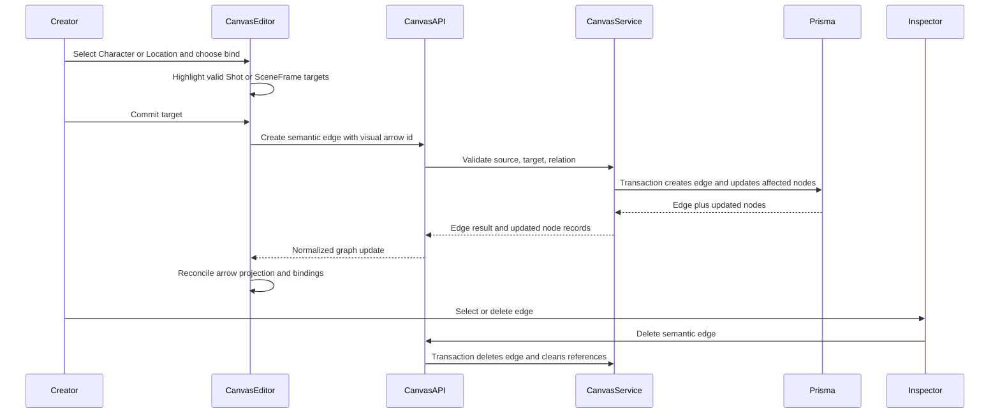
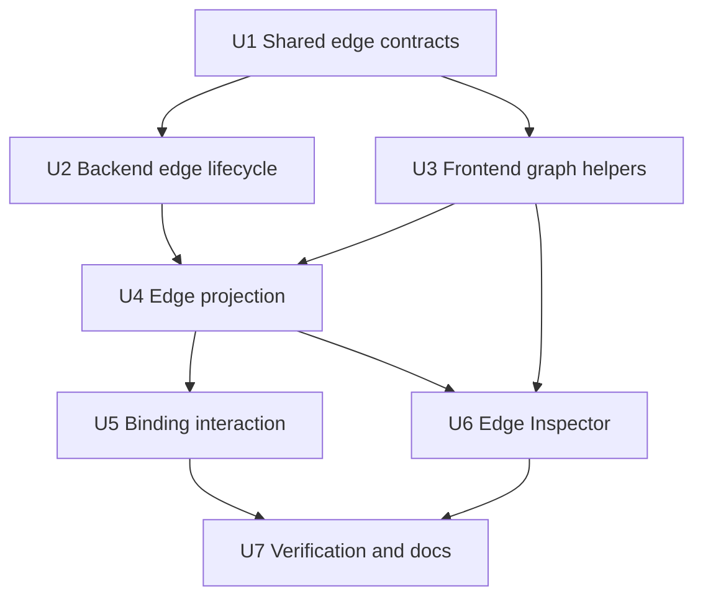
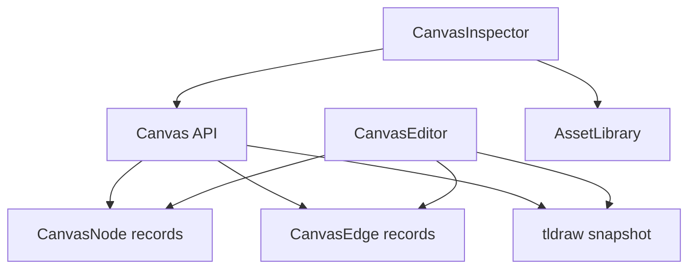

# feat: Add semantic canvas edges and asset binding

## Summary

Implement Phase 4 by extending the existing canvas node projection pattern to semantic edges: backend transactions own `CanvasEdge` facts and synchronized target-node reference data, while tldraw arrows project those facts visually. The frontend will add edge state, edge reconciliation, on-canvas drag/drop binding with a source-selected fallback, and an edge Inspector without changing the Node 26 architecture target.

---

## Problem Frame

Phase 3 made individual business nodes durable, but production relationships are still missing. Phase 4 needs to make Character/Location references visible, normalized, inspectable, deletable, and safe for later prompt composition and generation modules.

---

## Assumptions

*This plan was authored without synchronous user confirmation. The items below are agent inferences that fill gaps in the input — un-validated bets that should be reviewed before implementation proceeds.*

- The MVP interaction should support direct on-canvas Character/Location drag/drop onto valid targets. A source-selected bind mode may be included as a fallback if tldraw movement semantics make no-move drag brittle, but the implementation must record that evidence before treating the fallback as the primary browser-smoke path.
- SceneFrame batch apply should use a deterministic current-canvas containment rule: ShotNodes whose center point sits within the SceneFrame card bounds are eligible.
- Backend edge create/delete should update `CanvasEdge` and affected `CanvasNode.dataJson` in one service transaction so the frontend does not coordinate partial graph writes. Any frontend-supplied affected Shot ids for SceneFrame batch apply must be revalidated as project-scoped Shot nodes before mutation.
- Service-level idempotency is required; adding a database uniqueness guard for source-target-relation duplicates is allowed if implementation confirms it is low-risk.
- Built-in tldraw arrow shapes with arrow bindings are the preferred visual connector. A custom connector should only be used if installed package types make built-in arrow reconciliation impractical.

---

## Requirements

- R1. Support creating CharacterAssetNode to ShotNode and LocationAssetNode to ShotNode semantic relationships.
- R2. Persist every semantic relationship as a project-scoped normalized `CanvasEdge`.
- R3. Project semantic edges into visible, directional connectors on the canvas.
- R4. Keep visual connectors, normalized edges, and target node business references synchronized on create.
- R5. Character-to-Shot binding adds a unique Character reference without removing existing Character references.
- R6. Location-to-Shot binding sets or replaces the Shot's active Location reference.
- R7. Location-to-SceneFrame binding applies the Location to all eligible ShotNodes and reports the batch result.
- R8. Duplicate source-target-relation attempts are idempotent.
- R9. Selecting a semantic connector shows edge-focused Inspector content.
- R10. The edge Inspector shows relation, source, target, and delete controls.
- R11. Deleting a semantic relationship removes the edge visual, normalized edge, and synchronized target references.
- R12. Deleting a Location-to-SceneFrame batch relationship only removes references created by that batch.
- R13. Edge failures are visible and recoverable.
- R14. Reloading restores semantic edges as normalized records and visible connectors.
- R15. Deleting business nodes does not leave selectable orphan edge visuals.
- R16. Existing Asset Library and business-node Inspector behavior remain available.
- R17. Shared/API edge contracts stay ready for later generated-media relations.
- R18. Valid targets expose a visible affordance before commit.
- R19. Invalid binding combinations do not create edges or corrupt node data.
- R20. A creator can create, inspect, delete, and reload Character and Location semantic edges in one project.

**Origin actors:** A1 Creator, A2 Canvas graph system, A3 Inspector system, A4 Future prompt/generation modules  
**Origin flows:** F1 Character to Shot binding, F2 Location to Shot binding, F3 Location to SceneFrame batch apply, F4 Edge selection and deletion, F5 Reload graph state  
**Origin acceptance examples:** AE1 Character-to-Shot, AE2 Location-to-Shot, AE3 SceneFrame batch apply/delete, AE4 Edge Inspector delete, AE5 Node delete cleanup, AE6 Invalid target handling

---

## Scope Boundaries

- Do not implement Novel import, Storyboard JSON generation, or LLM extraction.
- Do not implement Storyboard import, auto layout, or duplicate import policy.
- Do not implement Prompt Composer, prompt debug panels, or prompt assembly from semantic edges.
- Do not implement GenerationJob execution, Shot-to-Image, Image-to-Video, retry, or generated media nodes.
- Do not implement real provider adapters, provider key configuration, remote media download, or provider polling.
- Do not implement Editor package export or local editor handoff.
- Do not convert raw uploaded file assets into Character/Location semantic references unless they are represented by business nodes first.
- Do not downgrade Node, Next, React, Prisma, tldraw, or the monorepo architecture to avoid local Node engine warnings.

### Deferred to Follow-Up Work

- Direct no-move drag ghost UX from sidebar asset lists: Phase 4 can bind from existing business nodes; a dedicated sidebar drag source can be added after semantic graph behavior is stable.
- Large-canvas performance targets for 300+ nodes and 1000-node pan/zoom: keep implementation reasonable, but defer formal performance gates to the productivity/performance modules.

---

## Context & Research

### Relevant Code and Patterns

- `packages/shared-types/src/domain/canvas.ts` already defines `CanvasEdgeRelation`, `CanvasEdgeRecord`, and includes `edges` in `CanvasLoadResult`; it needs Phase 4 mutation contracts and relation-aware node data fields.
- `apps/backend/prisma/schema.prisma` already has `CanvasEdge` with source/target node relations and cascade behavior when connected nodes are deleted.
- `apps/backend/src/canvas/canvas.service.ts` already loads edges but only mutates nodes and snapshots. Phase 4 should extend the same service/controller boundary rather than adding a separate graph module.
- `apps/frontend/src/components/canvas/canvas-editor.tsx` already reconciles normalized `CanvasNode` rows into tldraw business shapes, listens to user document changes, and recovers failed node deletes. Edge reconciliation should mirror this pattern.
- `apps/frontend/src/components/canvas/project-canvas-workspace.tsx` already lifts `canvasNodes` and selection state. Phase 4 should lift `canvasEdges` beside nodes.
- `apps/frontend/src/components/canvas/canvas-inspector.tsx` already preserves `AssetLibrary` while showing selection-aware node forms. Edge Inspector should compose into the same shell.

### Institutional Learnings

- `docs/solutions/architecture-patterns/tldraw-business-shape-normalized-node-sync-2026-06-12.md`: tldraw shapes are projections; backend records own domain facts. Edge visuals should follow the same projection boundary.
- `docs/solutions/architecture-patterns/durable-tldraw-snapshot-autosave-boundary-2026-06-12.md`: snapshot persistence is visual recovery; normalized arrays are the future-ready business envelope.
- `docs/solutions/architecture-patterns/project-scoped-asset-lifecycle-boundary-2026-06-12.md`: preserve asset lifecycle boundaries; edge/node deletes must not delete unrelated asset files.
- `docs/solutions/tooling-decisions/node-26-prisma-7-phase-0-foundation-2026-06-12.md`: keep the Node 26 target and Prisma 7 stack.

### External References

- Context7 `/tldraw/tldraw` confirms built-in arrow shapes can be created programmatically and bound to shapes with arrow bindings.
- Context7 `/tldraw/tldraw` confirms editor store listeners, `getShapeAtPoint`, editor event listeners, and `inputs.getCurrentPagePoint()` are available for hit-testing and pointer-driven interactions.
- Local `tldraw@5.1.0` package exports `ArrowBindingUtil`, `ArrowShapeUtil`, `createBindingId`, `getArrowBindings`, and includes tests using `getShapeAtPoint` and binding APIs.
- `docs/research/video-ref/repomix/toonflow-app-focused-storyboard.xml` shows Toonflow persists storyboard-to-asset associations through durable join records and deletes those associations with storyboard rows. Treat this as supporting evidence for durable relation records, not as a schema to copy.

---

## Key Technical Decisions

- Backend owns semantic synchronization: edge create/delete should update `CanvasEdge` and affected target `CanvasNode.dataJson` together so the browser never has to reconcile partial writes as normal behavior.
- Edge projection mirrors node projection: normalized `CanvasEdge` is canonical; tldraw arrows and bindings are visual state that can be recreated from normalized edge records.
- Use built-in tldraw arrows first: they already support bindings and stay attached when nodes move, reducing custom shape surface.
- Store batch lineage on edge metadata: Location-to-SceneFrame apply must persist which ShotNodes were affected, and any child Shot edges created from that batch must remain traceable to the batch edge so deletion can clean only references created by that batch.
- Treat manual user arrows as generic canvas content: only arrows linked to normalized `CanvasEdge.visualArrowShapeId` should select as business edges or trigger edge API deletes.
- Preserve data extensions: Shot, SceneFrame, Character, and Location forms must keep unknown `dataJson` keys so later provider and batch metadata is not dropped by Phase 4 saves.

---

## Open Questions

### Resolved During Planning

- tldraw visual connector approach: Use built-in arrow shapes and arrow bindings where possible; fall back to a custom connector only if implementation proves built-in arrows cannot be reconciled reliably.
- SceneFrame shot eligibility: Use center-point containment inside the SceneFrame business shape bounds for the MVP batch rule.
- Transaction boundary: Backend service owns edge and target-node reference writes in a transaction.
- Binding interaction: Implement direct on-canvas source drag/drop using tldraw hit-testing and target affordance. Include a source-selected bind mode as a recoverable fallback only if implementation evidence shows direct drag/drop interferes with normal movement.

### Deferred to Implementation

- Exact visual arrow style and label treatment: choose the smallest readable style after checking how built-in tldraw arrows render with business cards.
- Exact invalid-target affordance: choose the UI that fits the existing canvas toolbar and error overlay without adding a modal-heavy workflow.
- Whether to add a Prisma uniqueness migration for duplicate edges: implement if straightforward after confirming current migration state; otherwise enforce idempotency in service tests.
- Final browser smoke mechanics: use the available Browser/Chrome automation path in the current environment.

---

## High-Level Technical Design

> *This illustrates the intended approach and is directional guidance for review, not implementation specification. The implementing agent should treat it as context, not code to reproduce.*

---

## Implementation Units

- U1. **Shared Phase 4 edge contracts and node reference data**

**Goal:** Extend shared canvas contracts so edge creation/deletion, reference-bearing node data, and batch metadata are typed from one source.

**Requirements:** R1, R2, R4, R5, R6, R7, R8, R11, R12, R17

**Dependencies:** None

**Files:**
- Modify: `packages/shared-types/src/domain/canvas.ts`
- Modify: `packages/shared-types/src/domain/domain.test.ts`

**Approach:**
- Add Phase 4 edge mutation contracts for create/delete results, including normalized edge records and updated node records.
- Extend Shot data with character and location reference fields needed by prompt/generation phases.
- Add edge metadata for Location-to-SceneFrame batch lineage, including affected Shot node ids and child-edge linkage when child Shot edges are created.
- Keep broad relation enum support, while documenting that Phase 4 UI only exposes Character/Location reference relations.

**Execution note:** Implement new shared contracts test-first; downstream app work depends on these names and shapes.

**Patterns to follow:**
- Phase 3 shared node mutation contracts in `packages/shared-types/src/domain/canvas.ts`.
- Serialization-oriented shared tests in `packages/shared-types/src/domain/domain.test.ts`.

**Test scenarios:**
- Happy path: a create-edge result can carry one visible edge and updated target node records.
- Happy path: Shot data supports multiple unique character references and one active location reference.
- Happy path: Location-to-SceneFrame metadata can represent affected Shot node ids without breaking `CanvasSnapshotJson` compatibility.
- Edge case: existing generated relation enum values remain exported for later phases.

**Verification:**
- Shared-types tests compile and prove the Phase 4 contracts are JSON-compatible and importable by backend/frontend.

---

- U2. **Backend CanvasEdge lifecycle API with synchronized business data**

**Goal:** Add project-scoped edge create/delete routes that validate source/target relationships, persist `CanvasEdge`, and synchronize affected `CanvasNode.dataJson` atomically.

**Requirements:** R1, R2, R4, R5, R6, R7, R8, R11, R12, R13, R15, R17, AE1, AE2, AE3, AE4, AE5

**Dependencies:** U1

**Files:**
- Modify: `apps/backend/prisma/schema.prisma`
- Create: `apps/backend/prisma/migrations/<timestamp>_canvas_edge_idempotency/migration.sql` if adding a uniqueness guard
- Modify: `apps/backend/src/canvas/dto.ts`
- Modify: `apps/backend/src/canvas/canvas.service.ts`
- Modify: `apps/backend/src/canvas/canvas.controller.ts`
- Modify: `apps/backend/src/canvas/canvas.service.spec.ts`
- Modify: `apps/backend/test/app.e2e-spec.ts`

**Approach:**
- Add `POST /projects/:projectId/canvas/edges` and `DELETE /projects/:projectId/canvas/edges/:edgeId`.
- Scope all source, target, and edge lookups by `projectId` and the active `CanvasDocument`.
- Validate Phase 4 user-facing combinations: Character to Shot, Location to Shot, and Location to SceneFrame.
- For Character to Shot, add a unique character reference to the Shot's business data.
- For Location to Shot, set the active Location reference on the Shot.
- For Location to SceneFrame, identify affected Shots from input supplied by the frontend, revalidate every affected id as a project-scoped Shot node, persist enough lineage to clean only those references on delete, and return the updated nodes.
- Make repeated source-target-relation creation idempotent by returning the existing relationship and current synchronized nodes rather than creating duplicates.
- On delete, remove the edge and clean references that still belong to that edge or batch lineage. Leave unrelated project assets untouched.

**Execution note:** Start with service tests that define the transaction behavior before wiring the controller route.

**Patterns to follow:**
- Project-scoped node CRUD in `apps/backend/src/canvas/canvas.service.ts`.
- Existing in-memory Prisma e2e mock shape in `apps/backend/test/app.e2e-spec.ts`.
- Backend validation DTOs in `apps/backend/src/canvas/dto.ts`.

**Test scenarios:**
- Covers AE1. Happy path: Character-to-Shot creates one edge and updates Shot character references.
- Covers AE2. Happy path: Location-to-Shot creates one edge and sets the Shot location reference.
- Covers AE3. Happy path: Location-to-SceneFrame returns an applied-shot count and updated Shot records.
- Edge case: duplicate Character-to-Shot create returns or preserves one edge and one character reference.
- Edge case: deleting a connected business node cascades normalized edges and load results do not expose orphan edge records.
- Error path: invalid source-target relation returns a validation error and does not update target node data.
- Error path: cross-project source or target node is rejected.
- Error path: SceneFrame batch apply rejects affected Shot ids outside the project or with the wrong node type.
- Error path: deleting a missing edge returns a not-found error.
- Integration: e2e route tests cover create, duplicate, delete, invalid relation, and canvas reload edges array.

**Verification:**
- Backend service and e2e tests prove edge writes, duplicate prevention, deletion cleanup, and project scoping.

---

- U3. **Frontend edge API client and graph helper layer**

**Goal:** Add frontend API calls and pure helper functions for edge labels, source/target validation, SceneFrame shot eligibility, and immutable node/edge state updates.

**Requirements:** R3, R4, R7, R8, R11, R12, R17, R18, R19

**Dependencies:** U1, U2 API contract shape

**Files:**
- Modify: `apps/frontend/src/lib/api.ts`
- Create: `apps/frontend/src/components/canvas/canvas-edge-data.ts`
- Create: `apps/frontend/src/components/canvas/canvas-edge-data.test.ts`
- Modify: `apps/frontend/src/components/canvas/business-node-data.ts`
- Modify: `apps/frontend/src/components/canvas/business-node-data.test.ts`
- Modify: `apps/frontend/src/components/canvas/business-node-form.test.ts`

**Approach:**
- Add API client calls for create and delete edge routes.
- Add pure helpers for relation labels, source/target labels, valid binding combinations, edge idempotency checks, and state merging.
- Add a SceneFrame eligibility helper based on Shot center point inside SceneFrame bounds.
- Ensure card summaries can surface character/location reference state without turning cards into dense forms.
- Keep helper behavior testable without a real tldraw editor.

**Patterns to follow:**
- `apps/frontend/src/components/canvas/business-node-data.ts` pure helper style.
- `apps/frontend/src/components/canvas/use-business-node-sync.ts` state-merge expectations.
- `apps/frontend/src/lib/api.ts` request wrapper conventions.

**Test scenarios:**
- Happy path: Character-to-Shot and Location-to-Shot combinations are valid; unsupported combinations are invalid.
- Happy path: SceneFrame eligibility returns only Shot nodes whose centers are inside the frame bounds.
- Edge case: helper handles missing `dataJson`, missing titles, and partially populated older records.
- Edge case: merging edge create/delete results replaces updated nodes without dropping unrelated nodes.
- Error path: API error messages pass through the shared request wrapper.

**Verification:**
- Frontend helper tests prove relation decisions and state updates before editor integration begins.

---

- U4. **CanvasEditor edge state and tldraw arrow projection**

**Goal:** Load, reconcile, select, create, restore, and delete visual edge projections in tldraw while keeping normalized `canvasEdges` in React state.

**Requirements:** R2, R3, R4, R9, R11, R13, R14, R15, R17, AE4, AE5

**Dependencies:** U2, U3

**Files:**
- Modify: `apps/frontend/src/components/canvas/project-canvas-workspace.tsx`
- Modify: `apps/frontend/src/components/canvas/canvas-editor.tsx`
- Modify: `apps/frontend/src/components/canvas/canvas-selection.ts`
- Modify: `apps/frontend/src/components/canvas/use-selected-business-nodes.ts`
- Create: `apps/frontend/src/components/canvas/use-canvas-edge-sync.ts`
- Create: `apps/frontend/src/components/canvas/canvas-edge-visuals.ts`
- Create: `apps/frontend/src/components/canvas/canvas-edge-visuals.test.ts`
- Modify: `apps/frontend/src/components/canvas/canvas-editor.test.tsx`

**Approach:**
- Lift `canvasEdges` state beside `canvasNodes` in the workspace and publish load results from `getProjectCanvas`.
- Extend selection state so a selected arrow that maps to a normalized edge becomes `business-edge`.
- Reconcile normalized edges after node shapes exist: create missing visual arrows, bind arrows to source and target shapes, refresh stale edge visuals, and leave generic user arrows alone.
- When a semantic arrow is removed by user action, call the edge delete API, merge returned node/edge state, and restore the arrow if the API fails.
- When connected nodes are deleted, remove or ignore orphan visual edge projections that no longer have normalized edges.
- Schedule snapshot save when programmatic edge visual recovery changes the tldraw document.

**Patterns to follow:**
- Business node reconciliation, delete failure recovery, and geometry state merge in `apps/frontend/src/components/canvas/canvas-editor.tsx`.
- Selection helper tests in `apps/frontend/src/components/canvas/business-node-sync.test.ts`.
- tldraw docs for built-in arrow bindings and `getShapeAtPoint`.

**Test scenarios:**
- Happy path: selection helper maps a known visual arrow id to `business-edge`.
- Happy path: edge visual helper builds a stable arrow projection from source/target business shape ids.
- Covers AE4. Integration: removing a semantic arrow schedules backend delete and clears selection on success.
- Covers AE5. Edge case: deleting a connected business node removes semantic edge projection state but preserves unrelated user arrows.
- Error path: delete failure restores the semantic arrow and surfaces an action error.
- Edge case: normalized edge exists but arrow is missing from snapshot; reconciliation recreates it.

**Verification:**
- Frontend tests prove normalized edges and tldraw arrows do not drift through selection, reload, and deletion paths.

---

- U5. **Semantic binding interaction and target affordances**

**Goal:** Let creators bind Character/Location source nodes to valid Shot/SceneFrame targets through a reliable canvas interaction with visible affordances and invalid-target safety.

**Requirements:** R1, R3, R4, R5, R6, R7, R8, R18, R19, R20, AE1, AE2, AE3, AE6

**Dependencies:** U3, U4

**Files:**
- Create: `apps/frontend/src/components/canvas/semantic-bind-toolbar.tsx`
- Create: `apps/frontend/src/components/canvas/semantic-bind-interactions.ts`
- Create: `apps/frontend/src/components/canvas/semantic-bind-interactions.test.ts`
- Modify: `apps/frontend/src/components/canvas/canvas-editor.tsx`
- Modify: `apps/frontend/src/components/canvas/business-node-card.tsx`
- Modify: `apps/frontend/src/app/globals.css`

**Approach:**
- Support direct on-canvas drag/drop from CharacterAssetNode and LocationAssetNode business shapes onto valid ShotNode or SceneFrame targets.
- Add a compact bind control that becomes available when the selected source node is a CharacterAssetNode or LocationAssetNode as a fallback and accessibility-friendly explicit path.
- Use tldraw editor hit-testing to highlight valid targets while dragging a source node or while bind mode is active.
- Commit Character-to-Shot, Location-to-Shot, and Location-to-SceneFrame bindings through the backend create-edge API.
- For Location-to-SceneFrame, compute eligible ShotNodes from current normalized geometry and include the affected shot list in the create request.
- After a successful create, merge returned edges/nodes and reconcile arrow visuals.
- Invalid targets should leave bind mode recoverable and show a concise error or affordance, not create partial edges.
- If direct drag/drop cannot be completed without compromising normal canvas movement, record the implementation evidence in this plan's verification section and keep the explicit bind mode as the supported path for this module.

**Patterns to follow:**
- Business node toolbar composition in `apps/frontend/src/components/canvas/business-node-toolbar.tsx`.
- Existing `canvas-save-error node-action-error` overlay for visible failures.
- Existing CSS scale and compact controls in `apps/frontend/src/app/globals.css`.

**Test scenarios:**
- Covers AE1. Happy path: dragging a Character source over a Shot target calls create edge with the correct relation intent and merges the returned graph state.
- Covers AE2. Happy path: dragging a Location source over a Shot target updates the Location edge state.
- Happy path: source-selected bind mode commits the same relation as the drag/drop path.
- Covers AE3. Happy path: Location-to-SceneFrame includes the eligible Shot list and reports the number of affected Shots.
- Covers AE6. Error path: invalid source-target combinations do not call the API and show invalid-target state.
- Edge case: duplicate create response does not duplicate edge or node references in frontend state.
- Error path: API create failure leaves bind mode recoverable and does not insert a semantic arrow.

**Verification:**
- Canvas interaction tests and browser smoke prove creators can create valid edges and cannot corrupt graph state through invalid targets.

---

- U6. **Edge Inspector and delete flow**

**Goal:** Add edge-focused Inspector behavior so selected semantic connectors can be understood and deleted without losing Asset Library or business-node editing flows.

**Requirements:** R9, R10, R11, R12, R13, R16, R20, AE4, AE5

**Dependencies:** U3, U4

**Files:**
- Modify: `apps/frontend/src/components/canvas/canvas-inspector.tsx`
- Create: `apps/frontend/src/components/canvas/canvas-edge-inspector.tsx`
- Modify: `apps/frontend/src/components/canvas/canvas-inspector.test.tsx`
- Modify: `apps/frontend/src/components/canvas/project-canvas-workspace.tsx`
- Modify: `apps/frontend/src/app/globals.css`

**Approach:**
- Add an edge Inspector panel for `business-edge` selection.
- Display relation label, source node label, target node label, and batch/applied count where relevant.
- Delete through the backend edge delete API, merge returned updated nodes/edges, remove the visual arrow, and clear selection.
- Keep node form, empty, multi, unsupported, and Asset Library behavior unchanged.

**Patterns to follow:**
- `BusinessNodeForm` save/error style.
- `CanvasInspector` selection routing and Asset Library preservation.
- Shared relation label helpers from U3.

**Test scenarios:**
- Covers AE4. Happy path: selected edge renders relation/source/target and delete action.
- Covers AE4. Happy path: delete success calls parent update handlers and removes stale edge selection.
- Error path: delete failure surfaces an Inspector error and leaves the edge available for retry.
- Covers AE5. Integration: Asset Library remains rendered for edge selection.
- Edge case: missing source or target node renders a recoverable unavailable-edge state.

**Verification:**
- Inspector tests cover selection states, delete behavior, and asset library preservation.

---

- U7. **Phase 4 verification, documentation, and plan status**

**Goal:** Verify the Phase 4 acceptance path end-to-end, update developer documentation, and record execution evidence in the plan.

**Requirements:** R13, R14, R15, R16, R20, AE1, AE2, AE3, AE4, AE5, AE6

**Dependencies:** U1, U2, U3, U4, U5, U6

**Files:**
- Modify: `docs/development.md`
- Modify: `docs/plans/2026-06-12-005-feat-semantic-canvas-edges-plan.md`
- Optional: `docs/solutions/architecture-patterns/<phase-4-learning>-2026-06-12.md` during `ce-compound`

**Approach:**
- Update development docs with the Phase 4 semantic edge workflow and API surface once implementation is verified.
- Add a verification section to this plan with targeted, full-suite, and browser smoke evidence.
- Browser smoke should create or use a project with Character, Location, Shot, and SceneFrame nodes; bind Character-to-Shot and Location-to-Shot or SceneFrame; refresh; delete an edge; and confirm Asset Library still works.
- Keep Node engine warnings documented as environment warnings, not reasons to downgrade dependencies.

**Patterns to follow:**
- Phase 3 plan completion and verification evidence style in `docs/plans/2026-06-12-004-feat-business-canvas-nodes-inspector-plan.md`.
- Existing `docs/development.md` module notes.

**Test scenarios:**
- Covers AE1, AE2, AE4. Browser smoke: create Character-to-Shot and Location-to-Shot edges, refresh, verify connectors and target references remain, delete one edge, refresh again.
- Covers AE3. Browser smoke or integration test: Location-to-SceneFrame applies to eligible Shots and deletion cleans only batch-created references.
- Covers AE5. Browser smoke: connected node deletion does not leave selectable orphan semantic arrows and uploaded assets remain listed.
- Covers AE6. Browser smoke: invalid target does not create an edge and leaves the canvas usable.

**Verification:**
- Targeted tests pass for shared, backend, and frontend canvas modules.
- Full repository quality gates pass where available: format/type checks, tests, build, and mock workflow.
- Browser smoke evidence is captured in the plan.

---

## System-Wide Impact

- **Interaction graph:** Canvas load, tldraw store listeners, business-node reconciliation, semantic edge reconciliation, bind mode, Inspector selection, and Asset Library all share the workspace surface.
- **Error propagation:** Backend validation and transaction failures should surface through canvas action errors or Inspector form errors; save status must not claim semantic edge success when edge writes fail.
- **State lifecycle risks:** Edge create/delete can update both nodes and edges, so frontend merge helpers must update both arrays from backend responses before reconciliation.
- **API surface parity:** Shared contracts, backend DTOs, backend service/e2e mocks, and frontend API client must land together.
- **Integration coverage:** Unit helpers alone are not enough; backend service/e2e and browser smoke must prove cross-layer graph state.
- **Unchanged invariants:** Existing CanvasNode CRUD, autosave snapshot persistence, business-node forms, project assets, and provider-key boundaries remain intact.

---

## Risks & Dependencies

| Risk | Mitigation |
|------|------------|
| Built-in tldraw arrow APIs differ from docs at installed version | Verify against `tldraw@5.1.0` package exports before coding; isolate arrow creation in a small helper. |
| Binding UX interferes with normal node movement | Implement direct drag/drop first, but keep source-selected bind mode as a fallback and record evidence if direct dragging cannot remain reliable. |
| Edge create partially updates business data | Put edge and node updates inside backend service transactions and return updated records together. |
| SceneFrame containment feels surprising | Use center-point containment for determinism and report affected shot count; document the rule in development docs. |
| Duplicate edges corrupt prompt inputs | Enforce idempotency in service tests and optionally a database uniqueness guard. |
| Deleting edge removes references the user later changed manually | Persist batch lineage and clean only references still matching the deleted edge source/lineage. |

---

## Documentation / Operational Notes

- Update `docs/development.md` with Phase 4 edge routes, binding workflow, SceneFrame batch rule, and smoke checklist.
- Keep plan verification evidence current during `ce-work`; do not wait until final review to document browser results.
- `ce-compound` should likely capture a Phase 4 learning about semantic graph projection and backend-owned reference synchronization.

---

## Sources & References

- **Origin document:** [docs/brainstorms/2026-06-12-005-phase-4-semantic-edges-asset-binding-requirements.md](../brainstorms/2026-06-12-005-phase-4-semantic-edges-asset-binding-requirements.md)
- PRD: [infinite_canvas_video_prd_roadmap_v2_detailed.md](../../infinite_canvas_video_prd_roadmap_v2_detailed.md)
- Architecture reference: [docs/tech-stack-text2sql-reference.md](../tech-stack-text2sql-reference.md)
- Phase 3 plan: [docs/plans/2026-06-12-004-feat-business-canvas-nodes-inspector-plan.md](./2026-06-12-004-feat-business-canvas-nodes-inspector-plan.md)
- Phase 3 learning: [docs/solutions/architecture-patterns/tldraw-business-shape-normalized-node-sync-2026-06-12.md](../solutions/architecture-patterns/tldraw-business-shape-normalized-node-sync-2026-06-12.md)
- tldraw arrow shape docs: [apps/docs/content/sdk-features/arrow-shape.mdx](https://github.com/tldraw/tldraw/blob/main/apps/docs/content/sdk-features/arrow-shape.mdx)
- tldraw bindings docs: [apps/docs/content/sdk-features/bindings.mdx](https://github.com/tldraw/tldraw/blob/main/apps/docs/content/sdk-features/bindings.mdx)
- tldraw editor docs: [apps/docs/content/sdk-features/editor.mdx](https://github.com/tldraw/tldraw/blob/main/apps/docs/content/sdk-features/editor.mdx)
