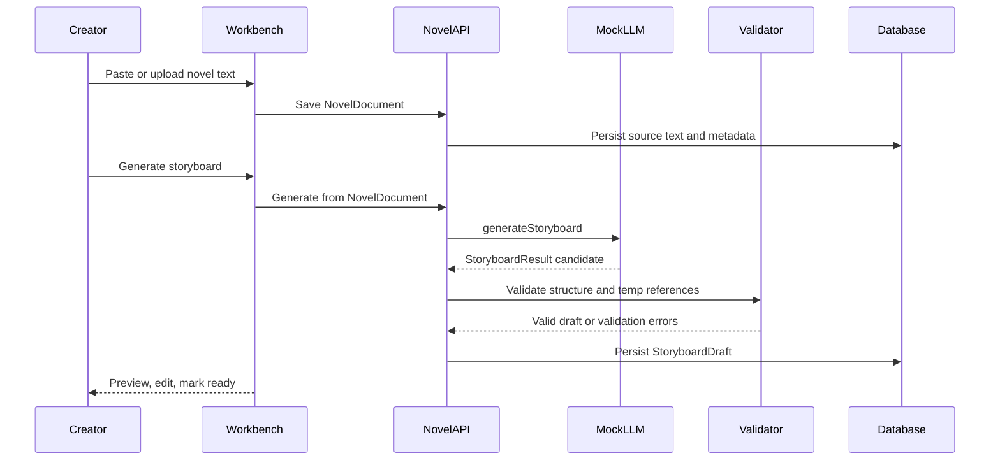
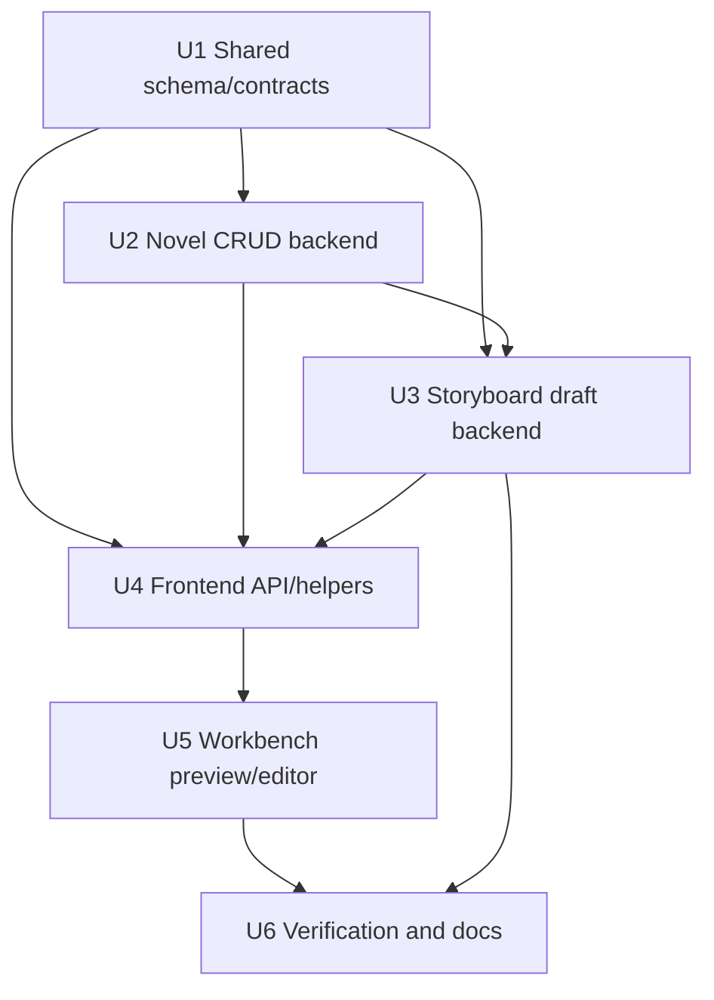

# feat: Add novel import and storyboard draft workflow

## Summary

Implement Phase 5 by adding shared Zod-backed storyboard validation, project-scoped NovelDocument and StoryboardDraft backend flows, and a compact workbench panel for paste/upload, mock generation, preview, edit, validation, and import-ready marking.

---

## Problem Frame

The existing app has durable canvas nodes and semantic edges, but no upstream story artifact that can feed canvas import. This plan adds the missing novel-to-storyboard draft layer without pulling Phase 6 canvas batch import or Phase 8 job queue behavior forward.

---

## Assumptions

*This plan was authored without synchronous user confirmation. The items below are agent inferences that fill gaps in the input — un-validated bets that should be reviewed before implementation proceeds.*

- Add `zod` as a shared-types runtime dependency and keep Zod 4 schema helpers in the shared package so backend, frontend, provider contracts, and worker code validate the same `StoryboardResult`.
- Add a durable `StoryboardDraft` persistence concept rather than storing generated storyboard JSON inside the tldraw snapshot or relying on transient frontend state.
- Use direct mock LLM provider invocation in Phase 5 and store provider/model metadata on the draft result, while leaving `GenerationJob` queue execution to Phase 8.
- Host the novel/storyboard workflow inside the existing project workbench, likely in the Inspector/sidebar area, while keeping the canvas as the primary workspace surface.
- Treat "ready for import" as a validated draft status or flag; do not create canvas nodes, shapes, or semantic edges until Phase 6.

---

## Requirements

- R1. Projects support creating, listing, reading, updating, and deleting novel source records.
- R2. Novel sources support pasted text and `.txt` / `.md` source imports.
- R3. Novel records retain title, source type, content, word count, language, and timestamps.
- R4. Novel mutations stay project-scoped and do not delete unrelated canvas nodes, semantic edges, or media assets.
- R5. A saved novel can generate a storyboard draft through the mock LLM provider without real keys.
- R6. Storyboard drafts include title, logline, characters, locations, scenes, shots, and stable temp-id references.
- R7. Shared runtime validation gates generated and edited storyboard data.
- R8. Invalid provider output is rejected without replacing the last valid draft.
- R9. Provider failures preserve the novel source and surface retryable errors.
- R10. The frontend exposes a scannable storyboard preview/editor.
- R11. The editor supports core scene, shot, character, location, prompt, duration, and temp-reference fields.
- R12. Edited drafts revalidate before save and cannot become import-ready when invalid.
- R13. Valid drafts reload after project refresh.
- R14. Valid drafts expose a ready-for-canvas-import state for Phase 6.
- R15. Empty source text, unsupported uploads, malformed drafts, duplicate temp ids, and missing references are handled safely.
- R16. Existing dashboard, asset library, canvas, semantic edge, and mock workflow behavior remain available.

**Origin actors:** A1 Creator, A2 Storyboard system, A3 Future canvas import system, A4 Future prompt/generation modules  
**Origin flows:** F1 Create/update novel source, F2 Generate mock storyboard draft, F3 Preview/edit storyboard, F4 Recover from invalid output or provider failure  
**Origin acceptance examples:** AE1 novel paste, AE2 txt/md import rejection, AE3 mock storyboard generation/reload, AE4 edit/save validation, AE5 failure recovery, AE6 import-ready without canvas mutation

---

## Scope Boundaries

- Do not import storyboard drafts into canvas nodes, tldraw shapes, or semantic edges.
- Do not implement auto layout, duplicate import policy, or fit-to-content behavior for storyboard import.
- Do not implement Prompt Composer, prompt debug panels, reference image enrichment, image generation, video generation, or editor package export.
- Do not create persistent `GenerationJob` queue execution for novel-to-storyboard in this module.
- Do not implement real LLM provider configuration, remote provider calls, provider keys, or provider UI.
- Do not downgrade Node, Next, React, Prisma, tldraw, or the monorepo architecture to avoid local runtime warnings.

### Deferred to Follow-Up Work

- Rich spreadsheet-like bulk editing for very large storyboard drafts: Phase 5 should support useful inline editing, but high-density productivity belongs to later efficiency modules.
- Automatic canvas import and layout from a ready draft: owned by Phase 6.

---

## Context & Research

### Relevant Code and Patterns

- `packages/shared-types/src/domain/storyboard.ts` already defines `StoryboardResult` and draft interfaces, but they are TypeScript-only and need runtime validation.
- `packages/provider-contracts/src/mock-providers.ts` already returns deterministic mock storyboard output through `MockLlmProvider`.
- `apps/backend/prisma/schema.prisma` already contains `NovelDocument`; no backend module currently exposes it, and no durable storyboard draft table exists yet.
- `apps/backend/src/projects/*`, `apps/backend/src/assets/*`, and `apps/backend/src/canvas/*` establish project-scoped service/controller/dto/test patterns.
- `apps/frontend/src/lib/api.ts`, `apps/frontend/src/components/canvas/project-canvas-workspace.tsx`, `apps/frontend/src/components/canvas/canvas-inspector.tsx`, and `apps/frontend/src/components/projects/asset-library.tsx` establish current workbench integration and request wrapper patterns.
- `apps/frontend/src/components/workbench-shell.tsx` already has Novel and Storyboard affordance placeholders, but Storyboard is disabled.

### Institutional Learnings

- `docs/solutions/tooling-decisions/node-26-prisma-7-phase-0-foundation-2026-06-12.md`: keep the Node 26 target; do not lower dependency architecture for the current local Node warning.
- `docs/solutions/architecture-patterns/project-scoped-asset-lifecycle-boundary-2026-06-12.md`: keep uploaded text assets behind backend boundaries; list/detail frontend state can diverge if not handled deliberately.
- `docs/solutions/architecture-patterns/tldraw-business-shape-normalized-node-sync-2026-06-12.md`: business facts belong in normalized backend records, not tldraw props.
- `docs/solutions/architecture-patterns/semantic-canvas-edge-projection-lifecycle-2026-06-12.md`: later storyboard import should consume normalized graph facts and create canvas projections as a separate module.

### External References

- Zod 4 official docs confirm object/array schemas, `z.infer`, `safeParse`, and `superRefine` are the right primitives for nested runtime validation and cross-reference checks.
- `docs/research/video-ref/repomix/toonflow-app-focused-storyboard.xml` shows a storyboard flow with explicit script/storyboard records, ordered batch creation, and durable asset-to-storyboard associations. Use this as product-flow evidence, not as a schema to copy.

---

## Key Technical Decisions

- Use Zod 4 in `@guga-flow/shared-types` for runtime storyboard validation: this keeps generated, edited, backend-stored, frontend-rendered, and provider-returned data on one schema.
- Add a durable StoryboardDraft persistence layer: Phase 5 needs reloadable preview/edit state and Phase 6 needs a validated input artifact.
- Generate through the existing mock provider contract directly: this satisfies mock-first Phase 5 while avoiding premature queue semantics that belong to Phase 8.
- Keep import readiness separate from canvas mutation: a ready draft is a contract for Phase 6, not an action that silently creates nodes in Phase 5.
- Keep the frontend editing surface compact and structured: list/section editing for characters, locations, scenes, and shots is enough; spreadsheet-grade bulk editing is deferred.

---

## Open Questions

### Resolved During Planning

- Runtime schema location: keep schema and inferred types in `packages/shared-types/src/domain/storyboard.ts` so all workspaces consume the same contract.
- Generation persistence: use a direct mock provider call and store provider/model/error metadata on StoryboardDraft; do not create `GenerationJob` rows yet.
- UI surface: integrate a Novel/Storyboard panel into the existing workbench shell/Inspector area, preserving the canvas as the primary visual workspace.

### Deferred to Implementation

- Exact StoryboardDraft table field names and enum naming should be finalized while editing the Prisma schema and generated client.
- Exact frontend editor component split should follow test seams discovered while building the panel.
- Exact browser smoke mechanics may use Browser/Chrome automation plus backend API verification if synthetic tldraw interactions remain brittle.

---

## High-Level Technical Design

> *This illustrates the intended approach and is directional guidance for review, not implementation specification. The implementing agent should treat it as context, not code to reproduce.*

---

## Implementation Units

- U1. **Shared storyboard schema, validation, and API contracts**

**Goal:** Turn `StoryboardResult` into a runtime-validated shared contract and add typed NovelDocument/StoryboardDraft mutation results.

**Requirements:** R3, R6, R7, R8, R12, R14, R15

**Dependencies:** None

**Files:**
- Modify: `packages/shared-types/package.json`
- Modify: `pnpm-lock.yaml`
- Modify: `packages/shared-types/src/domain/storyboard.ts`
- Modify: `packages/shared-types/src/domain/project.ts`
- Modify: `packages/shared-types/src/domain/domain.test.ts`

**Approach:**
- Add Zod 4 as a shared-types runtime dependency.
- Define nested schemas for characters, locations, scenes, shots, and full storyboard results.
- Add validation helpers that return parsed data or issue summaries without throwing in normal API paths.
- Add cross-reference validation for duplicate temp ids and scene/shot references to missing character/location temp ids.
- Add shared contracts for novel create/update/list/delete, storyboard generate/update/ready results, and StoryboardDraft status.

**Execution note:** Implement schema and validation tests before wiring backend calls.

**Patterns to follow:**
- Existing shared domain exports in `packages/shared-types/src/index.ts`.
- Shared type/import coverage in `packages/shared-types/src/domain/domain.test.ts`.
- Zod 4 official docs for `safeParse`, `z.infer`, object/array schemas, and `superRefine`.

**Test scenarios:**
- Happy path: the existing mock provider storyboard validates and infers as `StoryboardResult`.
- Happy path: a StoryboardDraft record can carry provider/model metadata, validation status, and ready-for-import state.
- Edge case: duplicate character, location, scene, or shot temp ids produce validation issues.
- Error path: a shot referencing a missing character temp id or missing location temp id fails validation.
- Error path: empty scenes, empty shots, non-positive duration, and missing prompts fail validation.

**Verification:**
- Shared-types tests and build prove schemas, inferred types, and mutation contracts are importable by backend/frontend/provider packages.

---

- U2. **Backend NovelDocument CRUD and project-scoped source imports**

**Goal:** Expose project-scoped novel source lifecycle APIs for pasted text and text/markdown imports without touching canvas state or assets outside the source flow.

**Requirements:** R1, R2, R3, R4, R15, AE1, AE2

**Dependencies:** U1

**Files:**
- Create: `apps/backend/src/novels/novels.module.ts`
- Create: `apps/backend/src/novels/novels.controller.ts`
- Create: `apps/backend/src/novels/novels.service.ts`
- Create: `apps/backend/src/novels/dto.ts`
- Create: `apps/backend/src/novels/novels.service.spec.ts`
- Modify: `apps/backend/src/app.module.ts`
- Modify: `apps/backend/test/app.e2e-spec.ts`

**Approach:**
- Add routes under the project boundary for novel list, create, read, update, delete, and text-source import.
- Validate title/content/source type/language and compute word count server-side.
- Accept pasted content directly and text/markdown source content from the browser; preserve uploaded asset lifecycle separately rather than reusing media delete behavior.
- Keep all reads and writes scoped by `projectId`.
- Delete only the novel record and its storyboard drafts if cascade is introduced; do not delete canvas nodes, edges, or project assets.

**Execution note:** Start with service tests for project scoping, word count, invalid input, and non-canvas side effects.

**Patterns to follow:**
- Project CRUD service/controller structure in `apps/backend/src/projects/*`.
- Asset upload validation and text MIME constraints in `apps/backend/src/assets/*`.
- E2E in-memory Prisma mock shape in `apps/backend/test/app.e2e-spec.ts`.

**Test scenarios:**
- Covers AE1. Happy path: pasted title/content creates a NovelDocument with source type, word count, language, timestamps, and project id.
- Covers AE2. Happy path: text/markdown source import creates a NovelDocument from supplied text content.
- Edge case: updating title/content recomputes word count and preserves project scoping.
- Error path: empty title, empty content, unsupported source type, and missing project are rejected.
- Error path: cross-project read/update/delete cannot access another project's novel.
- Integration: deleting a novel does not delete canvas nodes, semantic edges, or project assets in the mock store.

**Verification:**
- Backend service/e2e tests prove NovelDocument lifecycle behavior and project scoping.

---

- U3. **Backend storyboard draft generation, validation, editing, and readiness**

**Goal:** Generate mock storyboard drafts from saved novels, persist valid drafts, reject invalid candidates, allow edited draft saves, and expose ready-for-import state.

**Requirements:** R5, R6, R7, R8, R9, R12, R13, R14, R15, AE3, AE4, AE5, AE6

**Dependencies:** U1, U2

**Files:**
- Modify: `apps/backend/prisma/schema.prisma`
- Create: `apps/backend/prisma/migrations/<timestamp>_storyboard_drafts/migration.sql`
- Modify: `apps/backend/src/novels/novels.service.ts`
- Modify: `apps/backend/src/novels/novels.controller.ts`
- Modify: `apps/backend/src/novels/dto.ts`
- Modify: `apps/backend/src/novels/novels.service.spec.ts`
- Modify: `apps/backend/test/app.e2e-spec.ts`

**Approach:**
- Add durable StoryboardDraft persistence tied to project and novel source.
- Call the existing mock LLM provider through provider-contracts for generation.
- Validate provider candidates with shared Zod helpers before writing them as valid drafts.
- Preserve the last valid draft when provider output fails validation or provider execution fails.
- Allow edited storyboard drafts to be saved only after validation passes.
- Expose an import-ready mutation that succeeds only for a currently valid draft.
- Store enough provider/model/error metadata for debugging without creating Phase 8 queue records.

**Execution note:** Implement failure-path tests before the happy-path controller route wiring; stale draft replacement is the main data-integrity risk.

**Patterns to follow:**
- Transactional graph mutation discipline from `apps/backend/src/canvas/canvas.service.ts`.
- Mock provider contracts and failure normalization in `packages/provider-contracts/src/mock-providers.ts`.
- Prisma 7 migration and generated-client conventions from Phase 0.

**Test scenarios:**
- Covers AE3. Happy path: generate from a saved novel creates a validated StoryboardDraft and returns a reloadable record.
- Covers AE4. Happy path: editing a shot duration and prompts saves a validated updated draft.
- Covers AE6. Happy path: marking a valid draft ready sets import-ready state without creating canvas nodes or edges.
- Edge case: generating a second valid draft replaces or supersedes the active draft deterministically without orphaning the novel.
- Error path: provider failure returns a visible retryable error and leaves the previous valid draft unchanged.
- Error path: invalid storyboard JSON or invalid temp-id references cannot be saved or marked ready.
- Error path: cross-project draft access is rejected.
- Integration: e2e routes cover generate, read draft, update draft, mark ready, validation failure, and project scoping.

**Verification:**
- Backend tests prove draft lifecycle, validation gates, failure preservation, and no Phase 6 canvas mutation.

---

- U4. **Frontend API client and storyboard view-model helpers**

**Goal:** Add typed frontend API calls and pure helper functions for novel text import, storyboard draft validation summaries, editor state normalization, and concise draft summaries.

**Requirements:** R1, R2, R5, R7, R10, R11, R12, R13, R14, R15

**Dependencies:** U1, U2, U3

**Files:**
- Modify: `apps/frontend/src/lib/api.ts`
- Modify: `apps/frontend/src/lib/api.test.ts`
- Create: `apps/frontend/src/components/novels/storyboard-data.ts`
- Create: `apps/frontend/src/components/novels/storyboard-data.test.ts`

**Approach:**
- Add API functions for novel list/create/update/delete, text source import, storyboard generate/read/update/mark-ready.
- Add pure helpers that summarize scenes, shots, characters, locations, validation status, and ready state.
- Add editor-state helpers that preserve unknown extension keys where practical while updating known storyboard fields.
- Normalize error messages from request wrapper responses so provider/validation failures are visible to UI components.

**Patterns to follow:**
- Existing request wrapper conventions in `apps/frontend/src/lib/api.ts`.
- Pure canvas helper testing style in `apps/frontend/src/components/canvas/*-data.test.ts`.
- Data-preserving form helper behavior from `apps/frontend/src/components/canvas/business-node-form.test.ts`.

**Test scenarios:**
- Happy path: API functions call the expected project-scoped paths and parse responses through the request wrapper.
- Happy path: helpers summarize a mock provider storyboard as one scene, one shot, one character, one location, and valid.
- Edge case: helpers tolerate missing optional fields and older drafts with extension keys.
- Error path: validation issue arrays and provider failure messages become concise UI-facing summaries.
- Error path: invalid draft state cannot be considered ready by helpers.

**Verification:**
- Frontend API/helper tests pass without rendering React or tldraw.

---

- U5. **Workbench novel/storyboard panel and preview editor**

**Goal:** Let creators create/edit novel sources, generate mock storyboard drafts, review/edit the draft, and mark it ready inside the existing project workbench without breaking canvas or asset library behavior.

**Requirements:** R1, R2, R5, R9, R10, R11, R12, R13, R14, R16, AE1, AE2, AE3, AE4, AE5, AE6

**Dependencies:** U4

**Files:**
- Create: `apps/frontend/src/components/novels/novel-storyboard-panel.tsx`
- Create: `apps/frontend/src/components/novels/storyboard-editor.tsx`
- Create: `apps/frontend/src/components/novels/novel-storyboard-panel.test.tsx`
- Create: `apps/frontend/src/components/novels/storyboard-editor.test.tsx`
- Modify: `apps/frontend/src/components/canvas/project-canvas-workspace.tsx`
- Modify: `apps/frontend/src/components/workbench-shell.tsx`
- Modify: `apps/frontend/src/components/workbench-shell.test.tsx`
- Modify: `apps/frontend/src/app/globals.css`

**Approach:**
- Add a compact Novel/Storyboard panel to the workbench that can list existing novels, create a source from paste, import text/markdown file text, generate a mock storyboard, and show current draft state.
- Render storyboard drafts as scannable sections: overview, characters, locations, scenes, and nested shots.
- Support focused editing of the fields required by the requirements doc without building a full spreadsheet.
- Show validation/provider errors inline and keep retry actions available.
- Mark a valid draft ready for import while leaving canvas state unchanged.
- Preserve the existing `CanvasEditor`, `CanvasInspector`, `AssetLibrary`, save badge, and semantic edge behavior.

**Patterns to follow:**
- Existing workbench shell layout in `apps/frontend/src/components/workbench-shell.tsx`.
- AssetLibrary form, busy, error, and detail-load patterns in `apps/frontend/src/components/projects/asset-library.tsx`.
- Inspector form save/error handling in `apps/frontend/src/components/canvas/business-node-form.tsx`.

**Test scenarios:**
- Covers AE1. Happy path: pasting title/content creates a novel and shows it in the panel.
- Covers AE2. Happy path: selecting a `.txt` or `.md` file reads text and creates a novel; unsupported files show an error.
- Covers AE3. Happy path: generate action displays a validated mock storyboard and survives a component reload from initial props/API reload.
- Covers AE4. Happy path: editing a shot duration and prompt saves and re-renders the updated draft.
- Covers AE5. Error path: generate/save failure shows an error and keeps the last valid draft visible.
- Covers AE6. Happy path: mark ready action is enabled for valid drafts and does not call any canvas import API.
- Integration: canvas editor slot and AssetLibrary still render while the novel/storyboard panel is present.
- Accessibility: controls have labels and text does not overflow compact workbench panels.

**Verification:**
- Frontend component tests prove the Phase 5 UI loop and existing workbench surfaces still render.

---

- U6. **Phase 5 verification, documentation, and architecture notes**

**Goal:** Verify Phase 5 end-to-end, update development docs, and record learnings for future storyboard import and prompt modules.

**Requirements:** R13, R14, R16, AE1, AE2, AE3, AE4, AE5, AE6

**Dependencies:** U1, U2, U3, U4, U5

**Files:**
- Modify: `docs/development.md`
- Modify: `docs/plans/2026-06-12-006-feat-novel-storyboard-json-plan.md`
- Optional: `docs/solutions/architecture-patterns/<phase-5-learning>-2026-06-12.md`

**Approach:**
- Add Phase 5 local development notes, API surface, and smoke checklist.
- Run targeted shared/backend/frontend tests and full repository quality gates.
- Browser smoke should create a project, paste or import novel text, generate a mock storyboard, edit a shot field, mark the draft ready, refresh, and confirm the canvas/asset library still render.
- Record Node engine warnings as environment warnings only; keep Node 26 target unchanged.
- Capture a solution note if implementation reveals reusable patterns around StoryboardDraft validation or mock-provider draft persistence.

**Patterns to follow:**
- Phase 4 verification evidence style in `docs/plans/2026-06-12-005-feat-semantic-canvas-edges-plan.md`.
- Existing `docs/development.md` workflow notes.

**Test scenarios:**
- Browser/API smoke: novel paste/import, mock generation, edit save, mark ready, refresh restore.
- Browser/API smoke: provider or validation failure remains recoverable if practical to trigger without test-only production switches.
- Regression: existing canvas/asset/semantic edge browser smoke path still loads without console application errors.

**Verification:**
- Targeted tests pass for shared storyboard schema, backend novel/storyboard service, frontend API/helpers, and frontend panel/editor.
- Full repository checks pass where available: format, tests, build, and mock workflow.
- Browser smoke evidence is captured in this plan.

---

## System-Wide Impact

- **Interaction graph:** Workbench now coordinates canvas state, Inspector/AssetLibrary, NovelDocument records, StoryboardDraft records, mock provider generation, and validation state.
- **Error propagation:** Provider failures, validation issues, project scoping errors, and file import errors must surface in the novel/storyboard panel without claiming a saved or import-ready draft.
- **State lifecycle risks:** Invalid generated or edited storyboard data must not replace the last valid draft; deleting a novel should not erase unrelated canvas or asset state.
- **API surface parity:** Shared contracts, backend DTO/service/e2e mocks, frontend API client, and UI helpers must land together.
- **Integration coverage:** Unit tests alone are not enough; at least one backend e2e path and one browser smoke path must prove cross-layer draft persistence.
- **Unchanged invariants:** Canvas snapshot autosave, normalized CanvasNode/CanvasEdge behavior, asset upload/preview/delete, provider-key boundaries, and mock worker workflow remain unchanged.

---

## Risks & Dependencies

| Risk | Mitigation |
|------|------------|
| Runtime schema drifts from TypeScript interfaces | Use Zod schema as the shared source and infer exported types from it where practical. |
| Storyboard draft persistence becomes premature GenerationJob design | Store direct mock generation metadata only; keep queue status semantics out of Phase 5. |
| Invalid provider output overwrites a usable draft | Validate before replacing active draft and test stale-draft preservation. |
| Frontend editor becomes too large for the existing workbench | Keep a compact section/nested-shot editor; defer spreadsheet-grade bulk editing. |
| File source import duplicates AssetLibrary responsibilities | Treat uploaded source text as input to NovelDocument; leave reusable project asset lifecycle unchanged. |
| Current shell Node is below repo engine | Keep Node 26 target unchanged; upgrade local Node when a command truly requires it. |

---

## Documentation / Operational Notes

- Update `docs/development.md` with Novel/Storyboard routes, mock generation workflow, validation behavior, and smoke checklist.
- Add verification evidence to this plan before marking it completed.
- If a reusable validation/persistence pattern emerges, capture it under `docs/solutions/architecture-patterns/`.

---

## Implementation Notes

- U1 landed in `a13d06f feat(shared): add storyboard draft contracts`.
  Shared-types now owns Zod-backed `StoryboardResult` validation, cross-reference checks, NovelDocument contracts, and StoryboardDraft mutation contracts.
- U2 landed in `f24b97d feat(backend): add novel source api`.
  Backend NovelDocument CRUD/import routes are project-scoped and preserve canvas, semantic edge, and asset state.
- U3 landed in `7123622 feat(backend): add storyboard draft lifecycle`.
  Backend StoryboardDraft persistence uses direct mock LLM generation, validates candidates before persistence, saves valid edits, and marks valid drafts ready without importing them to canvas.
- U4 landed in `ea80ac3 feat(frontend): add storyboard draft data client`.
  Frontend API functions and pure storyboard helpers cover novel source calls, draft lifecycle calls, summary state, validation issue formatting, and extension-preserving editor updates.
- U5 landed in `3d1884b feat(frontend): add novel storyboard workbench panel`.
  The workbench sidebar now includes novel paste/import, source edit/delete, mock generation, storyboard preview/edit/save, and mark-ready controls while preserving the canvas, Inspector, and Asset Library.
- U6 applies final documentation and verification.
  A ready StoryboardDraft remains a Phase 6 input contract, not a canvas mutation.

## Verification Evidence

- `pnpm --filter @guga-flow/shared-types run test`
- `pnpm --filter @guga-flow/shared-types run lint`
- `pnpm --filter @guga-flow/shared-types run build`
- `pnpm --filter @guga-flow/provider-contracts run test`
- `pnpm --filter @guga-flow/provider-contracts run build`
- `pnpm --filter @guga-flow/backend run test -- src/novels/novels.service.spec.ts`
- `pnpm --filter @guga-flow/backend run test -- test/app.e2e-spec.ts`
- `pnpm --filter @guga-flow/backend run lint`
- `pnpm --filter @guga-flow/backend run build`
- `pnpm --filter @guga-flow/frontend run test -- src/lib/api.test.ts src/components/novels/storyboard-data.test.ts`
- `pnpm --filter @guga-flow/frontend run test -- src/components/novels/novel-storyboard-panel.test.tsx src/components/novels/storyboard-editor.test.tsx src/components/workbench-shell.test.tsx src/components/novels/storyboard-data.test.ts`
- `pnpm --filter @guga-flow/frontend run lint`
- `pnpm --filter @guga-flow/frontend run build`
- `pnpm run format:check`
- `pnpm run test`
- `pnpm run build`
- `pnpm run mock:workflow`

Smoke verification on 2026-06-12:

- Applied the pending local Postgres migration with `pnpm --filter @guga-flow/backend exec prisma migrate deploy`.
- API smoke project `cmqb3l25e0005l0svt83q5dvf` created novel `cmqb3l26p0006l0svxl2sq911` and draft `cmqb3l27p0007l0svkl0a2drv`.
- Mock storyboard generation returned `validation=true`.
- Edited shot duration persisted as `6` and image prompt persisted as `edited smoke image prompt`.
- Ready mutation returned `status=ready` and `readyForImport=true`.
- Reload returned `logline=Edited smoke logline`.
- Canvas API returned `canvasNodes=0` and `canvasEdges=0`, confirming Phase 5 did not import drafts into canvas state.
- Chrome smoke opened `/projects/cmqb3l25e0005l0svt83q5dvf/canvas`; Novel/Storyboard panel and canvas rendered.
- Browser console had no application errors after field-name fix. The only remaining warning was the known tldraw zh-cn missing-message warning.
- Code review sweep against Phase 5 base `3d1e4bd` found no unresolved blocking findings. Two review-time fixes were applied before final commit: form fields now carry `name` attributes, and novel delete state updates avoid setting state from inside another state updater.

Environment note:

- The current shell still reports Node `v22.22.2` while the repository target remains `>=26.3.0`. Commands completed with the expected engine warning only; the project architecture and Node target were not downgraded.

## Residual Follow-Up

- Phase 6 owns importing ready storyboard drafts into canvas nodes, tldraw shapes, semantic edges, auto layout, and duplicate import policy.
- Phase 8 owns persistent GenerationJob queue execution for novel-to-storyboard or media generation.

---

## Sources & References

- **Origin document:** [docs/brainstorms/2026-06-12-006-phase-5-novel-storyboard-requirements.md](../brainstorms/2026-06-12-006-phase-5-novel-storyboard-requirements.md)
- Roadmap workflow: [docs/infinite-canvas-video-long-task-development-flow.md](../infinite-canvas-video-long-task-development-flow.md)
- Architecture reference: [docs/tech-stack-text2sql-reference.md](../tech-stack-text2sql-reference.md)
- Phase 4 plan: [docs/plans/2026-06-12-005-feat-semantic-canvas-edges-plan.md](./2026-06-12-005-feat-semantic-canvas-edges-plan.md)
- Zod 4 docs: [https://zod.dev/v4](https://zod.dev/v4)
- Zod basics: [https://zod.dev/basics](https://zod.dev/basics)
- Toonflow storyboard research: [docs/research/video-ref/repomix/toonflow-app-focused-storyboard.xml](../research/video-ref/repomix/toonflow-app-focused-storyboard.xml)
