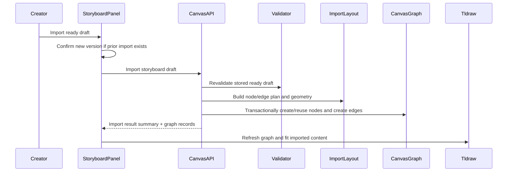
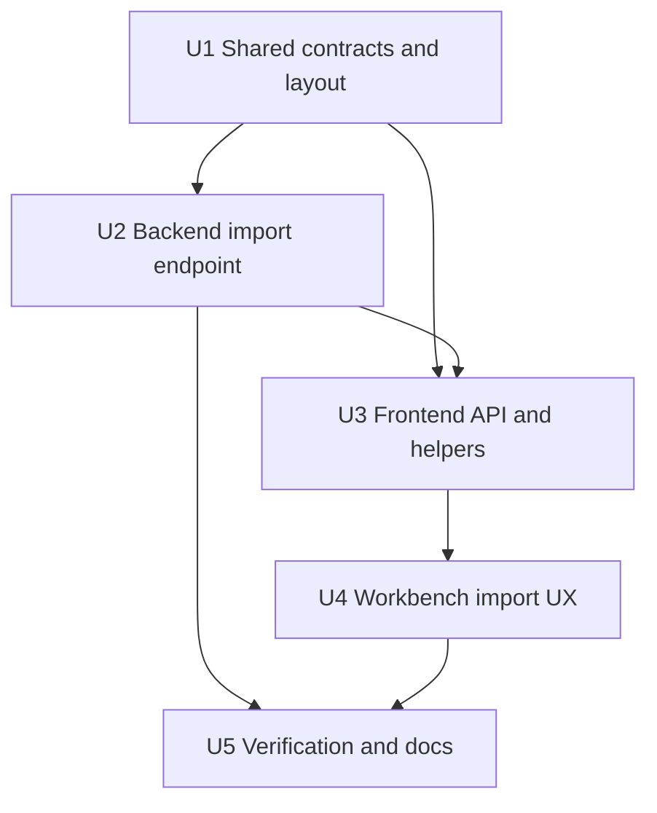

# feat: Add storyboard import and auto layout

## Summary

Implement Phase 6 by adding shared storyboard import contracts and pure layout helpers, a backend canvas import endpoint that atomically creates business nodes and semantic edges from a ready draft, and frontend workbench controls that confirm repeated imports, refresh the canvas graph, and fit imported content.

---

## Problem Frame

Phase 5 produces a validated, ready storyboard draft, but the canvas still has to be assembled manually. This plan closes the PRD's first end-to-end story path while preserving the normalized CanvasNode/CanvasEdge architecture from Phases 3 and 4.

---

## Assumptions

*This plan was authored without synchronous user confirmation. The items below are agent inferences that fill gaps in the input — un-validated bets that should be reviewed before implementation proceeds.*

- Store import provenance in node and edge `dataJson` for this module rather than adding a persistent import-batch table.
- Put deterministic layout helpers in `@guga-flow/shared-types` so backend import code and frontend/helper tests can share the same overlap calculations without coupling to tldraw.
- Model Scene membership with `belongs_to_scene` edges from Shot to Scene plus Scene to SceneFrame; Shot node data still carries prompt and asset ids for direct downstream consumption.
- Keep the backend import route on the Canvas API surface, matching the technical reference's `POST /api/v1/projects/:projectId/canvas/import-storyboard` path.
- Default all repeated imports to new-version append. The frontend asks before calling the API when existing storyboard-import provenance is detected; the backend does not overwrite previous nodes.

---

## Requirements

- R1. Only a project-scoped, valid, ready storyboard draft can be imported.
- R2. The storyboard workflow exposes one primary import action.
- R3. Import creates Novel, SceneFrame, Scene, Shot, Character asset, and Location asset canvas nodes.
- R4. Imported node data preserves storyboard prompts, duration, visual/action/camera fields, scene metadata, and Character/Location references.
- R5. The import API returns a summary of created/reused nodes, edges, scenes, shots, characters, and locations.
- R6. Imported content uses deterministic non-overlapping layout for at least two scenes and six shots.
- R7. Import creates semantic edges for Character, Location, and Scene membership.
- R8. Character and Location nodes deduplicate within a batch and may reuse matching existing project asset nodes.
- R9. Repeated import defaults to a new version and does not overwrite existing imported nodes.
- R10. Imported nodes and edges carry provenance that distinguishes batches.
- R11. Unsafe imports are rejected without partial canvas mutation.
- R12. The frontend refreshes imported graph state, restores visual projections, and fits the canvas after import.
- R13. Existing manual canvas, Inspector, semantic binding, asset, and Phase 5 draft behavior remains available.

**Origin actors:** A1 Creator, A2 Storyboard import system, A3 Canvas graph system, A4 Future prompt/generation modules  
**Origin flows:** F1 Import a ready storyboard draft, F2 Handle repeated imports, F3 Reject unsafe imports, F4 Reload imported graph state  
**Origin acceptance examples:** AE1 successful import counts, AE2 asset reference dedupe and semantic edges, AE3 non-overlap and fit, AE4 repeated import new version, AE5 unsafe import rejection, AE6 reload persistence

---

## Scope Boundaries

- Do not implement overwrite or in-place update import behavior.
- Do not add Prompt Composer, prompt debug panels, reference image uploads, image generation, video generation, or editor export.
- Do not add a persistent import-batch table unless implementation reveals that JSON provenance cannot support the MVP safely.
- Do not add a general-purpose auto-layout engine beyond deterministic storyboard import layout.
- Do not downgrade Node, Next, React, Prisma, tldraw, or workspace architecture to avoid local Node runtime warnings.

### Deferred to Follow-Up Work

- Rich duplicate resolution choices beyond cancel/new-version: overwrite and update-in-place belong to a later import-management iteration.
- Visual grouping/collapse and large-board navigation: Phase 12 owns SceneFrame collapse, search, MiniMap, and efficiency enhancements.

---

## Context & Research

### Relevant Code and Patterns

- `packages/shared-types/src/domain/storyboard.ts` already owns runtime storyboard validation and draft contracts.
- `packages/shared-types/src/domain/canvas.ts` already defines CanvasNode, CanvasEdge, node data types, and edge relations shared across backend/frontend.
- `apps/backend/src/canvas/canvas.service.ts` owns project-scoped CanvasNode/CanvasEdge persistence, semantic edge validation, graph mutation transactions, and Shot data sync for Character/Location references.
- `apps/backend/src/novels/novels.service.ts` owns ready draft lookup and shared validation; Phase 6 should consume its persisted draft boundary rather than accepting raw storyboard JSON.
- `apps/frontend/src/components/canvas/canvas-editor.tsx` already reconciles backend-owned business node and edge records into tldraw shapes/arrows and exposes `zoomToFit`.
- `apps/frontend/src/components/novels/novel-storyboard-panel.tsx` already owns Generate, Save draft, Mark ready controls and is the natural place for Import.
- `apps/frontend/src/components/canvas/project-canvas-workspace.tsx` is the state bridge between sidebar actions and `CanvasEditor`.

### Institutional Learnings

- `docs/solutions/architecture-patterns/storyboard-draft-validation-import-boundary-2026-06-12.md`: Phase 6 owns layout, duplicate policy, tldraw projections, CanvasNode creation, and semantic CanvasEdge creation after revalidating the ready draft.
- `docs/solutions/architecture-patterns/tldraw-business-shape-normalized-node-sync-2026-06-12.md`: keep business facts in normalized backend records; tldraw shapes are projections.
- `docs/solutions/architecture-patterns/semantic-canvas-edge-projection-lifecycle-2026-06-12.md`: CanvasEdge is the canonical relationship, with frontend arrow projections reconciled after business node shapes exist.
- `docs/solutions/tooling-decisions/node-26-prisma-7-phase-0-foundation-2026-06-12.md`: keep the Node 26 target and upgrade local runtime rather than lowering project architecture.

### External References

- `docs/research/video-ref/repomix/toonflow-app-focused-storyboard.xml` shows prior-art storyboard batch creation, ordered grouping, and durable asset-to-storyboard associations. Use it as product-flow evidence, not as a schema or API to copy.

---

## Key Technical Decisions

| Decision | Rationale |
| --- | --- |
| Shared pure layout helper | Lets backend import and tests assert non-overlap without depending on browser/tldraw runtime. |
| Canvas-owned import endpoint | Keeps import as a graph mutation alongside existing CanvasNode/CanvasEdge behavior and matches the technical reference route. |
| JSON provenance for MVP | Supports batch distinction and duplicate detection without adding a new table before overwrite/history UX exists. |
| New-version repeated import | Protects existing user work and satisfies MVP duplicate policy while keeping implementation bounded. |
| Import-time Character/Location reuse | Prevents unnecessary duplicate asset nodes when an existing project asset semantically matches the storyboard draft. |

---

## Open Questions

### Resolved During Planning

- Provenance storage: use a small `storyboardImport` object in node and edge `dataJson` with import batch id, draft id, novel id, source temp id, entity kind, and version marker.
- Layout location: put pure import planning/layout helpers in shared types; backend converts the plan into Prisma records and frontend can test/import summaries against the same geometry.
- Scene membership relation: extend backend semantic validation for `belongs_to_scene` so import can persist Shot-to-Scene and Scene-to-SceneFrame membership edges.

### Deferred to Implementation

- Exact shape id and batch id strings should be finalized while implementing deterministic helper tests; tests can inject a stable batch id/clock.
- Exact frontend fit timing may need a small callback bridge from the panel to `CanvasEditor` once the imported nodes have reconciled into tldraw shapes.
- Exact browser smoke selectors may need adjustment after import controls land in the sidebar.

---

## High-Level Technical Design

> *This illustrates the intended approach and is directional guidance for review, not implementation specification. The implementing agent should treat it as context, not code to reproduce.*

---

## Implementation Units

- U1. **Shared import contracts and deterministic layout helpers**

**Goal:** Add typed import inputs/results, provenance data, import summary data, and a pure storyboard import layout planner that produces deterministic non-overlapping node geometry.

**Requirements:** R3, R4, R5, R6, R8, R10

**Dependencies:** None

**Files:**
- Create: `packages/shared-types/src/domain/storyboard-import.ts`
- Modify: `packages/shared-types/src/domain/canvas.ts`
- Modify: `packages/shared-types/src/domain/domain.test.ts`
- Modify: `packages/shared-types/src/index.ts`

**Approach:**
- Define import provenance, duplicate policy, node planning, edge planning, and result summary contracts in shared types.
- Add a pure layout builder that accepts a validated `StoryboardResult` plus import metadata and emits planned Novel, Character, Location, SceneFrame, Scene, and Shot nodes with geometry.
- Keep layout constants close to the PRD values while allowing scene frames to grow vertically based on shot count.
- Include overlap helpers for tests so a two-scene/six-shot storyboard proves non-overlap without browser automation.
- Keep helper output independent from database ids; backend will map plan keys/temp ids to persisted node ids.

**Execution note:** Implement helper tests first because layout regressions are easy to miss visually.

**Patterns to follow:**
- Shared Zod/storyboard contract exports in `packages/shared-types/src/domain/storyboard.ts`.
- Existing canvas node data contracts in `packages/shared-types/src/domain/canvas.ts`.

**Test scenarios:**
- Happy path: a two-scene/six-shot storyboard plan includes one Novel, one frame per scene, one Scene per scene, every Shot, all Characters, and all Locations.
- Happy path: generated Shot node data includes image prompt, video prompt, duration, character temp references, location temp reference, visual/action/camera fields, and provenance.
- Edge case: repeated Character/Location temp ids in shot references resolve to single planned asset nodes.
- Edge case: layout rectangles for a two-scene/six-shot storyboard do not overlap.
- Integration: contracts are exported from `@guga-flow/shared-types` for backend/frontend import clients.

**Verification:**
- Shared-types test/build proves import contracts and layout helpers are reusable by downstream packages.

---

- U2. **Backend canvas storyboard import endpoint**

**Goal:** Add a project-scoped Canvas API route that revalidates a ready draft and atomically creates/reuses nodes plus semantic edges from the shared import plan.

**Requirements:** R1, R3, R4, R5, R7, R8, R9, R10, R11, AE1, AE2, AE4, AE5, AE6

**Dependencies:** U1

**Files:**
- Modify: `apps/backend/src/canvas/canvas.controller.ts`
- Modify: `apps/backend/src/canvas/canvas.service.ts`
- Modify: `apps/backend/src/canvas/dto.ts`
- Modify: `apps/backend/src/canvas/canvas.service.spec.ts`
- Modify: `apps/backend/test/app.e2e-spec.ts`

**Approach:**
- Add `POST /projects/:projectId/canvas/import-storyboard` accepting project-scoped novel and draft ids plus MVP duplicate policy.
- Load and revalidate the stored draft inside the service; reject missing, invalid, non-ready, cross-project, or unsupported duplicate policy requests before mutation.
- Use the shared layout plan to create new imported Novel, SceneFrame, Scene, and Shot nodes every time.
- Reuse matching Character/Location asset nodes when existing project nodes match normalized name+role/type semantics; otherwise create new asset nodes once per temp id.
- Create `references_character`, `references_location`, and `belongs_to_scene` CanvasEdge rows with import provenance.
- Extend edge validation so `belongs_to_scene` supports imported membership edges without weakening Character/Location validation.
- Wrap import mutation in a transaction so failures do not leave partial nodes or edges.

**Execution note:** Add unsafe-import and repeated-import service tests before wiring frontend.

**Patterns to follow:**
- Project-scoped Canvas mutations and transaction helper in `apps/backend/src/canvas/canvas.service.ts`.
- Ready draft validation boundary in `apps/backend/src/novels/novels.service.ts`.
- E2E mock storage patterns in `apps/backend/test/app.e2e-spec.ts`.

**Test scenarios:**
- Covers AE1. Happy path: ready two-scene/six-shot draft imports and returns expected node/edge counts plus graph records.
- Covers AE2. Happy path: shots referencing the same Character/Location reuse a single asset node and create semantic edges to that node.
- Covers AE4. Happy path: importing twice creates a second import batch and leaves the first batch nodes untouched.
- Covers AE5. Error path: missing, invalid, non-ready, or cross-project draft rejects without creating nodes or edges.
- Error path: unsupported duplicate policy rejects before mutation.
- Integration: `GET /canvas` after import returns imported nodes, provenance data, and semantic edges in persisted order.

**Verification:**
- Backend unit/e2e tests prove import gating, atomicity, repeated import behavior, semantic edges, and persistence.

---

- U3. **Frontend import API client and storyboard import helpers**

**Goal:** Add typed frontend API calls and pure UI helpers for import readiness, repeated-import detection, import summaries, and graph merge behavior.

**Requirements:** R2, R5, R9, R10, R12, R13, AE4

**Dependencies:** U1, U2

**Files:**
- Modify: `apps/frontend/src/lib/api.ts`
- Modify: `apps/frontend/src/lib/api.test.ts`
- Modify: `apps/frontend/src/components/novels/storyboard-data.ts`
- Modify: `apps/frontend/src/components/novels/storyboard-data.test.ts`

**Approach:**
- Add `importStoryboardToCanvas` API wrapper for the Canvas import route.
- Add helper predicates for ready/importable draft state and existing storyboard-import provenance in current canvas nodes.
- Add import summary formatting and graph merge helpers that preserve current canvas state while incorporating the API result.
- Keep duplicate policy UI state in the panel layer; helpers only identify whether prior imports exist and describe the result.

**Patterns to follow:**
- Existing storyboard draft API wrappers and tests in `apps/frontend/src/lib/api.ts`.
- Existing storyboard status/summary helpers in `apps/frontend/src/components/novels/storyboard-data.ts`.
- Existing graph merge helpers in `apps/frontend/src/components/canvas/canvas-edge-data.ts`.

**Test scenarios:**
- Happy path: API wrapper posts novel id, draft id, and new-version policy to the Canvas import endpoint.
- Happy path: helper detects existing imported provenance from canvas nodes.
- Happy path: summary formatter reports imported scenes, shots, characters, locations, nodes, and edges.
- Edge case: invalid or non-ready draft is not considered importable.
- Integration: graph merge helper includes imported nodes/edges without dropping existing manual graph state.

**Verification:**
- Frontend unit tests prove API path, helper logic, and graph merge behavior.

---

- U4. **Workbench import experience and canvas fit-to-content refresh**

**Goal:** Add the creator-facing Import action to the storyboard panel and bridge successful imports to the canvas editor refresh/reconcile/fit flow.

**Requirements:** R2, R5, R9, R12, R13, AE3, AE4, AE6

**Dependencies:** U2, U3

**Files:**
- Modify: `apps/frontend/src/components/novels/novel-storyboard-panel.tsx`
- Modify: `apps/frontend/src/components/novels/novel-storyboard-panel.test.tsx`
- Modify: `apps/frontend/src/components/canvas/project-canvas-workspace.tsx`
- Modify: `apps/frontend/src/components/canvas/canvas-editor.tsx`
- Modify: `apps/frontend/src/components/canvas/canvas-editor.test.tsx`
- Modify: `apps/frontend/src/app/globals.css`

**Approach:**
- Add an Import button that is enabled only when the selected draft is valid, ready, and not dirty.
- If current canvas state already contains storyboard import provenance, show a compact new-version confirmation before calling the API; cancellation performs no mutation.
- On successful import, merge returned graph records into workspace state, clear transient errors, show the import summary, and signal the canvas editor to fit content after shapes reconcile.
- Keep the panel compact and consistent with existing sidebar controls; avoid turning import into a modal-heavy workflow.
- Preserve existing Generate, Save, Mark ready, manual node creation, Inspector, semantic bind, and autosave behavior.

**Patterns to follow:**
- Existing Novel/Storyboard panel action handling in `apps/frontend/src/components/novels/novel-storyboard-panel.tsx`.
- Existing `CanvasEditor` fit-to-content control and reconcile effects.
- Existing workbench state bridge in `apps/frontend/src/components/canvas/project-canvas-workspace.tsx`.

**Test scenarios:**
- Covers AE3. Happy path: rendered panel shows Import for ready drafts and import result copy after success.
- Covers AE4. Edge case: existing import provenance shows a new-version confirmation path before API call.
- Error path: dirty, invalid, non-ready, or failed import state disables or reports the action without clearing draft edits.
- Integration: workspace applies imported nodes/edges to `CanvasEditor` props and requests fit-to-content.
- Regression: Generate, Save draft, Mark ready, and manual canvas toolbar controls still render.

**Verification:**
- Frontend tests and browser smoke prove the sidebar import action refreshes the visible canvas and fits imported content.

---

- U5. **Verification, documentation, and review sweep**

**Goal:** Verify the complete Phase 6 path, update docs, run review, and capture implementation learnings for later phases.

**Requirements:** R1-R13, AE1-AE6

**Dependencies:** U1, U2, U3, U4

**Files:**
- Modify: `docs/development.md`
- Modify: `docs/plans/2026-06-12-007-feat-storyboard-import-layout-plan.md`
- Create: `docs/solutions/architecture-patterns/storyboard-import-layout-provenance-2026-06-12.md`

**Approach:**
- Update development docs with the import route, duplicate policy, smoke checklist, and Phase 6 boundaries.
- Mark the plan completed only after tests, API smoke, and browser smoke pass.
- Capture the import/layout/provenance pattern as an architecture solution for Phase 7+ prompt/generation consumers.
- Run a review pass against the Phase 6 diff and address blocking findings before the final Phase 6 commit.

**Patterns to follow:**
- Phase 5 docs/review/solution wrap-up style in `docs/plans/2026-06-12-006-feat-novel-storyboard-json-plan.md`.
- Existing solution docs under `docs/solutions/architecture-patterns/`.

**Test scenarios:**
- API smoke: create project, create/import novel, generate storyboard, mark ready, import storyboard, assert node/edge counts, import provenance, and reload persistence.
- Browser smoke: open the project canvas, complete ready draft import from the panel, confirm imported board is visible and nonblank, and confirm no console app errors.
- Regression: full workspace format, tests, build, and mock workflow still pass with only expected local Node engine warnings.

**Verification:**
- Final checks prove Phase 6 meets the PRD's two-scene/six-shot import acceptance and does not regress previous phases.

---

## System-Wide Impact

- **Interaction graph:** Novel/Storyboard panel calls Canvas import API; Canvas import creates graph records; Project workspace merges graph state; CanvasEditor reconciles backend records to tldraw projections.
- **Error propagation:** Backend validation and transaction errors surface through the existing API wrapper into the storyboard panel without mutating frontend draft state.
- **State lifecycle risks:** Repeated imports create additional graph records; provenance must distinguish batches so later cleanup/update flows can reason about them.
- **API surface parity:** Canvas API gains import behavior; existing node/edge/manual endpoints remain unchanged.
- **Integration coverage:** API smoke and browser smoke are required because unit tests alone will not prove tldraw projection and viewport fit behavior.
- **Unchanged invariants:** StoryboardDraft remains the validated pre-import artifact; CanvasNode/CanvasEdge remain the graph source of truth; tldraw snapshot remains a visual persistence layer, not the business fact store.

---

## Risks & Dependencies

| Risk | Mitigation |
| --- | --- |
| Partial import creates orphaned nodes or edges | Run the whole backend import mutation in a transaction and test unsafe failures before mutation. |
| Layout visually overlaps at different scene/shot counts | Use shared rectangle overlap tests and browser smoke for the required two-scene/six-shot case. |
| Reused Character/Location matching is too aggressive | Match on normalized name plus role/type semantics only; create new nodes when uncertain. |
| Too many semantic arrows clutter the initial board | Keep Phase 6 focused on correctness; later canvas efficiency/visibility controls can improve large boards. |
| Local Node version warnings obscure test output | Keep project Node target at `>=26.3.0`; record warnings as environment issues rather than downgrading architecture. |

---

## Documentation / Operational Notes

- `docs/development.md` should document the Canvas import route, duplicate policy, provenance shape at a conceptual level, and smoke workflow.
- The Phase 6 plan should be updated to `status: completed` only after implementation and verification.
- No production rollout flag is required for the mock-first MVP; the feature is project-scoped and gated by ready storyboard drafts.

---

## Implementation Notes

- U1 completed in `29c1a01`: shared import contracts, provenance helpers, deterministic layout helper, and non-overlap tests.
- U2 completed in `4d5b846`: backend Canvas import route, ready draft validation, transactionally created/reused nodes, Character/Location/Scene semantic edges, API e2e, and mock provider 2-scene/6-shot output.
- U3 completed in `bee0391`: frontend import API wrapper and pure helpers for importable state, duplicate-import detection, summaries, and graph merge.
- U4 completed in `12ccf6a`: Novel/Storyboard panel Import action, new-version confirmation, workspace graph merge, and CanvasEditor fit request.
- U5 completed in this verification pass: worker mock workflow expectations were updated for the 2-scene/6-shot mock storyboard, backend body parsing was raised to support imported-board tldraw snapshot autosave, and Phase 6 docs/solution guidance were recorded.

## Verification Evidence

- `pnpm --filter @guga-flow/shared-types run lint`
- `pnpm --filter @guga-flow/shared-types run test`
- `pnpm --filter @guga-flow/shared-types run build`
- `pnpm --filter @guga-flow/provider-contracts run lint`
- `pnpm --filter @guga-flow/provider-contracts run test`
- `pnpm --filter @guga-flow/provider-contracts run build`
- `pnpm --filter @guga-flow/backend run lint`
- `pnpm --filter @guga-flow/backend run test`
- `pnpm --filter @guga-flow/frontend run lint`
- `pnpm --filter @guga-flow/frontend run test`
- `pnpm --filter @guga-flow/frontend run build`
- `pnpm --filter @guga-flow/worker run test`
- `pnpm run format:check`
- `pnpm run test`
- `pnpm run build`
- `pnpm run mock:workflow`
- `pnpm --filter @guga-flow/backend run prisma:migrate -- --name smoke_verify_phase_6`
- Real API smoke against local Postgres/backend:
  - created project `cmqb4znxp0018v9svr20o86ht` and novel `cmqb4znyc0019v9svj916zxym`;
  - generated ready draft `cmqb4znyk001av9sv4qco6tje` with 2 scenes, 6 shots, 2 characters, and 1 location;
  - first import returned version 1, 14 created nodes, 0 reused nodes, and 24 semantic edges;
  - second import returned version 2, 11 created nodes, 3 reused asset nodes, and 24 semantic edges;
  - `GET /canvas` persisted imported provenance, Shot prompts, Shot character/location refs, and semantic edges.
- Browser smoke at `http://localhost:3001/projects/cmqb4znxp0018v9svr20o86ht/canvas`:
  - loaded Novel/Storyboard panel with ready draft and Import action;
  - rendered imported Novel, Character, Location, SceneFrame, Scene, and Shot business shapes in tldraw;
  - panel Import -> Confirm new version returned `POST /canvas/import-storyboard` 201 and displayed `Imported 2 scenes / 6 shots / 2 characters / 1 locations / 11 nodes, 3 reused / 24 edges`;
  - caught a 413 snapshot autosave failure on a larger imported board, fixed backend body parser limit, reloaded, and verified `PATCH /canvas/snapshot` 200 with topbar `Saved`;
  - browser console had no application errors; only the known tldraw zh-cn missing-message warning appeared.

Node note: the local shell still reports Node `v22.22.2`, so pnpm emits the expected engine warning for the project target `>=26.3.0`. The project architecture and engine target were not downgraded.

---

## Sources & References

- **Origin document:** [docs/brainstorms/2026-06-12-007-phase-6-storyboard-import-layout-requirements.md](../brainstorms/2026-06-12-007-phase-6-storyboard-import-layout-requirements.md)
- Roadmap source: [infinite_canvas_video_prd_roadmap_v2_detailed.md](../../infinite_canvas_video_prd_roadmap_v2_detailed.md)
- Technical reference: [docs/tech-stack-text2sql-reference.md](../tech-stack-text2sql-reference.md)
- Related solution: [docs/solutions/architecture-patterns/storyboard-draft-validation-import-boundary-2026-06-12.md](../solutions/architecture-patterns/storyboard-draft-validation-import-boundary-2026-06-12.md)
- Related solution: [docs/solutions/architecture-patterns/semantic-canvas-edge-projection-lifecycle-2026-06-12.md](../solutions/architecture-patterns/semantic-canvas-edge-projection-lifecycle-2026-06-12.md)
- Related solution: [docs/solutions/architecture-patterns/tldraw-business-shape-normalized-node-sync-2026-06-12.md](../solutions/architecture-patterns/tldraw-business-shape-normalized-node-sync-2026-06-12.md)
