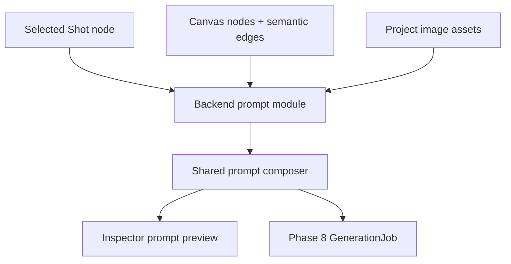
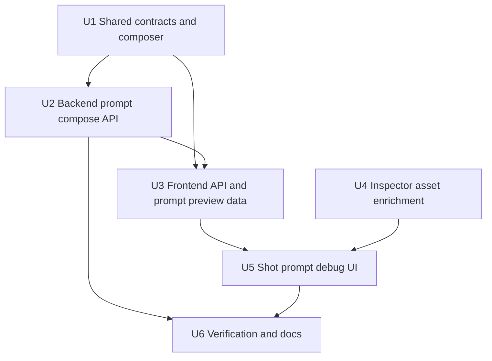

# feat: Add prompt composer and reference asset binding

## Summary

Implement Phase 7 by adding a shared prompt composition core, a backend-owned Shot prompt compose surface, and Inspector UI for Character/Location prompt fields, reference image binding, and Shot prompt debug preview.

---

## Problem Frame

Phase 6 made storyboard content durable as CanvasNode and CanvasEdge records, but creators still cannot inspect the final prompt that later generation jobs will run. Character and Location nodes also contain imported prompt-ready fields that are not editable in the current Inspector, and uploaded reference images are project assets without a node-level binding path.

This plan prepares the graph for Phase 8 mock generation while preserving the boundary that actual job creation, provider execution, ImageNode creation, and VideoNode creation remain outside Phase 7.

---

## Assumptions

*This plan was authored without synchronous user confirmation. The items below are agent inferences that fill gaps in the input — un-validated bets that should be reviewed before implementation proceeds.*

- Use a shared pure prompt composer plus backend wrapper. This keeps frontend previews and future server-side jobs aligned without moving provider secrets or job logic into the browser.
- Store reference image asset ids in Character/Location node `dataJson` for the MVP. A separate asset-reference table remains deferred until reference lifecycle needs independent history or permissions.
- Use a Shot-node compose action as the backend API boundary rather than accepting raw prompt inputs from the browser.
- Build reference image binding inside the Inspector instead of introducing new sidebar tabs in this phase.
- Leave Style/Prop asset support as empty or future prompt parts because current business node creation does not expose those node types.

---

## Requirements

- R1. Compose both image and video prompt outputs from Shot fields and graph context.
- R2. Include linked Character identity/consistency information.
- R3. Include linked Location prompt/consistency information.
- R4. Include reference asset ids from linked Character/Location nodes.
- R5. Tolerate missing optional context and report missing context in debug output.
- R6. Return debug parts for meaningful prompt sections.
- R7. Produce output suitable for future GenerationJob input.
- R8. Expose and preserve Character identity prompt fields.
- R9. Expose and preserve Location prompt fields.
- R10. Bind, display, and remove project image reference assets on Character/Location nodes.
- R11. Recompose from latest Character/Location node data without storyboard re-import.
- R12. Show Shot prompt preview/debug in Inspector.
- R13. Distinguish image and video prompt outputs.
- R14. Show prompt preview loading, empty, success, and error states.
- R15. Make reference binding discoverable in Character/Location Inspector context.
- R16. Preserve existing canvas, edge, import, autosave, and asset behavior.

---

## Scope Boundaries

- No GenerationJob creation, worker execution, provider calls, ImageNode creation, or VideoNode creation.
- No real provider configuration, model selection, polling, cancellation, retry, or remote asset download.
- No new StyleAsset or PropAsset node creation/binding.
- No separate asset-reference table unless implementation proves node data cannot safely hold reference ids.
- No prompt overwrite of imported storyboard fields; composed prompts are preview/runtime outputs.
- No Node/Next/React/Prisma/tldraw downgrade to avoid local Node runtime warnings.

### Deferred to Follow-Up Work

- Persisting composed prompt snapshots into GenerationJob input belongs to Phase 8.
- Provider-specific model parameters and model suffix controls belong to Phase 9/10 provider work.
- Style and Prop references should be introduced with their own asset/node workflow rather than hidden inside Phase 7.

---

## Context & Research

### Relevant Code and Patterns

- `packages/shared-types/src/domain/canvas.ts` owns node data contracts and should gain prompt/reference fields that backend and frontend share.
- `packages/shared-types/src/domain/storyboard-import.ts` already populates Shot, Character, and Location node data with storyboard import provenance and prompt-ready fields.
- `apps/backend/src/canvas/canvas.service.ts` is the source of project canvas graph loading and semantic edge synchronization.
- `apps/backend/src/assets/assets.service.ts` owns project asset validation, storage, preview, and delete lifecycle.
- `apps/frontend/src/components/canvas/business-node-form.tsx` and `business-node-inspector-sections.tsx` drive type-specific Inspector editing.
- `apps/frontend/src/components/projects/asset-library.tsx` already uploads and previews project assets, including character/location reference purposes.
- `apps/frontend/src/components/canvas/canvas-inspector.tsx` is the natural place to add selected-node prompt preview and node-scoped reference binding.

### Institutional Learnings

- `docs/solutions/architecture-patterns/tldraw-business-shape-normalized-node-sync-2026-06-12.md`: business facts stay in normalized CanvasNode rows; tldraw shapes are projections.
- `docs/solutions/architecture-patterns/semantic-canvas-edge-projection-lifecycle-2026-06-12.md`: semantic CanvasEdge rows are canonical relationships; frontend arrows project them.
- `docs/solutions/architecture-patterns/project-scoped-asset-lifecycle-boundary-2026-06-12.md`: asset bytes, preview, storage, and delete behavior stay behind the backend boundary.
- `docs/solutions/architecture-patterns/storyboard-import-layout-provenance-2026-06-12.md`: Phase 7 should build from imported graph records and provenance rather than storyboard JSON.

### Reference Research

- `infinite_canvas_video_prd_roadmap_v2_detailed.md` defines prompt composition as style + scene + location + character + shot + model suffix + negative prompt.
- `docs/tech-stack-text2sql-reference.md` requires final generation input to preserve final prompt, negative prompt, reference asset ids, provider params, debug parts, and source/target node ids.
- `docs/research/video-ref/repomix/toonflow-app-focused-assets.xml` shows prior-art asset prompts, role/scene image generation, and optional image references passed into generation. This supports durable asset prompt/reference data, but does not override guga-flow's normalized CanvasNode/Asset boundary.

---

## Key Technical Decisions

| Decision | Rationale |
| --- | --- |
| Shared pure prompt composer | Lets shared tests prove prompt parts, missing context, and reference ids before backend/frontend integration. |
| Backend-owned Shot compose surface | Future GenerationJob code can reuse the same server-side graph resolution and avoids trusting browser-composed prompts for canonical job input. |
| Reference ids on Character/Location node data | Matches the creator mental model, keeps Shots clean, and avoids a premature relation table. |
| Inspector-local reference binding | Fits the current workbench where node editing and Asset Library already live together. |
| Prompt debug parts as structured output | Enables both creator troubleshooting and later job reproducibility. |

---

## High-Level Technical Design

> *This illustrates the intended approach and is directional guidance for review, not implementation specification. The implementing agent should treat it as context, not code to reproduce.*

---

## Implementation Units

- U1. **Shared prompt contracts and pure composer**

**Goal:** Add shared prompt composition contracts, reference asset fields on asset node data, and a pure composer that resolves a Shot's prompt parts from graph records.

**Requirements:** R1, R2, R3, R4, R5, R6, R7, R8, R9, R10

**Dependencies:** None

**Files:**
- Create: `packages/shared-types/src/domain/prompt-composer.ts`
- Modify: `packages/shared-types/src/domain/canvas.ts`
- Modify: `packages/shared-types/src/domain/domain.test.ts`
- Modify: `packages/shared-types/src/index.ts`

**Approach:**
- Define composed image/video prompt result contracts with prompt text, negative prompt, reference asset ids, debug parts, missing context, and source node ids.
- Extend Character and Location node data with reference image asset ids while preserving existing fields.
- Build a pure graph resolver that accepts project canvas nodes/edges/assets and a Shot node id, then derives linked Scene, Character, Location, and reference asset context from normalized records.
- Prefer current node data over imported draft text; use existing Shot `imagePrompt`/`videoPrompt` as inputs, not canonical overwrite targets.
- Keep global style optional and empty until StyleAsset workflow exists.

**Execution note:** Test the pure composer first; downstream units should import this behavior rather than duplicating prompt assembly.

**Patterns to follow:**
- Shared storyboard validation in `packages/shared-types/src/domain/storyboard.ts`.
- Shared import plan style in `packages/shared-types/src/domain/storyboard-import.ts`.
- Existing node data tests in `packages/shared-types/src/domain/domain.test.ts`.

**Test scenarios:**
- Happy path: imported Shot linked to two Characters and one Location composes image/video prompt parts with Character and Location sections.
- Happy path: Character/Location reference asset ids flow into the composed reference asset list once each.
- Edge case: Shot with no Character or Location still returns a Shot-derived prompt and missing-context debug parts.
- Edge case: duplicate reference asset ids are deduplicated while source node ids remain traceable.
- Edge case: editing Character identity or Location prompt in node data changes the next composed output.

**Verification:**
- Shared-types lint/test/build proves contracts and pure composition are reusable.

---

- U2. **Backend prompt compose module**

**Goal:** Add a backend-owned prompt module that composes a project-scoped Shot prompt from persisted CanvasNode, CanvasEdge, and Asset records.

**Requirements:** R1, R2, R3, R4, R5, R6, R7, R11, R14, R16

**Dependencies:** U1

**Files:**
- Create: `apps/backend/src/prompt/prompt.module.ts`
- Create: `apps/backend/src/prompt/prompt.controller.ts`
- Create: `apps/backend/src/prompt/prompt.service.ts`
- Create: `apps/backend/src/prompt/dto.ts`
- Create: `apps/backend/src/prompt/prompt.service.spec.ts`
- Modify: `apps/backend/src/app.module.ts`
- Modify: `apps/backend/test/app.e2e-spec.ts`

**Approach:**
- Resolve the project canvas graph and project assets inside the backend; accept only a project-scoped Shot node selection from the caller.
- Reuse the shared composer to produce the canonical preview result.
- Reject missing projects, missing nodes, cross-project node ids, and non-Shot node ids without mutating canvas state.
- Keep the module read-only. It should not update Shot prompt fields, create assets, or create jobs.
- Add e2e coverage that imports a storyboard, composes a Shot prompt, edits linked Character/Location data, and composes again to prove fresh graph reads.

**Patterns to follow:**
- Module/controller/service layout from `apps/backend/src/canvas/*` and `apps/backend/src/assets/*`.
- Project-scoped validation and graph mapping in `apps/backend/src/canvas/canvas.service.ts`.
- API e2e mock structure in `apps/backend/test/app.e2e-spec.ts`.

**Test scenarios:**
- Happy path: imported Shot compose returns image/video prompts, Character/Location debug parts, source node ids, and reference asset ids.
- Edge case: manually created Shot with no linked assets returns a prompt and missing-context indicators.
- Error path: non-Shot node id rejects without mutation.
- Error path: node from another project cannot be composed through the current project.
- Integration: after Character/Location node data update, compose returns the edited values.

**Verification:**
- Backend lint/test proves compose API, gating, and fresh graph reads.

---

- U3. **Frontend API client and prompt preview helpers**

**Goal:** Add typed frontend API access and small pure helpers for prompt preview display, missing-context labels, and reference asset formatting.

**Requirements:** R6, R7, R12, R13, R14

**Dependencies:** U1, U2

**Files:**
- Modify: `apps/frontend/src/lib/api.ts`
- Modify: `apps/frontend/src/lib/api.test.ts`
- Create: `apps/frontend/src/components/canvas/prompt-preview-data.ts`
- Create: `apps/frontend/src/components/canvas/prompt-preview-data.test.ts`

**Approach:**
- Add a typed API wrapper for backend Shot prompt composition.
- Keep UI-independent formatting logic in a small helper so the Inspector component stays focused on state/rendering.
- Format debug parts and missing context consistently for image/video outputs.
- Preserve existing API error behavior so preview errors can surface through Inspector state.

**Patterns to follow:**
- API wrapper tests in `apps/frontend/src/lib/api.test.ts`.
- Frontend pure helper tests in `apps/frontend/src/components/novels/storyboard-data.test.ts`.

**Test scenarios:**
- Happy path: API wrapper calls the prompt compose route with project and Shot ids.
- Happy path: helper summarizes image/video prompt outputs and debug parts.
- Edge case: missing-context arrays render as compact status text.
- Error path: API wrapper propagates backend error messages.

**Verification:**
- Frontend lint/test proves data client and formatting behavior.

---

- U4. **Inspector Character/Location prompt fields and reference binding**

**Goal:** Expose identity/location prompt fields and allow Character/Location nodes to bind or remove project image reference assets from their node data.

**Requirements:** R8, R9, R10, R11, R15, R16

**Dependencies:** U1

**Files:**
- Modify: `apps/frontend/src/components/canvas/business-node-inspector-sections.tsx`
- Modify: `apps/frontend/src/components/canvas/business-node-data.ts`
- Modify: `apps/frontend/src/components/canvas/business-node-form.tsx`
- Modify: `apps/frontend/src/components/canvas/business-node-form.test.ts`
- Create: `apps/frontend/src/components/canvas/node-reference-assets.tsx`
- Create: `apps/frontend/src/components/canvas/node-reference-assets.test.tsx`
- Modify: `apps/frontend/src/components/canvas/canvas-inspector.tsx`
- Modify: `apps/frontend/src/components/canvas/canvas-inspector.test.tsx`

**Approach:**
- Add editable Character `identityPrompt` and Location `locationPrompt` fields to existing form definitions and defaults.
- Add a selected-node reference asset section for Character/Location nodes that lists image assets, uploads new image references with the appropriate purpose, toggles ids into node data, and removes ids without deleting assets.
- Reuse existing project asset upload/list/detail APIs; keep delete behavior in the general Asset Library, not in the reference binding section.
- Keep reference binding node-scoped and project-scoped. Non-image assets should be visible only if useful for context but not bindable as image references.

**Patterns to follow:**
- Business node form data merge behavior in `apps/frontend/src/components/canvas/business-node-form.tsx`.
- Asset upload/list state handling in `apps/frontend/src/components/projects/asset-library.tsx`.
- Node update callback pattern in `apps/frontend/src/components/canvas/canvas-inspector.tsx`.

**Test scenarios:**
- Happy path: Character form renders and saves identity prompt.
- Happy path: Location form renders and saves location prompt.
- Happy path: selecting an image asset adds its id to the selected Character/Location reference ids.
- Happy path: removing a reference id updates the node without deleting the Asset.
- Edge case: duplicate toggles do not create duplicate reference ids.
- Edge case: non-image assets cannot be bound as image references.
- Error path: upload/list/update failures show an inline error and leave local node data unchanged.

**Verification:**
- Frontend lint/test proves form and reference binding behavior.

---

- U5. **Shot Inspector prompt debug panel**

**Goal:** Add a Shot prompt preview panel that calls the backend composer, displays image/video prompts and debug parts, and refreshes when graph inputs change.

**Requirements:** R1, R2, R3, R4, R5, R6, R11, R12, R13, R14, R16, AE1, AE2, AE3, AE4, AE5

**Dependencies:** U2, U3, U4

**Files:**
- Create: `apps/frontend/src/components/canvas/shot-prompt-preview.tsx`
- Create: `apps/frontend/src/components/canvas/shot-prompt-preview.test.tsx`
- Modify: `apps/frontend/src/components/canvas/canvas-inspector.tsx`
- Modify: `apps/frontend/src/components/canvas/canvas-inspector.test.tsx`

**Approach:**
- Render the prompt preview only for selected Shot nodes.
- Fetch composed output from the backend using the selected Shot id and refresh when the selected Shot or graph inputs change.
- Present image and video prompt outputs in separate compact sections with debug parts and reference asset ids.
- Show empty/missing context as useful information, not as a fatal error.
- Keep the existing Shot form and Asset Library visible.

**Patterns to follow:**
- Storyboard panel loading/error states in `apps/frontend/src/components/novels/novel-storyboard-panel.tsx`.
- Inspector conditional rendering in `apps/frontend/src/components/canvas/canvas-inspector.tsx`.
- Static render tests in `apps/frontend/src/components/canvas/canvas-inspector.test.tsx`.

**Test scenarios:**
- Happy path: selected Shot renders image/video prompt sections and debug part labels.
- Happy path: reference asset ids are visible in the prompt preview.
- Edge case: missing Character/Location context renders a missing-context notice.
- Error path: backend compose failure shows an error while the Shot form remains visible.
- Integration: after node update callback replaces Character/Location node data, the preview refetches or re-renders from the latest graph version.

**Verification:**
- Frontend lint/test proves prompt preview behavior.

---

- U6. **Verification, documentation, and browser smoke**

**Goal:** Verify Phase 7 end to end and document how prompt preview/reference binding prepares Phase 8.

**Requirements:** R11, R12, R15, R16, AE6

**Dependencies:** U1, U2, U3, U4, U5

**Files:**
- Modify: `docs/development.md`
- Modify: `docs/plans/2026-06-12-008-feat-prompt-composer-assets-plan.md`
- Create: `docs/solutions/architecture-patterns/prompt-composer-graph-derived-debug-parts-2026-06-12.md`

**Approach:**
- Run targeted package checks as units land, then full workspace quality gates.
- Smoke with a real imported storyboard project: select a Shot, inspect composed prompts, edit Character/Location prompt fields, bind an uploaded image reference, refresh, and confirm composed reference ids and prompt parts persist.
- Document Phase 7 workflow, boundaries, and how Phase 8 should consume composed prompt output.
- Capture reusable learning around graph-derived prompt composition and debug parts.

**Patterns to follow:**
- Phase 6 development docs and solution record.
- Browser/API smoke checklist style in `docs/development.md`.

**Test scenarios:**
- Integration: local API compose path works after imported storyboard.
- Browser: Shot prompt preview renders and updates after Character/Location edits.
- Browser: reference image upload/bind persists after refresh and appears in prompt reference ids.
- Regression: existing canvas save status, Asset Library, and semantic edge Inspector remain usable.

**Verification:**
- `pnpm run format:check`, `pnpm run test`, `pnpm run build`, targeted package checks, and browser/API smoke pass with only the known local Node engine warning if the shell is still below Node 26.3.0.

---

## System-Wide Impact

- **Interaction graph:** Inspector selection now coordinates node editing, reference asset binding, and prompt preview fetches from the backend.
- **Error propagation:** Prompt compose and reference binding failures should remain local to Inspector panels and must not clear selected node forms or canvas state.
- **State lifecycle risks:** Reference ids live in node data, so node update merges must preserve existing storyboard import provenance and unrelated fields.
- **API surface parity:** Backend compose output becomes the canonical shape Phase 8 GenerationJob creation should reuse.
- **Integration coverage:** Unit tests prove composition, but API/browser smoke is required to prove imported graph resolution, asset upload, binding, refresh, and preview.
- **Unchanged invariants:** CanvasNode/CanvasEdge remain business truth; tldraw remains projection; Asset storage remains backend-owned; provider keys and generation execution stay server/worker-side and out of Phase 7.

---

## Risks & Dependencies

| Risk | Mitigation |
| --- | --- |
| Frontend and backend prompt assembly drift | Keep pure composition in shared types and call it from backend; frontend renders backend result rather than assembling canonical prompts separately. |
| Node data update drops provenance or existing fields | Extend existing form merge helpers and add tests for preserving unrelated data. |
| Reference image binding becomes confused with global Asset Library delete | Reference binding only adds/removes node ids; asset deletion remains in Asset Library. |
| Prompt preview overfetches on every render | Trigger fetch from selected Shot and graph version changes rather than raw render loops. |
| Phase 7 accidentally starts GenerationJob scope | Keep output generation-ready but read-only; document GenerationJob persistence as Phase 8. |

---

## Documentation / Operational Notes

- `docs/development.md` should document prompt compose behavior, reference binding, and the Phase 7 smoke checklist.
- The plan should move to `status: completed` only after implementation, full verification, browser smoke, and compound notes.
- No migration is expected if MVP reference ids remain in node `dataJson`.

---

## Sources & References

- **Origin document:** [docs/brainstorms/2026-06-12-008-phase-7-prompt-composer-assets-requirements.md](../brainstorms/2026-06-12-008-phase-7-prompt-composer-assets-requirements.md)
- Roadmap source: [infinite_canvas_video_prd_roadmap_v2_detailed.md](../../infinite_canvas_video_prd_roadmap_v2_detailed.md)
- Technical reference: [docs/tech-stack-text2sql-reference.md](../tech-stack-text2sql-reference.md)
- Related solution: [docs/solutions/architecture-patterns/tldraw-business-shape-normalized-node-sync-2026-06-12.md](../solutions/architecture-patterns/tldraw-business-shape-normalized-node-sync-2026-06-12.md)
- Related solution: [docs/solutions/architecture-patterns/semantic-canvas-edge-projection-lifecycle-2026-06-12.md](../solutions/architecture-patterns/semantic-canvas-edge-projection-lifecycle-2026-06-12.md)
- Related solution: [docs/solutions/architecture-patterns/project-scoped-asset-lifecycle-boundary-2026-06-12.md](../solutions/architecture-patterns/project-scoped-asset-lifecycle-boundary-2026-06-12.md)
- Related solution: [docs/solutions/architecture-patterns/storyboard-import-layout-provenance-2026-06-12.md](../solutions/architecture-patterns/storyboard-import-layout-provenance-2026-06-12.md)
- Reference research: [docs/research/video-ref/repomix/toonflow-app-focused-assets.xml](../research/video-ref/repomix/toonflow-app-focused-assets.xml)
