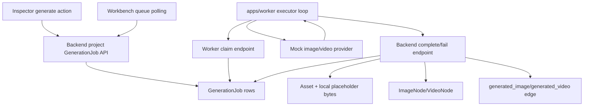
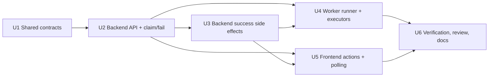

# feat: Add GenerationJob worker and mock media generation

## Summary

Implement Phase 8 by adding durable `GenerationJob` creation, DB-backed worker claiming, mock image/video execution, generated Asset/CanvasNode/CanvasEdge side effects, node status synchronization, retry, and workbench queue visibility.

---

## Problem Frame

Phase 7 can compose a Shot prompt from the canvas graph, but generation still stops at preview. Phase 8 is the first durable async media slice: a creator starts generation from a Shot or generated ImageNode, the backend persists the job and canonical input, the worker executes mock providers, and successful outputs become real project assets and canvas graph facts.

The implementation must keep provider execution out of the browser, keep generated media in the backend asset boundary, and preserve canvas-first behavior. It must also avoid reducing the project architecture to work around local Node warnings; local development should upgrade Node to satisfy the workspace engine.

---

## Requirements Trace

- `R1`-`R5`: backend project-scoped job creation, durable lifecycle, DB polling queue, and Shot prompt input capture.
- `R6`-`R10`: image/video success side effects, generated node trace, and node status synchronization.
- `R11`-`R13`: failure visibility and append-only retry.
- `R14`-`R17`: Inspector actions, workbench queue polling, refresh persistence, and no regression to previous canvas/storyboard/asset behavior.
- `AE1`-`AE5`: mock Shot -> ImageNode, ImageNode -> VideoNode, retry failure, queue status, and previous phase compatibility.

---

## Scope Boundaries

- Implement only `shot_to_image` and `image_to_video`.
- Use mock image/video providers only; no real provider adapters, API keys, provider polling, cancellation, or remote URL download.
- Use DB-backed polling over `GenerationJob.status = queued`; do not introduce BullMQ, PGMQ, Redis, or an in-memory queue.
- Retry creates a new job and leaves the original failed job intact.
- Do not implement batch generation, editor export, `novel_to_storyboard` job migration, or selected VideoNode export.
- Do not downgrade Node, Next, React, Prisma, tldraw, package layout, or the monorepo architecture to avoid engine warnings.

---

## Context & Research

### Relevant Code and Patterns

- `packages/shared-types/src/domain/generation.ts` already defines job statuses, operations, and `GenerationJobRecord`.
- `packages/shared-types/src/domain/canvas.ts` already includes `ImageNode`, `VideoNode`, `generated_image`, `generated_video`, and node statuses.
- `packages/provider-contracts/src/mock-providers.ts` already returns deterministic mock image/video provider outputs with storage keys, MIME types, provider, model, prompt, and references.
- `apps/backend/prisma/schema.prisma` already has `GenerationJob`, `Asset`, `CanvasNode`, and `CanvasEdge` tables.
- `apps/backend/src/prompt/prompt.service.ts` is the canonical server-side graph resolver for composed Shot prompts.
- `apps/backend/src/canvas/canvas.service.ts` owns normalized canvas facts, node/edge validation, and graph loading.
- `apps/backend/src/assets/assets.service.ts` owns project asset preview boundaries but needs an internal generated-asset creation path.
- `apps/backend/src/storage/local-storage.service.ts` can write/read/delete local objects and can be reused for generated placeholder bytes.
- `apps/worker/src/mock-workflow.ts` proves provider contract usage but is currently in-memory and not DB/job-backed.
- `apps/frontend/src/components/workbench-shell.tsx`, `project-canvas-workspace.tsx`, and `canvas-inspector.tsx` are the natural queue/action surfaces.

### Existing Architecture Learnings

- `docs/solutions/architecture-patterns/prompt-composer-graph-derived-debug-parts-2026-06-12.md`: Generation jobs should reuse backend graph-derived prompt composition rather than browser prompt snapshots.
- `docs/solutions/architecture-patterns/project-scoped-asset-lifecycle-boundary-2026-06-12.md`: generated asset records and preview bytes belong behind backend asset/storage services.
- `docs/solutions/architecture-patterns/semantic-canvas-edge-projection-lifecycle-2026-06-12.md`: semantic `CanvasEdge` rows are canonical; visual arrows are a frontend projection.
- `docs/solutions/architecture-patterns/tldraw-business-shape-normalized-node-sync-2026-06-12.md`: business nodes must persist as normalized `CanvasNode` rows, not only tldraw shapes.

### Source Facts

- `infinite_canvas_video_prd_roadmap_v2_detailed.md` Phase 8 lists GenerationJob API, DB-backed queue, worker bootstrap, executor registry, mock image executor, mock video executor, queue UI, node status sync, and retry action.
- `docs/tech-stack-text2sql-reference.md` requires long-running image/video work to use workers and says `GenerationJob.inputJson` must save final prompt, negative prompt, reference asset ids, provider params, debug parts, and source/target node ids.
- The tech-stack reference defines successful `shot_to_image` side effects as Asset + ImageNode + `generated_image` edge and successful `image_to_video` side effects as Asset + VideoNode + `generated_video` edge.

---

## Key Technical Decisions

| Decision | Rationale |
| --- | --- |
| Backend owns job lifecycle and side effects | Keeps project validation, DB transactions, asset creation, and canvas graph mutations in one trusted boundary. |
| Worker calls backend worker endpoints | Lets the worker execute providers without copying Prisma schema/client ownership into `apps/worker`, while still using a real DB-backed queue. |
| Mock provider outputs become real local assets | Downstream canvas, Inspector, preview, and export phases exercise the same Asset model that real providers will use. |
| Generated node geometry is backend-derived | Worker completion can place ImageNode/VideoNode near their source without mutating tldraw snapshots. |
| Queue UI polls job list | Simple MVP visibility that survives page refresh and avoids websocket scope creep. |
| Retry is append-only | Preserves failed job history and makes provider/executor failures auditable. |

---

## High-Level Technical Design

---

## Implementation Units

- U1. **Shared generation contracts and generated node trace**

**Goal:** Add typed request/input/output contracts for Phase 8 job creation, worker claims, completion, retry, queue summaries, and generated media node trace.

**Requirements:** R1, R2, R5, R7, R9, R10, R13

**Dependencies:** None

**Files:**
- Modify: `packages/shared-types/src/domain/generation.ts`
- Modify: `packages/shared-types/src/domain/canvas.ts`
- Modify: `packages/shared-types/src/domain/domain.test.ts`
- Modify: `packages/shared-types/src/index.ts`

**Approach:**
- Define `CreateGenerationJobInput`, `RetryGenerationJobResult`, `ClaimGenerationJobResult`, `CompleteGenerationJobInput`, `FailGenerationJobInput`, and `GenerationJobListResult`.
- Define `ShotToImageJobInput` with composed prompt, negative prompt, reference asset ids, debug parts, source node ids, and optional `forceFailure`.
- Define `ImageToVideoJobInput` with source image asset id, prompt, duration, parent Shot context, reference asset ids, and optional `forceFailure`.
- Define `GeneratedMediaJobOutput` around mock asset output, created asset id, created node id, created edge id, provider, model, prompt, and references.
- Extend ImageNode/VideoNode data contracts with asset id, prompt, provider, model, generation job id, source node ids, input/output trace, and reference asset ids.

**Test scenarios:**
- Job input and generated media output shapes are JSON-compatible and preserve prompt/reference/debug fields.
- ImageNode and VideoNode generated trace data can be represented without losing existing `assetId`, `prompt`, and `description` fields.
- Queue summary statuses map to current shared `GenerationJobStatus` values.

**Verification:**
- `pnpm --filter @guga-flow/shared-types test`
- `pnpm --filter @guga-flow/shared-types build`

---

- U2. **Backend GenerationJob API and DB polling queue**

**Goal:** Add project-scoped job creation/list/get/retry and worker claim/fail endpoints backed by `GenerationJob`.

**Requirements:** R1, R2, R3, R4, R5, R7, R10, R11, R12, R13, R15

**Dependencies:** U1

**Files:**
- Create: `apps/backend/src/generation/generation.module.ts`
- Create: `apps/backend/src/generation/generation.controller.ts`
- Create: `apps/backend/src/generation/worker-generation.controller.ts`
- Create: `apps/backend/src/generation/generation.service.ts`
- Create: `apps/backend/src/generation/dto.ts`
- Create: `apps/backend/src/generation/generation.service.spec.ts`
- Modify: `apps/backend/src/app.module.ts`
- Modify: `apps/backend/test/app.e2e-spec.ts`

**Approach:**
- Add `POST /api/v1/projects/:projectId/generation/jobs` for `shot_to_image` and `image_to_video`.
- Add `GET /api/v1/projects/:projectId/generation/jobs` and `GET /api/v1/projects/:projectId/generation/jobs/:jobId`.
- Add `POST /api/v1/projects/:projectId/generation/jobs/:jobId/retry`.
- Add worker endpoints under `/api/v1/worker/generation/jobs/claim` and `/api/v1/worker/generation/jobs/:jobId/fail`.
- For `shot_to_image`, validate a project-scoped Shot and reuse backend prompt composition to store canonical input.
- For `image_to_video`, validate a project-scoped ImageNode with an image asset and derive prompt/duration from its own data or parent Shot edge context.
- Claim one queued job at a time, mark it `running`, clear stale error/output fields, and sync the source node to `running`.
- On fail, mark the job `failed`, store a readable error, and sync the source or target node status to `failed`.
- Queue list returns jobs plus counts for queued/running/failed.

**Test scenarios:**
- Creating a Shot image job persists canonical prompt/debug/reference input and marks the source Shot queued.
- Creating an Image video job validates `assetId` and parent Shot context when present.
- Cross-project, missing node, wrong node type, and unsupported operation requests reject without mutation.
- Listing returns jobs ordered by newest first and a queue summary.
- Claim picks a queued job, marks it running, and returns typed input.
- Failure marks job and node failed without creating media nodes.
- Retrying a failed job creates a new queued job with copied operation/source/input and leaves the old job failed.

**Verification:**
- `pnpm --filter @guga-flow/backend test -- generation`
- `pnpm --filter @guga-flow/backend test -- app.e2e`
- `pnpm --filter @guga-flow/backend build`

---

- U3. **Backend generated media side effects**

**Goal:** Complete successful worker jobs by creating generated assets, ImageNode/VideoNode rows, semantic edges, local placeholder bytes, output JSON, and synchronized statuses.

**Requirements:** R2, R3, R6, R8, R9, R10, R16, R17

**Dependencies:** U1, U2

**Files:**
- Modify: `apps/backend/src/generation/generation.service.ts`
- Modify: `apps/backend/src/generation/worker-generation.controller.ts`
- Modify: `apps/backend/src/assets/assets.service.ts`
- Modify: `apps/backend/src/storage/local-storage.service.ts`
- Modify: `apps/backend/src/canvas/canvas.service.ts` only if existing public APIs cannot support transactional generated node creation
- Modify: `apps/backend/src/generation/generation.service.spec.ts`
- Modify: `apps/backend/test/app.e2e-spec.ts`

**Approach:**
- Add `POST /api/v1/worker/generation/jobs/:jobId/succeed` that accepts mock provider output.
- Add an internal generated-asset creation method that writes deterministic local placeholder bytes using the provider storage key and creates an Asset record with generated purpose metadata.
- Create ImageNode/VideoNode rows in the same backend transaction as job completion where practical.
- Place generated ImageNodes to the right of their source Shot and generated VideoNodes to the right of their source ImageNode, with stable default dimensions and higher z-index.
- Create `generated_image` or `generated_video` CanvasEdge rows through the same semantic edge validation model as existing canvas edges.
- Store `GeneratedMediaJobOutput` in `GenerationJob.outputJson`, set `targetNodeId`, set job `succeeded`, and mark source/target nodes `succeeded`.
- Ensure re-running completion for an already completed job rejects rather than creating duplicates.

**Test scenarios:**
- Completing `shot_to_image` creates one image Asset, one ImageNode, one `generated_image` edge, and a succeeded job output.
- Completing `image_to_video` creates one video Asset, one VideoNode, one `generated_video` edge, and a succeeded job output.
- Asset preview can read generated mock placeholder bytes from local storage.
- Completion rejects wrong operation output, missing running job, failed job, and cross-project output.
- Previous canvas and asset list APIs include generated assets/nodes/edges after refresh.

**Verification:**
- `pnpm --filter @guga-flow/backend test -- generation`
- `pnpm --filter @guga-flow/backend test -- app.e2e`
- `pnpm --filter @guga-flow/backend build`

---

- U4. **Worker HTTP queue runner and operation executors**

**Goal:** Replace the in-memory-only worker entry path with a DB-backed queue runner that claims jobs, dispatches mock image/video executors, and reports success/failure to the backend.

**Requirements:** R3, R4, R5, R7, R11, R13

**Dependencies:** U1, U2, U3

**Files:**
- Modify: `apps/worker/src/index.ts`
- Create: `apps/worker/src/generation-client.ts`
- Create: `apps/worker/src/generation-runner.ts`
- Create: `apps/worker/src/generation-executors.ts`
- Create: `apps/worker/src/generation-runner.test.ts`
- Keep/modify: `apps/worker/src/mock-workflow.ts`
- Modify: `apps/worker/package.json` only if additional test/build scripts are needed

**Approach:**
- Add a small fetch-based worker client for claim, succeed, and fail endpoints.
- Add an executor registry for `shot_to_image` and `image_to_video`.
- Convert claimed `ShotToImageJobInput` into `MockImageProvider.generateImage` input.
- Convert claimed `ImageToVideoJobInput` into `MockVideoProvider.generateVideo` input.
- On provider success, post the provider output back to backend completion.
- On provider or executor failure, post a normalized provider failure message to backend fail.
- Support a one-shot mode for tests and smoke verification plus a poll loop for local development.
- Preserve `pnpm run mock:workflow` for the earlier provider contract smoke unless it becomes redundant and is explicitly replaced with an equivalent DB-backed smoke.

**Test scenarios:**
- No claimed job exits one-shot without calling providers.
- A claimed image job calls the mock image provider and posts success.
- A claimed video job calls the mock video provider and posts success.
- `forceFailure` causes provider failure and posts fail with readable error.
- Unsupported operation posts fail rather than crashing the loop.

**Verification:**
- `pnpm --filter @guga-flow/worker test`
- `pnpm --filter @guga-flow/worker build`
- `pnpm run mock:workflow`

---

- U5. **Frontend generation actions and queue polling**

**Goal:** Let creators start mock image/video jobs from the Inspector and observe queued/running/failed counts in the workbench.

**Requirements:** R10, R14, R15, R16, R17

**Dependencies:** U1, U2, U3

**Files:**
- Modify: `apps/frontend/src/lib/api.ts`
- Modify: `apps/frontend/src/lib/api.test.ts`
- Create: `apps/frontend/src/components/canvas/generation-actions.tsx`
- Create: `apps/frontend/src/components/canvas/generation-actions.test.tsx`
- Modify: `apps/frontend/src/components/canvas/canvas-inspector.tsx`
- Modify: `apps/frontend/src/components/canvas/project-canvas-workspace.tsx`
- Modify: `apps/frontend/src/components/workbench-shell.tsx`
- Modify: `apps/frontend/src/components/canvas/project-canvas-workspace.test.tsx` or equivalent existing workspace tests

**Approach:**
- Add typed API wrappers for create/list/get/retry GenerationJob endpoints.
- Render a generate image action for selected Shot nodes.
- Render a generate video action for selected ImageNodes that have an image asset id.
- Show loading, success, and error states without hiding existing node forms, prompt preview, reference binding, edge Inspector, or Asset Library.
- Poll job list while the project workspace is open and after creating jobs.
- Feed queued/running/failed counts into the existing workbench queue area.
- Refresh canvas facts after job creation and after polling observes completed work so generated nodes/edges appear without a full browser reload.
- Surface retry for failed jobs from the queue or action panel when the backend exposes failed jobs.

**Test scenarios:**
- API wrapper creates, lists, and retries generation jobs with expected paths and payloads.
- Shot Inspector renders image generation action and calls create job.
- ImageNode Inspector renders video generation action only when `assetId` exists.
- Queue footer displays queued/running/failed counts from backend summary.
- Existing prompt preview/reference asset/edge inspector tests continue to pass.

**Verification:**
- `pnpm --filter @guga-flow/frontend test -- generation`
- `pnpm --filter @guga-flow/frontend test -- api`
- `pnpm --filter @guga-flow/frontend build`

---

- U6. **End-to-end verification, review, and docs**

**Goal:** Prove Phase 8 acceptance examples end to end, update documentation, run review, and capture reusable worker-generation learnings.

**Requirements:** AE1, AE2, AE3, AE4, AE5

**Dependencies:** U1, U2, U3, U4, U5

**Files:**
- Modify: `docs/development.md`
- Modify: `docs/plans/2026-06-12-009-feat-generation-worker-mock-media-plan.md`
- Create: `docs/solutions/architecture-patterns/generation-worker-backend-side-effects-2026-06-12.md`
- Modify tests as needed from prior units after review fixes.

**Approach:**
- Run a backend/API smoke: import storyboard, create Shot image job, run worker one-shot, assert ImageNode/Asset/edge/job succeeded; then create Image video job, run worker one-shot, assert VideoNode/Asset/edge/job succeeded.
- Run a failure/retry smoke with `forceFailure` to prove failed job visibility and append-only retry.
- Run browser verification against the local dev server: create/open project, start generation from Inspector, run worker, observe queue counts and generated nodes after refresh/poll.
- Run code review in headless/autofix style and fix blocking findings.
- Update docs and mark this plan completed only after acceptance evidence is collected.
- Capture the backend-owned side-effect pattern in `docs/solutions/`.

**Verification:**
- Targeted package tests from U1-U5.
- `pnpm run format:check`
- `pnpm run test`
- `pnpm run build`
- `pnpm run mock:workflow`
- Manual/browser smoke with backend + frontend + worker one-shot.

---

## Integration Risks And Mitigations

| Risk | Mitigation |
| --- | --- |
| Worker and backend disagree on job input/output shapes | Keep contracts in `@guga-flow/shared-types` and test both sides against those types. |
| Generated asset previews fail because mock provider returns only storage keys | Backend completion writes deterministic placeholder bytes before creating Asset records. |
| Job completion creates duplicate nodes if called twice | Completion accepts only `running` jobs and rejects already terminal jobs. |
| Queue claim races create double execution | Use a transaction or conditional update from `queued` to `running` and re-read the claimed row. |
| Node statuses drift from job statuses | Job create/claim/fail/succeed paths all update source/target node statuses in the same service. |
| Frontend queue poll misses completed canvas mutations | Polling should refresh canvas facts after terminal status changes or after create/complete smoke. |
| Tests become flaky due to long-running worker loops | Add deterministic one-shot worker mode for tests and keep poll loop separate. |

---

## Deferred Implementation Unknowns

- Exact queue claim implementation may depend on SQLite/Prisma transaction behavior; if conditional `updateMany` is clearer than row-level locks, use it and cover with tests.
- Placeholder video bytes may not be a playable MP4 in Phase 8. The acceptance target is durable asset preview/download boundaries and graph facts, not real media playback.
- Browser verification may need direct API setup for imported storyboard data if the UI flow would make the smoke too slow. The user-visible generation action still needs browser coverage.

---

## Completion Evidence

Phase 8 completed with the requested Node 26 target intact. Local verification ran under an older local Node shell and reported engine warnings, but the implementation did not downgrade Next, React, Prisma, tldraw, package layout, or workspace architecture.

Automated verification completed:

- `pnpm --filter @guga-flow/shared-types lint`
- `pnpm --filter @guga-flow/shared-types test`
- `pnpm --filter @guga-flow/shared-types build`
- `pnpm --filter @guga-flow/backend test -- generation`
- `pnpm --filter @guga-flow/backend test -- app.e2e`
- `pnpm --filter @guga-flow/backend test`
- `pnpm --filter @guga-flow/backend build`
- `pnpm --filter @guga-flow/provider-contracts test`
- `pnpm --filter @guga-flow/provider-contracts lint`
- `pnpm --filter @guga-flow/provider-contracts build`
- `pnpm --filter @guga-flow/worker test`
- `pnpm --filter @guga-flow/worker lint`
- `pnpm --filter @guga-flow/worker build`
- `pnpm --filter @guga-flow/worker run mock:workflow`
- `pnpm --filter @guga-flow/frontend test -- generation`
- `pnpm --filter @guga-flow/frontend test -- api`
- `pnpm --filter @guga-flow/frontend lint`
- `pnpm --filter @guga-flow/frontend build`

End-to-end API and worker smoke completed against local backend/frontend servers:

- Smoke project: `cmqb7t7xb0000a3svlcg4y8cq`
- Source Shot node: `cmqb7t7ys0004a3svrb44y75v`
- `shot_to_image` job `cmqb7t8080007a3svv873ukl3` succeeded and created ImageNode `cmqb7t89z0009a3svunlldqnv`.
- The generated image asset preview returned non-empty bytes.
- `image_to_video` job `cmqb7t8c0000ba3svn4u7801d` succeeded and created VideoNode `cmqb7t8l2000da3sv3uzckuu1`.
- Forced-failure job `cmqb7t8mz000fa3sv0nbcolyz` failed with `MOCK_PROVIDER_FAILURE`.
- Retry job `cmqb7t8xs000ga3svvqg65ytn` was created as a new queued job while the original failure remained failed.
- Queue summary after retry showed queued `1`, running `0`, failed `1`, and succeeded `2`.

Browser verification completed at `/projects/cmqb7t7xb0000a3svlcg4y8cq/canvas`:

- Workbench footer displayed the expected queue counts.
- Asset Library showed generated assets.
- Shot Inspector showed generation actions and continued to render prompt preview.
- ImageNode Inspector showed Generate Video.
- Fit to content revealed generated ImageNode and VideoNode on the canvas.
- Console output had no application errors; only the existing React DevTools info, HMR connect log, tldraw zh-cn missing-message warning, and known form id/name warning were observed.

---

## Done Criteria

- `shot_to_image` jobs can be created from Shot nodes and completed by the worker into persisted image assets, ImageNodes, and `generated_image` edges.
- `image_to_video` jobs can be created from generated ImageNodes and completed by the worker into persisted video assets, VideoNodes, and `generated_video` edges.
- Queue, failure, retry, and node statuses are visible and durable across refresh.
- Existing Phase 1-7 workflows still pass tests and smoke checks.
- Phase 8 docs, review fixes, and compound learning are committed before starting Phase 9.
