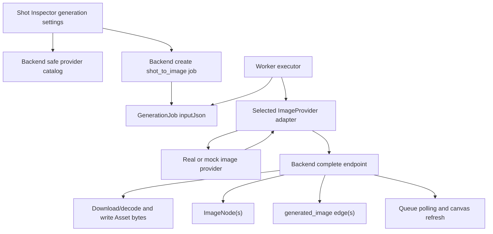

# feat: Add real image provider generation

## Summary

Extend the Phase 8 `shot_to_image` pipeline with safe image provider catalog data, provider/model/parameter selection, `image2` and `banana` adapter paths, remote or inline image persistence, and multi-output ImageNode completion while keeping mock generation as the default no-key path.

---

## Problem Frame

The current GenerationJob worker flow proves durable mock media side effects, but it always stores mock image output. Phase 9 must prove the same backend-owned lifecycle can call real image provider adapters without leaking provider secrets or leaving generated images as temporary provider URLs.

---

## Assumptions

*This plan was authored without synchronous user confirmation. The items below are agent inferences that fill gaps in the input - un-validated bets that should be reviewed before implementation proceeds.*

- `image2` will be implemented as an OpenAI GPT Image 2 compatible adapter.
- `banana` will be implemented as a Google Gemini / Nano Banana image adapter.
- Local CI and normal development will run without real keys, so mocked adapter HTTP tests and disabled-provider UI are the authoritative no-key verification path.
- Live provider smoke is optional and documented because it depends on server-side credentials outside the repo.

---

## Requirements

- R1. Expose a project-safe image provider catalog containing `mock-image`, `image2`, and `banana`.
- R2. Real image providers report disabled and cannot be used when required server-side configuration is absent.
- R3. Browser-visible provider data includes only safe metadata, never secrets or raw secret values.
- R4. Health/config provider mode remains inspectable without exposing secrets.
- R5. `shot_to_image` jobs preserve composed prompt data plus selected provider, model, count, aspect ratio, and provider parameters.
- R6. Character/Location reference image bindings are passed to providers that support references or visibly omitted when unsupported.
- R7. Mock image generation remains the default no-key path and keeps Phase 8 acceptance working.
- R8. `image2` and `banana` adapters normalize one or more image outputs.
- R9. Remote image URLs are downloaded server-side and saved to project storage before Asset creation.
- R10. Multi-output image generation creates one ImageNode and one `generated_image` edge per output.
- R11. Provider errors are normalized into readable failed job errors.
- R12. Retry remains append-only.
- R13. Queue counts, node status, Asset Library, prompt preview, and mock video generation keep working after real image jobs.
- R14. Workbench generation settings expose provider, model, aspect ratio, count, and provider parameters compactly.
- R15. Provider settings never store or request secrets in the browser.

**Origin actors:** A1 Creator, A2 Backend, A3 Worker, A4 Provider adapter
**Origin flows:** F1 Real provider availability and selection, F2 Shot to real image generation, F3 Provider failure and no-key handling
**Origin acceptance examples:** AE1 no-key disabled provider UI, AE2 mock path compatibility, AE3 remote image persistence, AE4 multi-output ImageNodes, AE5 provider failure/retry, AE6 no secret exposure

---

## Scope Boundaries

- In scope: image provider catalog/config, safe provider metadata API, `image2` and `banana` image adapters, remote/inline image persistence, `shot_to_image` provider settings, multi-output completion, no-key disabled UI, docs and smoke notes.
- Out of scope: real video providers, provider polling/cancel, batch Image -> Video, editor export, browser-side secret entry, browser-side provider calls, replacing the existing GenerationJob/worker/canvas graph architecture.

### Deferred to Follow-Up Work

- Live-provider CI: real provider keys should remain local/manual until a separate secrets and cost-control policy exists.
- Provider admin console: Phase 9 exposes compact per-request generation settings, not full provider CRUD or user-entered secret management.

---

## Context & Research

### Relevant Code and Patterns

- `packages/shared-types/src/domain/generation.ts` owns GenerationJob input/output contracts and currently models single generated media output.
- `packages/provider-contracts/src/contracts.ts` and `packages/provider-contracts/src/mock-providers.ts` define the current provider interface and mock image/video outputs.
- `apps/backend/src/config/app-config.ts` already reports provider mode and generic key presence without exposing secrets.
- `apps/backend/src/generation/generation.service.ts` creates `shot_to_image` inputs, claims jobs, handles failure, and applies generated media side effects.
- `apps/backend/src/assets/assets.service.ts` and `apps/backend/src/storage/local-storage.service.ts` own local Asset creation and previewable bytes.
- `apps/worker/src/generation-executors.ts` is the operation executor seam where selected image providers should be invoked.
- `apps/frontend/src/components/canvas/generation-actions.tsx` is the compact Inspector action surface for generation settings.
- `apps/frontend/src/components/canvas/project-canvas-workspace.tsx` already polls job state and refreshes canvas facts after terminal job changes.

### Institutional Learnings

- `docs/solutions/architecture-patterns/generation-worker-backend-side-effects-2026-06-12.md`: worker executes providers, backend owns job lifecycle, Asset writes, generated nodes, edges, and status transitions.
- `docs/solutions/architecture-patterns/project-scoped-asset-lifecycle-boundary-2026-06-12.md`: browser should not own storage paths, provider secrets, or deletion rules.
- `docs/solutions/architecture-patterns/prompt-composer-graph-derived-debug-parts-2026-06-12.md`: generation input should reuse backend graph-derived prompt composition instead of frontend prompt snapshots.

### External References

- OpenAI image generation docs: `gpt-image-2` is available through OpenAI image generation APIs, supports direct image generation, and supports multiple outputs with an `n` parameter. Source: https://developers.openai.com/api/docs/guides/image-generation
- Gemini image generation docs: Nano Banana image models are exposed through Gemini image generation, support response modality configuration, aspect ratios, and multiple reference image limits by model. Source: https://ai.google.dev/gemini-api/docs/image-generation
- Toonflow vendor context: `docs/research/video-ref/repomix/toonflow-app-focused-vendor-code.xml` shows a vendor model catalog with image modes and model-test routes, but guga-flow should keep provider code static and server-owned for MVP.

---

## Key Technical Decisions

- Use fetch-based real image adapters: Node 26 provides `fetch`, and current packages have no SDK dependencies. This keeps the first adapter slice small and easy to mock in tests.
- Keep provider catalog static plus env-derived availability: Phase 9 needs safe provider metadata and disabled states, not a database-backed provider admin system.
- Use one `shot_to_image` job for multi-output requests: the job remains the user action and audit record; success output records all generated targets while `targetNodeId` can point to the first generated node for backward compatibility.
- Persist bytes in backend completion: adapters may return inline base64/bytes or remote URLs, but backend completion must materialize bytes through the existing storage/Asset boundary before creating ImageNodes.
- Keep provider settings inside the Inspector generation panel: this is the current user action surface, avoids a new settings page, and keeps settings contextual to the selected Shot.

---

## Open Questions

### Resolved During Planning

- Should Phase 9 add SDK dependencies? No. Prefer fetch-based adapters for the first slice and revisit SDKs only if implementation finds fetch insufficient for official APIs.
- Should missing real keys block mock generation? No. Mock image remains default and must stay fully usable without paid keys.
- Should provider configuration be database-backed now? No. Use static provider catalog plus environment-derived availability; full provider CRUD is follow-up work.

### Deferred to Implementation

- Exact OpenAI/Gemini response parsing details: verify while implementing against official docs and fixture tests.
- Exact multi-output trace shape: preserve old single-output fields where possible, but add a multi-target trace that tests and UI can consume.
- Reference image byte formatting: implement the minimal provider-supported shape needed for `image2` and `banana`, and omit unsupported references visibly.

---

## High-Level Technical Design

> *This illustrates the intended approach and is directional guidance for review, not implementation specification. The implementing agent should treat it as context, not code to reproduce.*

---

## Implementation Units

- U1. **Shared provider settings and multi-output contracts**

**Goal:** Add shared, typed contracts for safe image provider catalog entries, image generation settings, adapter outputs, and multi-output generated media job traces.

**Requirements:** R1, R3, R5, R8, R10, R14, R15

**Dependencies:** None

**Files:**
- Modify: `packages/shared-types/src/domain/generation.ts`
- Modify: `packages/shared-types/src/domain/domain.test.ts`
- Modify: `packages/shared-types/src/index.ts`
- Modify: `packages/provider-contracts/src/contracts.ts`
- Test: `packages/shared-types/src/domain/domain.test.ts`

**Approach:**
- Extend `CreateGenerationJobInput` for `shot_to_image` settings without breaking existing mock callers.
- Add safe provider catalog types that describe provider id, display name, enabled state, disabled reason, supported modes, default model, and parameter metadata.
- Extend provider output contracts so adapters can return inline bytes/base64 or remote URLs and can return multiple outputs.
- Extend generated job output trace to support multiple generated targets while preserving single-output compatibility for current UI and job list consumers.

**Patterns to follow:**
- Existing generation contract tests in `packages/shared-types/src/domain/domain.test.ts`.
- Existing provider failure and mock output shapes in `packages/provider-contracts/src/contracts.ts`.

**Test scenarios:**
- Happy path: a `shot_to_image` create input with provider/model/aspectRatio/count/providerParams is representable and JSON-compatible.
- Happy path: a safe catalog entry serializes without secret fields.
- Happy path: a multi-output generated media job output can preserve three target node ids, asset ids, and edge ids.
- Edge case: old Phase 8 create input without provider settings still parses as the mock-default shape.

**Verification:**
- Shared types compile and domain tests prove old and new generation shapes.

---

- U2. **Provider catalog, config, and disabled-state API**

**Goal:** Add a backend-owned safe image provider catalog that derives availability from server-side environment configuration and exposes disabled provider metadata to the frontend.

**Requirements:** R1, R2, R3, R4, R14, R15, AE1, AE6

**Dependencies:** U1

**Files:**
- Create: `apps/backend/src/providers/providers.module.ts`
- Create: `apps/backend/src/providers/providers.controller.ts`
- Create: `apps/backend/src/providers/providers.service.ts`
- Create: `apps/backend/src/providers/providers.service.spec.ts`
- Modify: `apps/backend/src/app.module.ts`
- Modify: `apps/backend/src/config/app-config.ts`
- Modify: `apps/backend/src/health/health.controller.spec.ts`
- Modify: `apps/backend/src/health/health.controller.ts`
- Modify: `apps/backend/.env.example`
- Modify: `apps/worker/.env.example`
- Test: `apps/backend/src/providers/providers.service.spec.ts`
- Test: `apps/backend/src/health/health.controller.spec.ts`

**Approach:**
- Define a static provider catalog for `mock-image`, `image2`, and `banana`.
- Derive real-provider `enabled` state from server-side key presence such as OpenAI and Gemini image key env values.
- Return safe metadata only; expose key presence or disabled reason, never the key name's value or raw secret.
- Keep health output aligned with the provider catalog so operator-facing config and UI-facing catalog do not disagree.

**Patterns to follow:**
- `apps/backend/src/config/app-config.ts` for env parsing and non-secret health data.
- `apps/backend/src/health/health.controller.ts` for safe provider mode reporting.

**Test scenarios:**
- Covers AE1. With no real keys, catalog returns `mock-image` enabled and `image2`/`banana` disabled.
- Covers AE6. Catalog payload contains no API key values and no raw secret payloads.
- Happy path: with provider-specific env values set, real providers report enabled and include default model metadata.
- Error path: invalid or missing optional provider config does not prevent mock provider catalog from loading.
- Integration: health provider mode remains non-secret and reflects per-provider key availability.

**Verification:**
- Backend provider catalog tests prove disabled-state and secret-safety behavior.

---

- U3. **Real image adapters and worker provider registry**

**Goal:** Add fetch-based `image2` and `banana` image adapters behind the provider-contracts package and update the worker executor to select the job's requested image provider.

**Requirements:** R5, R6, R7, R8, R11, AE2, AE5

**Dependencies:** U1, U2

**Files:**
- Create: `packages/provider-contracts/src/image-provider-registry.ts`
- Create: `packages/provider-contracts/src/real-image-providers.ts`
- Create: `packages/provider-contracts/src/real-image-providers.test.ts`
- Modify: `packages/provider-contracts/src/index.ts`
- Modify: `packages/provider-contracts/src/mock-providers.ts`
- Modify: `packages/provider-contracts/src/mock-providers.test.ts`
- Modify: `apps/worker/src/generation-executors.ts`
- Modify: `apps/worker/src/generation-runner.test.ts`
- Modify: `apps/worker/src/index.ts`
- Test: `packages/provider-contracts/src/real-image-providers.test.ts`
- Test: `apps/worker/src/generation-runner.test.ts`

**Approach:**
- Build provider adapters around injectable `fetch` so tests can verify request mapping without live keys.
- Keep `mock-image` in the same registry as real providers so the worker does not special-case mock vs real execution.
- Map `image2` to OpenAI-compatible image generation, normalizing base64 outputs and provider errors.
- Map `banana` to Gemini image generation, normalizing inline image parts and provider errors.
- Treat unsupported references as an explicit adapter-level omission/failure according to provider capability metadata, preserving enough context for readable job errors.

**Patterns to follow:**
- `packages/provider-contracts/src/mock-providers.ts` for deterministic mock outputs and `ProviderError`.
- `apps/worker/src/generation-executors.ts` for converting claimed jobs to provider calls and reporting normalized failures.

**Test scenarios:**
- Happy path: `image2` adapter sends prompt/model/aspectRatio/count and normalizes two image outputs from a mocked provider response.
- Happy path: `banana` adapter sends prompt/model/aspectRatio/reference metadata and normalizes inline image output.
- Error path: missing key produces a `ProviderError` before any network request.
- Error path: provider HTTP error normalizes into a retryable or non-retryable readable failure.
- Covers AE2. Existing mock image job still executes through the registry without real keys.
- Covers AE5. Unsupported or invalid references surface as normalized provider failure.

**Verification:**
- Provider-contract tests verify adapter request/response mapping without live network.
- Worker tests prove selected provider dispatch and mock compatibility.

---

- U4. **Backend job creation, remote persistence, and multi-output side effects**

**Goal:** Validate selected image providers during job creation, persist real provider outputs as project Assets, and complete multi-output jobs into multiple ImageNodes and `generated_image` edges.

**Requirements:** R2, R5, R6, R8, R9, R10, R11, R12, R13, AE3, AE4, AE5

**Dependencies:** U1, U2

**Files:**
- Modify: `apps/backend/src/generation/dto.ts`
- Modify: `apps/backend/src/generation/generation.service.ts`
- Modify: `apps/backend/src/generation/generation.service.spec.ts`
- Modify: `apps/backend/test/app.e2e-spec.ts`
- Modify: `apps/backend/src/assets/assets.service.ts`
- Modify: `apps/backend/src/assets/assets.service.spec.ts`
- Modify: `apps/backend/src/storage/local-storage.service.ts`
- Modify: `apps/backend/src/storage/local-storage.service.spec.ts`
- Modify: `apps/backend/src/storage/storage.types.ts`
- Test: `apps/backend/src/generation/generation.service.spec.ts`
- Test: `apps/backend/src/assets/assets.service.spec.ts`
- Test: `apps/backend/test/app.e2e-spec.ts`

**Approach:**
- Validate `shot_to_image` provider settings against the safe catalog at job creation.
- Store selected provider/model/count/aspectRatio/providerParams in canonical job input.
- Reject disabled real providers before a job is created; keep mock default behavior when settings are omitted.
- Extend success handling to iterate image outputs and create one Asset, one ImageNode, and one generated edge per output.
- Persist inline bytes/base64 directly and remote URLs through a backend downloader before Asset creation.
- Keep existing single-target fields populated with the first generated output for backward compatibility while adding a complete multi-target output trace.

**Patterns to follow:**
- `apps/backend/src/generation/generation.service.ts` transaction boundary for generated media side effects.
- `apps/backend/src/assets/assets.service.ts` backend-owned Asset lifecycle.
- `apps/backend/src/storage/local-storage.service.ts` storage-key escape protection.

**Test scenarios:**
- Covers AE1. Creating a job with disabled `image2` rejects without mutating job or node state.
- Covers AE3. Completing a job with remote URL output downloads bytes, creates an Asset, creates an ImageNode, creates a `generated_image` edge, and serves preview bytes.
- Covers AE4. Completing a job with three image outputs creates three Assets, three ImageNodes, three edges, and one job output containing all targets.
- Error path: remote download failure marks the job failed through the worker fail path or rejects completion without partial graph mutation.
- Covers AE5. Failed real provider job remains failed and retry creates a new queued job preserving provider settings.
- Regression: existing mock single-output completion still passes Phase 8 expectations.

**Verification:**
- Backend unit and e2e tests prove disabled-provider rejection, remote persistence, multi-output side effects, and mock regression.

---

- U5. **Frontend provider settings and safe catalog client**

**Goal:** Let creators see image provider availability and choose compact image generation settings from the existing Shot generation panel.

**Requirements:** R1, R2, R3, R5, R6, R14, R15, AE1, AE2, AE6

**Dependencies:** U1, U2, U4 API contract

**Files:**
- Modify: `apps/frontend/src/lib/api.ts`
- Modify: `apps/frontend/src/lib/api.test.ts`
- Modify: `apps/frontend/src/components/canvas/generation-actions.tsx`
- Modify: `apps/frontend/src/components/canvas/generation-actions.test.tsx`
- Modify: `apps/frontend/src/components/canvas/canvas-inspector.test.tsx`
- Modify: `apps/frontend/src/app/globals.css`
- Test: `apps/frontend/src/lib/api.test.ts`
- Test: `apps/frontend/src/components/canvas/generation-actions.test.tsx`
- Test: `apps/frontend/src/components/canvas/canvas-inspector.test.tsx`

**Approach:**
- Add a frontend API wrapper for the safe image provider catalog.
- Load catalog data in the generation panel or workspace and render provider/model/aspectRatio/count controls only for Shot image generation.
- Default to `mock-image` when available and settings are untouched.
- Disable real provider options with clear non-secret reason text when keys are absent.
- Include selected settings in create job calls; keep retry behavior job-owned rather than re-entering settings.
- Keep ImageNode video generation compact and unchanged except for layout compatibility with the expanded Shot settings.

**Patterns to follow:**
- `apps/frontend/src/components/canvas/generation-actions.tsx` for compact Inspector actions.
- Existing API wrapper and render-to-static markup tests in `apps/frontend/src/lib/api.test.ts` and `generation-actions.test.tsx`.

**Test scenarios:**
- Covers AE1. With no-key catalog data, `mock-image` is enabled and real providers render disabled.
- Covers AE2. Submitting with default settings calls create job with mock-compatible input.
- Happy path: selecting an enabled provider/model/count/aspectRatio sends those settings in the create job request.
- Covers AE6. Rendered markup and API payloads do not include secret values.
- Regression: ImageNode with an asset still renders Generate Video and does not show image provider settings.

**Verification:**
- Frontend tests prove provider catalog rendering, request payloads, disabled states, and existing ImageNode video behavior.

---

- U6. **Phase 9 verification, review, docs, and learning capture**

**Goal:** Prove Phase 9 acceptance in no-key and mocked-real-provider modes, update docs, run review, and capture reusable provider integration learnings.

**Requirements:** AE1, AE2, AE3, AE4, AE5, AE6

**Dependencies:** U1, U2, U3, U4, U5

**Files:**
- Modify: `docs/development.md`
- Modify: `docs/plans/2026-06-12-010-feat-real-image-provider-plan.md`
- Create: `docs/solutions/architecture-patterns/real-image-provider-secret-safe-persistence-2026-06-12.md`
- Modify tests as needed from review findings.

**Approach:**
- Run no-key browser/API smoke proving disabled `image2`/`banana`, enabled `mock-image`, and unchanged mock generation.
- Run mocked-real-provider backend/worker smoke proving remote URL download, multi-output side effects, Asset previews, and readable provider failure/retry.
- Document optional live smoke instructions for environments with OpenAI/Gemini keys.
- Run code review against the Phase 9 diff and fix blocking findings before marking the plan completed.
- Capture a solution note covering secret-safe provider catalog, adapter normalization, and backend-owned remote media persistence.

**Patterns to follow:**
- Phase 8 verification evidence in `docs/plans/2026-06-12-009-feat-generation-worker-mock-media-plan.md`.
- `docs/solutions/architecture-patterns/generation-worker-backend-side-effects-2026-06-12.md`.

**Test scenarios:**
- Covers AE1 and AE6. Browser/API responses expose disabled real providers without secrets.
- Covers AE2. Existing mock Shot -> ImageNode flow still succeeds.
- Covers AE3. Mocked remote URL output becomes a local Asset preview.
- Covers AE4. Multi-output job produces multiple ImageNodes and edges.
- Covers AE5. Provider failure is readable and retry append-only.

**Verification:**
- Targeted package tests for U1-U5 pass.
- Full quality gates pass.
- Browser/API smoke evidence is recorded in the plan before final Phase 9 commit.

---

## Verification Evidence

- Full quality gates passed on 2026-06-12: `pnpm run format:check`, `pnpm run test`, `pnpm run build`, and `pnpm run mock:workflow`. The local shell still reports Node `v22.22.2` against repo engines `>=26.3.0`; Phase 9 keeps the Node 26 architecture requirement and treats this as an environment upgrade item, not a reason to lower engines.
- Targeted review-fix gates passed after hardening changes: `pnpm --filter @guga-flow/provider-contracts test`, `pnpm --filter @guga-flow/provider-contracts lint`, `pnpm --filter @guga-flow/backend test -- assets generation`, and `pnpm --filter @guga-flow/backend lint`.
- API no-key smoke passed against `http://localhost:3002`: `GET /api/v1/providers/image` returned `mock-image` enabled, `image2` disabled with `Image 2 server-side key is not configured`, and `banana` disabled with `Nano Banana server-side key is not configured`; the payload contained no actual secret-like values. `GET /api/v1/health` returned status `ok`, image provider mode `mock-image`, and per-provider key-presence booleans without secret values.
- Browser smoke passed against `http://localhost:3001/projects/cmqb7t7xb0000a3svlcg4y8cq/canvas`: selecting `Shot: Smoke Shot 01` opened the Inspector Generation panel with Provider, Model, Aspect, Count, enabled Mock Image, unavailable Image 2, unavailable Nano Banana, and `Generate Image`. Network smoke showed project canvas/assets/jobs requests returning 200/304. Console retained unrelated tldraw zh-cn missing-message warnings and older connection-refused resource records, with no new Phase 9 provider-secret exposure.
- Mock workflow smoke passed and produced a complete storyboard/image/video/editor-package flow using mock providers, preserving Phase 8 no-key compatibility while Phase 9 provider settings are present.
- Code review findings were fixed before completion: generated remote asset downloads now require HTTPS and reject obvious local/private hosts, adapter fetch rejections normalize into sanitized `ProviderError`s, and backend image completion rejects more provider outputs than the requested `count`.
- Optional live-provider smoke was not run because this checkout has no OpenAI/Gemini image keys configured. `docs/development.md` now documents the manual live-smoke path for environments with server-side credentials.

---

## System-Wide Impact

- **Interaction graph:** Generation job creation, worker execution, backend completion, Asset preview, Inspector actions, and queue polling all touch the same `shot_to_image` flow.
- **Error propagation:** Provider adapter errors must normalize to `ProviderFailure`, worker must report fail, backend must preserve failed job and node status, frontend must show readable failure/retry state.
- **State lifecycle risks:** Remote downloads and multi-output completion can create partial storage objects if DB writes fail; backend completion should keep DB mutations grouped and document or mitigate storage cleanup risk.
- **API surface parity:** Shared generation types, backend DTOs, worker client/executor, and frontend API wrappers must all agree on provider settings and multi-output traces.
- **Integration coverage:** Unit tests alone will not prove remote bytes preview or canvas graph refresh; backend e2e and browser/API smoke are required.
- **Unchanged invariants:** Provider keys stay server-side, mock-first remains default, `image_to_video` behavior remains Phase 8 behavior, and canvas graph facts remain normalized `CanvasNode`/`CanvasEdge` rows.

---

## Risks & Dependencies

| Risk | Mitigation |
|------|------------|
| Provider docs or model names shift | Keep exact API parsing isolated to adapters and back it with mocked HTTP fixtures; document live smoke as optional. |
| Browser accidentally receives provider secrets | Use safe catalog DTOs and tests that assert no secret values appear in API responses or rendered UI. |
| Multi-output completion breaks single-output UI assumptions | Preserve first-target compatibility fields and add complete multi-target output trace. |
| Remote URL download succeeds but DB transaction fails | Keep storage writes behind backend service; add tests around failure behavior and document cleanup limits if needed. |
| Real provider keys absent in CI | Disabled-provider tests and mocked adapter tests are mandatory; live smoke is conditional and manual. |
| Provider references differ by adapter | Carry capability metadata and make unsupported references visible rather than silently dropping them. |

---

## Documentation / Operational Notes

- Update `docs/development.md` with image provider env vars, disabled-provider behavior, mocked-real-provider verification, and optional live smoke steps.
- Keep `.env.example` files clear that real provider keys are server-side only.
- Mark this plan completed only after docs, review, smoke evidence, and solution learning are committed.

---

## Sources & References

- **Origin document:** [docs/brainstorms/2026-06-12-010-phase-9-real-image-provider-requirements.md](../brainstorms/2026-06-12-010-phase-9-real-image-provider-requirements.md)
- PRD roadmap: [infinite_canvas_video_prd_roadmap_v2_detailed.md](../../infinite_canvas_video_prd_roadmap_v2_detailed.md)
- Development flow: [docs/infinite-canvas-video-long-task-development-flow.md](../infinite-canvas-video-long-task-development-flow.md)
- Tech stack reference: [docs/tech-stack-text2sql-reference.md](../tech-stack-text2sql-reference.md)
- Phase 8 learning: [docs/solutions/architecture-patterns/generation-worker-backend-side-effects-2026-06-12.md](../solutions/architecture-patterns/generation-worker-backend-side-effects-2026-06-12.md)
- Asset lifecycle learning: [docs/solutions/architecture-patterns/project-scoped-asset-lifecycle-boundary-2026-06-12.md](../solutions/architecture-patterns/project-scoped-asset-lifecycle-boundary-2026-06-12.md)
- Prompt composer learning: [docs/solutions/architecture-patterns/prompt-composer-graph-derived-debug-parts-2026-06-12.md](../solutions/architecture-patterns/prompt-composer-graph-derived-debug-parts-2026-06-12.md)
- OpenAI image generation docs: https://developers.openai.com/api/docs/guides/image-generation
- Gemini image generation docs: https://ai.google.dev/gemini-api/docs/image-generation
- Toonflow vendor research context: [docs/research/video-ref/repomix/toonflow-app-focused-vendor-code.xml](../research/video-ref/repomix/toonflow-app-focused-vendor-code.xml)
