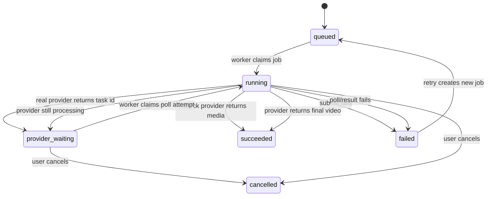
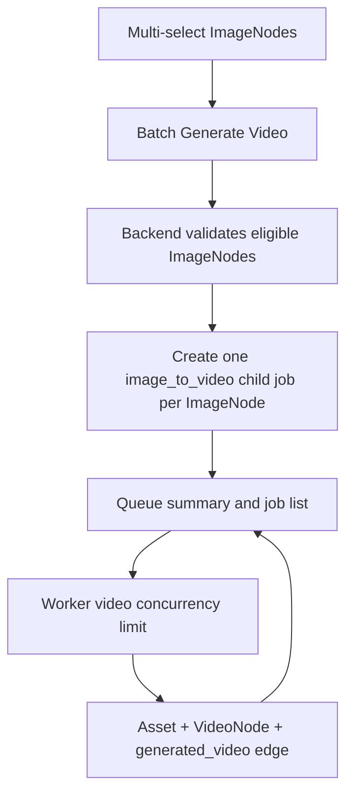

# feat: Add real video provider generation

## Summary

Extend the existing `image_to_video` flow with a safe video provider catalog, async `createTask`/poll/cancel adapters for `seedance` and `happyhorse`, backend-owned remote video persistence, compact video generation settings, batch Image -> Video child jobs, and worker video concurrency limits while preserving the no-key `mock-video` path.

---

## Problem Frame

The current GenerationJob pipeline can create mock video Assets and VideoNodes, but it still treats video providers as synchronous. Phase 10 must prove that real long-running video tasks can be submitted once, resumed through `provider_waiting`, cancelled when possible, and completed into local project storage without leaking provider credentials or hiding batch progress.

---

## Assumptions

- `seedance` will use a BytePlus ModelArk-style async video task API because the current BytePlus docs expose video task creation, retrieval, listing, and cancel/delete pages.
- `happyhorse` will use a fal queue-compatible adapter for the first implementation slice because fal publishes a Happy Horse image-to-video model page and a queue lifecycle with submit, status, result, and cancel operations.
- Live video provider smoke is optional and manual because it needs paid server-side credentials and can incur cost.
- The local environment currently warns on Node `v22.22.2`, but the repo architecture remains Node `>=26.3.0`; implementation should upgrade the runtime rather than lower `engines`.

---

## Requirements

**Provider catalog and secret safety**

- R1. Expose a safe video provider catalog containing `mock-video`, `seedance`, and `happyhorse`.
- R2. Reject disabled real video providers before job mutation when required server-side keys are absent.
- R3. Return browser-safe provider metadata only, never raw keys, auth headers, or secret-shaped values.
- R4. Health/config output reports selected video provider and per-provider key presence without exposing secrets.

**Async job lifecycle**

- R5. `image_to_video` jobs preserve source image asset id, prompt, provider, model, duration, resolution, aspect ratio, and provider parameters.
- R6. Worker execution uses one VideoProvider interface across mock and real providers.
- R7. Real provider submission stores `providerTaskId` and moves the job to `provider_waiting` after one `createTask` call.
- R8. Waiting jobs are polled by `providerTaskId` and are not re-submitted as new provider tasks.
- R9. Provider success normalizes one final video output into the existing generated media completion path.

**Persistence, cancel, retry**

- R10. Remote video outputs are downloaded server-side, validated as video media, written to storage, and represented as Assets before VideoNode creation.
- R11. Completion creates one VideoNode and one `generated_video` edge while keeping queue polling and canvas refresh behavior.
- R12. Cancel transitions active or waiting video jobs to `cancelled` and calls provider cancellation when supported.
- R13. Provider submit, poll, cancel, and result errors normalize into readable job errors without leaking secrets.
- R14. Retry stays append-only and preserves original provider settings on the new queued job.

**Frontend and batch**

- R15. ImageNode video controls expose compact provider, model, duration, resolution, aspect ratio, and provider parameter settings.
- R16. Batch Image -> Video creates separate child jobs for eligible ImageNodes and reports skipped selections.
- R17. Queue UI makes queued, running, waiting, failed, and cancelled child jobs inspectable during batch work.

**Origin trace:** A1 Creator, A2 Backend, A3 Worker, A4 Video provider adapter; F1 provider selection, F2 async Image -> Video, F3 cancel/failure, F4 batch Image -> Video; AE1 no-key disabled provider UI, AE2 mock compatibility, AE3 no duplicate submit, AE4 remote video persistence, AE5 cancel, AE6 retry, AE7 batch child jobs.

---

## Scope Boundaries

- In scope: video provider catalog/config, `seedance` and `happyhorse` adapter seams, async provider task lifecycle, provider polling, cancel routing, remote video persistence, compact video settings, batch Image -> Video child jobs, worker concurrency limits, docs, tests, review, and smoke evidence.
- Out of scope: real editor export, timeline packaging, text-to-video from Shot without an ImageNode, webhooks, provider admin CRUD, browser-entered secrets, browser-side provider calls, BullMQ/PGMQ migration, audio editing workflows, and provider cost accounting.

### Deferred to Follow-Up Work

- Webhook ingestion can replace or supplement polling after the polling lifecycle is proven.
- Text-to-video and reference-to-video modes can reuse the VideoProvider interface after Image -> Video is reliable.
- Spend controls, quota dashboards, and provider CRUD need a separate operator-facing module.

---

## Context & Research

### Relevant Code and Patterns

- `packages/shared-types/src/domain/generation.ts` already defines `provider_waiting`, `cancelled`, `providerTaskId`, `image_to_video`, and `batch_images_to_videos`, but `CreateGenerationJobInput` is still limited to Phase 8 operations and image settings.
- `packages/provider-contracts/src/contracts.ts` currently models `VideoProvider.generateVideo` as synchronous mock output; Phase 10 needs `createTask`, `getTask`, and optional `cancelTask`.
- `apps/backend/src/generation/generation.service.ts` owns job creation, claim, fail, succeed, retry, generated Asset/VideoNode/edge side effects, and queue summaries.
- `apps/backend/src/providers/providers.service.ts` provides the safe image catalog pattern that video catalog should mirror.
- `apps/backend/src/assets/assets.service.ts` already downloads generated remote media through the backend and now blocks non-HTTPS/local generated URLs.
- `apps/worker/src/generation-runner.ts` currently claims one queued job, executes it, and posts succeed/fail; it has no waiting-task poll or concurrency loop yet.
- `apps/frontend/src/components/canvas/generation-actions.tsx` is the compact Inspector generation surface and already differentiates Shot image settings from ImageNode video generation.
- `apps/frontend/src/components/canvas/canvas-inspector.tsx` currently reports multi-selection only as a static state, so batch actions need a new multi-selection path that carries selected business node ids.

### Institutional Learnings

- `docs/solutions/architecture-patterns/generation-worker-backend-side-effects-2026-06-12.md`: backend owns job lifecycle, generated media persistence, canvas nodes, edges, and status side effects.
- `docs/solutions/architecture-patterns/real-image-provider-secret-safe-persistence-2026-06-12.md`: provider catalog stays safe, adapters normalize outputs, and backend completion materializes remote provider media before graph references.
- `docs/solutions/architecture-patterns/project-scoped-asset-lifecycle-boundary-2026-06-12.md`: storage keys and deletion/preview rules stay behind backend services.

### External References

- BytePlus ModelArk Seedance 2.0 docs list video generation task creation, retrieval, listing, and cancellation/delete pages. Source: https://docs.byteplus.com/en/docs/ModelArk/1520757
- fal async inference docs describe queue submission, status polling, result retrieval, cancellation, and expiring media URLs that should be downloaded for durable use. Source: https://fal.ai/docs/documentation/model-apis/inference/queue
- fal Happy Horse image-to-video docs identify the `alibaba/happy-horse/image-to-video` model, server-side `FAL_KEY`, and first-frame image URL input. Source: https://fal.ai/models/alibaba/happy-horse/image-to-video/api
- Runware HappyHorse docs describe `alibaba:happyhorse@1.0`, text/image-to-video modes, 720p/1080p output, 3-15 second durations, async delivery, and task UUID tracking. Source: https://runware.ai/docs/models/alibaba-happyhorse-1-0

---

## Key Technical Decisions

- **Use fetch-based video adapters first:** Match Phase 9's no-SDK adapter pattern so tests can inject fetch fixtures and Node 26's built-in `fetch` remains the runtime baseline.
- **Model provider tasks as a provider-neutral result:** Adapters should normalize submit/poll/cancel into statuses, provider task id, remote output URL, retryable failure, and small non-secret raw trace data.
- **Add backend waiting-state endpoints for the worker:** Worker needs a way to mark a claimed job `provider_waiting` after submit and later claim or list waiting jobs for polling without treating them as new queued submissions.
- **Keep cancel server-owned, with one provider-cancel attempt:** Public cancel should update durable job/node state immediately and route provider cancellation through server-side adapter code or worker cancellation metadata, whichever implementation proves less duplicative while still calling `cancelTask` at most once.
- **Represent batch as child jobs:** `batch_images_to_videos` should create one `image_to_video` child job per eligible ImageNode instead of one opaque provider request, preserving retry, cancel, queue visibility, and per-item failure.
- **Keep provider URLs temporary:** Any final URL from Seedance, fal, Runware, or a mock real fixture is an input to backend persistence, not the lasting preview URL.

---

## Open Questions

### Resolved During Planning

- Should Phase 10 lower the Node engine because the local shell is on Node 22? No. Upgrade the runtime; do not downgrade architecture.
- Should batch Image -> Video be one job with many targets? No. Use child jobs so queue state and retry remain per ImageNode.
- Should Phase 10 introduce provider webhooks? No. Polling is the MVP path; webhooks are deferred.

### Deferred to Implementation

- Exact Seedance task payload and status strings should be verified against current BytePlus docs while implementing the adapter fixtures.
- Exact HappyHorse gateway should stay isolated behind the adapter. The first slice should prefer fal queue compatibility unless implementation finds Runware's API is a safer documented route for the required workflow.
- Provider cancel handoff can be backend-owned or worker-owned as long as it is server-side, idempotent, and tested for one cancel attempt.

---

## High-Level Technical Design

### Async Video Lifecycle

### Batch Image To Video

---

## Implementation Units

### U1. Shared video provider and async job contracts

**Goal:** Add typed contracts for safe video provider catalog entries, video generation settings, async task results, worker waiting/cancel payloads, and batch Image -> Video creation results.

**Requirements:** R1, R3, R5, R6, R7, R8, R12, R15, R16, R17

**Dependencies:** None

**Files:**
- Modify: `packages/shared-types/src/domain/generation.ts`
- Modify: `packages/shared-types/src/domain/domain.test.ts`
- Modify: `packages/shared-types/src/index.ts`
- Modify: `packages/provider-contracts/src/contracts.ts`
- Test: `packages/shared-types/src/domain/domain.test.ts`

**Approach:**
- Add video provider ids, modes, model options, parameter definitions, and safe catalog result types mirroring the image catalog without sharing secret-bearing fields.
- Extend creation inputs so `image_to_video` can carry provider, model, duration, resolution, aspect ratio, and params without accidentally applying image-only `count`.
- Add provider-neutral async task result types that can represent `provider_waiting`, `succeeded`, `failed`, and `cancelled` provider states.
- Add batch Image -> Video result types that report created child jobs and skipped image nodes.

**Patterns to follow:**
- `ImageProviderCatalogItem` and image settings in `packages/shared-types/src/domain/generation.ts`.
- `ProviderError` and provider output conventions in `packages/provider-contracts/src/contracts.ts`.

**Test scenarios:**
- Happy path: a video catalog containing `mock-video`, `seedance`, and `happyhorse` serializes without secret fields.
- Happy path: an `image_to_video` input with provider/model/duration/resolution/aspect/providerParams is JSON-compatible.
- Happy path: a waiting task result preserves provider task id, provider, model, and raw trace without secrets.
- Edge case: legacy mock `image_to_video` creation without provider settings still represents the mock-default shape.
- Happy path: batch creation result can report two created child jobs and one skipped non-image selection.

**Verification:** Shared types compile and domain tests cover video catalog, async task, legacy mock compatibility, and batch result shapes.

### U2. Backend video provider catalog, config, health, and job validation

**Goal:** Expose a backend-owned safe video provider catalog and validate video provider settings before creating jobs or batch child jobs.

**Requirements:** R1, R2, R3, R4, R5, R15, AE1

**Dependencies:** U1

**Files:**
- Modify: `apps/backend/src/providers/providers.service.ts`
- Modify: `apps/backend/src/providers/providers.controller.ts`
- Modify: `apps/backend/src/providers/providers.service.spec.ts`
- Modify: `apps/backend/src/config/app-config.ts`
- Modify: `apps/backend/src/health/health.controller.ts`
- Modify: `apps/backend/src/health/health.controller.spec.ts`
- Modify: `apps/backend/src/generation/dto.ts`
- Modify: `apps/backend/src/generation/generation.service.ts`
- Modify: `apps/backend/src/generation/generation.service.spec.ts`
- Modify: `apps/backend/.env.example`
- Modify: `apps/worker/.env.example`
- Test: `apps/backend/src/providers/providers.service.spec.ts`
- Test: `apps/backend/src/generation/generation.service.spec.ts`
- Test: `apps/backend/src/health/health.controller.spec.ts`

**Approach:**
- Add `GET /providers/video` beside the image catalog and derive real-provider enabled state from server-side env such as Seedance/BytePlus and fal/HappyHorse keys.
- Add safe model and parameter metadata for `mock-video`, `seedance`, and `happyhorse`, including duration, resolution, and aspect-ratio boundaries.
- Validate `image_to_video` settings against the video catalog during job creation and keep `mock-video` as the default when settings are omitted.
- Keep health output aligned with the catalog by reporting configured video providers as booleans only.

**Patterns to follow:**
- `buildImageProviderCatalog` in `apps/backend/src/providers/providers.service.ts`.
- Image provider validation in `apps/backend/src/generation/generation.service.ts`.
- Non-secret health output in `apps/backend/src/health/health.controller.ts`.

**Test scenarios:**
- Covers AE1. With no real video keys, catalog returns `mock-video` enabled and real providers disabled with non-secret reasons.
- Covers AE1. Catalog and health payloads do not include configured key values.
- Happy path: configured Seedance and HappyHorse env values enable those providers and expose default model metadata.
- Error path: creating a job with disabled `seedance` rejects before creating a job or mutating node state.
- Regression: creating an `image_to_video` job with no provider settings still produces a queued `mock-video` job.

**Verification:** Backend provider, health, and generation tests prove safe catalog behavior and disabled-provider rejection.

### U3. Real video adapters and video provider registry

**Goal:** Replace the synchronous-only video provider contract with a registry that supports mock, Seedance, and HappyHorse async task lifecycles.

**Requirements:** R6, R7, R8, R9, R12, R13, AE2, AE3, AE5

**Dependencies:** U1, U2

**Files:**
- Create: `packages/provider-contracts/src/video-provider-registry.ts`
- Create: `packages/provider-contracts/src/real-video-providers.ts`
- Create: `packages/provider-contracts/src/real-video-providers.test.ts`
- Modify: `packages/provider-contracts/src/contracts.ts`
- Modify: `packages/provider-contracts/src/mock-providers.ts`
- Modify: `packages/provider-contracts/src/mock-providers.test.ts`
- Modify: `packages/provider-contracts/src/index.ts`
- Test: `packages/provider-contracts/src/real-video-providers.test.ts`
- Test: `packages/provider-contracts/src/mock-providers.test.ts`

**Approach:**
- Define `VideoProvider.createTask`, `VideoProvider.getTask`, and optional `VideoProvider.cancelTask` around provider-neutral task results.
- Let `mock-video` implement the same interface while returning immediate success for no-key compatibility.
- Implement fetch-based Seedance and HappyHorse adapters with injectable fetch, key checks before network calls, sanitized ProviderErrors, and fixture-driven response normalization.
- Normalize final provider outputs to a single video media output with MIME type, remote URL or inline bytes, provider task id, dimensions/duration when available, and small non-secret raw trace data.

**Patterns to follow:**
- `packages/provider-contracts/src/real-image-providers.ts` for fetch injection, ProviderError normalization, key redaction, and provider output parsing.
- `packages/provider-contracts/src/image-provider-registry.ts` for registry shape.

**Test scenarios:**
- Happy path: mock video `createTask` returns succeeded output compatible with existing worker completion.
- Happy path: Seedance `createTask` sends prompt/source/duration/resolution settings and returns a waiting task id.
- Happy path: Seedance `getTask` normalizes a succeeded remote MP4 output.
- Happy path: HappyHorse fal queue submission returns request id and status/result URLs or equivalent task id.
- Happy path: HappyHorse polling maps queue statuses to waiting/succeeded and extracts final video URL.
- Error path: missing provider key throws a non-retryable ProviderError before fetch.
- Error path: HTTP/fetch errors redact query keys and authorization values.
- Covers AE5. `cancelTask` maps provider cancel response into a successful local cancel attempt or readable failure.

**Verification:** Provider-contract tests cover mock compatibility, submit, poll, success, failure, cancel, and secret redaction without live network.

### U4. Worker async polling and video concurrency

**Goal:** Teach the worker to submit video tasks once, persist waiting state, poll waiting tasks, complete final media, and respect video concurrency limits.

**Requirements:** R7, R8, R9, R12, R13, AE2, AE3, AE4, AE5

**Dependencies:** U1, U3

**Files:**
- Modify: `apps/worker/src/generation-executors.ts`
- Modify: `apps/worker/src/generation-runner.ts`
- Modify: `apps/worker/src/generation-client.ts`
- Modify: `apps/worker/src/index.ts`
- Modify: `apps/worker/src/generation-runner.test.ts`
- Modify: `apps/worker/src/generation-client.test.ts`
- Modify: `apps/backend/src/generation/worker-generation.controller.ts`
- Modify: `apps/backend/src/generation/dto.ts`
- Modify: `apps/backend/src/generation/generation.service.ts`
- Modify: `apps/backend/src/generation/generation.service.spec.ts`
- Test: `apps/worker/src/generation-runner.test.ts`
- Test: `apps/worker/src/generation-client.test.ts`
- Test: `apps/backend/src/generation/generation.service.spec.ts`

**Approach:**
- Add worker/backend API support for marking a claimed job `provider_waiting` with `providerTaskId` and for claiming waiting jobs for poll attempts.
- Update the executor so `image_to_video` branches between submit and poll based on whether the job already has `providerTaskId`.
- Keep `shot_to_image` synchronous behavior unchanged.
- Add a worker loop that can process queued submissions and waiting polls while enforcing a default video concurrency of 2 and image concurrency of 3.
- Normalize poll outcomes: waiting keeps the job in `provider_waiting`, success posts succeed, provider failure posts fail, and cancel completion updates cancelled state.

**Patterns to follow:**
- Current `runOneGenerationJob` fail/succeed flow in `apps/worker/src/generation-runner.ts`.
- Backend atomic claim pattern in `GenerationService.claimNextJob`.
- Queue summary treatment of `provider_waiting` as running in `GenerationService.getQueueSummary`.

**Test scenarios:**
- Covers AE3. A queued real video job is submitted once, marked waiting with task id, and not posted to succeed yet.
- Covers AE3. A waiting job with provider task id calls `getTask` rather than `createTask`.
- Happy path: waiting poll success posts one video provider output to backend succeed.
- Error path: submit failure posts backend fail with sanitized ProviderFailure.
- Error path: poll failure posts backend fail without clearing provider task history.
- Covers AE5. Cancellation path calls provider cancel once when the waiting job has a task id.
- Concurrency: worker loop does not run more than two video jobs or polls concurrently.
- Regression: mock image and mock video one-shot worker tests continue to pass.

**Verification:** Worker and backend tests prove no duplicate submit, waiting poll, success, failure, cancel handoff, and concurrency behavior.

### U5. Backend cancel, remote video persistence, and batch child jobs

**Goal:** Add public cancel and batch Image -> Video APIs while completing real provider video outputs through the backend Asset and canvas graph boundary.

**Requirements:** R9, R10, R11, R12, R13, R14, R16, R17, AE4, AE5, AE6, AE7

**Dependencies:** U1, U2, U4

**Files:**
- Modify: `apps/backend/src/generation/generation.controller.ts`
- Modify: `apps/backend/src/generation/worker-generation.controller.ts`
- Modify: `apps/backend/src/generation/dto.ts`
- Modify: `apps/backend/src/generation/generation.service.ts`
- Modify: `apps/backend/src/generation/generation.service.spec.ts`
- Modify: `apps/backend/test/app.e2e-spec.ts`
- Modify: `apps/backend/src/assets/assets.service.ts`
- Modify: `apps/backend/src/assets/assets.service.spec.ts`
- Test: `apps/backend/src/generation/generation.service.spec.ts`
- Test: `apps/backend/src/assets/assets.service.spec.ts`
- Test: `apps/backend/test/app.e2e-spec.ts`

**Approach:**
- Add `POST /projects/:projectId/generation/jobs/:jobId/cancel` for queued, running, and waiting jobs with idempotent local state transitions.
- Preserve failed-job retry behavior and ensure retry copies video provider settings.
- Reuse `AssetsService.createGeneratedAsset` for remote video URLs, including HTTPS/local-host guards and video MIME validation.
- Add a batch Image -> Video create endpoint or operation that validates selected ImageNodes, creates child `image_to_video` jobs, and returns created/skipped summary.
- Keep DB graph mutations grouped: video Asset, VideoNode, generated edge, job output, and node statuses should remain consistent.

**Patterns to follow:**
- Existing `succeedJob` generated media side effects in `apps/backend/src/generation/generation.service.ts`.
- Phase 9 multi-output and remote persistence tests in `apps/backend/src/generation/generation.service.spec.ts`.
- Backend DTO and API wrapper conventions for project-scoped generation endpoints.

**Test scenarios:**
- Covers AE4. Completing a waiting job with a remote HTTPS MP4 downloads bytes, creates an Asset, creates a VideoNode, creates a `generated_video` edge, and serves preview bytes.
- Error path: remote non-video MIME is rejected before Asset creation.
- Error path: remote video download failure rejects completion without partial graph side effects.
- Covers AE5. Cancelling a waiting job marks the job and node cancelled and does not allow later success completion.
- Covers AE6. Retrying a failed real video job creates a new queued job with the same provider/model/params.
- Covers AE7. Batch request for three ImageNodes creates three child jobs and returns skipped items for non-image or assetless nodes.
- Regression: existing mock single-video completion still passes Phase 8 expectations.

**Verification:** Backend unit and e2e tests prove cancel, remote video persistence, batch child jobs, retry, and mock regression.

### U6. Frontend video settings, cancel, queue states, and batch UI

**Goal:** Let creators choose video provider settings, cancel active/waiting jobs, and run batch Image -> Video from multi-selection while seeing per-child queue state.

**Requirements:** R1, R2, R3, R12, R15, R16, R17, AE1, AE2, AE5, AE7

**Dependencies:** U1, U2, U5

**Files:**
- Modify: `apps/frontend/src/lib/api.ts`
- Modify: `apps/frontend/src/lib/api.test.ts`
- Modify: `apps/frontend/src/components/canvas/canvas-selection.ts`
- Modify: `apps/frontend/src/components/canvas/use-selected-business-nodes.ts`
- Modify: `apps/frontend/src/components/canvas/canvas-inspector.tsx`
- Modify: `apps/frontend/src/components/canvas/canvas-inspector.test.tsx`
- Modify: `apps/frontend/src/components/canvas/generation-actions.tsx`
- Modify: `apps/frontend/src/components/canvas/generation-actions.test.tsx`
- Modify: `apps/frontend/src/components/canvas/project-canvas-workspace.tsx`
- Modify: `apps/frontend/src/components/workbench-shell.tsx`
- Modify: `apps/frontend/src/components/workbench-shell.test.tsx`
- Modify: `apps/frontend/src/app/globals.css`
- Test: `apps/frontend/src/lib/api.test.ts`
- Test: `apps/frontend/src/components/canvas/generation-actions.test.tsx`
- Test: `apps/frontend/src/components/canvas/canvas-inspector.test.tsx`
- Test: `apps/frontend/src/components/workbench-shell.test.tsx`

**Approach:**
- Add API wrappers for video provider catalog, cancel job, and batch Image -> Video.
- Render video settings for ImageNode generation, mirroring the compact image settings pattern but using duration, resolution, aspect ratio, model, and provider params.
- Add Cancel action for queued/running/waiting jobs and keep Retry for failed jobs.
- Enrich multi-selection state with selected business node ids so the Inspector can present batch video generation for selected ImageNodes.
- Keep queue summary compact but make waiting/cancelled child states visible enough for batch work.

**Patterns to follow:**
- `GenerationActions` image provider settings and disabled-provider rendering.
- `ProjectCanvasWorkspace.refreshGenerationState` polling and canvas refresh behavior.
- Existing multi-selection detection in `selectionFromShapes`.

**Test scenarios:**
- Covers AE1. No-key catalog renders `mock-video` enabled and real video providers disabled without secret text.
- Covers AE2. Default ImageNode Generate Video payload remains mock-compatible.
- Happy path: selecting a configured provider/model/duration/resolution sends those settings in create job calls.
- Covers AE5. Active waiting job renders Cancel and calls the cancel API.
- Covers AE7. Multi-selecting eligible ImageNodes renders batch Generate Video and sends selected ids.
- Error path: mixed multi-selection reports skipped/invalid selections from backend response.
- Regression: Shot image generation settings and Generate Image behavior remain unchanged.

**Verification:** Frontend tests prove safe catalog rendering, create/cancel/batch payloads, queue state rendering, and image generation regression.

### U7. Phase 10 verification, review, docs, and learning capture

**Goal:** Prove no-key, mocked-real-provider, polling/cancel, batch, and regression behavior; update docs; run review; and capture the reusable async provider learning.

**Requirements:** AE1, AE2, AE3, AE4, AE5, AE6, AE7

**Dependencies:** U1, U2, U3, U4, U5, U6

**Files:**
- Modify: `docs/development.md`
- Modify: `docs/plans/2026-06-12-011-feat-real-video-provider-plan.md`
- Create: `docs/solutions/architecture-patterns/real-video-provider-async-task-lifecycle-2026-06-12.md`
- Modify tests as needed from review findings.

**Approach:**
- Run no-key API/browser smoke for video provider disabled states and mock defaults.
- Run mocked real-provider smoke for submit -> provider_waiting -> poll -> remote MP4 persistence -> VideoNode.
- Run cancel smoke proving provider cancel is attempted once where supported and local state becomes cancelled.
- Run batch smoke proving one child job per selected ImageNode and per-child queue state.
- Document optional live Seedance/HappyHorse smoke with server-side keys and cost warnings.
- Run code review against the Phase 10 diff, fix actionable findings, and record verification evidence in this plan before the final Phase 10 commit.

**Patterns to follow:**
- Phase 9 verification evidence in `docs/plans/2026-06-12-010-feat-real-image-provider-plan.md`.
- Solution note shape in `docs/solutions/architecture-patterns/real-image-provider-secret-safe-persistence-2026-06-12.md`.

**Test scenarios:**
- Covers AE1 and AE2. No-key mock path still completes video and exposes no secrets.
- Covers AE3. Mocked real provider waiting job is not re-submitted.
- Covers AE4. Mocked remote video becomes a local Asset preview.
- Covers AE5. Cancelled waiting job does not later complete.
- Covers AE6. Retry appends a new job with preserved provider settings.
- Covers AE7. Batch creates child jobs and queue UI exposes child state.

**Verification:** Full quality gates, API smoke, browser smoke, mocked-real-provider smoke, review results, and docs updates are recorded before Phase 10 is considered complete.

---

## System-Wide Impact

- **State lifecycle:** `queued`, `running`, `provider_waiting`, `succeeded`, `failed`, and `cancelled` become externally visible video states rather than mostly dormant enum values.
- **Worker architecture:** The worker moves from one synchronous claim path to a mixed submit/poll loop with concurrency limits and cancellation handoff.
- **Provider boundary:** Backend and worker must keep provider keys server-side while still sharing safe catalog metadata with the browser.
- **Asset lifecycle:** Video URLs from providers are temporary inputs; local project Assets remain the durable preview and export source.
- **Canvas graph:** Batch child jobs can create multiple VideoNodes and edges over time, so polling refresh and queue UI need to handle partial completion.
- **API contract:** Shared types, DTOs, backend services, worker client, and frontend API wrappers must agree on video settings, waiting task data, cancel, and batch result shapes.

---

## Risks & Dependencies

| Risk | Mitigation |
|---|---|
| Provider API docs shift during implementation | Keep provider-specific parsing isolated to adapters and prove behavior with mocked HTTP fixtures; document optional live smoke. |
| Duplicate paid provider submission | Persist `providerTaskId` immediately after submit and poll waiting jobs by id; add tests that fail on a second `createTask`. |
| Cancel races with provider completion | Make cancel idempotent and reject late success completion after local cancellation. |
| Remote video download succeeds but DB mutation fails | Reuse backend Asset service boundary and keep graph/job DB mutations grouped; document cleanup limits if storage orphan cleanup remains deferred. |
| Batch hides individual failures | Represent batch as child jobs and show per-child status in queue/job list. |
| Local Node runtime lags repo engine | Upgrade Node locally; keep `engines` at `>=26.3.0`. |

---

## Documentation / Operational Notes

- Update `docs/development.md` with video provider env vars, no-key behavior, worker polling/cancel notes, batch smoke, and optional live provider smoke.
- Keep `.env.example` files clear that video provider keys are server-side only.
- Document `WORKER_VIDEO_CONCURRENCY` and polling interval defaults without requiring new queue infrastructure.
- Note that live provider smoke can incur cost and should not be part of normal CI until a secrets and cost-control policy exists.

---

## Sources & References

- Origin requirements: [docs/brainstorms/2026-06-12-011-phase-10-real-video-provider-requirements.md](../brainstorms/2026-06-12-011-phase-10-real-video-provider-requirements.md)
- PRD roadmap: [infinite_canvas_video_prd_roadmap_v2_detailed.md](../../infinite_canvas_video_prd_roadmap_v2_detailed.md)
- Development flow: [docs/infinite-canvas-video-long-task-development-flow.md](../infinite-canvas-video-long-task-development-flow.md)
- Tech stack reference: [docs/tech-stack-text2sql-reference.md](../tech-stack-text2sql-reference.md)
- Phase 8 requirements: [docs/brainstorms/2026-06-12-009-phase-8-generation-worker-mock-media-requirements.md](../brainstorms/2026-06-12-009-phase-8-generation-worker-mock-media-requirements.md)
- Phase 9 learning: [docs/solutions/architecture-patterns/real-image-provider-secret-safe-persistence-2026-06-12.md](../solutions/architecture-patterns/real-image-provider-secret-safe-persistence-2026-06-12.md)
- Generation worker learning: [docs/solutions/architecture-patterns/generation-worker-backend-side-effects-2026-06-12.md](../solutions/architecture-patterns/generation-worker-backend-side-effects-2026-06-12.md)
- BytePlus ModelArk Seedance video generation API: https://docs.byteplus.com/en/docs/ModelArk/1520757
- fal async inference queue docs: https://fal.ai/docs/documentation/model-apis/inference/queue
- fal Happy Horse image-to-video docs: https://fal.ai/models/alibaba/happy-horse/image-to-video/api
- Runware HappyHorse docs: https://runware.ai/docs/models/alibaba-happyhorse-1-0
