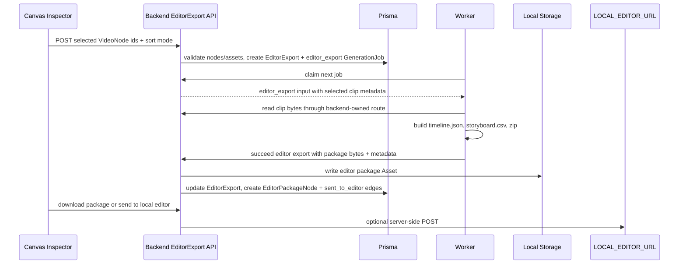

# feat: Add editor export package workflow

## Summary

Implement Phase 11 by extending the existing GenerationJob, worker, storage, canvas, and Inspector patterns to turn selected VideoNodes into a durable editor export package. The backend will validate selected VideoNodes and own persistence/graph side effects, while the worker will build the zip package and report completion through server-owned APIs.

---

## Problem Frame

The project can already generate VideoNodes, but the MVP needs those clips to leave the canvas as an editor-ready artifact. Export must remain canvas-first and mock-first: the package should be traceable as an EditorPackageNode, downloadable without external services, and optionally sendable to a local editor without making local editor availability part of package success.

---

## Assumptions

*This plan was authored without synchronous user confirmation. The items below are agent inferences that fill gaps in the input - un-validated bets that should be reviewed before implementation proceeds.*

- The first package format is a zip with stored clips, `timeline.json`, and `storyboard.csv`; no audio/subtitle folders are required for Phase 11.
- Manual ordering uses the selected-node id order supplied by the frontend until Phase 12 or later adds a timeline reorder UI.
- Local editor send state can be stored in existing JSON fields or returned through the API without adding a broad editor integration table.

---

## Requirements

- R1. Export starts from an explicit multi-selection of project VideoNodes.
- R2. Backend validation rejects missing, cross-project, non-video, or assetless selections.
- R3. Sort modes `shot_index`, `canvas_x`, and `manual` produce deterministic clip order.
- R4. Export creates a durable `editor_export` GenerationJob and EditorExport record with retryable input.
- R5. Worker packaging produces a zip containing `timeline.json`, `storyboard.csv`, and `clips/`.
- R6. Timeline and CSV artifacts preserve project, source node, asset, duration, and order metadata.
- R7. Package zip is persisted as a project Asset with purpose `editor_package`.
- R8. Succeeded export creates an EditorPackageNode and `sent_to_editor` edges from selected VideoNodes.
- R9. API/UI expose queued, running, succeeded, failed, and download/send states.
- R10. `LOCAL_EDITOR_URL` remains server-side, and local editor POST failure does not invalidate a completed package.
- R11. Retry of failed export is append-only and preserves original selected node ids and sort settings.

**Origin actors:** A1 Creator, A2 Backend, A3 Worker, A4 Local editor bridge
**Origin flows:** F1 Selected VideoNode export, F2 Package download and graph trace, F3 Local editor send, F4 Failed export recovery
**Origin acceptance examples:** AE1 three-VideoNode export, AE2 deterministic order, AE3 zip structure, AE4 local editor send success, AE5 send failure keeps download, AE6 invalid asset failure and retry

---

## Scope Boundaries

- In scope: editor export contracts, backend EditorExport API, worker package building, package Asset persistence, EditorPackageNode graph side effects, local editor POST, frontend multi-select export controls, docs, tests, and smoke evidence.
- Out of scope: timeline editing UI, real desktop editor plugin protocols, cloud editor uploads, audio/subtitle generation, permissioned package sharing, iframe `postMessage`, and Phase 12 canvas productivity features.

### Deferred to Follow-Up Work

- Dedicated manual timeline reorder UI can replace selected-node order later.
- Cloud editor or desktop plugin integrations can build on the completed package contract.
- Audio, subtitles, and image sidecar folders can be added when those source assets exist in the product flow.

---

## Context & Research

### Relevant Code and Patterns

- `packages/shared-types/src/domain/generation.ts` already includes `editor_export` in `GENERATION_OPERATIONS` but `CreateGenerationJobInput` and worker handling currently target Phase 8 media operations.
- `packages/shared-types/src/domain/canvas.ts` already includes `editor_package` nodes and `sent_to_editor` edges.
- `apps/backend/prisma/schema.prisma` already defines `EditorExport`, `EditorExportStatus`, and `AssetPurpose.editor_package`.
- `apps/backend/src/generation/generation.service.ts` owns job creation, claim, fail, retry, completion side effects, queue summaries, and status transitions for generated media.
- `apps/backend/src/assets/assets.service.ts` and `apps/backend/src/storage/local-storage.service.ts` own project storage and previewable Asset records.
- `apps/worker/src/generation-runner.ts`, `apps/worker/src/generation-executors.ts`, and `apps/worker/src/generation-client.ts` form the worker claim, execute, and report loop.
- `apps/frontend/src/components/canvas/canvas-inspector.tsx` already routes multi-selection into batch generation controls.
- `apps/frontend/src/components/canvas/generation-actions.tsx` already contains compact generation controls, queue status, retry, cancel, and batch ImageNode actions.

### Institutional Learnings

- `docs/solutions/architecture-patterns/generation-worker-backend-side-effects-2026-06-12.md`: backend owns durable job lifecycle and canvas graph side effects; worker reports provider/package outputs.
- `docs/solutions/architecture-patterns/generation-worker-backend-side-effects-2026-06-12.md`: long-running work should stay in `GenerationJob` state rather than browser-only progress.
- `docs/solutions/architecture-patterns/project-scoped-asset-lifecycle-boundary-2026-06-12.md`: browser should not own storage paths or durable media writes.
- `docs/solutions/architecture-patterns/real-video-provider-async-task-lifecycle-2026-06-12.md`: visible failure and retry state matter for long-running media workflows.

### External References

- No new external product contract is needed for Phase 11. Local code and the PRD define the package format. If implementation adds a zip dependency, use the dependency's current documentation while coding and keep package assembly behind a small worker utility with tests.

---

## Key Technical Decisions

- Add editor export contracts in shared types rather than overloading image/video generation inputs. This keeps `editor_export` retry, worker execution, and frontend API calls typed without weakening Phase 8 media inputs.
- Introduce an EditorExport backend module instead of expanding generic GenerationController routes. The PRD names `/editor-exports`, and export has package download/send concerns that are not ordinary generation job actions.
- Keep worker packaging output as bytes plus structured metadata. The backend should persist the zip Asset, update EditorExport, and create EditorPackageNode/edges in one server-owned completion path.
- Treat local editor send as post-completion delivery. The package job succeeds when the zip and graph trace are durable; local editor POST success/failure is surfaced separately.
- Place the EditorPackageNode near the selected VideoNodes using deterministic bounding-box placement. This keeps the package visible and avoids depending on tldraw viewport state in the backend.

---

## Open Questions

### Resolved During Planning

- Should Phase 11 require a running local editor for export success? No. The zip download is the primary MVP handoff and local POST is optional.
- Should packaging happen in the browser? No. Clip bytes, storage paths, and local editor URL remain server-side.
- Should export create one opaque download only? No. Canvas-first traceability requires an EditorPackageNode and `sent_to_editor` edges.

### Deferred to Implementation

- Exact zip library choice: pick a small, testable library or utility during implementation and document why it was chosen.
- Exact timeline duration fallback: use video Asset duration metadata when present; otherwise derive from VideoNode or a safe default and record the fallback in timeline metadata.
- Exact local editor response shape: accept a small set of common response shapes such as `{ url }`, `{ editorUrl }`, or plain acknowledgement while keeping failures readable.

---

## High-Level Technical Design

> *This illustrates the intended approach and is directional guidance for review, not implementation specification. The implementing agent should treat it as context, not code to reproduce.*

---

## Implementation Units

- U1. **Shared editor export contracts**

**Goal:** Add typed contracts for editor export creation, sort modes, timeline manifest, storyboard CSV metadata, package outputs, and local editor send results.

**Requirements:** R1, R3, R4, R5, R6, R9, R10, R11

**Dependencies:** None

**Files:**
- Modify: `packages/shared-types/src/domain/generation.ts`
- Modify: `packages/shared-types/src/domain/canvas.ts`
- Modify: `packages/shared-types/src/domain/assets.ts`
- Modify: `packages/shared-types/src/domain/domain.test.ts`
- Modify: `packages/shared-types/src/index.ts`
- Modify: `packages/provider-contracts/src/contracts.ts`
- Modify: `packages/provider-contracts/src/mock-providers.ts`
- Modify: `packages/provider-contracts/src/mock-providers.test.ts`
- Test: `packages/shared-types/src/domain/domain.test.ts`
- Test: `packages/provider-contracts/src/mock-providers.test.ts`

**Approach:**
- Define `EditorExportSortMode`, create/list/detail/download/send result contracts, `EditorExportJobInput`, `EditorExportJobOutput`, and `TimelineManifest` shapes.
- Extend EditorPackageNode data with export id, package asset id, selected video node ids, sort mode, status, and local editor handoff fields.
- Extend provider contracts only where the existing mock editor provider needs to carry timeline/package metadata for tests.

**Execution note:** Implement new domain behavior test-first.

**Patterns to follow:**
- Existing image/video provider catalog and job input tests in `packages/shared-types/src/domain/domain.test.ts`.
- Existing mock provider contract style in `packages/provider-contracts/src/mock-providers.ts`.

**Test scenarios:**
- Happy path: three selected VideoNode ids plus `shot_index` sort mode form a JSON-compatible editor export input.
- Happy path: a timeline manifest with three clips preserves source node ids, asset ids, durations, and filenames.
- Happy path: local editor send result can represent success with an open URL and failure with a message.
- Edge case: manual sort preserves caller-supplied selected id order.

**Verification:**
- Shared/provider packages compile and domain tests cover export input, manifest, package output, and local send shapes.

---

- U2. **Backend EditorExport API and validation**

**Goal:** Add project-scoped EditorExport routes that create export jobs, list/read export records, download packages, and send completed packages to `LOCAL_EDITOR_URL`.

**Requirements:** R1, R2, R3, R4, R9, R10, R11

**Dependencies:** U1

**Files:**
- Create: `apps/backend/src/editor-exports/editor-exports.module.ts`
- Create: `apps/backend/src/editor-exports/editor-exports.controller.ts`
- Create: `apps/backend/src/editor-exports/editor-exports.service.ts`
- Create: `apps/backend/src/editor-exports/dto.ts`
- Create: `apps/backend/src/editor-exports/editor-exports.service.spec.ts`
- Modify: `apps/backend/src/app.module.ts`
- Modify: `apps/backend/src/config/app-config.ts`
- Modify: `apps/backend/src/health/health.controller.ts`
- Modify: `apps/backend/src/health/health.controller.spec.ts`
- Modify: `apps/backend/.env.example`
- Test: `apps/backend/src/editor-exports/editor-exports.service.spec.ts`
- Test: `apps/backend/src/health/health.controller.spec.ts`

**Approach:**
- Add PRD routes under `projects/:projectId/editor-exports`.
- On create, validate selected nodes are project-scoped VideoNodes with video Asset ids, compute deterministic order metadata, create an EditorExport row, and create an `editor_export` GenerationJob.
- Add list/get endpoints that return package/download/send state without exposing storage internals.
- Add download endpoint that streams the package Asset bytes through backend storage after completion.
- Add send endpoint that POSTs server-side metadata to `LOCAL_EDITOR_URL` only after package success and records/returns the handoff result.

**Execution note:** Start with backend service tests for validation, job creation, download gating, and local send failure behavior.

**Patterns to follow:**
- `apps/backend/src/generation/generation.service.ts` for durable job creation and retry posture.
- `apps/backend/src/assets/assets.controller.ts` and `apps/backend/src/assets/assets.service.ts` for backend-owned download/preview boundaries.
- `apps/backend/src/providers/providers.service.ts` for server-side config and safe metadata.

**Test scenarios:**
- Covers AE1. Happy path: three valid VideoNodes create one EditorExport and one queued `editor_export` job with selected node metadata.
- Covers AE2. Happy path: `shot_index` and `canvas_x` sorting produce deterministic order.
- Error path: non-video, cross-project, missing node, and missing asset selections are rejected before job creation.
- Error path: download before package success is rejected with a readable error.
- Covers AE4 and AE5. Integration: configured local editor receives a server-side POST; missing/failing local editor returns a handoff failure without changing package success.

**Verification:**
- Backend tests prove route/service behavior, and health/config exposes local editor configured state without the raw URL unless already public-safe.

---

- U3. **Worker editor package builder**

**Goal:** Teach the worker to claim `editor_export` jobs, fetch or read clip bytes through backend-owned boundaries, build timeline/storyboard artifacts, zip them with clips, and report package completion.

**Requirements:** R4, R5, R6, R7, R9

**Dependencies:** U1, U2

**Files:**
- Create: `apps/worker/src/editor-export-package.ts`
- Create: `apps/worker/src/editor-export-package.test.ts`
- Modify: `apps/worker/src/generation-client.ts`
- Modify: `apps/worker/src/generation-client.test.ts`
- Modify: `apps/worker/src/generation-executors.ts`
- Modify: `apps/worker/src/generation-runner.ts`
- Modify: `apps/worker/src/generation-runner.test.ts`
- Modify: `apps/worker/package.json`
- Modify: `pnpm-lock.yaml`
- Test: `apps/worker/src/editor-export-package.test.ts`
- Test: `apps/worker/src/generation-runner.test.ts`

**Approach:**
- Extend worker job typing so `editor_export` jobs route to a package executor instead of image/video providers.
- Add a package utility that creates `timeline.json`, `storyboard.csv`, and `clips/<ordered-filename>` entries.
- Prefer fetching clip bytes from backend worker-safe routes or signed internal preview URLs over reading browser-visible storage paths.
- Report a package output containing zip bytes, manifest JSON, storyboard CSV, selected VideoNode ids, and ordered clip metadata.

**Execution note:** Implement package builder tests before wiring the runner.

**Patterns to follow:**
- `apps/worker/src/generation-executors.ts` for operation-specific execution dispatch.
- `apps/worker/src/generation-runner.test.ts` for one-shot claim/succeed/fail coverage.

**Test scenarios:**
- Covers AE3. Happy path: three clips produce a zip with `timeline.json`, `storyboard.csv`, and three `clips/shot_###` files.
- Happy path: manual order preserves selected id order.
- Edge case: missing duration uses a documented fallback and records metadata.
- Error path: a failed clip fetch or invalid job input reports a provider-style failure to the backend.

**Verification:**
- Worker tests prove package structure and runner routing without requiring a real backend server.

---

- U4. **Backend export completion side effects**

**Goal:** Add worker completion handling for editor exports so package bytes become an Asset, EditorExport is updated, and canvas graph trace is created atomically.

**Requirements:** R7, R8, R9, R10, R11

**Dependencies:** U1, U2, U3

**Files:**
- Modify: `apps/backend/src/generation/generation.service.ts`
- Modify: `apps/backend/src/generation/worker-generation.controller.ts`
- Modify: `apps/backend/src/generation/dto.ts`
- Modify: `apps/backend/src/generation/generation.service.spec.ts`
- Modify: `apps/backend/src/assets/assets.service.ts`
- Modify: `apps/backend/src/assets/assets.service.spec.ts`
- Modify: `apps/backend/src/canvas/canvas.service.ts`
- Modify: `apps/backend/src/canvas/canvas.service.spec.ts`
- Test: `apps/backend/src/generation/generation.service.spec.ts`
- Test: `apps/backend/src/canvas/canvas.service.spec.ts`
- Test: `apps/backend/src/assets/assets.service.spec.ts`

**Approach:**
- Extend worker succeed DTOs to accept editor export package output separately from generated media output.
- Add an Asset service method for package bytes with `AssetType.package`, `AssetPurpose.editor_package`, and `application/zip`.
- Update the matching EditorExport row to succeeded with package asset id, timeline JSON, and storyboard CSV.
- Create an EditorPackageNode near the selected VideoNodes and create `sent_to_editor` edges from each selected VideoNode.
- Ensure failure updates EditorExport and GenerationJob consistently and retry preserves original input.

**Execution note:** Use integration-style service tests with real in-memory Prisma mocks before frontend wiring.

**Patterns to follow:**
- Generated media completion transaction in `apps/backend/src/generation/generation.service.ts`.
- Business node and edge creation semantics in `apps/backend/src/canvas/canvas.service.ts`.

**Test scenarios:**
- Covers AE1. Integration: successful editor export completion writes package Asset, updates EditorExport, creates package node, and creates three edges.
- Covers AE6. Error path: invalid package output fails the job/export without presenting a package.
- Edge case: completing a cancelled or already failed export is rejected.
- Integration: retry of failed `editor_export` creates a new queued job with original selected nodes and sort mode.

**Verification:**
- Backend generation/canvas/assets tests prove package persistence and graph trace.

---

- U5. **Frontend multi-select export UI**

**Goal:** Add a compact multi-selection export panel that collects selected VideoNodes, lets creators choose sort mode, queues export, shows status, and exposes download/send actions.

**Requirements:** R1, R3, R9, R10

**Dependencies:** U1, U2, U4

**Files:**
- Create: `apps/frontend/src/components/canvas/editor-export-actions.tsx`
- Create: `apps/frontend/src/components/canvas/editor-export-actions.test.tsx`
- Modify: `apps/frontend/src/components/canvas/canvas-inspector.tsx`
- Modify: `apps/frontend/src/components/canvas/canvas-inspector.test.tsx`
- Modify: `apps/frontend/src/lib/api.ts`
- Modify: `apps/frontend/src/lib/api.test.ts`
- Modify: `apps/frontend/src/app/globals.css`
- Test: `apps/frontend/src/components/canvas/editor-export-actions.test.tsx`
- Test: `apps/frontend/src/components/canvas/canvas-inspector.test.tsx`
- Test: `apps/frontend/src/lib/api.test.ts`

**Approach:**
- Identify selected VideoNodes with usable `assetId` values, mirroring existing ImageNode batch filtering.
- Render export controls only for multi-selection with eligible VideoNodes.
- Add sort mode controls for `shot_index`, `canvas_x`, and `manual`, plus create/download/send actions.
- Poll existing job/export state through the workbench refresh hooks and surface failures without hiding the Asset Library or generation controls.

**Patterns to follow:**
- `apps/frontend/src/components/canvas/generation-actions.tsx` for compact controls, status messages, and multi-selection action shape.
- `apps/frontend/src/lib/api.ts` request helpers.

**Test scenarios:**
- Covers AE1. Happy path: selecting three VideoNodes shows export controls and calls create API with ids and sort mode.
- Covers AE5. Error path: send failure message is displayed while download remains available.
- Edge case: mixed selection with non-video nodes reports skipped/eligible counts and does not send invalid ids.
- UI state: buttons disable while busy and retain compact layout on narrow inspector width.

**Verification:**
- Frontend component/API tests pass and browser smoke can queue an export from multi-selection.

---

- U6. **Docs, smoke, review, and learning**

**Goal:** Document the Phase 11 workflow, run quality gates and smoke verification, complete code review, and capture durable learning.

**Requirements:** R1, R2, R3, R4, R5, R6, R7, R8, R9, R10, R11

**Dependencies:** U1, U2, U3, U4, U5

**Files:**
- Modify: `docs/development.md`
- Modify: `docs/plans/2026-06-13-012-feat-editor-export-package-plan.md`
- Create: `docs/solutions/architecture-patterns/editor-export-package-worker-boundary-2026-06-13.md`
- Test: relevant package, backend, worker, frontend tests touched by U1-U5

**Approach:**
- Update development docs with EditorExport routes, worker packaging, local editor env, zip smoke, and browser smoke.
- Record verification evidence in the plan before flipping status.
- Run headless/report-style review against this plan's diff and fix actionable findings.
- Add a solution note about the backend/worker/package boundary after the implementation is verified.

**Patterns to follow:**
- Phase 9 and Phase 10 verification sections in `docs/development.md`.
- Existing solution docs under `docs/solutions/architecture-patterns/`.

**Test scenarios:**
- Covers AE1-AE6. Manual/API smoke creates three VideoNodes or fixtures, exports zip, inspects package structure, verifies package node/edges, sends to local editor success fixture, and verifies send failure keeps download.
- Quality gate: targeted package/backend/worker/frontend tests plus root build/test/format where feasible.

**Verification:**
- Relevant tests pass, package smoke evidence is recorded, review has no blocking findings, and solution doc exists.

---

## System-Wide Impact

- **Interaction graph:** Export adds a new path from multi-selection UI to backend validation, GenerationJob queue, worker package execution, package Asset persistence, canvas node/edge side effects, and optional local editor HTTP.
- **Error propagation:** Validation errors fail before job creation; packaging errors fail GenerationJob and EditorExport; local editor send errors do not change package success.
- **State lifecycle risks:** Partial package writes must not appear as succeeded exports. Completion should group EditorExport, Asset, EditorPackageNode, and edge updates where possible.
- **API surface parity:** Public EditorExport APIs and worker completion APIs must agree on export input/output shapes from shared types.
- **Integration coverage:** Unit tests alone are not enough; at least one backend integration-style test must prove export completion creates package Asset plus graph trace.
- **Unchanged invariants:** Provider secrets and local editor URL stay server-side; generated VideoNodes and source Assets are not deleted by export failures.

---

## Risks & Dependencies

| Risk | Mitigation |
|------|------------|
| Zip package contains missing or mismatched clips | Validate selected VideoNode asset ids before queueing and test zip entries against manifest rows. |
| Worker cannot read clip bytes in production-like topology | Route clip reads through backend-owned internal APIs or explicit worker-safe boundaries instead of browser-local storage paths. |
| Export completion creates duplicate package nodes on retry | Treat retries as new export attempts with distinct EditorExport/job ids; preserve traceability rather than overwriting old attempts. |
| Local editor POST blocks or fails package completion | Keep send as post-completion route with timeout/error handling and separate handoff status. |
| Timeline metadata lacks true video duration | Use Asset metadata when present and record fallback duration source in the manifest. |

---

## Documentation / Operational Notes

- Add `LOCAL_EDITOR_URL` to backend env examples as optional and server-side only.
- Document that normal CI and local smoke can validate export without a local editor by inspecting the zip.
- Document a lightweight local editor receiver command or fixture only if implementation creates one for tests.

---

## Implementation Evidence

Completed on 2026-06-13.

- U1 shared contracts: added editor export inputs/results, timeline/package output contracts, package Asset MIME/type metadata, EditorPackageNode metadata, and mock editor provider payload support.
- U2 backend API: added `projects/:projectId/editor-exports` create/list/detail/download/send routes, project/node/asset validation, local editor handoff, and health/config reporting for local editor availability without exposing the URL.
- U3 worker packaging: routed `editor_export` jobs through the worker runner, fetched clip bytes through backend asset preview routes, generated `timeline.json` and `storyboard.csv`, and built a deterministic stored ZIP without adding a new dependency.
- U4 backend completion: extended worker success payloads, persisted package ZIP bytes as `editor_package` Assets, updated `EditorExport`, created `editor_package` canvas nodes, and added `sent_to_editor` edges from selected VideoNodes.
- U5 frontend UI: added compact Inspector export controls for multi-selected VideoNodes, sort-mode segmented controls, queued export action, download link, local editor send action, and send-failure display that keeps download visible.
- U6 docs/learning: updated development docs and added `docs/solutions/architecture-patterns/editor-export-package-worker-boundary-2026-06-13.md`.

Verification run:

- `pnpm --filter @guga-flow/shared-types build`
- `pnpm --filter @guga-flow/provider-contracts build`
- `pnpm --filter @guga-flow/shared-types test`
- `pnpm --filter @guga-flow/provider-contracts test`
- `pnpm --filter @guga-flow/backend test`
- `pnpm --filter @guga-flow/backend lint`
- `pnpm --filter @guga-flow/worker test`
- `pnpm --filter @guga-flow/worker lint`
- `pnpm --filter @guga-flow/frontend test`
- `pnpm --filter @guga-flow/frontend lint`

All commands passed with the local Node engine warning because the shell is running Node v22.22.2 while the repo targets Node >=26.3.0.

---

## Sources & References

- Origin requirements: [docs/brainstorms/2026-06-13-012-phase-11-editor-export-requirements.md](../brainstorms/2026-06-13-012-phase-11-editor-export-requirements.md)
- PRD roadmap: [infinite_canvas_video_prd_roadmap_v2_detailed.md](../../infinite_canvas_video_prd_roadmap_v2_detailed.md)
- Development flow: [docs/infinite-canvas-video-long-task-development-flow.md](../infinite-canvas-video-long-task-development-flow.md)
- Tech stack reference: [docs/tech-stack-text2sql-reference.md](../tech-stack-text2sql-reference.md)
- Generation worker learning: [docs/solutions/architecture-patterns/generation-worker-backend-side-effects-2026-06-12.md](../solutions/architecture-patterns/generation-worker-backend-side-effects-2026-06-12.md)
- Asset lifecycle learning: [docs/solutions/architecture-patterns/project-scoped-asset-lifecycle-boundary-2026-06-12.md](../solutions/architecture-patterns/project-scoped-asset-lifecycle-boundary-2026-06-12.md)
