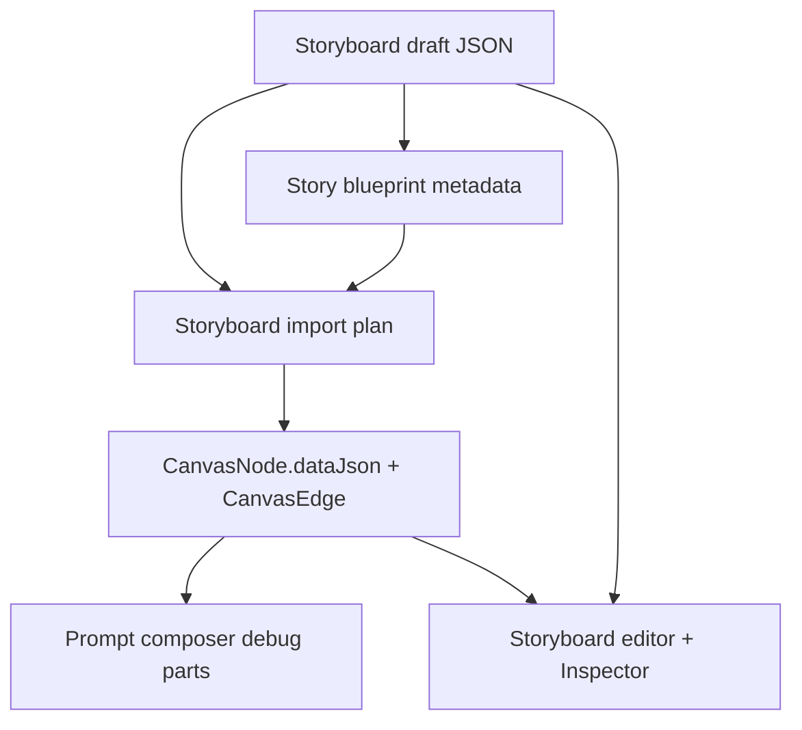
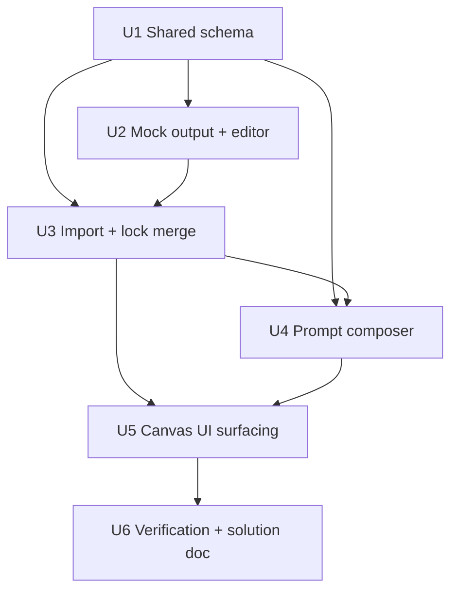

# feat: Add story blueprint and character lifecycle context

## Summary

Implement Phase 14 by extending the existing storyboard, import, and prompt-composer pipeline with optional story blueprint metadata and character lifecycle stages. The plan keeps EventGraph as draft/import metadata for this slice, preserves reusable character locks during import, and makes prompt previews include event and lifecycle context when present.

---

## Problem Frame

The current storyboard flow can import scenes, shots, characters, and locations, but longer story work still lacks event traceability and character-stage continuity. Phase 14 needs to make those facts durable without destabilizing the short-story MVP path.

---

## Assumptions

*This plan was authored without synchronous user confirmation. The items below are agent inferences that fill gaps in the input -- un-validated bets that should be reviewed before implementation proceeds.*

- Blueprint, event, relationship, and lifecycle data should remain optional so existing Phase 5-13 storyboards continue validating and importing unchanged.
- A dedicated EventGraph table is deferred; imported nodes can carry event/stage trace in `dataJson` for this phase.
- Character lock behavior can be enforced at reusable asset-node import time before broader asset/version management exists.
- Prompt composer debug output should add explicit story/lifecycle parts rather than hiding all context inside generic shot text.

---

## Requirements

- R1. Storyboard drafts may include a story blueprint with world summary, timeline events, and character relationship facts.
- R2. Timeline events must be stable enough for scenes and shots to reference by id within the same storyboard draft.
- R3. Validation must fail for unknown event ids, unknown character lifecycle stage ids, or unknown relationship participants.
- R4. Imported Scene and Shot nodes must preserve story-event trace information.
- R5. Character drafts and imported Character nodes must support lifecycle stages for age, appearance, wardrobe/costume, emotional state, and stage-specific identity prompt text.
- R6. Locked creator-edited character identity fields must not be overwritten by later generated/imported storyboard data for the same reusable character.
- R7. Storyboard editing must expose lifecycle and lock-relevant fields enough for inspection and adjustment before import.
- R8. Imported Shot nodes must record event and character-stage dependencies while existing semantic edges remain the durable relationship graph.
- R9. Prompt preview and generation job inputs must include story event and lifecycle context in debug/source parts when present.
- R10. Existing storyboard generation and import flows must continue working when no blueprint metadata is present.

**Origin actors:** A1 Creator, A2 Mock LLM/generation service, A3 Canvas workspace, A4 Prompt composer
**Origin flows:** F1 generate blueprint-backed storyboard, F2 import blueprint trace to canvas, F3 compose prompts with lifecycle context
**Origin acceptance examples:** AE1, AE2, AE3, AE4

---

## Scope Boundaries

- No full screenplay/version management workbench or script export surface.
- No chat-based Agent runtime, memory system, or skill editor.
- No full automatic 100k-word novel-to-finished-video pipeline.
- No real LLM provider-specific parsing requirement; mock-first output is sufficient.
- No replacement of storyboard import layout, semantic edge projection, or backend prompt-composer ownership.

### Deferred to Follow-Up Work

- A dedicated EventGraph/StoryEvent persistence model can follow when long-novel chapter import needs queryable events across drafts.
- Full TF-15 script versioning and screenplay export should be planned separately.
- Rich character-stage authoring controls, diff review, and lifecycle history can follow after the MVP stage data proves useful.

---

## Context & Research

### Relevant Code and Patterns

- `packages/shared-types/src/domain/storyboard.ts` owns storyboard draft schemas, validation, and backward-compatible parsing.
- `packages/provider-contracts/src/mock-providers.ts` is the deterministic mock LLM output source for storyboard generation.
- `packages/shared-types/src/domain/storyboard-import.ts` maps storyboard drafts to `CanvasNode` and `CanvasEdge` import plans with provenance.
- `apps/backend/src/canvas/canvas.service.ts` owns canvas import transactions, reusable Character/Location asset matching, and semantic edge application.
- `packages/shared-types/src/domain/prompt-composer.ts` is the pure prompt-composition core used by backend prompt preview and generation job creation.
- `apps/frontend/src/components/novels/storyboard-editor.tsx` and `storyboard-data.ts` own storyboard preview/edit UI helpers.
- `apps/frontend/src/components/canvas/business-node-data.ts` and `business-node-inspector-sections.tsx` control canvas card summaries and Inspector fields.

### Institutional Learnings

- `docs/solutions/architecture-patterns/storyboard-draft-validation-import-boundary-2026-06-12.md`: validate storyboard drafts before persistence/import, and keep canvas creation out of draft persistence.
- `docs/solutions/architecture-patterns/storyboard-import-layout-provenance-2026-06-12.md`: import should attach provenance and durable business facts to normalized graph records.
- `docs/solutions/architecture-patterns/prompt-composer-graph-derived-debug-parts-2026-06-12.md`: prompt preview is backend-owned runtime output derived from the graph, not browser-composed text.
- `docs/solutions/architecture-patterns/canvas-productivity-local-state-boundary-2026-06-13.md`: durable production intent belongs in normalized graph facts, not tldraw session state.

### Reference Research

- `infinite_canvas_video_prd_roadmap_v2_detailed.md` defines EventGraph as the path for long-form chapter/event trace and requires character lock behavior for automatic re-parsing.
- `docs/infinite-canvas-video-long-task-development-flow.md` maps Phase 14 to XQ-02/XQ-03 plus TF-14/TF-15, with completion defined by shot-to-blueprint/event/stage traceability.
- `docs/research/video-ref/repomix/toonflow-app-focused-agent.xml` shows Toonflow-style chapter event extraction fields: chapter, characters, core event, mainline relevance, information density, estimated duration, and emotion intensity.

---

## Key Technical Decisions

- Keep Phase 14 data optional and storyboard-local: this preserves existing short-form storyboard compatibility while enabling blueprint-backed drafts and imports.
- Reuse `CanvasNode.dataJson` for imported event/stage trace: it keeps story context canvas-first and avoids a premature query model before chapter workflows need it.
- Merge reusable Character asset nodes during import with lock-aware preservation: this is the narrowest place to enforce creator authority over generated character updates.
- Add story/lifecycle prompt debug parts: reviewers and creators can see why a prompt changed without reverse-engineering raw shot text.
- Treat UI editing as inspect-and-adjust, not a full authoring studio: this satisfies Phase 14 traceability while leaving rich script workbench features to TF-15.

---

## Open Questions

### Resolved During Planning

- Should Phase 14 add a dedicated EventGraph table?: No for this slice. The PRD allows EventGraph after MVP, but current acceptance can be met by draft/import metadata and prompt debug output.
- Should blueprint context create new canvas node types?: No. Existing Novel, Scene, Shot, and Character nodes can carry trace fields; new node types would expand layout, shapes, and Inspector scope unnecessarily.
- Should prompt composer infer character stage from shot order when no explicit stage reference exists?: No. Use explicit stage references when present; otherwise fall back to the existing character identity fields.

### Deferred to Implementation

- Exact field names and optional defaults may adjust while modifying shared schemas, as long as requirements remain traceable and old storyboards remain valid.
- Final UI density may adjust after browser smoke if the existing Novel/Storyboard panel becomes too crowded.

---

## High-Level Technical Design

> *This illustrates the intended approach and is directional guidance for review, not implementation specification. The implementing agent should treat it as context, not code to reproduce.*

---

## Implementation Units

- U1. **Shared blueprint and lifecycle contracts**

**Goal:** Extend shared storyboard and canvas-domain types with optional story blueprint, event references, relationship facts, character lifecycle stages, and lock metadata.

**Requirements:** R1, R2, R3, R5, R8, R10; Covers AE1

**Dependencies:** None

**Files:**
- Modify: `packages/shared-types/src/domain/storyboard.ts`
- Modify: `packages/shared-types/src/domain/canvas.ts`
- Modify: `packages/shared-types/src/domain/domain.test.ts`

**Approach:**
- Add optional storyboard blueprint metadata that can describe world context, timeline events, and character relationships.
- Add optional lifecycle stages to character drafts and character canvas data.
- Add optional scene/shot event references and shot character-stage references.
- Extend validation to reject unknown event references, unknown relationship participants, and stage references that point to a character or stage not present in the draft.
- Keep all new fields optional so legacy storyboards still parse and validate.

**Execution note:** Implement the shared validation tests first; downstream units depend on these contracts.

**Patterns to follow:**
- Optional storyboard schema extension style in `packages/shared-types/src/domain/storyboard.ts`.
- Import-facing `CanvasNodeData` interfaces in `packages/shared-types/src/domain/canvas.ts`.

**Test scenarios:**
- Happy path: a storyboard with blueprint events, a relationship, lifecycle stages, and shot stage references validates successfully.
- Edge case: a legacy storyboard without blueprint metadata remains valid.
- Error path: a shot referencing a missing event id fails validation.
- Error path: a relationship with an unknown character temp id fails validation.
- Error path: a shot stage reference with an unknown character or unknown stage id fails validation.

**Verification:**
- Shared domain tests prove both backward compatibility and new reference validation.

---

- U2. **Mock storyboard output and storyboard editor surfacing**

**Goal:** Make mock generation produce deterministic blueprint/lifecycle metadata and expose the new data in storyboard preview/edit helpers.

**Requirements:** R1, R5, R7, R10; Covers F1 / AE3

**Dependencies:** U1

**Files:**
- Modify: `packages/provider-contracts/src/mock-providers.ts`
- Modify: `packages/provider-contracts/src/mock-providers.test.ts`
- Modify: `apps/frontend/src/components/novels/storyboard-data.ts`
- Modify: `apps/frontend/src/components/novels/storyboard-data.test.ts`
- Modify: `apps/frontend/src/components/novels/storyboard-editor.tsx`
- Modify: `apps/frontend/src/components/novels/storyboard-editor.test.tsx`
- Modify: `apps/frontend/src/app/globals.css`

**Approach:**
- Extend mock LLM storyboard output with a small world summary, two timeline events, one character relationship, and per-character lifecycle stages.
- Include event and stage references on mock scenes/shots so import and prompt tests have realistic data.
- Add summary helpers for blueprint/event/stage counts.
- Add compact storyboard editor sections that let creators inspect blueprint facts and edit generated lifecycle stage text enough to correct age, wardrobe, appearance, emotion, and stage prompt fields before import.
- Avoid adding full event authoring or relationship graph editing in this phase.

**Patterns to follow:**
- Existing storyboard editor grouped sections and patch helpers in `storyboard-data.ts`.
- Mock provider deterministic fixtures in `packages/provider-contracts/src/mock-providers.ts`.

**Test scenarios:**
- Happy path: mock provider output validates and includes blueprint event and lifecycle metadata.
- Happy path: storyboard summary reports event and lifecycle counts.
- Happy path: editor markup exposes story blueprint and lifecycle stage controls.
- Edge case: storyboard editor still renders old drafts that have no blueprint metadata.

**Verification:**
- Provider-contracts and frontend storyboard tests pass with deterministic mock data.

---

- U3. **Canvas import trace and lock-aware reusable characters**

**Goal:** Preserve event/stage trace on imported nodes and prevent generated imports from overwriting locked reusable Character node identity fields.

**Requirements:** R4, R5, R6, R8, R10; Covers F2 / AE2 / AE4

**Dependencies:** U1, U2

**Files:**
- Modify: `packages/shared-types/src/domain/storyboard-import.ts`
- Modify: `packages/shared-types/src/domain/domain.test.ts`
- Modify: `apps/backend/src/canvas/canvas.service.ts`
- Modify: `apps/backend/src/canvas/canvas.service.spec.ts`

**Approach:**
- Add blueprint summary to imported Novel node data where available.
- Add event summaries/source trace to imported Scene and Shot node data.
- Add lifecycle stages, active stage hints, and lock metadata to imported Character node data.
- Add shot-level character stage references without replacing existing character/location semantic edges.
- When an imported character matches an existing reusable Character node, merge non-locked metadata while preserving any locked identity fields.
- Treat a broad `locked` flag as preserving core identity fields, and a narrower locked-field list as preserving only named identity fields.

**Patterns to follow:**
- Existing `storyboardImport` provenance in import plan data.
- Existing asset-key reuse in `CanvasService.findReusableAssetNode`.
- Existing semantic edge application in `applyCharacterToShot` and `applyLocationToShot`.

**Test scenarios:**
- Happy path: imported Shot node includes event trace and character stage references.
- Happy path: imported Character node includes lifecycle stage data.
- Integration: storyboard import still creates normal scene, shot, character, location, and semantic edge records.
- Edge case: legacy storyboard import without blueprint metadata creates the same node/edge shape as before.
- Error path: locked reusable Character keeps edited appearance/identity prompt when a later import tries to reuse it.

**Verification:**
- Shared import-plan tests and backend canvas service tests prove trace preservation and lock-aware reuse.

---

- U4. **Prompt composer story and lifecycle debug parts**

**Goal:** Include story event and character lifecycle stage context in prompt composition and job inputs when the graph has that data.

**Requirements:** R5, R8, R9, R10; Covers F3 / AE3

**Dependencies:** U1, U3

**Files:**
- Modify: `packages/shared-types/src/domain/prompt-composer.ts`
- Modify: `packages/shared-types/src/domain/domain.test.ts`
- Modify: `apps/frontend/src/components/canvas/prompt-preview-data.ts`
- Modify: `apps/frontend/src/components/canvas/prompt-preview-data.test.ts`

**Approach:**
- Add prompt debug support for story event context and character lifecycle context.
- Resolve a character stage only when the Shot node explicitly references a stage for a linked character.
- Use stage-specific identity/appearance/wardrobe/emotional fields when present, while falling back to the existing Character node prompt fields when absent.
- Surface the new parts in prompt preview data without changing the backend prompt API contract shape.

**Patterns to follow:**
- Existing scene/location/character/shot debug part construction in `prompt-composer.ts`.
- Existing prompt preview view-model formatting in `prompt-preview-data.ts`.

**Test scenarios:**
- Happy path: a Shot with event trace and character stage references produces story-event and lifecycle debug parts.
- Happy path: stage-specific identity prompt appears in the composed prompt instead of only the base Character identity when explicitly referenced.
- Edge case: a Shot without event/stage metadata composes exactly from existing scene/character/location/shot fields.
- Edge case: a stage reference for an unlinked character is reported as missing context rather than silently changing prompts.
- Integration: generation job creation continues storing the composed prompt/debug parts through existing generation service tests.

**Verification:**
- Shared prompt-composer and frontend prompt-preview tests prove the new debug parts and fallback behavior.

---

- U5. **Canvas Inspector and card surfacing**

**Goal:** Make imported event and lifecycle context visible in the canvas workspace without adding new node types or a separate workbench.

**Requirements:** R4, R5, R7, R8, R9; Covers AE2 / AE3

**Dependencies:** U3, U4

**Files:**
- Modify: `apps/frontend/src/components/canvas/business-node-data.ts`
- Modify: `apps/frontend/src/components/canvas/business-node-card.test.tsx`
- Modify: `apps/frontend/src/components/canvas/business-node-inspector-sections.tsx`
- Modify: `apps/frontend/src/components/canvas/canvas-inspector.tsx`
- Modify: `apps/frontend/src/components/canvas/canvas-productivity-panel.test.tsx`
- Modify: `apps/frontend/src/app/globals.css`

**Approach:**
- Add concise card summaries for event-backed shots and lifecycle-backed characters.
- Add Inspector fields or read-only trace sections for event summary, source excerpt, character stage references, lifecycle stages, and lock fields.
- Keep editing simple and compatible with existing generic field-save behavior where possible.
- Avoid adding a new left-tab or rich graph visualization in this phase.

**Patterns to follow:**
- Existing business node summary/detail helpers.
- Existing Inspector selected-node sections and prompt preview placement.

**Test scenarios:**
- Happy path: Shot card/Inspector exposes event trace summary after import.
- Happy path: Character card/Inspector exposes lifecycle stage count or stage details.
- Edge case: nodes without blueprint metadata keep existing card summaries and Inspector fields.
- UI regression: long event summaries and lifecycle text are truncated or placed in scrollable panel content, not overflowing buttons/toolbars.

**Verification:**
- Frontend component tests and browser smoke show blueprint/lifecycle context is visible after mock import.

---

- U6. **End-to-end verification and learning capture**

**Goal:** Prove Phase 14 works across mock generation, storyboard edit/validation, canvas import, prompt preview, and existing generation/export surfaces, then document the reusable pattern.

**Requirements:** R1-R10; Covers AE1-AE4

**Dependencies:** U1, U2, U3, U4, U5

**Files:**
- Create: `docs/solutions/architecture-patterns/story-blueprint-canvas-trace-boundary-2026-06-13.md`

**Approach:**
- Run targeted tests as each layer lands, then run root lint/test/build.
- Browser-smoke a project through creative/novel storyboard generation, canvas import, selecting a Shot, and prompt preview with event/lifecycle debug parts.
- Capture the pattern for keeping story planning data optional, draft-local, and projected into canvas/prompt context.

**Patterns to follow:**
- Recent Phase 13 solution doc structure in `docs/solutions/architecture-patterns/light-agent-entry-generation-job-boundary-2026-06-13.md`.
- Existing browser smoke approach from previous canvas phases.

**Test scenarios:**
- Integration: mock storyboard with blueprint imports to canvas and prompt preview shows lifecycle/event context.
- Regression: root test/build remain green for Phase 5-13 flows.
- Browser: no tldraw validation errors or obvious text overlap after importing a blueprint-backed storyboard.

**Verification:**
- Root `format:check`, `test`, and `build` pass.
- Browser smoke records a clean import/prompt-preview path.
- Solution document frontmatter validates with the Compound frontmatter script.

---

## System-Wide Impact

- **Interaction graph:** Mock LLM output, storyboard validation, canvas import, prompt preview, and generation job input composition all read the extended storyboard/canvas data.
- **Error propagation:** Broken event or stage references should fail draft validation before import; import merge failures should remain ordinary canvas import errors.
- **State lifecycle risks:** Reused Character nodes can already survive across imports; lock-aware merge must avoid silently overwriting creator edits while still allowing trace metadata to update.
- **API surface parity:** No new public endpoint is required; existing storyboard, canvas import, prompt compose, and generation job endpoints should continue accepting legacy inputs.
- **Integration coverage:** Unit tests must cover schema/import/prompt behavior, and browser smoke must prove the combined workflow in the canvas.
- **Unchanged invariants:** Provider keys stay server-side; tldraw remains a projection; `CanvasEdge` remains the semantic relationship source for character/location/scene links.

---

## Risks & Dependencies

| Risk | Mitigation |
|------|------------|
| Optional schema fields accidentally break existing storyboard fixtures | Keep new fields optional and add explicit legacy validation/import regression tests. |
| Character lock behavior becomes too broad or surprising | Support both broad `locked` preservation and a narrower locked-field list; document the first-phase semantics in tests. |
| Prompt composer becomes hard to debug with too many text parts | Add explicit story/lifecycle debug part kinds and keep fallback behavior unchanged when metadata is absent. |
| Storyboard editor becomes too dense | Keep blueprint/lifecycle controls compact and run browser smoke at desktop and narrow widths if layout looks risky. |

---

## Documentation / Operational Notes

- Add one solution document for the optional blueprint-to-canvas-trace pattern after verification.
- No database migration is planned for Phase 14.
- No environment variables or provider configuration changes are planned.

---

## Sources & References

- **Origin document:** [docs/brainstorms/2026-06-13-015-phase-14-story-blueprint-character-lifecycle-requirements.md](../brainstorms/2026-06-13-015-phase-14-story-blueprint-character-lifecycle-requirements.md)
- `infinite_canvas_video_prd_roadmap_v2_detailed.md`
- `docs/infinite-canvas-video-long-task-development-flow.md`
- `docs/solutions/architecture-patterns/storyboard-import-layout-provenance-2026-06-12.md`
- `docs/solutions/architecture-patterns/prompt-composer-graph-derived-debug-parts-2026-06-12.md`
