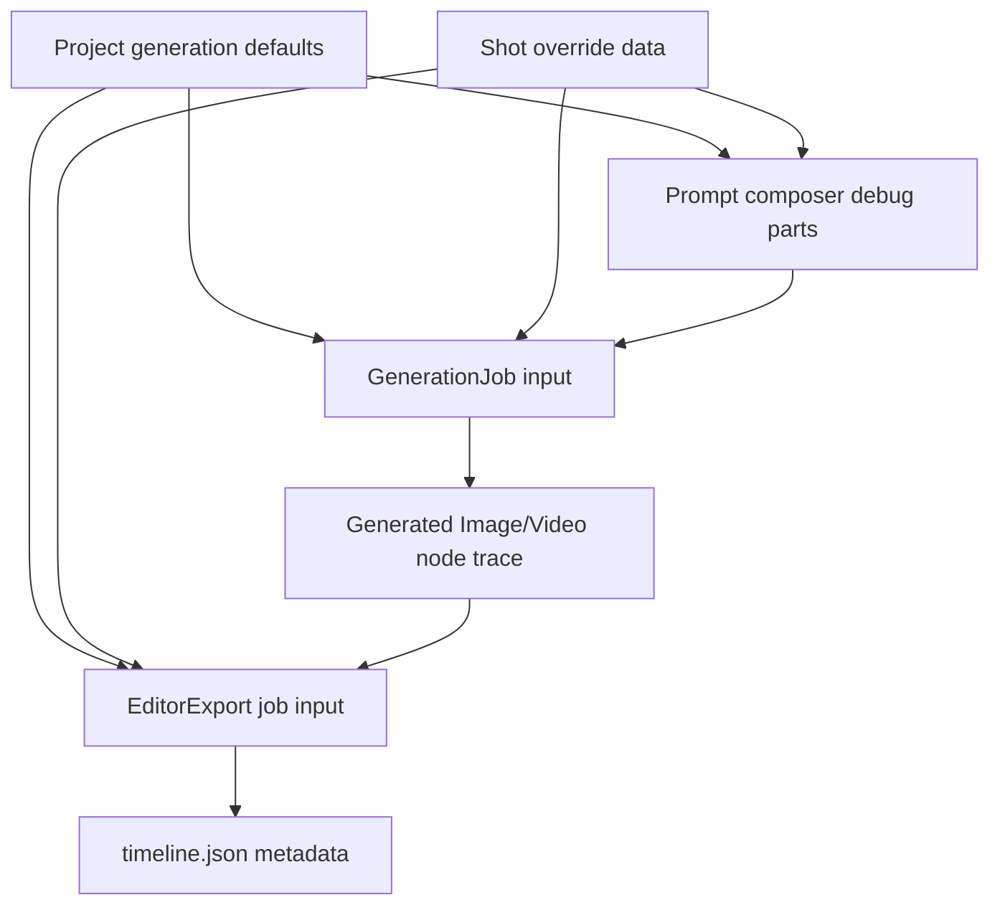
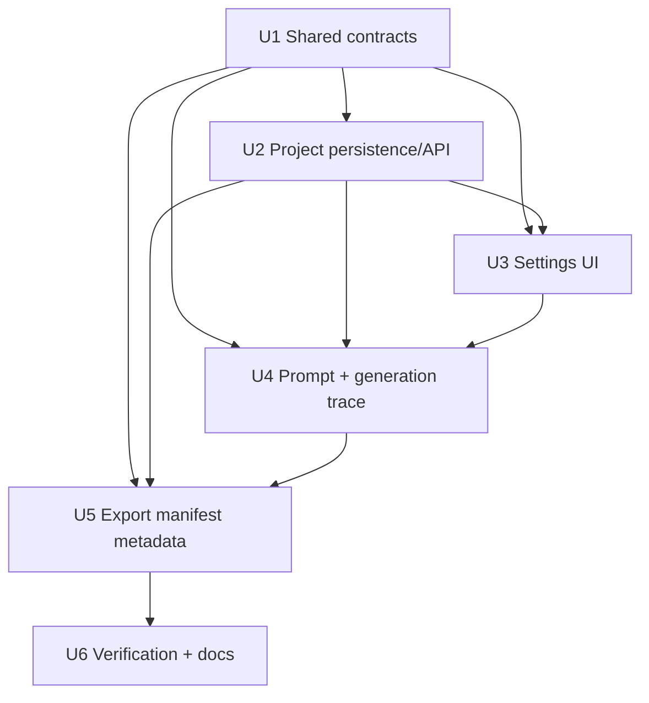

# feat: Add generation settings and export packaging metadata

## Summary

Implement Phase 15 by adding typed project defaults, Shot overrides, resolved generation-setting trace, and export packaging references across the existing Project, Canvas, prompt composer, GenerationJob, and EditorExport flows. The plan extends the current backend-owned generation/export patterns and keeps subtitles, BGM, transitions, and style packs as manifest metadata rather than generated media.

---

## Problem Frame

The current system can generate prompts and media from canvas graph facts and package selected VideoNodes, but creative intent such as visual style, narration language, accent, and finished-video packaging does not survive as a durable contract. Phase 15 must make that intent visible before generation and auditable after export without turning the MVP into a timeline editor.

---

## Assumptions

*This plan was authored without synchronous user confirmation. The items below are agent inferences that fill gaps in the input -- un-validated bets that should be reviewed before implementation proceeds.*

- Project-level defaults should live on the Project record instead of tldraw snapshot or browser local state.
- Shot-level overrides should live on Shot `dataJson` so they travel with canvas import, save, and prompt composition.
- Manifest metadata is enough for mock subtitles/BGM/transitions/style packs in this phase; placeholder media files are deferred.
- Explicit provider form settings can override creative defaults for request execution, while creative settings remain trace metadata.

---

## Requirements

- R1. Creators can set project-level defaults for visual style, aspect ratio, narration language, narration accent or voice description, subtitle preference, BGM reference, transition style, and visual packaging/style pack.
- R2. Creators can override relevant generation settings on an individual Shot before image or video generation.
- R3. The UI distinguishes inherited project defaults from Shot overrides.
- R4. Provider/model/count/duration/resolution/provider parameters remain available without exposing provider keys.
- R5. Prompt preview includes resolved style, aspect, narration, voice, and packaging context when present.
- R6. Image and video generation job inputs include the resolved settings used for the request.
- R7. Generated Image and Video nodes retain trace metadata for the generation settings used to create them.
- R8. Older projects, shots, jobs, generated nodes, and exports continue working without Phase 15 metadata.
- R9. Changing settings affects future prompt/generation jobs without mutating completed generated media records.
- R10. Editor export manifests carry subtitle, BGM, transition, and visual style-pack references when requested or available.
- R11. Timeline clip items retain per-shot transition, subtitle, narration, and packaging metadata alongside VideoNode and Asset lineage.
- R12. Export metadata distinguishes absent, requested-but-unresolved, and available packaging references.
- R13. Valid selected VideoNodes can still export when optional packaging references are unresolved.
- R14. Existing Phase 11 zip behavior remains intact for selected VideoNodes.

**Origin actors:** A1 Creator, A2 Canvas workspace, A3 Prompt and generation services, A4 Export worker and backend, A5 Downstream editor or local editor bridge
**Origin flows:** F1 project defaults setup, F2 Shot override and generation, F3 editor package with finished-video intent
**Origin acceptance examples:** AE1, AE2, AE3, AE4, AE5

---

## Scope Boundaries

- No full NLE, timeline editor, subtitle timing editor, DAW, transition preview, or beat matching UI.
- No automatic subtitle transcription, voiceover synthesis, BGM generation, sticker marketplace, or style-pack marketplace.
- No real provider key requirement; mock-first generation and export remain sufficient.
- No browser-side provider secrets, local editor URL editing, or server-only integration setting exposure.
- No change to selected VideoNodes as the source of the Phase 11 export flow.
- No scene-level, sequence-level, collaboration-level, or multi-platform export preset hierarchy in this slice.

### Deferred to Follow-Up Work

- Placeholder subtitle/audio sidecar files can be added later when real subtitle or audio asset flows exist.
- Scene-level or sequence-level generation-setting inheritance can follow if project plus Shot inheritance proves too coarse.
- Rich asset pickers for BGM/style packs can follow broader asset categorization and audio binding work.

---

## Context & Research

### Relevant Code and Patterns

- `packages/shared-types/src/domain/generation.ts` owns provider settings, GenerationJob input/output, EditorExport job input, timeline manifest, and package output contracts.
- `packages/shared-types/src/domain/canvas.ts` owns Shot, generated media, and EditorPackage node `dataJson` contracts.
- `packages/shared-types/src/domain/project.ts` owns project DTO types, including the existing `defaultAspectRatio`.
- `packages/shared-types/src/domain/prompt-composer.ts` composes prompt debug parts from graph facts and already supports optional context.
- `apps/backend/src/projects/projects.service.ts` and `apps/backend/prisma/schema.prisma` own durable project fields and project duplication behavior.
- `apps/backend/src/generation/generation.service.ts` builds canonical job inputs server-side and stores generated node trace metadata.
- `apps/backend/src/editor-exports/editor-exports.service.ts` validates selected VideoNodes, builds ordered clip sources, and creates `editor_export` jobs.
- `apps/worker/src/editor-export-package.ts` builds deterministic `timeline.json`, `storyboard.csv`, and stored-zip output.
- `apps/frontend/src/components/canvas/generation-actions.tsx` is the compact Inspector generation action surface.
- `apps/frontend/src/components/canvas/editor-export-actions.tsx` is the selected-VideoNode export action surface.
- `apps/frontend/src/components/canvas/project-canvas-workspace.tsx` currently loads canvas/jobs but not Project detail.

### Institutional Learnings

- `docs/solutions/architecture-patterns/prompt-composer-graph-derived-debug-parts-2026-06-12.md`: prompt preview and job inputs should derive from backend-owned graph state, not browser-composed prompt strings.
- `docs/solutions/architecture-patterns/generation-worker-backend-side-effects-2026-06-12.md`: provider execution belongs outside the browser; backend owns asset/node/edge side effects and job status.
- `docs/solutions/architecture-patterns/editor-export-package-worker-boundary-2026-06-13.md`: export input must be durable, worker output structured, and package/local editor states separated.
- `docs/solutions/architecture-patterns/story-blueprint-canvas-trace-boundary-2026-06-13.md`: optional graph metadata can enrich prompts while preserving legacy short-story flows.

### Reference Research

- `docs/infinite-canvas-video-long-task-development-flow.md` maps Phase 15 to XQ-04 and XQ-06 and defines completion as project/shot parameter setup plus export package subtitle/BGM/transition/packaging references.
- `infinite_canvas_video_prd_roadmap_v2_detailed.md` already sketches editor timeline tracks and assets that can include video, audio, subtitle, and image references.
- `docs/research/video-ref/repomix/toonflow-app-context.xml` contains prompt-generation references where style, transition, language, dialogue, and audio context are treated as prompt/package inputs.

---

## Key Technical Decisions

- Add a Project-level JSON settings field rather than overloading `defaultAspectRatio`: the settings are a cohesive creative profile and need to survive outside any one canvas node.
- Store Shot overrides on Shot `dataJson`: this matches the canvas-first business graph and lets import, prompt preview, and generation read the same durable source.
- Resolve effective settings server-side: browser controls can submit settings, but prompt preview and generation jobs must use the backend's latest persisted project and Shot facts.
- Preserve provider controls as execution controls: creative aspect/style defaults can seed request settings, but explicit provider/model settings still validate against provider catalogs.
- Put packaging intent in `timeline.json` metadata and per-item metadata first: unresolved references remain visible without pretending media files exist.
- Keep export success semantics from Phase 11: optional unresolved packaging references do not fail a valid selected-VideoNode package.

---

## Open Questions

### Resolved During Planning

- Where should project defaults persist?: On Project as optional JSON settings, copied during project duplication and exposed through existing project read/update APIs.
- Should mock mode create placeholder subtitle or audio files?: No. Manifest metadata is enough for Phase 15; fake sidecar files would create false downstream guarantees.
- Should Shot overrides mutate generated Image/Video nodes when changed later?: No. Generated nodes keep the resolved settings captured at job creation.
- Should export gather settings from current project/Shot state or from generated media trace?: Both matter. The export should prefer generated media trace for what created the clip and supplement current project/Shot packaging defaults for unresolved finished-video intent.

### Deferred to Implementation

- Exact preset labels and UI copy may adjust during frontend implementation as long as inherited/overridden state remains clear.
- Exact field names in shared contracts may adjust to fit existing naming conventions, but the contract must still distinguish project defaults, Shot overrides, resolved job settings, and export packaging references.
- The exact placement of the project defaults panel may adjust after browser smoke if the Inspector becomes too dense.

---

## High-Level Technical Design

> *This illustrates the intended approach and is directional guidance for review, not implementation specification. The implementing agent should treat it as context, not code to reproduce.*

---

## Implementation Units

- U1. **Shared generation settings and packaging contracts**

**Goal:** Add portable shared types for project defaults, Shot overrides, resolved generation settings, prompt debug settings parts, generated media trace, and editor packaging metadata.

**Requirements:** R1, R2, R5, R6, R7, R8, R10, R11, R12; Covers AE1, AE2, AE3, AE5

**Dependencies:** None

**Files:**
- Modify: `packages/shared-types/src/domain/project.ts`
- Modify: `packages/shared-types/src/domain/canvas.ts`
- Modify: `packages/shared-types/src/domain/generation.ts`
- Modify: `packages/shared-types/src/domain/prompt-composer.ts`
- Test: `packages/shared-types/src/domain/domain.test.ts`

**Approach:**
- Define optional project defaults and Shot override contracts with JSON-safe fields for visual style, aspect ratio, narration language/accent, subtitle preference, BGM reference, transition style, and visual package/style pack.
- Define a resolved settings contract that records the effective values and source level where useful.
- Add a prompt debug part kind for generation settings so prompt preview can explain style/packaging context.
- Extend generated media and editor export contracts with optional settings/package metadata while keeping legacy fields optional.
- Keep the contracts permissive enough to load older records with no Phase 15 fields.

**Execution note:** Add shared type/normalization tests before touching services so downstream units have a stable contract.

**Patterns to follow:**
- Optional metadata extension style in `packages/shared-types/src/domain/canvas.ts`.
- Existing provider setting contracts in `packages/shared-types/src/domain/generation.ts`.
- Existing prompt debug part list in `packages/shared-types/src/domain/prompt-composer.ts`.

**Test scenarios:**
- Happy path: project defaults plus Shot overrides normalize into a resolved settings object with Shot values taking precedence.
- Edge case: empty or absent settings normalize to safe defaults and do not require metadata on legacy projects.
- Edge case: packaging references distinguish absent, unresolved requested, and available asset-backed states.
- Integration: prompt debug part kind and generation job input types can represent the same resolved settings without type casts.

**Verification:**
- Shared package tests cover precedence, optional legacy loading, and packaging-reference states.

---

- U2. **Project settings persistence and API**

**Goal:** Persist project-level generation defaults on Project records and expose them through existing project create/read/update/duplicate APIs.

**Requirements:** R1, R3, R8; Covers F1 / AE1, AE5

**Dependencies:** U1

**Files:**
- Modify: `apps/backend/prisma/schema.prisma`
- Create: `apps/backend/prisma/migrations/20260613090000_phase_15_generation_settings/migration.sql`
- Modify: `apps/backend/src/projects/dto.ts`
- Modify: `apps/backend/src/projects/projects.service.ts`
- Test: `apps/backend/src/projects/projects.service.spec.ts`
- Modify: `apps/frontend/src/lib/api.ts`
- Test: `apps/frontend/src/lib/api.test.ts`

**Approach:**
- Add an optional JSON column for project generation settings and preserve the existing `defaultAspectRatio` field for backward compatibility.
- Accept, return, and duplicate project generation settings through the existing Projects API.
- Validate the API shape enough to reject non-object settings while allowing partial optional settings.
- Add a frontend `getProject` helper because the canvas workspace currently receives only a project id.

**Patterns to follow:**
- Project CRUD and duplication flow in `apps/backend/src/projects/projects.service.ts`.
- Frontend project API helpers in `apps/frontend/src/lib/api.ts`.

**Test scenarios:**
- Happy path: creating or updating a project with generation defaults returns them in the Project detail.
- Happy path: duplicating a project copies generation defaults.
- Edge case: projects without generation defaults still return valid Project details.
- Error path: invalid non-object generation settings are rejected before persistence.
- Integration: frontend API helper calls the existing project read/update routes with generation settings included.

**Verification:**
- Project service and API client tests prove settings survive create/update/duplicate and legacy records remain valid.

---

- U3. **Project defaults and Shot override UI**

**Goal:** Let creators edit project defaults and selected-Shot overrides from the canvas workspace while preserving provider controls and inherited/overridden status.

**Requirements:** R1, R2, R3, R4, R8; Covers F1, F2 / AE1, AE2, AE5

**Dependencies:** U1, U2

**Files:**
- Modify: `apps/frontend/src/components/canvas/project-canvas-workspace.tsx`
- Modify: `apps/frontend/src/components/canvas/canvas-inspector.tsx`
- Modify: `apps/frontend/src/components/canvas/generation-actions.tsx`
- Test: `apps/frontend/src/components/canvas/generation-actions.test.tsx`
- Test: `apps/frontend/src/components/canvas/canvas-inspector.test.tsx`
- Modify: `apps/frontend/src/app/globals.css`

**Approach:**
- Load Project detail in the canvas workspace and pass project settings into the Inspector/generation panel.
- Add a compact project-default settings panel in the canvas workspace/Inspector area with controls for style, aspect, narration language, accent, subtitle preference, BGM reference, transition, and style pack.
- Add selected-Shot override controls adjacent to the Shot generation action surface and save overrides through the existing canvas node update route.
- Show inherited versus overridden values in a compact way and keep provider/model/count/duration/resolution controls unchanged.
- Seed provider aspect controls from effective creative aspect where possible, while still allowing explicit provider settings.
- Keep the backend authoritative for resolved creative settings: the frontend saves project/Shot settings before generation and sends provider execution settings, not a browser-computed resolved-settings snapshot.

**Patterns to follow:**
- Existing compact provider controls in `apps/frontend/src/components/canvas/generation-actions.tsx`.
- Existing canvas node save flow in `apps/frontend/src/components/canvas/canvas-inspector.tsx`.
- Existing Project dashboard create/update form patterns in `apps/frontend/src/components/projects/project-dashboard.tsx`.

**Test scenarios:**
- Happy path: rendering the canvas Inspector with project defaults shows generation defaults without provider secrets.
- Happy path: rendering a Shot with overrides shows the override state and still renders the existing Generate Image action.
- Happy path: building a generation request preserves selected provider settings while relying on saved project/Shot settings for backend resolution.
- Edge case: a legacy Project/Shot with no settings renders the generation panel and prompt preview entry points without crashing.
- Error path: failed project or Shot settings save surfaces a readable form error and does not clear local provider controls.

**Verification:**
- Frontend tests cover inherited/overridden UI state, build-input behavior, and unchanged provider controls.

---

- U4. **Prompt composer and generation job trace**

**Goal:** Resolve project defaults and Shot overrides in backend prompt/generation flows, include settings in prompt debug output and job inputs, and preserve them on generated Image/Video nodes.

**Requirements:** R5, R6, R7, R8, R9; Covers F2 / AE1, AE2, AE5

**Dependencies:** U1, U2, U3

**Files:**
- Modify: `packages/shared-types/src/domain/prompt-composer.ts`
- Test: `packages/shared-types/src/domain/domain.test.ts`
- Modify: `apps/backend/src/prompt/prompt.service.ts`
- Test: `apps/backend/src/prompt/prompt.service.spec.ts`
- Modify: `apps/backend/src/generation/generation.service.ts`
- Test: `apps/backend/src/generation/generation.service.spec.ts`
- Modify: `apps/frontend/src/components/canvas/prompt-preview-data.ts`
- Test: `apps/frontend/src/components/canvas/prompt-preview-data.test.ts`
- Test: `apps/frontend/src/components/canvas/shot-prompt-preview.test.tsx`

**Approach:**
- Resolve effective settings from Project defaults plus Shot override data when composing Shot prompts.
- Add a generation-settings debug part so prompt preview shows the same context that generation jobs store.
- Include resolved settings in `shot_to_image` and `image_to_video` job inputs, including parent-Shot context for ImageNode to VideoNode generation.
- Preserve resolved settings in generated node `inputJson`/trace metadata and generated job outputs without mutating old generated media when defaults change later.
- Keep batch Shot-to-image and Image-to-video creation aligned with the single-node paths.

**Patterns to follow:**
- Backend-owned prompt composition in `apps/backend/src/prompt/prompt.service.ts`.
- Server-side job input construction in `apps/backend/src/generation/generation.service.ts`.
- Prompt preview debug rendering in `apps/frontend/src/components/canvas/prompt-preview-data.ts`.

**Test scenarios:**
- Happy path: prompt composition includes a generation-settings debug part when project defaults exist.
- Happy path: Shot overrides take precedence over project defaults in the composed prompt/debug output.
- Happy path: `shot_to_image` and `image_to_video` job inputs store the resolved settings used for that request.
- Edge case: composing/generating from legacy Shot data produces the same prompt/job behavior as before.
- Integration: completed generated Image/Video node data contains the resolved settings snapshot from the job input.
- Regression: changing Project defaults after a job completes does not rewrite generated node trace data.

**Verification:**
- Shared, backend, and frontend prompt tests prove prompt preview, job input, and generated trace stay aligned.

---

- U5. **Editor export manifest packaging metadata**

**Goal:** Extend editor export inputs and worker package output so `timeline.json` carries project and per-shot packaging references without breaking Phase 11 zip semantics.

**Requirements:** R10, R11, R12, R13, R14; Covers F3 / AE3, AE4, AE5

**Dependencies:** U1, U2, U4

**Files:**
- Modify: `apps/backend/src/editor-exports/editor-exports.service.ts`
- Test: `apps/backend/src/editor-exports/editor-exports.service.spec.ts`
- Modify: `apps/backend/src/generation/generation.service.ts`
- Test: `apps/backend/src/generation/generation.service.spec.ts`
- Modify: `apps/worker/src/editor-export-package.ts`
- Test: `apps/worker/src/editor-export-package.test.ts`
- Modify: `apps/worker/src/generation-runner.test.ts`
- Modify: `apps/frontend/src/components/canvas/editor-export-actions.tsx`
- Test: `apps/frontend/src/components/canvas/editor-export-actions.test.tsx`

**Approach:**
- Add packaging metadata to editor export job input based on Project defaults, selected VideoNode generated trace, and recoverable source Shot settings.
- Prefer generated media trace for settings that actually produced the clip, then supplement current project/Shot packaging defaults for unresolved package intent.
- Distinguish generation-time settings from export-time packaging intent in the manifest so later Project default changes do not look like the original generation context.
- Add manifest-level metadata for project packaging settings and item-level metadata for per-shot settings/references.
- Mark optional references as absent, requested-unresolved, or available; do not fail package creation for unresolved optional references.
- Keep `timeline.json`, `storyboard.csv`, and `clips/` entries unchanged as required Phase 11 artifacts.
- Surface package metadata summary in the export UI/status only enough to show that packaging references were included or unresolved.

**Patterns to follow:**
- Durable export input creation in `apps/backend/src/editor-exports/editor-exports.service.ts`.
- Worker package builder in `apps/worker/src/editor-export-package.ts`.
- Backend completion validation in `apps/backend/src/generation/generation.service.ts`.

**Test scenarios:**
- Happy path: editor export job input includes project packaging defaults and selected clip settings.
- Happy path: worker output `timeline.json` includes manifest-level style/BGM/subtitle/transition references and item-level clip metadata.
- Edge case: unresolved requested BGM/subtitle/style-pack references are recorded but package creation succeeds.
- Edge case: asset references outside the current project are treated as unresolved metadata, not package-accessible assets.
- Regression: a legacy export input with no packaging metadata still produces `timeline.json`, `storyboard.csv`, and clip files.
- Integration: backend export completion persists package timeline metadata on `EditorExport` and `EditorPackageNode`.
- Regression: matching export status in the frontend still distinguishes different semantic export inputs.

**Verification:**
- Backend and worker tests prove packaging metadata is durable while Phase 11 zip contents remain intact.

---

- U6. **Verification, compatibility, and docs**

**Goal:** Prove the Phase 15 flow end-to-end with mock providers and record the updated generation/export behavior for future modules.

**Requirements:** R1-R14; Covers AE1-AE5

**Dependencies:** U1, U2, U3, U4, U5

**Files:**
- Modify: `docs/development.md`
- Verify: `docs/brainstorms/2026-06-13-016-phase-15-generation-settings-export-packaging-requirements.md`
- Verify: `docs/plans/2026-06-13-016-feat-generation-settings-export-packaging-plan.md`

**Approach:**
- Update development docs only where they describe generation settings, prompt preview, or editor export package contents.
- Run focused unit tests after each behavioral unit and full repo checks after integration.
- Browser smoke the canvas workflow: set project defaults, override a Shot, preview prompt settings context, generate mock media, export selected videos, inspect status/download affordance.
- Inspect the generated export package or timeline response to confirm subtitle/BGM/transition/style-pack metadata is carried and unresolved references are visible.

**Patterns to follow:**
- Phase 11 export smoke and Phase 14 prompt trace smoke conventions.
- Existing `docs/development.md` quality-gate documentation style.

**Test scenarios:**
- Integration: mock workflow from project settings through Shot override to prompt preview and job input.
- Integration: mock export succeeds with unresolved optional packaging references and records that state in manifest metadata.
- Regression: legacy projects with no settings still generate and export.

**Verification:**
- Targeted tests pass for shared types, backend services, frontend components, and worker package builder.
- Full repo format, test, and build checks pass.
- Browser smoke demonstrates the Phase 15 completion signal from the roadmap.

---

## System-Wide Impact

- **Interaction graph:** Project settings feed frontend controls, prompt preview, generation job input, generated media trace, editor export input, worker package output, and EditorPackage node metadata.
- **Error propagation:** Invalid project settings should fail Project update; invalid provider settings should continue failing generation job creation; unresolved optional packaging references should be recorded, not thrown as package failures.
- **State lifecycle risks:** Project defaults can change after media generation, so jobs/generated nodes must store resolved settings snapshots. Export should not silently reinterpret old media as if it was generated with new defaults.
- **API surface parity:** Project list/detail/update, prompt compose, generation job creation, batch generation, editor export creation, worker claim/succeed, and frontend API helpers all need compatible optional metadata.
- **Integration coverage:** Unit tests must be backed by a browser smoke because the key user promise crosses Project settings UI, Shot overrides, prompt preview, mock generation, and export.
- **Unchanged invariants:** Provider keys remain server-side; selected VideoNodes remain the export source; Phase 11 zip core artifacts remain required; existing jobs and exports without Phase 15 fields stay readable.

---

## Risks & Dependencies

| Risk | Mitigation |
|------|------------|
| Settings only appear in UI and drift from backend job inputs | Resolve effective settings in backend prompt/generation services and test prompt/job alignment. |
| Project schema change breaks existing local databases | Add nullable JSON settings with defaults in service code; keep `defaultAspectRatio` intact. |
| Export metadata accidentally blocks valid clip packages | Treat optional packaging references as metadata states and test unresolved references as successful exports. |
| Inspector becomes too dense | Keep project defaults compact and place Shot overrides beside generation actions; adjust placement during browser smoke if needed. |
| Generated media trace changes make old nodes unreadable | Keep all new fields optional and preserve existing `inputJson`/`outputJson` behavior. |

---

## Documentation / Operational Notes

- Update `docs/development.md` to mention Phase 15 generation settings and export manifest metadata after implementation is verified.
- Because Project persistence changes, run Prisma generate during implementation and include the migration in review.
- No new environment variables or provider secrets are needed.

---

## Sources & References

- **Origin document:** [docs/brainstorms/2026-06-13-016-phase-15-generation-settings-export-packaging-requirements.md](../brainstorms/2026-06-13-016-phase-15-generation-settings-export-packaging-requirements.md)
- Roadmap: [docs/infinite-canvas-video-long-task-development-flow.md](../infinite-canvas-video-long-task-development-flow.md)
- PRD: [infinite_canvas_video_prd_roadmap_v2_detailed.md](../../infinite_canvas_video_prd_roadmap_v2_detailed.md)
- Architecture reference: [docs/tech-stack-text2sql-reference.md](../tech-stack-text2sql-reference.md)
- Prompt composer pattern: [docs/solutions/architecture-patterns/prompt-composer-graph-derived-debug-parts-2026-06-12.md](../solutions/architecture-patterns/prompt-composer-graph-derived-debug-parts-2026-06-12.md)
- Generation worker pattern: [docs/solutions/architecture-patterns/generation-worker-backend-side-effects-2026-06-12.md](../solutions/architecture-patterns/generation-worker-backend-side-effects-2026-06-12.md)
- Editor export pattern: [docs/solutions/architecture-patterns/editor-export-package-worker-boundary-2026-06-13.md](../solutions/architecture-patterns/editor-export-package-worker-boundary-2026-06-13.md)
