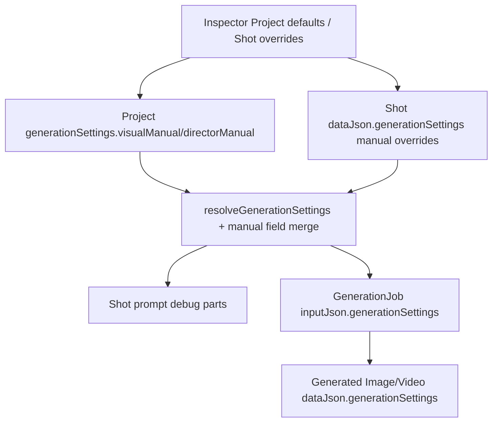

# feat: Add project visual and director manuals

## Summary

Extend the existing generation settings path with visual-manual and director-manual guidance, then surface that guidance through prompt debug, generation job trace, generated media trace, and the canvas Inspector settings UI. The plan reuses Project defaults plus Shot overrides rather than adding a separate manual subsystem.

---

## Problem Frame

Phase 15 made compact generation settings durable and auditable, but TF-08 needs longer project-level creative direction to guide consistent prompt composition across Shots. The current architecture already has the right persistence and backend-resolution boundary; this plan fills the manual-specific gap without expanding into a settings center or Toonflow-compatible schema.

---

## Assumptions

*This plan was authored without synchronous user confirmation. The items below are agent inferences that fill gaps in the input -- un-validated bets that should be reviewed before implementation proceeds.*

- Visual and director manuals should be nested optional fields inside the existing generation settings contract.
- Shot manual notes should override project manual fields per field when present; unrelated project manual fields should remain inherited even though the current resolver is otherwise top-level-key based.
- Separate prompt debug part kinds are clearer than folding long manual text into the existing Generation settings debug part.
- The existing project and Shot settings panels are acceptable for TF-08; UI-TF-09 can later reorganize these controls into a broader settings information architecture.

---

## Requirements

- R1. Creators can store project visual manual guidance for art style, palette/color, lighting, lens/composition, texture/material treatment, consistency rules, and negative style constraints.
- R2. Creators can store project director manual guidance for pacing, camera language, performance/emotion, editing rhythm, audio/narration intent, and production constraints.
- R3. Creators can store Shot-level visual and director manual notes when a specific Shot should supplement or override project manual guidance.
- R4. Shot prompt preview includes effective visual manual and director manual guidance as distinct debug parts when present.
- R5. Prompt debug output makes project versus Shot source level visible.
- R6. Image and video generation job inputs include the resolved manual guidance used at queue time.
- R7. Generated Image and Video node trace preserves the resolved manual guidance used for generation.
- R8. Existing projects and generation flows continue working when no manual guidance exists.
- R9. Manual guidance stays behind backend-owned prompt/generation boundaries and does not expose provider keys.
- R10. TF-08 does not build a settings center, art marketplace, manual template library, style reference generation flow, or Toonflow-compatible table shape.

**Origin actors:** A1 Creator, A2 Canvas workspace, A3 Prompt and generation services
**Origin flows:** F1 project manual setup, F2 Shot prompt with inherited manuals, F3 Shot-specific adjustment
**Origin acceptance examples:** AE1, AE2, AE3, AE4

---

## Scope Boundaries

- No separate manual service, new manual table, or Toonflow route/table parity.
- No provider-admin behavior, browser-side secrets, or arbitrary skill/template execution.
- No style reference generation or art-style marketplace; this is prompt/debug/manual metadata only.
- No retroactive mutation of completed generated media when manuals change.
- No broad redesign of the current Inspector layout; keep the change inside the existing generation settings panels.

### Deferred to Follow-Up Work

- A dedicated settings center can organize manuals, providers, prompt templates, and skills under UI-TF-09/TF-17.
- Manual templates, version history, and prompt/skill library management belong with TF-13/TF-17.
- Style reference images or generated style assets can build on TF-07 patterns in a separate module.

---

## Context & Research

### Relevant Code and Patterns

- `packages/shared-types/src/domain/generation.ts` owns `GenerationCreativeSettings`, `GENERATION_CREATIVE_SETTING_KEYS`, normalization, and resolved `{ project, shot, effective, sources }` settings.
- `packages/shared-types/src/domain/prompt-composer.ts` already turns resolved generation settings into prompt debug parts and prompt text.
- `packages/shared-types/src/domain/canvas.ts` carries optional `generationSettings` on Shot node data and generated media node traces.
- `apps/backend/src/projects/projects.service.ts` persists and duplicates Project-level generation settings through `Project.generationSettingsJson`.
- `apps/backend/src/prompt/prompt.service.ts` resolves project settings server-side before calling the shared prompt composer.
- `apps/backend/src/generation/generation.service.ts` records resolved generation settings on job inputs and generated Image/Video nodes.
- `apps/frontend/src/components/canvas/generation-creative-settings-panel.tsx` already edits Project defaults and Shot overrides in the Inspector.

### Institutional Learnings

- `docs/solutions/architecture-patterns/generation-settings-export-trace-2026-06-13.md`: resolve creative settings at backend boundaries and preserve snapshots on generated outputs.
- `docs/solutions/architecture-patterns/prompt-composer-graph-derived-debug-parts-2026-06-12.md`: prompt previews and job inputs should derive from persisted graph/project state, not browser-composed prompt strings.
- `docs/solutions/architecture-patterns/image-refinement-backflow-lineage-2026-06-13.md`: generated outputs should preserve prompt/provider/input trace rather than rewriting source nodes.

### External References

- External research skipped: the repo has direct, current patterns for project defaults, Shot overrides, prompt debug parts, and generation trace. The Toonflow row is used only as product inspiration per `docs/infinite-canvas-video-long-task-development-flow.md`.

---

## Key Technical Decisions

- Extend `GenerationCreativeSettings`: project and Shot manuals are part of the same resolved creative settings snapshot that already reaches prompt preview, jobs, generated nodes, and exports.
- Use explicit visual and director manual sub-objects: this keeps image-style guidance separate from motion, camera, performance, editing, and audio/narration guidance.
- Add distinct prompt debug parts for manuals: long manual text should be reviewable without burying it inside the existing compact settings part.
- Add manual-aware merge/source handling: the generic top-level setting precedence is not enough for manuals because a Shot may override one manual field while still inheriting the rest of the project manual.
- Keep normalization permissive and compact: empty manual fields should disappear, preserving backward compatibility with old projects and tests.

---

## Open Questions

### Resolved During Planning

- Should manuals use a separate persistence model?: No. The current Project JSON plus Shot `dataJson.generationSettings` path already gives the inheritance, duplication, and backend-owned resolution TF-08 needs.
- Should Shot manual notes replace or supplement Project manual fields?: Use manual-specific field-level override semantics. If a Shot supplies one manual field, that field is Shot-sourced while absent manual fields inherit from the project object.
- Should prompt debug reuse `generation_settings` or add manual parts?: Add manual-specific debug kinds so long text is visible and source-attributed.

### Deferred to Implementation

- Final UI grouping labels can adjust during implementation as long as visual manual and director manual sections remain discoverable and testable.
- Exact helper names for manual text formatting can follow the nearby prompt composer style.

---

## High-Level Technical Design

> *This illustrates the intended approach and is directional guidance for review, not implementation specification. The implementing agent should treat it as context, not code to reproduce.*

---

## Implementation Units

- U1. **Shared manual settings contracts**

**Goal:** Add typed, normalized visual-manual and director-manual settings to the existing creative settings model.

**Requirements:** R1, R2, R3, R6, R7, R8; Covers AE2, AE3, AE4

**Dependencies:** None

**Files:**
- Modify: `packages/shared-types/src/domain/generation.ts`
- Modify: `packages/shared-types/src/domain/domain.test.ts`
- Test: `packages/shared-types/src/domain/domain.test.ts`

**Approach:**
- Add optional visual and director manual settings to the creative settings key list and normalized settings contract.
- Keep each manual as a compact object with optional text fields that disappear when empty.
- Extend the existing resolved settings precedence with manual-aware field merging so Shot manual fields override only matching project manual fields.
- Preserve source attribution for manual lines either through explicit manual field source metadata or by deriving each line's source from project/Shot manual objects during prompt formatting.

**Execution note:** Implement shared type and normalization tests before touching prompt or UI code.

**Patterns to follow:**
- `GenerationViralReference`, `GenerationContinuitySettings`, and `normalizeGenerationMarketingSettings` in `packages/shared-types/src/domain/generation.ts`.
- Existing precedence tests in `packages/shared-types/src/domain/domain.test.ts`.

**Test scenarios:**
- Happy path: project visual/director manuals normalize with populated fields and survive `resolveGenerationSettings`.
- Happy path: Shot manual fields override matching project manual fields while unrelated project manual fields remain inherited.
- Edge case: a Shot visual manual with only a lens note still inherits the project palette and lighting notes.
- Edge case: empty strings and empty manual objects are omitted from normalized settings.
- Edge case: legacy settings with no manual fields resolve without changing existing effective values.

**Verification:**
- Shared type tests prove manual normalization, precedence, and legacy compatibility.

---

- U2. **Prompt composer manual debug parts**

**Goal:** Include resolved manual guidance in Shot prompt preview as source-attributed debug parts.

**Requirements:** R4, R5, R8, R9; Covers AE1, AE2, AE4

**Dependencies:** U1

**Files:**
- Modify: `packages/shared-types/src/domain/prompt-composer.ts`
- Modify: `packages/shared-types/src/domain/domain.test.ts`
- Modify: `apps/backend/src/prompt/prompt.service.spec.ts`
- Test: `packages/shared-types/src/domain/domain.test.ts`
- Test: `apps/backend/src/prompt/prompt.service.spec.ts`

**Approach:**
- Add prompt debug part kinds for visual manual and director manual.
- Format manual text with source labels at the manual-field level so inherited project fields and Shot overrides can appear in the same debug part.
- Include visual manual guidance in both image and video prompt channels.
- Include director manual guidance primarily where motion/camera/performance/audio intent matters, while keeping debug visibility available for both channels if the existing prompt composer structure favors shared common parts.

**Patterns to follow:**
- `generationSettingsPart`, `viralReferenceLine`, `continuityLine`, and `partFromText` in `packages/shared-types/src/domain/prompt-composer.ts`.
- Backend `PromptService` test fixture for project settings and Shot overrides.

**Test scenarios:**
- Covers AE1. Happy path: project manuals appear in prompt text and debug parts with project source labels.
- Covers AE2. Happy path: Shot manual override appears with Shot source labels and wins over project text for the same field.
- Edge case: no manuals means no manual debug parts and current prompt parts remain unchanged.
- Integration: backend `PromptService` reads persisted project manuals and Shot overrides, then returns debug part kinds for both manuals.

**Verification:**
- Prompt composer and backend prompt service tests demonstrate manual prompt visibility and source attribution.

---

- U3. **Generation trace propagation**

**Goal:** Ensure manual guidance captured by prompt composition continues through generation job input and generated media node trace.

**Requirements:** R6, R7, R8, R9; Covers AE2, AE3, AE4

**Dependencies:** U1, U2

**Files:**
- Modify: `apps/backend/src/generation/generation.service.spec.ts`
- Review/modify if needed: `apps/backend/src/generation/generation.service.ts`
- Test: `apps/backend/src/generation/generation.service.spec.ts`

**Approach:**
- Characterize that `shot_to_image`, `image_refinement`, and `image_to_video` job inputs already carry `generationSettings`.
- Add tests proving manual settings are present on job input and generated node/output snapshots when prompt composition returns them.
- Only modify production generation service if tests expose a missing trace path.

**Patterns to follow:**
- Existing Phase 15 assertions for `generationSettings` in `apps/backend/src/generation/generation.service.spec.ts`.
- Generated node trace construction in `apps/backend/src/generation/generation.service.ts`.

**Test scenarios:**
- Covers AE2. Happy path: queued `shot_to_image` input includes effective visual and director manuals.
- Covers AE3. Happy path: completion stores the same manual snapshot on generated Image/Video node data and job output.
- Edge case: old composition output with no manual fields still creates jobs and generated nodes.
- Integration: manual trace is backend-derived and not submitted from the browser job request.

**Verification:**
- Backend generation tests prove manual guidance is captured at queue/completion time and remains optional.

---

- U4. **Inspector manual editing UI**

**Goal:** Let creators edit project manual defaults and Shot manual overrides in the existing canvas Inspector generation settings panels.

**Requirements:** R1, R2, R3, R5, R8, R10; Covers F1, F3, AE1, AE2, AE4

**Dependencies:** U1

**Files:**
- Modify: `apps/frontend/src/components/canvas/generation-creative-settings-panel.tsx`
- Modify: `apps/frontend/src/components/canvas/canvas-inspector.test.tsx`
- Modify: `apps/frontend/src/lib/api.test.ts`
- Test: `apps/frontend/src/components/canvas/canvas-inspector.test.tsx`
- Test: `apps/frontend/src/lib/api.test.ts`

**Approach:**
- Add compact visual manual and director manual sections to the existing `GenerationCreativeSettingsForm`.
- Use multiline text controls for longer manual fields.
- Preserve the current project save and Shot save flows so manuals persist through existing Project and CanvasNode APIs.
- Keep labels focused on editing controls, not in-app documentation.

**Patterns to follow:**
- Existing viral reference, continuity strategy, talking photo, and marketing sections in `generation-creative-settings-panel.tsx`.
- Inspector tests that assert project settings and Shot override content render.

**Test scenarios:**
- Covers AE1. Happy path: project manual fields render in the Project defaults panel and save through the project API payload.
- Covers AE2. Happy path: Shot manual fields render in the Shot overrides panel and save through the canvas node API payload.
- Edge case: clearing all manual fields removes empty manual objects from normalized settings.
- Regression: existing settings sections still render and existing project/Shot settings API calls retain prior fields.

**Verification:**
- Frontend component/API tests cover rendering, save payloads, clearing behavior, and regression of existing controls.

---

- U5. **Documentation and completion status**

**Goal:** Record the TF-08 behavior and close the plan only after implementation and verification.

**Requirements:** R1-R10

**Dependencies:** U1, U2, U3, U4

**Files:**
- Modify: `docs/development.md`
- Modify: `docs/plans/2026-06-13-022-feat-project-visual-director-manual-plan.md`
- Create: `docs/solutions/architecture-patterns/project-visual-director-manual-prompt-trace-2026-06-13.md`

**Approach:**
- Add a concise development note describing project/Shot manuals, prompt debug parts, and generation trace.
- Write a solution note only if implementation confirms a reusable pattern beyond the Phase 15 settings trace.
- Mark this plan `completed` after tests and review pass.

**Patterns to follow:**
- TF-06 and TF-07 sections in `docs/development.md`.
- Recent architecture-pattern solution docs in `docs/solutions/architecture-patterns/`.

**Test scenarios:**
- Test expectation: none -- documentation/status changes are verified by review and frontmatter validation when a solution doc is added.

**Verification:**
- Docs mention TF-08 status, the plan status reflects completion only after verification, and any solution frontmatter validates.

---

## System-Wide Impact

- **Interaction graph:** Project update, canvas node update, prompt preview, generation create, and generation completion all read the same resolved creative settings path.
- **Error propagation:** Manual fields are optional text metadata; invalid or empty values should normalize away rather than breaking legacy prompts or jobs.
- **State lifecycle risks:** Jobs and generated nodes must snapshot manual guidance at queue/completion time so later project edits do not rewrite historical outputs.
- **API surface parity:** Project create/update/duplicate and Shot update APIs should preserve manual fields through existing generation settings payloads.
- **Integration coverage:** Shared type tests are not enough; backend prompt/generation tests and frontend save tests must prove cross-layer behavior.
- **Unchanged invariants:** Provider secrets stay server-side, existing provider execution controls remain separate from creative manual metadata, and editor export semantics do not change in this module.

---

## Risks & Dependencies

| Risk | Mitigation |
|------|------------|
| Manual fields make the Inspector too dense | Add compact grouped sections inside the existing settings panel and defer broader settings IA to UI-TF-09. |
| Long manual text buries prompt debug readability | Use dedicated debug part kinds with source-attributed lines instead of appending everything to the compact generation settings part. |
| Trace metadata accidentally references current project settings instead of queue-time settings | Assert job input and generated node/output snapshots in backend generation tests. |
| Empty manual objects persist and create noisy metadata | Extend shared normalization tests to compact empty manual fields away. |
| Shot-level manual object accidentally drops unrelated project manual fields | Add shared resolver tests for partial Shot manual overrides and prompt tests for mixed project/Shot source labels. |

---

## Documentation / Operational Notes

- Update `docs/development.md` after implementation with a short TF-08 smoke checklist.
- If a solution doc is added, validate its frontmatter before closing the module.
- No new migration should be required if manuals use the existing project JSON and Shot `dataJson` settings path.

---

## Sources & References

- **Origin document:** [docs/brainstorms/2026-06-13-022-tf-08-project-visual-director-manual-requirements.md](../brainstorms/2026-06-13-022-tf-08-project-visual-director-manual-requirements.md)
- **Roadmap task:** `docs/infinite-canvas-video-long-task-development-flow.md` TF-08
- Related plan: [docs/plans/2026-06-13-016-feat-generation-settings-export-packaging-plan.md](2026-06-13-016-feat-generation-settings-export-packaging-plan.md)
- Related solution: [docs/solutions/architecture-patterns/generation-settings-export-trace-2026-06-13.md](../solutions/architecture-patterns/generation-settings-export-trace-2026-06-13.md)
