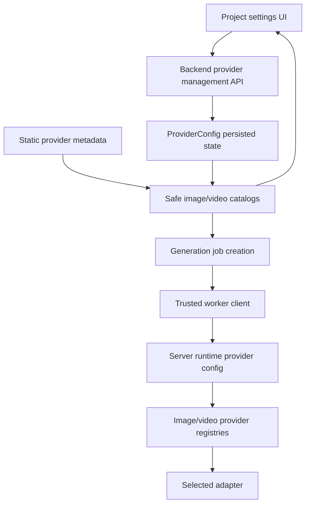

# feat: Add provider management console

## Summary

Build a project-scoped provider management path on top of the existing static image/video catalogs: safe DTOs, persisted enable/default/credential state, backend connectivity tests, catalog integration, trusted worker credential resolution, and a settings UI for provider administration.

---

## Problem Frame

Real provider generation exists, but provider readiness is still mostly env-derived and generation-panel-local. TF-09 needs to make provider configuration inspectable and durable without weakening the secret-safe backend/worker boundary established by Phase 9 and Phase 10.

---

## Assumptions

*This plan was authored without synchronous user confirmation. The items below are agent inferences that fill gaps in the input -- un-validated bets that should be reviewed before implementation proceeds.*

- Provider credentials should use a dedicated server-only encrypted JSON field rather than overloading existing non-secret `paramsJson`.
- Stored provider credentials should supplement environment variables; env keys remain valid for local smoke tests and backward compatibility.
- The first connectivity test implementation can use adapter-level bounded calls or mock success paths and store only safe summaries.
- A project settings page is acceptable for TF-09 even though a broader settings center remains future work.

---

## Requirements

- R1. Creators can view project-scoped image and video provider configuration.
- R2. Provider management responses expose safe provider metadata, model lists, default model, enabled state, disabled reason, credential presence, capability limits, and test status.
- R3. Creators can enable or disable a provider.
- R4. Creators can choose a default model from the provider's known model list.
- R5. Creators can submit, rotate, or clear provider credentials without those credentials being returned by browser-facing APIs.
- R6. Creators can run provider/model connectivity tests.
- R7. Connectivity tests return and persist a safe status, timestamp, tested model, and readable non-secret message.
- R8. Invalid provider configuration and test failures are visible without exposing secrets.
- R9. Connectivity tests do not create production graph or media records.
- R10. Generation provider catalogs honor project provider enablement and default model state.
- R11. Trusted worker execution can use server-stored provider credentials without adding secrets to job input/output JSON.
- R12. Mock providers remain enabled and usable without credentials.
- R13. TF-09 does not support arbitrary executable provider code or dynamic adapter editing.
- R14. Existing catalog, generation, worker, health, and mock workflow behavior remains compatible when no provider config exists.

**Origin actors:** A1 Creator/Admin, A2 Settings console, A3 Backend provider service, A4 Worker/provider execution
**Origin flows:** F1 configure a provider, F2 test a provider/model, F3 generate with configured defaults
**Origin acceptance examples:** AE1, AE2, AE3, AE4

---

## Scope Boundaries

- No arbitrary TypeScript/JavaScript provider adapter editing, sandboxing, remote vendor code download, or user-supplied executable provider code.
- No full settings center IA beyond the provider settings page/panel needed for this slice.
- No production media creation during provider tests.
- No browser-visible stored credential values, request headers, or raw secret-bearing provider traces.
- No real provider credentials required for local mock workflow or CI.
- No billing, quotas, team permissions, usage analytics, provider marketplace, or model marketplace.

### Deferred to Follow-Up Work

- TF-10 can design and implement programmable provider sandboxing after a dedicated security pass.
- UI-TF-09/TF-17 can reorganize provider, prompt, skill, database, and version settings into a broader settings center.
- Usage/quota/cost management should be a separate provider operations module.

---

## Context & Research

### Relevant Code and Patterns

- `apps/backend/src/providers/providers.service.ts` builds the current safe image/video provider catalogs from static metadata and env-derived key presence.
- `apps/backend/src/providers/providers.controller.ts` exposes `GET /providers/image` and `GET /providers/video`.
- `apps/backend/prisma/schema.prisma` already includes project-owned `ProviderConfig`.
- `packages/shared-types/src/domain/generation.ts` owns provider catalog item/result types and generation provider setting shapes.
- `apps/backend/src/generation/generation.service.ts` validates providers/models via `ProvidersService` before creating jobs.
- `apps/worker/src/generation-executors.ts` creates env-backed image/video provider registries and executes jobs without browser involvement.
- `apps/worker/src/generation-client.ts` is the trusted worker-to-backend API client seam.
- `apps/frontend/src/components/canvas/generation-actions.tsx` already consumes safe image/video catalogs for generation controls.
- `apps/frontend/src/components/workbench-shell.tsx` has an inactive Settings rail item and can link to a project settings route.
- `apps/frontend/src/lib/api.ts` is the frontend API wrapper pattern for safe catalog calls and project-scoped mutations.

### Institutional Learnings

- `docs/solutions/architecture-patterns/real-image-provider-secret-safe-persistence-2026-06-12.md`: browser-safe provider catalogs must exclude raw keys, secret headers, and browser-owned provider calls.
- `docs/solutions/architecture-patterns/generation-worker-backend-side-effects-2026-06-12.md`: provider execution belongs in the worker, while backend owns durable state and side effects.
- `docs/solutions/architecture-patterns/project-scoped-asset-lifecycle-boundary-2026-06-12.md`: browser should not own provider-like credentials or storage internals.

### Reference Project Findings

- Toonflow exposes vendor configuration, enabled vendor lists, model list/detail routes, and image/text/video model test routes under `setting/vendorConfig/*` and `modelSelect/*`.
- Toonflow also supports vendor code templates and update routes. TF-09 deliberately borrows the management/test/model-list product shape while excluding dynamic code execution and vendor script editing.

### External References

- External web research skipped for planning: TF-09 uses already-implemented local adapters and provider metadata. Live provider API details remain isolated behind existing adapter tests from Phase 9/10.

---

## Key Technical Decisions

- Extend `ProviderConfig` rather than creating a new provider settings table: the existing model already matches project-scoped provider configuration.
- Add server-only credential/test metadata: keep non-secret defaults separate from encrypted credential material and safe test summaries.
- Compose catalogs from static provider metadata plus project config: static metadata remains the source of supported modes, model list, limits, and parameter definitions; project config controls enablement and default model.
- Keep credential flow write-only in browser-safe DTOs: update requests can carry a new secret, but list/get responses only carry credential presence and timestamps.
- Let trusted worker resolve runtime provider config through backend-owned APIs or claim-time runtime metadata that never lands in `GenerationJob.inputJson`.

---

## Open Questions

### Resolved During Planning

- Should TF-09 support adding arbitrary providers or adapter code?: No. That is TF-10 after a security design.
- Should stored provider config replace env keys?: No. Stored config supplements env keys; existing no-key and env-key flows keep working.
- Should provider tests create sample media assets?: No. Tests must be readiness checks without production graph/media side effects.
- Should the first UI live inside the canvas Inspector?: No. Provider administration is project-level settings, while generation panels continue consuming safe catalogs.

### Deferred to Implementation

- Final credential encryption envelope details can follow the smallest Node `crypto` helper that is deterministic in tests and server-only in production.
- Exact provider test prompt/payload can be adjusted per adapter capability as long as no production records are created.
- The final route names can follow Nest controller conventions, but they must stay project-scoped for persisted provider config and safe for frontend use.

---

## High-Level Technical Design

> *This illustrates the intended approach and is directional guidance for review, not implementation specification. The implementing agent should treat it as context, not code to reproduce.*

---

## Implementation Units

- U1. **Shared provider management contracts**

**Goal:** Add shared safe DTOs and provider config helpers for management responses, updates, and test results.

**Requirements:** R1, R2, R3, R4, R5, R6, R7, R8, R12, R13, R14; Covers AE1, AE2, AE3, AE4

**Dependencies:** None

**Files:**
- Modify: `packages/shared-types/src/domain/generation.ts`
- Modify: `packages/shared-types/src/domain/domain.test.ts`
- Test: `packages/shared-types/src/domain/domain.test.ts`

**Approach:**
- Define project-safe provider management item/result types that extend catalog concepts with provider kind, configured enabled state, credential presence, selected default model, and last test summary.
- Define update and test input/result types that allow credential submission but keep returned provider records secret-free.
- Add normalizers/guards for provider kind, provider id, default model, credential update intent, and non-secret provider params where useful.

**Execution note:** Start with shared type tests that assert serialized management responses do not contain submitted credential values.

**Patterns to follow:**
- Existing `ImageProviderCatalogItem` and `VideoProviderCatalogItem` contracts in `packages/shared-types/src/domain/generation.ts`.
- Existing normalization tests around generation settings in `packages/shared-types/src/domain/domain.test.ts`.

**Test scenarios:**
- Happy path: image and video management DTOs carry model list, default model, enabled state, and credential presence.
- Error path: invalid provider kind/provider id/model is rejected by normalization or backend validation.
- Security path: safe response serialization does not include credential values or secret-like update payload fields.
- Compatibility path: existing image/video provider catalog types still compile and remain unchanged for current consumers.

**Verification:**
- Shared type tests prove safe DTO shape and backward compatibility.

---

- U2. **Backend provider config persistence and safe catalogs**

**Goal:** Persist project provider configuration and compose image/video catalogs from static provider metadata plus project-specific settings.

**Requirements:** R1, R2, R3, R4, R5, R8, R10, R12, R14; Covers AE1, AE2, AE4

**Dependencies:** U1

**Files:**
- Modify: `apps/backend/prisma/schema.prisma`
- Create: `apps/backend/prisma/migrations/20260613120000_tf_09_provider_management/migration.sql`
- Modify: `apps/backend/src/providers/providers.service.ts`
- Modify: `apps/backend/src/providers/providers.controller.ts`
- Create: `apps/backend/src/providers/dto.ts`
- Modify: `apps/backend/src/providers/providers.service.spec.ts`
- Modify: `apps/backend/test/app.e2e-spec.ts`
- Test: `apps/backend/src/providers/providers.service.spec.ts`
- Test: `apps/backend/test/app.e2e-spec.ts`

**Approach:**
- Extend `ProviderConfig` with server-only credential metadata and safe last-test metadata while preserving existing rows.
- Add a small server-only credential helper for encrypting/decrypting provider credentials or safely reading env credentials when no stored credential exists.
- Build management lists by joining static metadata with project config rows.
- Keep global `GET /providers/image` and `GET /providers/video` backward-compatible, and add project-scoped catalog/management variants that honor saved config and default model.
- Validate provider id/kind/model against static metadata before persisting updates.

**Execution note:** Characterize current catalog behavior first, then add project-config tests.

**Patterns to follow:**
- Existing `buildImageProviderCatalog` / `buildVideoProviderCatalog` tests in `apps/backend/src/providers/providers.service.spec.ts`.
- Project-scoped controller/service validation style in `apps/backend/src/projects/projects.service.ts` and generation controllers.

**Test scenarios:**
- Happy path: project management list returns mock providers enabled and real providers with credential presence false when no config exists.
- Happy path: saving enabled/default model/credential creates or updates the project provider config and returns a secret-free safe record.
- Happy path: project-scoped image/video catalog uses saved enabled state and default model.
- Error path: unknown provider id, mismatched provider kind, unsupported default model, and malformed credential update are rejected without partial unsafe response data.
- Security path: safe catalog and management responses never contain submitted credential values or secret field contents.
- Compatibility path: global catalog endpoints preserve the current env-derived no-project behavior.

**Verification:**
- Backend provider service and e2e tests prove safe persistence, catalog compatibility, and no-secret responses.

---

- U3. **Provider connectivity tests**

**Goal:** Add backend provider/model test execution that records safe readiness status without creating production graph or media records.

**Requirements:** R6, R7, R8, R9, R12, R13; Covers AE3

**Dependencies:** U1, U2

**Files:**
- Modify: `apps/backend/src/providers/providers.service.ts`
- Modify: `apps/backend/src/providers/providers.controller.ts`
- Modify: `apps/backend/src/providers/dto.ts`
- Modify: `apps/backend/src/providers/providers.service.spec.ts`
- Modify: `packages/provider-contracts/src/contracts.ts`
- Modify: `packages/provider-contracts/src/mock-providers.ts`
- Modify: `packages/provider-contracts/src/real-image-providers.ts`
- Modify: `packages/provider-contracts/src/real-video-providers.ts`
- Modify: `packages/provider-contracts/src/mock-providers.test.ts`
- Test: `apps/backend/src/providers/providers.service.spec.ts`
- Test: `packages/provider-contracts/src/mock-providers.test.ts`
- Test: `packages/provider-contracts/src/real-image-providers.test.ts`
- Test: `packages/provider-contracts/src/real-video-providers.test.ts`

**Approach:**
- Add a provider-neutral health/test method or bounded test helper to provider contracts where needed.
- For mock providers, return deterministic success with the selected model.
- For real providers, use a minimal adapter-owned test path that validates credentials and model availability without saving media. If a provider lacks a cheap health endpoint, treat the bounded call as a connectivity check and discard output.
- Persist only safe test status, model, timestamp, and sanitized message on the provider config row.

**Patterns to follow:**
- `ProviderError` normalization in `packages/provider-contracts/src/contracts.ts`.
- Existing real provider HTTP fixture tests.

**Test scenarios:**
- Happy path: mock provider test returns success and updates last-test metadata.
- Error path: missing credential returns a failed test result without calling the real provider adapter.
- Error path: provider adapter failure is sanitized and stored as a safe failure message.
- Side-effect path: test execution does not create `GenerationJob`, `Asset`, `CanvasNode`, or `CanvasEdge` records.
- Security path: raw provider error bodies with secret-like content are sanitized before persistence/response.

**Verification:**
- Provider tests prove readiness checks, sanitized failures, and zero production side effects.

---

- U4. **Generation and worker runtime integration**

**Goal:** Make saved provider defaults and credentials usable by generation creation and trusted worker execution without adding secrets to job JSON.

**Requirements:** R10, R11, R12, R14; Covers AE2, AE4

**Dependencies:** U1, U2

**Files:**
- Modify: `apps/backend/src/generation/generation.service.ts`
- Modify: `apps/backend/src/generation/worker-generation.controller.ts`
- Modify: `apps/backend/src/generation/generation.service.spec.ts`
- Modify: `apps/worker/src/generation-client.ts`
- Modify: `apps/worker/src/generation-executors.ts`
- Modify: `apps/worker/src/generation-runner.ts`
- Modify: `apps/worker/src/generation-client.test.ts`
- Modify: `apps/worker/src/generation-executors.test.ts`
- Modify: `apps/worker/src/generation-runner.test.ts`
- Test: `apps/backend/src/generation/generation.service.spec.ts`
- Test: `apps/worker/src/generation-client.test.ts`
- Test: `apps/worker/src/generation-executors.test.ts`
- Test: `apps/worker/src/generation-runner.test.ts`

**Approach:**
- Let generation provider validation use project-scoped catalogs when a project id is available.
- Ensure generated job input records provider/model/default params but not runtime credentials.
- Add a trusted worker runtime-config resolution path so the worker can build provider registries with project/provider-specific credentials when executing a claimed job.
- Preserve env-backed registry behavior for no-config and existing tests.

**Patterns to follow:**
- Current `resolveImageProviderSettings` and `resolveVideoProviderSettings` validation in `apps/backend/src/generation/generation.service.ts`.
- Worker claim/succeed/fail flow in `apps/worker/src/generation-client.ts` and `apps/worker/src/generation-runner.ts`.

**Test scenarios:**
- Happy path: a project default model becomes the fallback model for new image/video jobs.
- Security path: job `inputJson` and `outputJson` do not contain provider credentials after project config is used.
- Happy path: worker builds a provider registry with server-resolved stored credentials for a claimed real-provider job.
- Compatibility path: existing mock worker execution still works with env-only/default registry setup.
- Error path: missing runtime credential fails as a sanitized provider failure and keeps durable job failure semantics.

**Verification:**
- Backend and worker tests prove configured defaults and credentials can be used without secret leakage.

---

- U5. **Frontend provider settings console**

**Goal:** Add a project settings UI for provider administration and wire it to safe provider management APIs.

**Requirements:** R1, R2, R3, R4, R5, R6, R7, R8, R10, R12, R13; Covers AE1, AE2, AE3

**Dependencies:** U1, U2, U3

**Files:**
- Create: `apps/frontend/src/app/projects/[projectId]/settings/page.tsx`
- Create: `apps/frontend/src/components/projects/provider-settings-panel.tsx`
- Create: `apps/frontend/src/components/projects/provider-settings-panel.test.tsx`
- Modify: `apps/frontend/src/components/workbench-shell.tsx`
- Modify: `apps/frontend/src/components/workbench-shell.test.tsx`
- Modify: `apps/frontend/src/lib/api.ts`
- Modify: `apps/frontend/src/lib/api.test.ts`
- Modify: `apps/frontend/src/app/globals.css`
- Test: `apps/frontend/src/components/projects/provider-settings-panel.test.tsx`
- Test: `apps/frontend/src/components/workbench-shell.test.tsx`
- Test: `apps/frontend/src/lib/api.test.ts`

**Approach:**
- Add frontend API wrappers for project provider management list/update/test calls.
- Create a project settings page focused on Providers, grouped by image and video.
- For each provider, show enabled state, credential presence, default model select, safe disabled reason, supported modes/limits, and last test result.
- Allow write-only credential entry/rotation/clear and immediately clear credential input state after submit.
- Link the existing Settings rail item to the project settings page when `projectId` is available.

**Patterns to follow:**
- Existing project-scoped API wrapper tests in `apps/frontend/src/lib/api.test.ts`.
- Existing dense operational UI styling for `generation-panel`, `generation-settings`, and project dashboard sections in `apps/frontend/src/app/globals.css`.

**Test scenarios:**
- Happy path: settings panel renders image and video provider groups with model list, enabled state, credential presence, and test status.
- Happy path: toggling enabled/default model submits a provider update and refreshes safe provider data.
- Security path: entering a credential submits it to the backend but the value is cleared from component state after save and never rendered from API data.
- Error path: update/test failures render readable non-secret errors.
- Navigation path: Workbench Settings rail links to the project settings route.

**Verification:**
- Frontend tests prove safe rendering, write-only credential handling, project settings navigation, and API contract parity.

---

- U6. **Documentation, smoke coverage, and learning capture**

**Goal:** Document provider management behavior, run the verification suite, and capture reusable provider-management learnings.

**Requirements:** R8, R9, R11, R12, R13, R14; Covers AE1, AE3, AE4

**Dependencies:** U1, U2, U3, U4, U5

**Files:**
- Modify: `docs/development.md`
- Modify: `docs/plans/2026-06-13-023-feat-provider-management-console-plan.md`
- Create: `docs/solutions/architecture-patterns/provider-management-secret-safe-runtime-config-2026-06-13.md`

**Approach:**
- Update development docs with provider settings behavior, secret boundaries, test semantics, runtime worker config behavior, and no-key mock workflow expectations.
- Capture a solution note covering safe provider admin DTOs, write-only credential flow, side-effect-light tests, and trusted worker runtime config resolution.
- Run targeted provider/backend/frontend/worker tests, then full workspace checks and mock workflow.

**Patterns to follow:**
- Existing provider workflow documentation in `docs/development.md`.
- Existing solution documents under `docs/solutions/architecture-patterns/`.

**Test scenarios:**
- Test expectation: none -- this unit documents and verifies behavior implemented by U1-U5.

**Verification:**
- Docs describe the safe provider-management path and verification commands pass.

---

## System-Wide Impact

- **Interaction graph:** Provider settings affect provider catalogs, generation job creation defaults, worker runtime registry construction, and settings navigation.
- **Error propagation:** Provider config validation and connectivity failures must surface as readable non-secret errors without mutating production graph state.
- **State lifecycle risks:** Credential rotation and clearing must not leave stale browser state, stale enabled flags, or job payload secrets.
- **API surface parity:** Shared types, backend DTOs, frontend wrappers, generation validation, and worker client/runtime config must agree on safe fields.
- **Integration coverage:** Cross-layer tests should prove management update -> catalog default -> job creation -> worker runtime resolution without secret leakage.
- **Unchanged invariants:** Mock providers remain default/no-key usable; provider execution remains backend/worker-owned; browser never calls provider APIs directly; generated media side effects stay behind backend completion.

---

## Risks & Dependencies

| Risk | Mitigation |
|------|------------|
| Credentials leak through management DTOs, logs, job JSON, or test messages | Use write-only update DTOs, safe response mappers, sanitized provider errors, and tests that search serialized responses/job JSON for submitted secrets. |
| Worker cannot execute DB-configured providers because it only has env keys | Add a trusted runtime-config resolution path and keep credentials out of persisted job input/output. |
| Connectivity tests accidentally create media records or incur unexpected provider cost | Keep tests bounded, side-effect-light, and covered by backend tests asserting no production records are created. |
| Saved project config breaks existing env/no-config provider behavior | Preserve global catalog endpoints and env-backed registry fallback; cover no-config and mock workflow compatibility. |
| Settings UI grows into full settings-center scope | Limit this module to Providers and defer broader settings IA to UI-TF-09/TF-17. |

---

## Documentation / Operational Notes

- Document that stored credentials are server-side and browser-safe APIs only expose credential presence.
- Document that env keys still work and remain suitable for local live-provider smoke.
- Document that provider tests are readiness checks and not production media generation.
- Document manual live-provider testing as optional because real provider calls may incur cost.

## Implementation Outcome

- U1 added shared provider management/update/test/runtime contracts and normalization helpers in `@guga-flow/shared-types`.
- U2 extended `ProviderConfig` with encrypted credential and last-test fields, added project-scoped provider management/catalog routes, and preserved global env-derived catalog routes.
- U3 implemented backend readiness tests that validate provider/model/credential state and persist safe results without creating production media or graph records. Provider-contract live health hooks remain deferred because the first TF-09 slice intentionally avoids cost-bearing provider calls.
- U4 switched generation validation to project-scoped catalogs and added a trusted worker runtime-config endpoint/client path so stored credentials can be applied at execution time without entering job JSON. Runtime config responses that contain stored credentials require a matching `WORKER_API_TOKEN`.
- U5 added `/projects/:projectId/settings`, the provider settings panel, project-scoped frontend provider APIs, workbench Settings navigation, and project catalog fetches in single/batch generation controls.
- U6 documented the provider-management workflow, captured the reusable secret-safe runtime-config pattern, and fixed the final review finding that the worker CLI must fetch project runtime config instead of constructing a static env registry up front.

## Verification Log

- `pnpm --filter @guga-flow/shared-types test -- src/domain/domain.test.ts`
- `pnpm db:generate`
- `pnpm --filter @guga-flow/shared-types build`
- `pnpm --filter @guga-flow/backend test -- src/providers/providers.service.spec.ts src/generation/generation.service.spec.ts test/app.e2e-spec.ts`
- `pnpm --filter @guga-flow/worker test -- src/generation-client.test.ts src/generation-runner.test.ts`
- `pnpm --filter @guga-flow/frontend test -- src/lib/api.test.ts src/components/canvas/generation-actions.test.tsx src/components/projects/provider-settings-panel.test.tsx src/components/workbench-shell.test.tsx`
- `pnpm --filter @guga-flow/shared-types lint`
- `pnpm --filter @guga-flow/backend lint`
- `pnpm --filter @guga-flow/worker lint`
- `pnpm --filter @guga-flow/frontend lint`
- `pnpm run build`
- `pnpm run mock:workflow`

Visual smoke verification on 2026-06-13 opened `http://localhost:3001/projects/project_1/settings` against the mock API and confirmed the provider console rendered image/video groups, safe credential presence, Save/Test controls, and no browser console errors or secret values.

All commands above passed on 2026-06-13 with the repository's expected Node engine warning because the shell was running Node v22.22.2 instead of the documented Node 26.3.0.

---

## Sources & References

- **Origin document:** [docs/brainstorms/2026-06-13-023-tf-09-provider-management-console-requirements.md](../brainstorms/2026-06-13-023-tf-09-provider-management-console-requirements.md)
- Roadmap: `docs/infinite-canvas-video-long-task-development-flow.md`
- Architecture constraints: `docs/tech-stack-text2sql-reference.md`
- Prior provider plan: `docs/plans/2026-06-12-010-feat-real-image-provider-plan.md`
- Prior provider learning: `docs/solutions/architecture-patterns/real-image-provider-secret-safe-persistence-2026-06-12.md`
- Toonflow vendor context: `docs/research/video-ref/repomix/toonflow-app-focused-vendor.xml`
