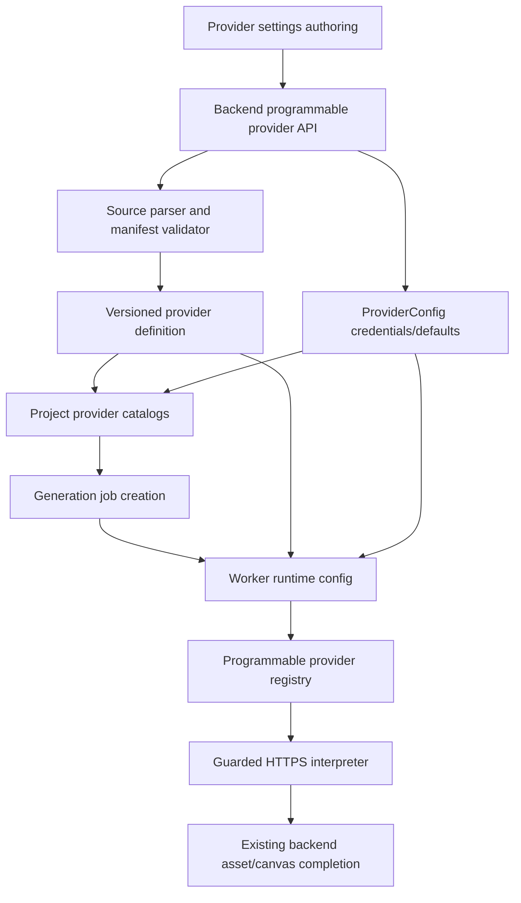

# feat: Add programmable provider sandbox

## Summary

Implement TF-10 as a security-first programmable provider system for image and video providers. The first slice should accept TypeScript/JavaScript-style authoring only as a data-only provider manifest, validate and version it server-side, interpret it through trusted runtime code in the worker, and integrate it with TF-09 provider management without executing arbitrary user functions.

---

## Problem Frame

TF-09 made provider enablement, credentials, defaults, tests, and worker runtime config project-scoped and secret-safe. TF-10 now needs to let a project add providers that are not compiled into the repo.

The unsafe path is to copy Toonflow's model directly: uploaded TypeScript is transformed and run in a VM with broad helpers. Node's own documentation warns that the `node:vm` module is not a security mechanism, and the reference Toonflow sandbox exposes helpers such as `fetch`, `axios`, crypto/JWT, form-data, image utilities, and AI SDK factories. guga-flow should instead implement a restricted provider program whose authored source is parsed into data and executed by trusted interpreter code.

---

## Assumptions

*This plan was authored without synchronous user confirmation. These are plan-time bets based on the roadmap, TF-09, local code, and reference research.*

- The first programmable provider format is a data-only TypeScript/JavaScript manifest. It may look like code to users, but arbitrary functions, imports, expressions with execution semantics, and runtime JS evaluation are rejected.
- The runtime interpreter supports enough HTTP request/response templating to prove a custom image provider and a custom video provider can register, test, and execute in mocked tests.
- Private-network blocking can start with explicit hostname/IP checks and a no-localhost policy. DNS rebinding and hardened network egress remain follow-up operational hardening.
- Current auth remains local/single-user; audit fields are still useful and should be included for future permission work.
- Programmatic LLM/editor/audio providers remain out of scope for this slice.

---

## Requirements

- R1. Creators can create programmable image and video provider definitions with safe metadata.
- R2. Provider ids and model ids use a restricted identifier policy and cannot collide with built-ins.
- R3. Every code change creates a version with status, timestamp, diagnostics, and preserved history.
- R4. Versions are inactive until validation succeeds and a creator enables them.
- R5. Browser-facing responses never include credentials, runtime env, raw secret headers, or secret-bearing raw provider responses.
- R6. Validation failures show actionable non-secret diagnostics.
- R7. Creators can disable or roll back programmable providers without deleting history.
- R8. Programmable provider code does not run as unrestricted backend/worker process code.
- R9. Runtime exposes only required provider-call capabilities.
- R10. Runtime cannot access files, shell, `process.env`, Node built-ins, dynamic imports, package installation, browser APIs, or private/local network targets.
- R11. Runtime enforces timeouts, bounded body/response sizes, and deterministic failures.
- R12. Credentials reach runtime only through the trusted server/worker path.
- R13. Logs, diagnostics, and provider errors are sanitized.
- R14. Project catalogs include enabled programmable providers with TF-09 safe catalog semantics.
- R15. Job JSON records only provider/model/params/version/safe trace metadata.
- R16. Programmable image outputs fit existing image asset and ImageNode completion flows.
- R17. Programmable video outputs support immediate or async lifecycle compatible with existing worker behavior.
- R18. Provider tests validate readiness without creating production jobs/assets/nodes/edges.
- R19. Built-in providers, mock workflow, TF-09 management, and global env catalogs stay compatible when no programmable providers exist.
- R20. A documented security design lands before custom provider execution is enabled.
- R21. Security design covers secret handling, network restrictions, import policy, resource limits, logging, activation, rollback, and failures.
- R22. Boundary tests cover env/file/import/private-network/secret-leak/timeout attempts.
- R23. Definition changes, activation, tests, and failures leave safe audit data.
- R24. Browser-side provider API calls remain forbidden.

**Origin actors:** A1 Creator/Admin, A2 Provider authoring surface, A3 Backend provider service, A4 Sandbox runner, A5 Worker/provider execution  
**Origin flows:** F1 add/update provider, F2 configure/validate/enable, F3 generate, F4 disable/rollback  
**Origin acceptance examples:** AE1, AE2, AE3, AE4, AE5

---

## Scope Boundaries

- Do not execute arbitrary uploaded JavaScript functions in this slice.
- Do not use `node:vm` or Toonflow-style broad `vm2` exposure as the trust boundary.
- Do not support arbitrary npm imports, package installation, shell execution, filesystem access, browser execution, or remote code download.
- Do not add a provider marketplace, billing/quota management, team approvals, or public sharing.
- Do not add programmable LLM/editor/TTS/audio/agent providers.
- Do not replace built-in providers or make real credentials required for tests/local development.

### Deferred to Follow-Up Work

- Hardened egress controls that resolve DNS and enforce private-network blocking after resolution.
- Full settings-center code editor ergonomics, diff viewer, and approval workflow.
- Marketplace/sharing, provider templates, and import from remote provider registries.
- OS/container-level sandboxing if future requirements require arbitrary functions rather than data-only provider programs.

---

## Context & Research

### Relevant Local Code

- `packages/shared-types/src/domain/generation.ts` owns provider ids, catalog items, management DTOs, runtime config, and generation settings.
- `apps/backend/src/providers/providers.service.ts` composes static provider catalogs with project config, stores encrypted credentials, records readiness tests, and serves worker runtime config.
- `apps/backend/src/providers/providers.controller.ts` exposes project provider management routes.
- `apps/backend/prisma/schema.prisma` already has project-owned `ProviderConfig`; TF-10 needs separate versioned provider definition history rather than overloading credential config.
- `apps/backend/src/generation/generation.service.ts` validates provider catalogs before creating jobs and keeps job JSON secret-free.
- `apps/worker/src/generation-client.ts` fetches worker runtime config with `WORKER_API_TOKEN`.
- `apps/worker/src/generation-executors.ts` constructs provider registries and normalizes provider outputs.
- `packages/provider-contracts/src/contracts.ts` defines normalized image/video provider interfaces and output shapes.
- `apps/frontend/src/components/projects/provider-settings-panel.tsx` is the TF-09 settings surface to extend with a programmable provider section.

### Institutional Learnings

- `docs/solutions/architecture-patterns/provider-management-secret-safe-runtime-config-2026-06-13.md`: browser-safe management DTOs and trusted worker runtime config keep credentials out of job JSON and browser responses.
- `docs/solutions/architecture-patterns/real-image-provider-secret-safe-persistence-2026-06-12.md`: provider calls belong server-side and generated media must be saved as durable assets.
- `docs/solutions/architecture-patterns/real-video-provider-async-task-lifecycle-2026-06-12.md`: long-running video providers need idempotent task polling and safe provider-waiting state.
- `docs/solutions/architecture-patterns/generation-worker-backend-side-effects-2026-06-12.md`: worker executes providers, backend owns durable state mutations.

### Reference Project Findings

- Toonflow validates vendor metadata, writes vendor code to disk, lets admins update code and model lists, and runs image/text/video tests through vendor-specific request functions.
- Toonflow transforms TypeScript through Sucrase and executes the transformed script through `vm2`.
- Toonflow's VM sandbox exposes broad helpers and direct network/runtime primitives. guga-flow should borrow the product loop (author, validate, version/update, test, enable), not the execution privilege model.

### External References

- Node.js `vm` docs: `node:vm` is not a security mechanism and should not be used to run untrusted code.
- TypeScript Compiler API docs: `createSourceFile` and AST traversal via `forEachChild` support parsing and inspecting TypeScript source without executing it.

---

## Key Technical Decisions

| Decision | Rationale |
| --- | --- |
| Use a data-only provider program for TF-10 v1 | Satisfies programmable onboarding while keeping arbitrary code execution out of the trusted process. |
| Parse authored source into a manifest instead of evaluating it | Supports TS/JS-style authoring while making env/file/import/function attempts rejectable before runtime. |
| Store provider definition versions separately from `ProviderConfig` | `ProviderConfig` is project enablement/credential state; provider code/history needs version lifecycle and audit metadata. |
| Prefix custom provider ids | Avoids built-in id collisions and lets shared types distinguish static providers from programmable ids. |
| Return executable runtime manifest only to the authenticated worker path | Preserves TF-09's secret-safe runtime config boundary. |
| Interpret HTTP templates in provider-contracts/worker code | Keeps request execution testable with injected fetch and avoids exposing Node APIs to provider authors. |
| Include security-design documentation in the implementation | R20/R21 require the trust boundary to be reviewable before custom provider execution ships. |

---

## Alternative Approaches Considered

| Approach | Why not chosen for TF-10 v1 |
| --- | --- |
| Direct `node:vm` or `vm2` execution of uploaded code | Node documents `vm` as non-security, and Toonflow-style broad helper exposure conflicts with R8-R13/R20-R22. |
| OS/container sandbox for arbitrary JS functions | Stronger isolation, but too much operational surface for this repo's first programmable-provider slice. Better as a follow-up if data-only manifests are insufficient. |
| Pure JSON only | Safest, but misses the roadmap's TS/JS provider editing shape. A data-only TS/JS manifest gives familiar authoring without execution. |
| Add providers only by editing repo source | Already possible for developers; does not satisfy TF-10's user-facing programmable provider goal. |

---

## High-Level Technical Design

> *This illustrates the intended approach and is directional guidance for review, not implementation specification. The implementing agent should treat it as context, not code to reproduce.*

The provider program should be a manifest-like object with metadata, credential descriptors, model/capability declarations, and image/video action definitions. The trusted interpreter owns HTTP execution, output extraction, task-state normalization, timeouts, size limits, and sanitization.

---

## Implementation Units

- U1. **Shared programmable provider contracts**

**Goal:** Add shared contracts for custom provider ids, provider definition/version DTOs, data-only manifest shape, validation/test results, and runtime config extensions.

**Requirements:** R1, R2, R3, R5, R6, R14, R15, R16, R17, R18, R19; Covers AE1, AE3, AE4

**Dependencies:** None

**Files:**
- Modify: `packages/shared-types/src/domain/generation.ts`
- Modify: `packages/shared-types/src/domain/domain.test.ts`

**Approach:**
- Introduce a custom provider id convention that is distinct from built-in ids and works for image/video catalog items.
- Add safe provider definition/version/test DTOs for browser-facing management.
- Extend runtime config types so the worker can receive a validated manifest/version in addition to env overrides.
- Keep built-in provider id unions usable for existing call sites while allowing project catalogs to contain custom ids.

**Execution note:** Start test-first around id normalization, safe serialization, and catalog compatibility before touching backend code.

**Patterns to follow:**
- TF-09 provider management types and normalizers in `packages/shared-types/src/domain/generation.ts`.
- Existing domain tests for generation settings and provider management.

**Test scenarios:**
- Happy path: `custom:atlascloud`-style ids normalize as programmable ids and built-in ids remain unchanged.
- Error path: ids with colons beyond the custom prefix, path separators, whitespace, uppercase-only collisions, or built-in collisions are rejected.
- Security path: provider definition/version DTO serialization never includes credential values or runtime env overrides.
- Compatibility path: existing built-in image/video catalog DTOs still compile and preserve previous fields.

**Verification:**
- Shared type tests prove programmable ids and safe DTOs without weakening built-in provider contracts.

---

- U2. **Security design and data-only manifest parser**

**Goal:** Document the sandbox/security boundary and implement parser/validator logic that converts authored TS/JS-style source into a safe manifest without executing it.

**Requirements:** R1, R2, R6, R8, R9, R10, R13, R20, R21, R22; Covers AE2

**Dependencies:** U1

**Files:**
- Create: `docs/security/programmable-provider-sandbox.md`
- Create: `packages/provider-contracts/src/programmable-provider-manifest.ts`
- Create: `packages/provider-contracts/src/programmable-provider-manifest.test.ts`
- Modify: `packages/provider-contracts/src/contracts.ts`

**Approach:**
- Define the v1 manifest subset as data-only: literal strings/numbers/booleans/nulls, arrays, and plain objects.
- Parse source with the TypeScript compiler API and reject imports, function/class declarations, call expressions, identifiers outside literal object positions, template expressions with executable expressions, and any top-level statement that is not an allowed export/assignment shape.
- Validate metadata, model capabilities, credential descriptors, action request templates, response mappings, and timeout/size limits.
- Make diagnostics point to manifest paths rather than exposing raw parser internals.

**Execution note:** Security boundary tests should be written before the parser accepts any source as valid.

**Patterns to follow:**
- Provider error normalization in `packages/provider-contracts/src/contracts.ts`.
- TypeScript Compiler API AST traversal using `createSourceFile` and `forEachChild`.

**Test scenarios:**
- Happy path: a data-only image provider manifest parses and validates into safe metadata.
- Happy path: a data-only video provider manifest with async task mapping parses and validates.
- Error path: imports, function exports, call expressions, `process.env`, `require`, dynamic import, `fetch(...)` in source, and computed expressions are rejected.
- Error path: invalid provider id/model id/capability/mode/URL template gets a non-secret diagnostic.
- Security path: parser tests include attempts that resemble env/file/import/private-network setup and reject before runtime.

**Verification:**
- Parser tests prove authored provider source is parsed as data, not executed.
- Security design doc names the trust boundary, denied capabilities, allowed capabilities, residual risks, and follow-up hardening.

---

- U3. **Backend persistence, versioning, and management API**

**Goal:** Persist programmable provider definitions and versions, expose safe project-scoped management routes, and keep credentials/defaults in `ProviderConfig`.

**Requirements:** R1, R2, R3, R4, R5, R6, R7, R18, R19, R23; Covers AE1, AE4, AE5

**Dependencies:** U1, U2

**Files:**
- Modify: `apps/backend/prisma/schema.prisma`
- Create: `apps/backend/prisma/migrations/20260613130000_tf_10_programmable_provider_sandbox/migration.sql`
- Create: `apps/backend/src/providers/programmable-provider.dto.ts`
- Modify: `apps/backend/src/providers/providers.service.ts`
- Modify: `apps/backend/src/providers/providers.controller.ts`
- Modify: `apps/backend/src/providers/providers.module.ts`
- Modify: `apps/backend/src/providers/providers.service.spec.ts`
- Modify: `apps/backend/test/app.e2e-spec.ts`

**Approach:**
- Add separate definition/version records for programmable providers with project ownership, kind, provider id, active version, validation status, source text, parsed manifest, diagnostics, and audit timestamps.
- Add safe create/update/validate/activate/disable/rollback/list/detail/test API methods under the project provider boundary.
- Reuse `ProviderConfig` for enabled state, default model, credentials, last test status, and runtime secret handling.
- Make every code update create a new inactive version; activation is explicit and requires a valid parsed manifest.
- Ensure safe API responses omit source when not needed and never include credentials.

**Execution note:** Characterize TF-09 provider management behavior first so project catalogs and built-in provider routes do not regress.

**Patterns to follow:**
- TF-09 `ProviderConfig` service methods and safe response mapping.
- Existing Prisma migration style under `apps/backend/prisma/migrations/`.
- Existing project-scoped controller style in provider and generation controllers.

**Test scenarios:**
- Happy path: create a custom image provider, validate it, activate it, and list it without secret values.
- Happy path: updating source creates a new inactive version while the previous active version remains active.
- Happy path: rollback selects a previous validated version.
- Error path: duplicate provider id, built-in id collision, invalid manifest, invalid default model, or activation of invalid version is rejected.
- Security path: source and manifest responses do not include stored credentials; credentials remain write-only through `ProviderConfig`.
- Compatibility path: built-in provider management still returns the same providers when no programmable definitions exist.

**Verification:**
- Backend unit and e2e tests prove version lifecycle, safe responses, and compatibility.

---

- U4. **Catalog, generation, and runtime config integration**

**Goal:** Make active programmable providers appear in project catalogs, allow generation jobs to select them, and return manifest/runtime data only through the authenticated worker path.

**Requirements:** R12, R14, R15, R16, R17, R18, R19, R24; Covers AE1, AE3, AE5

**Dependencies:** U1, U3

**Files:**
- Modify: `apps/backend/src/providers/providers.service.ts`
- Modify: `apps/backend/src/generation/generation.service.ts`
- Modify: `apps/backend/src/generation/dto.ts`
- Modify: `apps/backend/src/generation/generation.service.spec.ts`
- Modify: `apps/backend/src/generation/worker-generation.controller.ts`
- Modify: `apps/worker/src/generation-client.ts`
- Modify: `apps/worker/src/generation-client.test.ts`

**Approach:**
- Overlay active programmable provider manifests into project-scoped image/video catalogs while preserving global built-in catalog endpoints.
- Keep custom provider ids out of browser secrets and job credentials; job input records provider id/model/version and non-secret params only.
- Extend the worker runtime-config response for programmable providers with active manifest/version and credential env/secret values only when `WORKER_API_TOKEN` authorizes it.
- Ensure disabled or invalid providers cannot be selected for new jobs.

**Patterns to follow:**
- TF-09 project-scoped catalog overlay and runtime token gate.
- Existing generation provider validation and job input normalization.

**Test scenarios:**
- Happy path: active programmable provider appears in project catalog and can become the selected provider for a new job.
- Happy path: job input records custom provider id and active version but no credential value.
- Error path: disabled, invalid, inactive, or missing-version custom provider cannot create a job.
- Security path: runtime config refuses stored credentials without the worker token and never returns programmable manifest through browser-facing routes.
- Compatibility path: built-in mock and real-provider job creation still works.

**Verification:**
- Backend generation/provider tests prove catalog overlay, job validation, runtime config gating, and no-secret job JSON.

---

- U5. **Worker programmable provider interpreter**

**Goal:** Execute validated manifest actions through trusted worker code for image and video providers, with guarded HTTPS, output normalization, and async task support.

**Requirements:** R8, R9, R10, R11, R12, R13, R16, R17, R22; Covers AE2, AE3

**Dependencies:** U1, U2, U4

**Files:**
- Create: `packages/provider-contracts/src/programmable-providers.ts`
- Create: `packages/provider-contracts/src/programmable-providers.test.ts`
- Modify: `packages/provider-contracts/src/contracts.ts`
- Modify: `apps/worker/src/generation-executors.ts`
- Modify: `apps/worker/src/generation-executors.test.ts`
- Modify: `apps/worker/src/generation-runner.ts`
- Modify: `apps/worker/src/generation-runner.test.ts`

**Approach:**
- Build image/video provider implementations from validated manifests and runtime credentials.
- Use an injected fetch-like capability so tests can verify requests without live provider calls.
- Enforce HTTPS-only URLs, no localhost/private IP literal targets, method/header/body allowlists, timeout, max response bytes, and sanitized error shaping.
- Support image providers returning URL or base64 outputs compatible with existing asset persistence.
- Support video providers returning immediate URL/base64 output or provider task ids with polling/cancel mappings.

**Execution note:** Boundary tests should be treated as security tests, not only happy-path adapter tests.

**Patterns to follow:**
- Existing real image/video provider adapter tests in `packages/provider-contracts`.
- Existing worker executor result conversion and provider-waiting flow.

**Test scenarios:**
- Happy path: custom image manifest maps input prompt/model/reference ids into a mocked HTTPS request and normalized image output.
- Happy path: custom video manifest maps image-to-video input into a provider task id, then a poll response into a normalized video output.
- Error path: invalid response shape, missing output URL, provider error status, timeout, oversized response, and blocked URL become sanitized `ProviderError`s.
- Security path: localhost, private IP literals, non-HTTPS URLs, disallowed headers, and raw secret echo in error bodies are blocked or sanitized.
- Compatibility path: when runtime config has no programmable manifest, built-in registries keep their existing behavior.

**Verification:**
- Provider-contract and worker tests prove interpreter behavior, async task mapping, security boundaries, and built-in fallback.

---

- U6. **Frontend provider authoring surface**

**Goal:** Extend project settings with a compact programmable provider management surface that supports source editing, validation feedback, activation, rollback, credential entry, and tests.

**Requirements:** R1, R3, R4, R5, R6, R7, R13, R18, R23; Covers AE1, AE4, AE5

**Dependencies:** U1, U3, U4

**Files:**
- Modify: `apps/frontend/src/lib/api.ts`
- Modify: `apps/frontend/src/lib/api.test.ts`
- Modify: `apps/frontend/src/components/projects/provider-settings-panel.tsx`
- Modify: `apps/frontend/src/components/projects/provider-settings-panel.test.tsx`
- Modify: `apps/frontend/src/app/globals.css`

**Approach:**
- Add API wrappers for programmable provider list/detail/create/update/activate/disable/rollback/test.
- Add a provider settings section for programmable providers below built-ins, using dense operational styling consistent with TF-09.
- Provide a textarea/source field, validation status, active version, version list, enable/disable, rollback, credential input/clear, and test controls.
- Clear credential fields after save and render only safe credential presence/status.
- Keep source editing minimal; advanced code editor UX is deferred.

**Execution note:** Use frontend tests to prove write-only credential behavior and safe diagnostics before browser verification.

**Patterns to follow:**
- TF-09 `ProviderSettingsPanel` state and save/test controls.
- Existing API wrapper tests and settings page styling.

**Test scenarios:**
- Happy path: programmable provider section lists active/inactive versions and safe metadata.
- Happy path: submitting source calls create/update, displays validation diagnostics, and does not render credentials.
- Happy path: activating, disabling, rolling back, and testing call the expected safe API wrappers.
- Error path: validation or test failures render readable non-secret messages.
- Security path: typed credential values are cleared after save and never rehydrated from API data.

**Verification:**
- Frontend tests prove API parity, safe rendering, write-only credential handling, and version controls.

---

- U7. **End-to-end verification, documentation, and learning capture**

**Goal:** Prove the programmable provider path across layers, document operator/security behavior, and capture reusable learning.

**Requirements:** R18, R19, R20, R21, R22, R23, R24; Covers AE2, AE3, AE4, AE5

**Dependencies:** U1, U2, U3, U4, U5, U6

**Files:**
- Modify: `docs/development.md`
- Modify: `docs/plans/2026-06-13-024-feat-programmable-provider-sandbox-plan.md`
- Create: `docs/solutions/architecture-patterns/programmable-provider-data-manifest-sandbox-2026-06-13.md`

**Approach:**
- Update development docs with the programmable provider manifest model, denied capabilities, worker token requirement, local mock expectations, and known residual sandbox limitations.
- Add verification notes to this plan after implementation.
- Capture the reusable pattern: data-only provider program plus trusted interpreter instead of arbitrary JS execution.
- Run targeted shared/backend/provider-contracts/worker/frontend tests, full build, and mock workflow.
- Run browser verification for the settings page after frontend changes.

**Test scenarios:**
- Test expectation: no unique unit test; this unit verifies U1-U6 and documents behavior.

**Verification:**
- Docs and solution note exist, frontmatter validates, final checks pass, and browser smoke confirms no visible secret leakage.

---

## System-Wide Impact

- **Interaction graph:** Provider settings now affect definition versioning, provider catalogs, generation job validation, worker runtime config, provider execution, and asset/canvas completion.
- **Error propagation:** Parser errors, validation diagnostics, provider test failures, runtime guard failures, and provider API failures must stay non-secret and user-readable.
- **State lifecycle risks:** Updating source creates inactive versions; activation/rollback must not orphan credentials, silently change existing job history, or make invalid versions selectable.
- **API surface parity:** Shared types, backend DTOs, frontend wrappers, generation validation, worker runtime config, and provider-contract interpreter must agree on programmable id, manifest, version, and safe error shapes.
- **Integration coverage:** Cross-layer tests must cover definition -> activation -> catalog -> job creation -> runtime config -> worker interpreter -> normalized output without secret leakage.
- **Unchanged invariants:** Built-in providers remain available; browser never calls provider APIs directly; credentials stay server/worker-only; mock workflow remains no-key.

---

## Risks & Dependencies

| Risk | Mitigation |
| --- | --- |
| Data-only manifest is less flexible than arbitrary JS | Ship v1 safely, document limitations, and defer arbitrary execution to an OS/container sandbox decision if needed. |
| Custom ids weaken static provider type assumptions | Introduce explicit custom-id helpers and keep built-in unions intact for existing static providers. |
| Runtime config leaks manifests or credentials to browser routes | Keep executable runtime config only behind worker endpoint and token gate; test browser-facing routes for absence of secrets. |
| Network guard misses DNS-resolved private targets | Block localhost/private IP literals now, document DNS-resolution hardening as follow-up, and avoid claiming full egress isolation. |
| Version activation changes generation behavior unexpectedly | Require explicit activation, record version id in job input, preserve rollback, and keep historical versions readable. |
| Frontend settings becomes a code IDE | Keep source authoring minimal and operational; defer editor ergonomics to UI/settings follow-up. |

---

## Documentation / Operational Notes

- `docs/security/programmable-provider-sandbox.md` should be treated as part of the feature, not optional commentary.
- `WORKER_API_TOKEN` remains required when runtime config returns stored credentials.
- Local development and CI should use mocked programmable provider tests; live provider tests are optional and may incur vendor cost.
- Operators should understand that v1 blocks arbitrary functions by design; provider authors must express calls through the supported manifest actions.

## Implementation Outcome

- U1 added custom provider id contracts, programmable manifest/version/runtime DTOs, safe serialization checks, and provider-version trace fields in shared generation types.
- U2 added the sandbox security design, data-only TypeScript manifest parser, denied-syntax tests, and trusted programmable provider interpreters with HTTPS/private-network/header/timeout/response-size/error-sanitization guards.
- U3 added versioned Prisma persistence, management DTOs/routes, safe browser-facing summaries, activation/disable/rollback behavior, and backend lifecycle tests that keep credentials write-only.
- U4 overlaid active programmable providers into project catalogs, allowed custom providers through generation validation, stored active `providerVersionId` in job input, and kept runtime manifests/credentials behind the worker runtime token gate.
- U5 wired worker registries to instantiate programmable image/video providers from runtime config while preserving built-in fallback behavior.
- U6 added frontend programmable provider API wrappers, a compact settings authoring/version surface, activation/disable controls, and safe rendering tests.
- U7 updated development/security docs and captured the reusable data-only manifest sandbox pattern.

## Verification Log

- `pnpm db:generate`
- `pnpm --filter @guga-flow/shared-types build`
- `pnpm --filter @guga-flow/provider-contracts build`
- `pnpm --filter @guga-flow/shared-types test -- src/domain/domain.test.ts`
- `pnpm --filter @guga-flow/provider-contracts test -- src/programmable-provider-manifest.test.ts src/programmable-providers.test.ts`
- `pnpm --filter @guga-flow/backend test -- src/providers/providers.service.spec.ts src/generation/generation.service.spec.ts`
- `pnpm --filter @guga-flow/worker test -- src/generation-executors.test.ts src/generation-runner.test.ts src/generation-client.test.ts`
- `pnpm --filter @guga-flow/frontend test -- src/lib/api.test.ts src/components/projects/provider-settings-panel.test.tsx`
- `pnpm --filter @guga-flow/shared-types lint`
- `pnpm --filter @guga-flow/provider-contracts lint`
- `pnpm --filter @guga-flow/backend lint`
- `pnpm --filter @guga-flow/worker lint`
- `pnpm --filter @guga-flow/frontend lint`
- `pnpm run build`
- `pnpm run mock:workflow`

Visual smoke verification on 2026-06-13 opened `http://127.0.0.1:3001/projects/project_1/settings` in Chrome and confirmed the settings route renders the workbench shell and provider loading state. The backend was not running for live provider data in that smoke; populated programmable-provider rendering is covered by `provider-settings-panel.test.tsx`.

All commands above passed on 2026-06-13 with the repository's expected Node engine warning because the shell was running Node v22.22.2 instead of the documented Node 26.3.0.

---

## Sources & References

- **Origin document:** [docs/brainstorms/2026-06-13-024-tf-10-programmable-provider-sandbox-requirements.md](../brainstorms/2026-06-13-024-tf-10-programmable-provider-sandbox-requirements.md)
- Roadmap: `docs/infinite-canvas-video-long-task-development-flow.md`
- TF-09 plan: `docs/plans/2026-06-13-023-feat-provider-management-console-plan.md`
- TF-09 learning: `docs/solutions/architecture-patterns/provider-management-secret-safe-runtime-config-2026-06-13.md`
- Provider contracts: `packages/provider-contracts/src/contracts.ts`
- Backend provider service: `apps/backend/src/providers/providers.service.ts`
- Worker executor registry: `apps/worker/src/generation-executors.ts`
- Toonflow vendor code context: `docs/research/video-ref/repomix/toonflow-app-focused-vendor-code.xml`
- Node.js VM docs: `https://nodejs.org/api/vm.html`
- TypeScript Compiler API docs: `https://github.com/microsoft/TypeScript/wiki/Using-the-Compiler-API`
