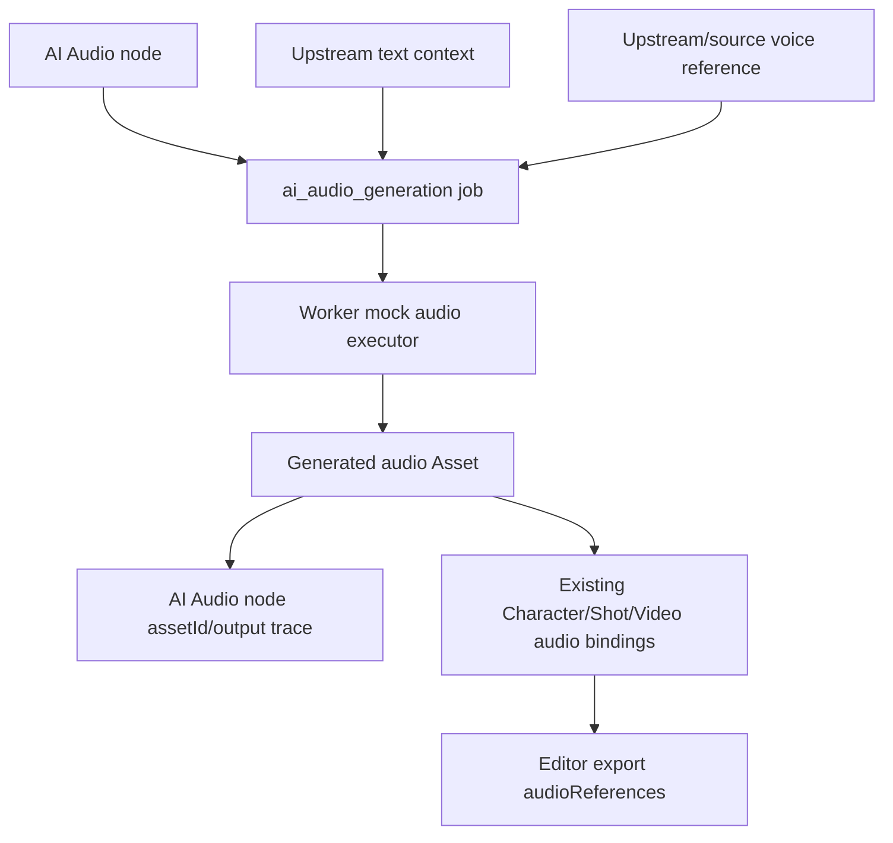

# feat: Complete CEX-09 AI Audio TTS Binding

## Summary

Add a task-backed AI Audio node that produces mock-first audio Assets from node
text and upstream voice references, then route those assets through the existing
audio binding and editor export manifest path.

## Assumptions

- The first CEX-09 slice should be mock-first for audio provider execution,
  because the current provider management surface has no managed audio provider
  kind.
- Existing upload and binding UI for Character, Shot, and Video nodes should be
  reused rather than replaced.

## Scope Boundaries

- No complete audio editor, mixing lane, or waveform timeline.
- No real third-party TTS provider management in this slice.
- No browser-side provider secret handling.
- No replacement of existing audio binding fields or export references.

## Requirements Trace

- R1/R2 -> U1 shared node and generation contracts.
- R3/R4 -> U2 backend/worker job creation, mock execution, and asset writeback.
- R5 -> U3 frontend AI Audio node and generation controls.
- R6 -> U4 editor export verification and regression coverage.
- AE1-AE6 -> U5 validation, solution doc, and commit.

## High-Level Technical Design

> This illustrates the intended approach and is directional guidance for review,
> not implementation specification. The implementing agent should treat it as
> context, not code to reproduce.

## Implementation Units

- U1. **Shared contracts**
  - Add `ai_audio` to canvas node registry, Phase 3 node list, data contracts,
    input/output policy, and Prisma enum.
  - Add `ai_audio_generation` operation/input/output types and tests.
  - Extend generated asset typing so audio output is first-class.

- U2. **Backend and worker**
  - Build AI Audio job input from node text plus upstream `derived_from` text and
    audio/voice references.
  - Add mock-first worker execution that returns an audio provider output.
  - Persist generated audio Assets and AI Audio node result metadata through the
    existing media completion path.
  - Add backend/worker tests for validation, failure, and output persistence.

- U3. **Frontend canvas UI**
  - Add AI Audio toolbar, shape, card, default data, and inspector fields.
  - Add audio prompt/script generation controls in `GenerationActions`.
  - Keep Character/Shot/Video audio binding controls on the existing
    `NodeAudioAssets` path.
  - Add focused frontend tests for payload construction and node visibility.

- U4. **Editor export audio manifest verification**
  - Confirm generated audio Assets can be represented by existing
    `audioReferences`.
  - Add or tighten tests that prove uploaded and generated audio references are
    included in editor export package inputs and timeline assets.

- U5. **Validation and learning capture**
  - Run shared/backend/worker/frontend checks and production frontend build.
  - Capture a solution doc for the task-backed AI Audio node boundary.
  - Mark this plan completed and commit the CEX-09 module.

## System-Wide Impact

- **Interaction graph:** Canvas node registry, GenerationJob creation, worker
  execution, Asset persistence, audio binding UI, and editor export packaging.
- **Error propagation:** AI Audio uses existing queued/running/failed/cancelled
  node and job statuses.
- **State lifecycle risks:** Asset creation and node writeback must stay in the
  same backend completion transaction.
- **API surface parity:** Shared operation enums, DTO validation, worker claim
  input assertions, and Prisma enums must remain aligned.
- **Unchanged invariants:** Existing upload/bind/export audio fields remain the
  canonical manifest path.

## Risks & Dependencies

| Risk | Mitigation |
|------|------------|
| Audio provider scope expands into real TTS integration | Keep CEX-09 mock-first and document real provider management as follow-up |
| Generated audio bypasses binding/export paths | Persist as normal audio Asset and reuse existing `audioReferences` |
| Shared enum drift breaks worker/backend claims | Update shared, Prisma, DTO, and worker assertions together |

## Verification Targets

- `pnpm --filter @guga-flow/shared-types run lint`
- `pnpm --filter @guga-flow/shared-types test`
- `pnpm --filter @guga-flow/shared-types run build`
- `pnpm --filter @guga-flow/backend run lint`
- `pnpm --filter @guga-flow/backend test`
- `pnpm --filter @guga-flow/worker run lint`
- `pnpm --filter @guga-flow/worker test`
- `pnpm --filter @guga-flow/frontend run lint`
- `pnpm --filter @guga-flow/frontend test`
- `NEXT_PUBLIC_API_BASE_URL=http://localhost:3012/api/v1 pnpm --dir apps/frontend exec next build`
- `pnpm -r lint`
- `pnpm -r test`

## Completion Notes

- Added `ai_audio` canvas contracts, input slots, output kind, and Prisma enum.
- Added `ai_audio_generation` shared job contracts, backend queue input
  assembly, worker mock audio execution, generated audio Asset persistence, and
  same-node result writeback.
- Added AI Audio frontend node affordances and generation controls while
  reusing existing Character, Shot, and Video audio binding UI.
- Tightened editor export tests so generated narration audio bound to a Shot is
  enriched into the clip manifest.
- Captured the solution pattern in
  `docs/solutions/architecture-patterns/task-backed-ai-audio-node-boundary-2026-06-14.md`.

## Sources & References

- Origin checklist: `docs/codex-reference-long-task-execution-checklist.md`
- Source modules: `ACP-05`, `TFR-18`
- Existing learning: `docs/solutions/architecture-patterns/audio-asset-binding-export-manifest-2026-06-13.md`
- Existing learning: `docs/solutions/architecture-patterns/task-backed-ai-text-node-boundary-2026-06-14.md`
